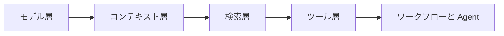
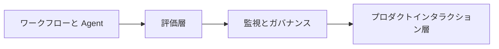
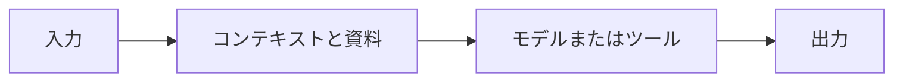
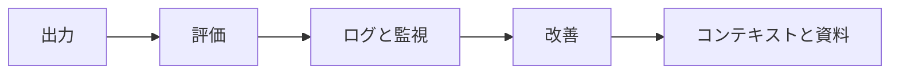

# 2025-2026 AI アプリケーション技術マップ

## この節の位置づけ

このページは、コース後半全体の「現代技術の全体像」です。2025～2026 年の AI アプリケーションエンジニアリングの主流は、すでに「大規模モデルを呼び出せる」から、「検索できる、行動できる、評価できる、監視できる、デプロイできる AI システムを構築できる」へと進化しています。

初学者がこのページを読むとき、すべての新しい用語を覚える必要はありません。まずは地図を作ることが大切です。RAG は知識接続を解決し、Agent は複数ステップの行動を解決し、マルチモーダルは現実世界の入出力を解決し、モデルエンジニアリングはコストとデプロイを解決し、LLMOps / RAGOps / AgentOps は長期運用と品質管理を解決します。

## 初学者はまずこの 5 つを覚えよう

| 技術ブロック | 解決する問題 | コース内の主な学習箇所 |
|---|---|---|
| RAGOps | ナレッジベースを継続的に更新、検索、評価できるか | 第 8 章 |
| AgentOps | Agent を追跡、制御、安全に実行できるか | 第 9 章 |
| マルチモーダル AI | AI が画像、PDF、音声、動画を扱えるか | 第 10～12 章 |
| モデルエンジニアリング | 効果、コスト、遅延の間でどう取捨選択するか | 第 6～8 章 |
| LLMOps | Prompt、評価、ログ、本番運用をどう長期的に維持するか | 第 7～9 章と卒業プロジェクト |

## 現代 AI システムは単なる 1 つのモデルではない

初期の大規模モデルアプリケーションは、よくある形として「ユーザーが質問を入力し、バックエンドが 1 つのモデルを呼び出し、モデルが答えを返す」というものでした。しかし、実際の製品ではすぐに問題が出てきます。モデルが社内資料を知らない、回答に出典がない、ツール呼び出しが不安定、コストを管理できない、生成内容を確認できない、本番の失敗を振り返れない、などです。

そのため、現代の AI アプリケーションは単一のモデルというより、1 つのシステムとして考える必要があります。

この 2 つの図が理解できれば、なぜコース後半で Prompt から RAG、Agent、マルチモーダル、デプロイ、評価へ進むのかが分かります。本当の力は「1 回モデルをうまく呼べること」ではなく、さまざまなユーザー、さまざまな資料、さまざまな失敗シナリオの中でも、システムを検査して改善し続けられることです。

## RAGOps：ナレッジベースを一度きりの Demo にしない

RAGOps は、「RAG システムを運用、評価、保守するための方法」と考えると分かりやすいです。通常の RAG は、検索して回答できるかだけを気にします。一方、RAGOps は、文書が更新されているか、インデックスが古くなっていないか、再現率が安定しているか、引用が信頼できるか、コストと遅延が許容範囲か、まで考えます。

現代の RAG でよく使われる技術には、Hybrid Search、Reranking、Query Rewrite、Multi-query Retrieval、GraphRAG、Agentic RAG、Multimodal RAG があります。これらはそれぞれ異なる問題を解決します。Hybrid Search は純粋なベクトル検索でキーワードを取りこぼすのを防ぎ、Reranking は検索結果を再順位付けし、Query Rewrite はあいまいな質問を検索しやすくし、GraphRAG は文書をまたぐエンティティ関係に向いており、Agentic RAG はシステムが複数回判断して追加調査するかどうかを決められるようにし、Multimodal RAG は画像、表、PDF、スクリーンショットを知識ソースに含めます。

この部分は主に第 8 章：LLM アプリケーション開発と RAG で扱います。

## AgentOps：Agent を追跡し、制御できるようにする

AgentOps は、「Agent の実行履歴、ツール呼び出し、権限、安全性、評価、デプロイを扱うエンジニアリング手法」と考えることができます。Agent は、ただ動いて見えるだけでは不十分です。なぜその行動をしたのか、どのツールを呼んだのか、どれくらいコストがかかったのか、失敗したときにどう復旧するのか、どの場面で人間の確認が必要なのか、まで分かる必要があります。

現代の Agent で重要なのは、モデルを完全に自由に動かすことではなく、ワークフロー、ツールプロトコル、安全境界を組み合わせることです。MCP のようなプロトコルは、モデルとツール、ファイル、データベース、業務システムの接続を標準化します。Agentic Workflow は、自由度の高いタスクと固定フローを組み合わせます。Human-in-the-loop は、高リスクの手順に人間の確認を残します。Agent Observability は、計画、ツール呼び出し、結果、エラーを記録します。

この部分は主に第 9 章：AI Agent と Agent システムで扱います。

## マルチモーダル AI：文字のアシスタントから現実世界のアシスタントへ

マルチモーダル AI のポイントは「画像をきれいに生成すること」ではなく、スクリーンショット、図表、PDF、文書ページ、音声、動画、画像、テキストなど、現実世界のさまざまな入出力を AI が扱えるようにすることです。現代のアプリケーションでは、マルチモーダル能力は RAG、Agent、コンテンツ生成、確認ワークフローと組み合わされることがよくあります。

たとえば、授業資料アシスタントは Markdown を読めるだけでなく、スライドのスクリーンショットや PDF の表も理解できます。研究用 Agent は Web ページのスクリーンショットを見て、図表情報を抽出し、ツールを呼び出してレポートを作成できます。AIGC ワークスペースは、テーマから文章、画像プロンプト、絵コンテ、ナレーション原稿、確認チェックリストを生成できます。

この部分は主に第 12 章：AIGC とマルチモーダルで扱い、第 8 章の文書解析、マルチモーダル RAG、第 9 章のマルチモーダル Agent にもつながります。

## モデルエンジニアリング：常に最強モデルを呼ぶわけではない

実際のプロジェクトでは、必ずしも最も強く、最も高価で、最も大きいモデルを使うとは限りません。多くの場面では、効果、遅延、コスト、プライバシー、デプロイの複雑さのバランスを取る必要があります。

現代のモデルエンジニアリングでは、小型モデル、モデルルーティング、量子化、蒸留、LoRA / QLoRA、ローカルデプロイ、ハイブリッドデプロイ、キャッシュ、バッチ処理、推論最適化を検討します。1 つのシステムが、簡単なタスクには安価なモデルを使い、複雑な推論には強力なモデルを使い、画像にはビジョンモデルを使い、機密データにはローカルモデルを使う、といった設計もあります。

この部分は、第 6 章の深層学習基礎、第 7 章の大規模モデルの原理とファインチューニング、第 8 章のモデルデプロイとエンジニアリング実践につながります。

## LLMOps：大規模モデルアプリを長く動くソフトウェアとして扱う

LLMOps が注目するのは、大規模モデルアプリのライフサイクル全体です。Prompt のバージョン管理、評価データセット、自動テスト、ログ、Trace、Token コスト、遅延、モデルバージョン変更、権限制御、コンテンツ安全、本番のロールバックまで含まれます。

LLMOps がなければ、ある日はうまく答えられていたアプリが、翌日には文書更新、Prompt 変更、モデルバージョン変更、ユーザー質問の変化などで品質が落ちても、誰も理由を特定できません。コースのエンジニアリング部分では、これらの能力を少しずつプロジェクトに追加していきます。まずログを記録し、次に評価データセットを設計し、さらに監視とコスト集計を加え、最後に本番チェックリストへとまとめます。

## 現代 AI アプリケーションの最小閉ループ

RAG、Agent、マルチモーダルアプリのどれを作る場合でも、以下の閉ループでシステムの信頼性を確認できます。

もしプロジェクトに入力と出力しかなく、評価、ログ、改善がなければ、それはまだ Demo にすぎません。どの資料を使ったのか、どのツールを呼んだのか、なぜ失敗したのか、改善前後でどう変わったのかを把握できて初めて、本当の AI エンジニアリングに近づきます。

## 学習のすすめ

このページを初めて読むときは、次の 4 つだけ覚えれば十分です。RAG は外部知識を取り込む役割、Agent は目標に向かって複数ステップのタスクを実行する役割、マルチモーダルは現実世界の入出力を扱う役割、Ops はシステムを長期的に安定運用する役割です。

具体的な章に進むときは、新しい技術を用語の一覧として覚えないでください。1 つ学ぶたびに、次のことを自分に問いかけましょう。これはどんな失敗を解決するのか。どんなときに使うべきではないのか。最小の例はどう作るのか。どう評価するのか。どうやってプロジェクトの README に書くのか。そうすれば、学ぶものは流行語ではなく、ほかにも応用できるエンジニアリング力になります。
