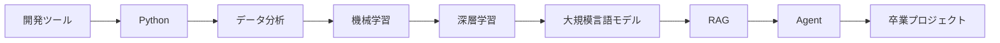

# 段階移行ガイド：基礎から AI アプリケーションへ

AI フルスタック学習でいちばんつまずきやすいのは、特定の知識そのものよりも、なぜ次のテーマを急に学ぶ必要があるのか分からなくなることです。このページでは、各段階のつながりを一本の流れで説明し、段階を切り替えるときに「いま自分は何の能力を補っているのか」を分かるようにします。

## 一枚でわかる段階の並び方

段階を切り替える前に、毎回ひとつだけ問いましょう。次の段階では、どんな新しい能力が必要になるのか？ もし答えがはっきりしないなら、まずこのページの対応する移行部分を読んでから、最小限の練習を1つやってみてください。

## 開発ツールから Python へ

開発ツールの段階で解決するのは、「コードを書けるか、実行できるか、保存できるか」です。Python の段階で解決するのは、「コードで分かりやすい処理の流れを表現できるか」です。開発環境、パス、依存関係、Git がうまく動いていないと、その後の AI プロジェクトはすべて環境問題で止まってしまいます。

Python に入る前に、少なくともプロジェクトディレクトリを開けること、スクリプトを1つ実行できること、Git の記録を1回残せることが必要です。そうでないと、Python 学習中に出てくる多くの問題は、実は文法の問題ではなく環境の問題です。

## Python からデータ分析へ

Python は処理の流れを書くことを教えてくれます。データ分析は、実際のデータを扱う方法を教えてくれます。AI プロジェクトの入力は、きれいな1つの変数ではなく、ファイル、表、ログ、文書、ユーザー行動の記録であることが多いです。データ分析段階の価値は、データの形、品質、分布、異常を理解できるようになることです。

データ分析に入る前に、関数を書けること、ファイルを読み書きできること、リストと辞書を使えることが必要です。機械学習に入る前に、Pandas でデータを読み込み、項目を整え、基本的な統計を取り、グラフで現象を説明できることが必要です。

## データ分析から機械学習へ

データ分析は「何が起きたか」に答えます。機械学習は「これまでのデータから予測や分類ができるか」に挑戦します。この移行で大事なのは、データ表を特徴量に変え、ビジネスの問題をモデリングの問題に変え、直感的な結論を評価可能なモデルに変えることです。

機械学習段階でつまずくとき、よくある原因はアルゴリズムが難しすぎることではなく、データの理解が足りないことです。たとえば、目的変数は何か、特徴量にリークはないか、学習データとテストデータは適切か、指標は問題に合っているか、といった点はすべてデータ分析の力に関わっています。

## 機械学習から深層学習へ

機械学習段階では、データ、特徴量、モデル、評価の理解を主に鍛えます。深層学習段階では、モデルが表現を自動で学ぶことをさらに学びます。特に、画像、テキスト、音声、複雑な系列データに向いています。この移行のポイントは、「手作りの特徴量 + 伝統的なモデル」から「テンソル + ニューラルネットワーク + 表現学習」へ進むことです。

深層学習に入る前に、学習データ/テストデータ、損失関数、過学習、評価指標、baseline を理解しておく必要があります。そうでないと、PyTorch のコードが動いても、モデルが何を学んだのか判断しにくくなります。

## 深層学習から大規模言語モデルへ

深層学習はニューラルネットワークの学習を理解するための土台で、Transformer は現代の大規模言語モデルの構造的な基礎です。大規模言語モデルの段階では、ゼロからモデルを学習する必要はありませんが、token、embedding、文脈、事前学習、微調整、アライメントといった概念が何のためにあるのかを理解する必要があります。

アプリケーションを作りたいだけなら、内部の数式導出は速く読んでも大丈夫です。ただし、Transformer と embedding を完全に飛ばしてはいけません。RAG、Prompt、微調整、Agent の多くの問題は、これらの基礎概念と関係しているからです。

## 大規模言語モデルから RAG へ

大規模言語モデルには、知識が古くなる、幻覚を起こす、社内資料にアクセスできない、といった制限があります。RAG の役割は、外部の知識ベースを生成の流れに組み込み、検索した資料をもとに答えさせることです。この移行のポイントは、「モデルに記憶だけで答えさせる」から「出典に基づいて答えさせる」へ変えることです。

RAG に入る前に、API の呼び出し、テキスト分割、embedding、ベクトル類似度、基本的なプロンプトを理解しておく必要があります。RAG を学ぶときは、検索と生成を必ず分けてデバッグするようにしましょう。

## RAG から Agent へ

RAG は主に知識の取得問題を解決します。Agent はさらに、タスク実行の問題を解決します。RAG は「関連資料は何か、答えは何か」に答えます。Agent は「目標を達成するために、何段階に分けるべきか、どのツールを呼ぶべきか、状態をどう記録するか、失敗したらどう復帰するか」を扱います。

Agent に入る前に、RAG、関数呼び出し、ログ、評価、安全境界を理解しておく必要があります。そうでないと、Agent はすぐに制御できない自動化スクリプトになり、問題が起きても追跡できません。

## Agent から卒業プロジェクトへ

卒業プロジェクトは、すべての技術を詰め込むことではありません。現実の問題を1つ選び、適切な技術を組み合わせて安定した閉ループを作ることです。AI 学習アシスタント、企業ナレッジベース、データ分析 Agent、特定分野のアシスタント、マルチモーダルなワークフローの中から、1つの方向を選べます。

本当の合格基準は、プロジェクトが動くこと、流れを説明できること、効果を評価できること、失敗を振り返れること、ほかの人が README に従って再現できることです。この段階では、学習の重点は「ある知識を覚えること」から「信頼できるシステムを作ること」へ移ります。
