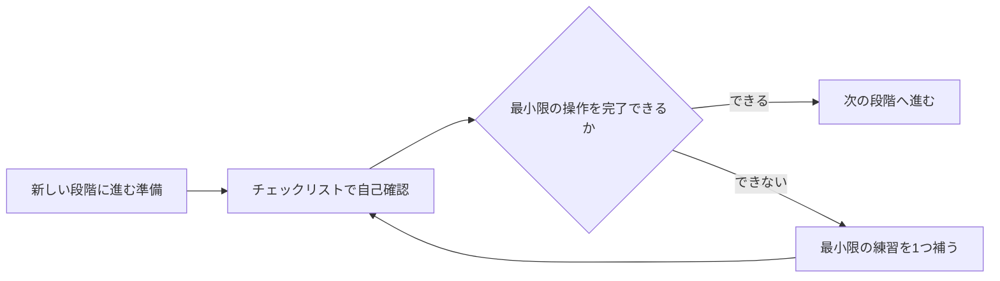

# 前提知識チェックリスト

このチェックリストは、重要な段階に入る前に、自分が準備できているかをすばやく判断するためのものです。もしどれか1つでも不慣れでも、学習を続けられないわけではありません。ただし、いったん該当する章に戻って、最小限の練習を1つ補うことをおすすめします。AI フルスタック学習でいちばん怖いのは、前提知識の不足がどんどん積み重なって、最後に「各章は少しずつ分かるのに、プロジェクトが作れない」と感じてしまうことです。

## 使い方を図で理解する

| 自己確認の結果 | 次にやること |
|---|---|
| ほとんどできる | 学習を続け、慣れていない点を振り返りに書く |
| 1～2項目だけ不慣れ | 最小限の練習を1つ補う。章全体を学び直さない |
| ほとんど分からない | 1つ前の段階のタスクリストに戻り、まず最小プロジェクトを完成させる |

## Python に入る前

次の操作ができる必要があります: ターミナルを開く、プロジェクトのディレクトリに入る、ファイルを作成する、コマンドを1つ実行する、現在の作業ディレクトリを理解する、エラーメッセージがどのコマンドから出たか分かる。これらがまだ不安なら、まず開発者ツール基礎の段階に戻りましょう。

## データ分析に入る前

関数を書けること、リストや辞書を使えること、ファイルの読み書きができること、サードパーティライブラリをインストールできること、スクリプトの入力と出力を理解できることが必要です。Pandas に入る前に、まずは純粋な Python でテキストファイルを読み込み、内容を集計できるとよいです。

## 機械学習に入る前

表形式データを読み取れること、行と列を確認できること、欠損値を処理できること、学習データと目的変数の違いを理解できること、グラフでデータ分布を説明できることが必要です。機械学習はアルゴリズムから始めるのではなく、「この問題はデータで表現できるか」から始まります。

## 深層学習に入る前

訓練データ、検証データ、テストデータ、特徴量、ラベル、損失関数、過学習、評価指標を理解している必要があります。また、行列、ベクトル、配列の shape について基本的な感覚も必要です。そうでないと、PyTorch の Tensor エラーの原因を見つけるのがとても難しくなります。

## 大規模言語モデルと Prompt に入る前

モデルの入力と出力、API、JSON、コンテキストとは何か、そしてなぜモデルの回答が安定しないことがあるのかを理解している必要があります。Prompt は魔法の言葉ではなく、タスク、制約、入力、出力形式をモデルに分かりやすく渡すためのものです。

## RAG に入る前

LLM API を1回呼び出せること、テキスト分割を理解していること、embedding がテキストをベクトルに変換するものであること、類似度検索を理解していること、「検索結果」と「生成された回答」を区別できることが必要です。検索された元の文章断片を確認できないと、RAG のデバッグはとても難しくなります。

## Agent に入る前

関数呼び出し、ツールの引数、エラー処理、ログ、状態、権限を理解している必要があります。Agent はモデルにたくさん考えさせることではなく、制御された範囲内でツールを呼び出してタスクを完了させる仕組みです。Agent に入る前に、まず普通の関数呼び出しワークフローを書けるようにしておくとよいです。

## デプロイに入る前

プロジェクトの依存関係、実行コマンド、設定項目、環境変数、ログの場所、エラーの切り分け方法を説明できる必要があります。デプロイは最後に考えるものではなく、プロジェクトが再現可能かどうかを確かめる重要な工程です。

## このチェックリストの使い方

新しい段階に入るたびに、10分ほどかけて対応する項目を確認してください。分からないところで長く理論の説明にとどまらず、最小限の練習を1つ補うことを優先しましょう。たとえば JSON に不慣れなら、JSON を読み書きするスクリプトを書く。API に不慣れなら、公開 API を1回呼び出す。ログに不慣れなら、自分の小さなプログラムに実行ログを1行追加する、という形です。
