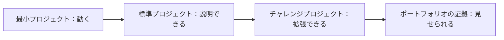

# 全コースのプロジェクトマトリクス

この表は、コースを「章の一覧」から「作品のロードマップ」に変える手助けをします。各段階では、少なくとも1つの実行可能な成果を残し、最後には成長の過程を示せるプロジェクト証拠がそろいます。

## まず図で見る：各プロジェクトは3段階



最初は「最小プロジェクト」だけでも、そのまま先へ進んで大丈夫です。ポートフォリオを作るときに、重要なプロジェクトを「標準プロジェクト」や「チャレンジプロジェクト」へアップグレードしましょう。

| 学習ステージ | 最小プロジェクト | 標準プロジェクト | チャレンジプロジェクト | ポートフォリオの証拠 |
|---|---|---|---|---|
| 1 開発者ツールの基礎 | リポジトリを作って Python を実行する | Git、VS Code、Jupyter を設定する | 環境構築スクリプトを書く | README、スクリーンショット、コミット履歴 |
| 2 Python プログラミング基礎 | コマンドラインのタスク管理ツール | JSON 保存とモジュール分割に対応する | Web API か AI API 呼び出しを追加する | 実行コマンド、入力と出力の例 |
| 3 データ分析と可視化 | 単一 CSV の EDA | 複数データソースの分析レポート | データベースとインタラクティブなグラフを追加する | グラフ、結論、データクリーニング記録 |
| 4 AI 数学の基礎 | ベクトルと確率でデータを説明する | 勾配降下法の可視化ミニ実験 | 逆伝播の直感デモ | 数式の説明、図解、実験記録 |
| 5 機械学習 | 住宅価格または分類の baseline | 完全な sklearn pipeline | 特徴量エンジニアリングとモデル比較 | 指標、baseline、エラー分析 |
| 6 深層学習と Transformer | PyTorch のトレーニングループ | 画像またはテキスト分類プロジェクト | 学習診断と転移学習 | 学習曲線、混同行列、失敗サンプル |
| 7 大規模言語モデルの原理と Prompt | Prompt テンプレート集 | 学習計画/振り返りカード生成器 | 行動比較の評価表 | Prompt のバージョン、出力比較 |
| 8 LLM アプリケーションと RAG | Markdown 検索Q&A | コース知識ベースアシスタント | Rerank、評価セット、引用チェック | 質問集、出典引用、評価結果 |
| 9 AI Agent | ツール呼び出しのミニ Agent | 学習計画 Agent | 記憶、MCP、trace と安全境界を追加する | 実行トレース、ツールログ、再生サンプル |
| 10 コンピュータビジョン | 画像分類または OCR 実験 | 物体検出/視覚理解プロジェクト | 業界向け視覚検出 Demo | アノテーション例、指標、可視化結果 |
| 11 自然言語処理 | テキスト分類またはキーワード抽出 | レビュー理解/情報抽出プロジェクト | ドメインテキスト分析システム | ラベル体系、指標、エラーサンプル |
| 12 AIGC とマルチモーダル | 画像/音声/動画の小実験 | マルチモーダルコンテンツワークフロー | 承認可能なクリエイティブプラットフォーム Demo | 素材、生成記録、手動レビュー基準 |

## このマトリクスの使い方

時間が限られているなら、各段階で最小プロジェクトだけを完成させて先へ進んでも大丈夫です。ポートフォリオを作りたいなら、少なくとも機械学習、RAG、Agent、マルチモーダルの段階では標準プロジェクトまで完成させ、README もきちんと書くことをおすすめします。

チャレンジプロジェクトを必須だと思わないでください。これは、主な流れを一通り動かせるようになってから、作品を「学習課題」から「見せられるプロジェクト」へ引き上げるために向いています。

## プロジェクト証拠の段階分け

同じプロジェクトでも、3回に分けて提出できます。最初から完成品を目指す必要はありません。1回目は最小の閉ループを提出して「動く」ことを示し、2回目はエンジニアリングの証拠を補って「再現できる・切り分けられる」ことを示し、3回目は展示用素材を足して「ポートフォリオや面接に出せる」ことを示します。

| 証拠レベル | 何に答えるか | よくあるファイル |
|---|---|---|
| 最小閉ループ | このプロジェクトは動くのか | `README.md`、実行コマンド、入力と出力の例 |
| エンジニアリング閉ループ | エラー時に原因特定と再現ができるか | 設定ファイル、ログ、テストケース、失敗サンプル |
| ポートフォリオ閉ループ | 他の人が価値とトレードオフを理解できるか | アーキテクチャ図、評価レポート、スクリーンショット/GIF、振り返り記録 |

コースの後半に進むほど、プロジェクトの証拠は「動く」から「説明できる、評価できる、振り返れる」へ移していくべきです。特に RAG と Agent のプロジェクトでは、最終結果だけでなく途中経過も残しましょう。

## おすすめのリポジトリ構成

コース全体を長期的なポートフォリオとして整理したい場合は、各段階のプロジェクトを1つの総合リポジトリにまとめてもよいですし、成熟したプロジェクトごとに個別リポジトリを作ってもよいです。どちらの場合でも、構成は統一しておくのがおすすめです。

```text
ai-fullstack-portfolio/
├── ch01-tools1-python-cli/
├── ch01-tools2-data-analysis/
├── ch01-tools5-ml-baseline/
├── ch01-tools8-rag-assistant/
├── ch01-tools9-agent-planner/
└── final-ai-app/
```

各プロジェクトディレクトリには少なくとも、README、ソースコード、サンプルデータまたは入力、結果のスクリーンショットまたは出力、失敗サンプル、次の計画を含めましょう。こうしておくと、コースを最後まで学んだときに、単なる練習ファイルの集まりではなく、成長の証拠がつながった一本のストーリーになります。
