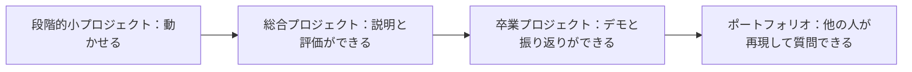
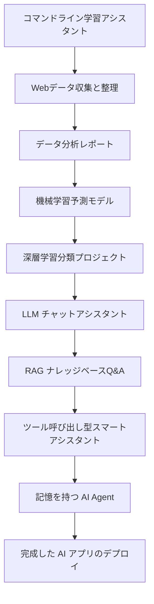

# プロジェクトロードマップとポートフォリオ


AI を最も効果的に学ぶ方法は、教材を見続けることではなく、動かせて、説明できて、見せられる小さなプロジェクトを作り続けることです。プロジェクトに取り組むと、データはどこから来るのか、入力と出力は何か、モデルをどうつなぐのか、効果をどう評価するのか、失敗したときにどう原因を調べるのか、といった実際の問題に向き合うことになります。

このコースでは、プロジェクトを3つのレベルに分けます。段階的小プロジェクト、総合プロジェクト、卒業プロジェクトです。

## まず図で見る：プロジェクトはどうやって練習から作品になるか



| レベル | まずできるようにすること | 最初から追い求めないこと |
|---|---|---|
| 段階的小プロジェクト | 入力、出力、実行コマンドがある | 機能がたくさんある、見た目がとてもきれい |
| 総合プロジェクト | 指標、ログ、失敗サンプルがある | 一度成功したスクリーンショットだけを見せる |
| 卒業プロジェクト | 完成した README、評価、デモがある | すべての技術を詰め込む |

## プロジェクト成長ロードマップ



## 1つ目のグループのプロジェクト：プログラミングとデータ基礎

1つ目のグループの目的は、複雑なアルゴリズムを追うことではなく、開発の流れに慣れることです。

まずはコマンドラインの ToDo ツールや学習アシスタントを作って、Python の入出力、ファイルの読み書き、引数の解析、モジュール分割を練習できます。次に、Webデータ収集のプロジェクトを作って、リクエスト、解析、クリーニング、保存を練習します。その後、データ分析レポートを作って、Pandas、可視化、結論の伝え方を練習します。

このグループが終わるころには、「小さくても一通りそろった」Python プロジェクトを自力で完成でき、結果をドキュメントや Notebook にまとめられるようになるはずです。

## 2つ目のグループのプロジェクト：モデル訓練と評価

2つ目のグループの目的は、モデルがどのようにデータから法則を学ぶのかを理解することです。

住宅価格予測、顧客離脱予測、ユーザーのグループ分け、異常検知などのプロジェクトに取り組めます。各プロジェクトには、データの理解、特徴量処理、訓練データとテストデータの分割、モデル訓練、指標評価、誤差分析、改善提案を含める必要があります。

このグループが終わるころには、`fit()` と `predict()` を呼ぶだけでなく、機械学習プロジェクト全体の流れを説明できるようになるはずです。

## 3つ目のグループのプロジェクト：大規模モデルアプリケーション

3つ目のグループの目的は、大規模モデルを実際のタスクにつなぐことです。

まずは LLM チャットアシスタントを作って、API 呼び出し、Prompt テンプレート、会話の文脈、構造化出力を練習できます。その後、文書Q&Aシステムを作って、文書解析、分割、Embedding、ベクトル検索、RAG を練習します。さらに進めるなら、講座Q&Aアシスタント、履歴書改善アシスタント、資料整理アシスタント、または企業ナレッジベースの Demo を作れます。

このグループが終わるころには、大規模モデルが何を担当し、検索システムが何を担当し、バックエンドサービスが何を担当するのか、評価データをどう設計するのかをはっきり説明できるようになるはずです。

## 4つ目のグループのプロジェクト：AI Agent

4つ目のグループの目的は、AI を「質問に答える」ものから「タスクを実行する」ものへと進化させることです。

研究アシスタントを作って、テーマに基づいて問題を分解し、資料を検索し、要約をまとめさせることができます。データ分析 Agent を作って、データを読み込み、分析計画を作成し、Python ツールを呼び出し、グラフと結論を出力させることもできます。さらに進めると、複数の Agent が協力して要件分析、コーディング、テスト、ドキュメント作成を行う小さな開発チーム Demo も作れます。

このグループが終わるころには、Agent の中心的な難しさである、タスク計画、ツール選択、コンテキスト管理、エラー回復、権限の境界、コスト管理、結果評価を理解できるようになるはずです。

## 卒業プロジェクトのおすすめ

卒業プロジェクトは大きくなくても構いませんが、必ず完成している必要があります。よい卒業プロジェクトには、フロントエンドまたは対話用の入り口、バックエンド API、モデル呼び出し、データまたはナレッジベース、ログ記録、基本的な評価、デプロイ手順が含まれているべきです。

選べる方向性としては、個人ナレッジベースアシスタント、講座学習アシスタント、採用履歴書分析アシスタント、業界レポート生成アシスタント、カスタマーサポート用ナレッジベース、データ分析 Agent、自動化オフィスアシスタント、マルチモーダルコンテンツ制作ツールなどがあります。

## ポートフォリオ README テンプレート

各段階のプロジェクトを終えたら、README を1つ追加することをおすすめします。README は長くなくてよいですが、そのプロジェクトが何を解決するのか、どう実行するのか、結果をどう判断するのか、次にどう改善できるのかを、すぐに分かるようにしておく必要があります。

````md
# プロジェクト名

## プロジェクトの目的

このプロジェクトは何の問題を解決しますか？対象ユーザーは誰ですか？なぜ取り組む価値がありますか？

## 入力と出力

入力：ユーザーはどんなデータ、テキスト、画像、文書、または質問を提供する必要がありますか？
出力：システムはどんな結果、グラフ、ファイル、回答、またはレポートを返しますか？

## 技術ルート

データの読み込み → クリーニング → モデリング → 評価 → レポート出力 のように、核心の流れを3～6ステップで説明します。

## 実行方法

```bash
# 依存関係をインストール
pip install -r requirements.txt

# プロジェクトを実行
python main.py
```

## 結果の表示

重要なスクリーンショット、出力例、指標表、または実行ログの一部を載せます。「実行成功」とだけ書くのではなく、成功がどのようなものかを見せてください。

## 評価方法

プロジェクトがうまくいっているかをどう判断するかを説明します。正解率、F1、MAE、再現率、人によるチェックリスト、固定テスト質問セット、失敗サンプル分析などでも構いません。

## 発生した問題

環境エラー、データの問題、モデル性能の低さ、APIの失敗、RAG が検索できない、Agent のツール呼び出し失敗など、2～3個の実際の問題を記録し、どう切り分けたかも書きます。

## 次の改善

続けて作るなら何を優先して改善するかを明確に書きます。たとえば、データ追加、指標変更、ログ追加、Prompt の最適化、デプロイの追加、UI 改善などです。
````

## 段階ごとの成果物をどう蓄積するか

初心者は、まず各プロジェクトに「動くこと + 説明があること + 結果のスクリーンショットがあること」をそろえるとよいです。経験のある学習者は、さらに「実験記録 + エラー分析 + 指標比較 + デプロイ手順」を追加できます。各ステップの README を同じテンプレートで整理していけば、コースを学び終えるころには、自然とAIフルスタックのポートフォリオが一式そろいます。
