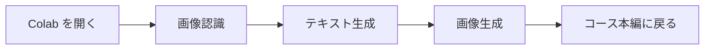

# 30 分でできる AI 体験

> **目標：** 本格的な学習の前に、まず自分の手で AI を触って、何ができるのかを感じてみましょう  
> **時間：** 30 分 ～ 1 時間  
> **準備するもの：** Google アカウント 1 つ（Colab を開くために使います）。ほかは何もインストール不要です

## 一目でわかる：30 分体験の流れ



プログラミングを学ぶとき、多くの人は最初から文法や概念を覚え込みます。でも、2 週間勉強しても「自分は何をしているんだろう？」となりがちです。ここでは逆に、先に遊んでから学びます。まず AI に何ができるのかを見て、好奇心を持ったまま本編に戻りましょう。

## まずはこの 3 つだけ

| 体験 | 何が見えるか | 後で対応する章 |
| --- | --- | --- |
| AI に画像を認識させる | 写真を 1 枚渡すと、中身を答えてくれる | 深層学習、コンピュータビジョン |
| AI と会話する | ひと言入力すると、続きを書いてくれる | Prompt エンジニアリング、大規模言語モデル |
| AI に絵を描かせる | 文章で画面を説明すると、画像を生成してくれる | AIGC、マルチモーダル |

:::tip プログラミング経験は不要です
下のコードは、今は理解しなくて大丈夫です。コピーして貼り付けて実行するだけでOKです。Python プログラミング基礎 を学んだあとにもう一度見ると、とても簡単に感じるはずです。
:::

---

## 体験 1：AI に画像を見せてみる（10 分）

### ステップ 1：Google Colab を開く

1. ブラウザで [Google Colab](https://colab.research.google.com) を開きます
2. 新しいノートブックを作成します。どちらかの方法でOKです：
   - ホーム画面に **「新規ノートブック」** または **「New notebook」** ボタンがあれば、それをクリック
   - あるいは、上部メニューの **ファイル → ドライブに新しいノートブックを作成** をクリック（英語画面では **File → New notebook**）
3. 開くと、メモ帳のような画面が表示され、コードを書ける枠（「コードセル」）があります

### ステップ 2：必要なライブラリをインストールする

コードセルに次のコードを貼り付けて、`Shift + Enter` で実行します：

```python
!pip install transformers torch pillow requests -q
```

1 分ほど待って、赤いエラーが出ずに終わればOKです。

:::tip `HF_TOKEN` や Hugging Face のログイン表示が出たら
後のコードを実行すると、**"The secret HF_TOKEN does not exist"** のような警告が出ることがあります。**無視して大丈夫です**。この教材で使うモデル（たとえば `google/vit-base-patch16-224`、`gpt2`）は公開モデルなので、ログインしなくてもダウンロードして使えます。コードはそのまま最後まで動きます。

この警告を消したい場合（または今後ログインが必要なモデルを使いたい場合）は、次の手順で設定できます：
1. [Hugging Face → Settings → Access Tokens](https://huggingface.co/settings/tokens) を開き、新しい Token を作成する（Read 権限でOK）
2. Colab 左側の **鍵アイコン 🔑（Secrets）** をクリックし、Secret を追加する：名前に `HF_TOKEN`、値に先ほどコピーした Token を入れる
3. Colab セッションを再起動する：上部の **コード実行プログラム** → **セッションを再起動** をクリック（英語画面では **Runtime → Restart runtime**）。日本語版では「再起動ランタイム」とは表示されないことがあるので、「セッションを再起動」を選べばOKです。再起動後、セルをもう一度実行してください
:::

### ステップ 3：画像認識を実行する

左上の **「+ コード」** をクリックして新しいセルを作り、次のコードを貼り付けて実行します：

```python
from transformers import pipeline
from PIL import Image
import requests
import io

# 画像分類モデルを読み込む（最初の実行ではモデルをダウンロードするので少し待ちます）
classifier = pipeline("image-classification", model="google/vit-base-patch16-224")

# ネット上の犬の画像でテストする（いったんバイトとして取得してから開くと、Colab のネットワークで認識失敗しにくくなります）
url = "https://upload.wikimedia.org/wikipedia/commons/thumb/2/26/YellowLabradorLooking_new.jpg/1200px-YellowLabradorLooking_new.jpg"
resp = requests.get(url, headers={"User-Agent": "Mozilla/5.0"})
resp.raise_for_status()
image = Image.open(io.BytesIO(resp.content))

# AI にこの画像を認識させる
results = classifier(image)

# 結果を見る
print("🤖 AI はこの画像を次のように判断しました：")
for r in results[:3]:
    print(f"  {r['label']:30s}  信頼度: {r['score']:.1%}")
```

### このような出力が見えればOKです

```
🤖 AI はこの画像を次のように判断しました：
  Labrador retriever              信頼度: 95.6%
  golden retriever                信頼度: 1.0%
  kuvasz                          信頼度: 0.5%
```

> 🎉 **考えてみよう：** あなたは AI にラブラドールとは何かを教えていませんし、画像にラベルも付けていません。それなのに、どうして分かったのでしょう？  
> それは、このモデルがすでに 1400 万枚の画像で「学習」しているからです。こうした「大規模に学習してから、新しいものを見分ける」流れこそが、**深層学習** の核となる考え方です。これが、このコースで学ぶ内容です。

### 自分の画像に変えて試してみよう

`url` を、ネット上の好きな画像のリンクに変えて、AI が認識できるか試してみましょう：

```python
url = "https://upload.wikimedia.org/wikipedia/commons/thumb/3/3a/Cat03.jpg/1200px-Cat03.jpg"
resp = requests.get(url, headers={"User-Agent": "Mozilla/5.0"})
resp.raise_for_status()
image = Image.open(io.BytesIO(resp.content))
results = classifier(image)

print("🤖 AI はこの画像を次のように判断しました：")
for r in results[:3]:
    print(f"  {r['label']:30s}  信頼度: {r['score']:.1%}")
```

---

## 体験 2：AI と会話する（10 分）

### 方法 A：Colab で小さなモデルを動かす（無料）

新しいコードセルを作って、次のコードを貼り付けて実行します：

```python
from transformers import pipeline

# テキスト生成モデルを読み込む
generator = pipeline("text-generation", model="gpt2")

# 文章の冒頭を与えて、AI に続きを書かせる
prompt = "The future of artificial intelligence is"
result = generator(prompt, max_length=80, num_return_sequences=1)

print("📝 あなたが与えた冒頭：", prompt)
print()
print("🤖 AI が続けて書いた文章：")
print(result[0]['generated_text'])
```

:::info このモデルについて
GPT-2 は 2019 年のモデルで、今の ChatGPT と比べるとかなり弱く、出力が少し不自然なこともあります。でも、AI が文章を作るときの大事な仕組みを理解する助けになります。  
AI が文章を書くとは、実は「次に一番ありそうな単語は何か」を何度も予測し続けることです。ChatGPT も基本は同じで、ただしモデルが何百倍も大きく、学習データも何百倍も多いだけです。
:::

### 方法 B：最新の大規模モデルをそのまま体験する（おすすめ）

最強クラスの AI 会話を体験したいなら、次のどれかを開いてみてください（すべて無料です）：

| サービス | URL | 特徴 |
|------|------|------|
| **ChatGPT** | [chat.openai.com](https://chat.openai.com) | 世界で最も有名で、英語が特に強い |
| **Claude** | [claude.ai](https://claude.ai) | 長文理解が得意で、日本語もかなり良い |
| **通義千問** | [tongyi.aliyun.com](https://tongyi.aliyun.com) | Alibaba 提供、中国から直接アクセスしやすい |
| **Kimi** | [kimi.moonshot.cn](https://kimi.moonshot.cn) | 超長文のコンテキストに対応 |
| **DeepSeek** | [chat.deepseek.com](https://chat.deepseek.com) | オープンソースモデルで、コスパが高い |

少し難しい質問をしてみましょう：

```
Python でフィボナッチ数列の第 n 項を計算する関数を書いてください。
要件：
1. 再帰で実装した版
2. 動的計画法で実装した版
3. 2 つの方法の効率の違いを比較してください
```

> 🎉 **考えてみよう：** AI は会話だけでなく、コード作成、翻訳、文書要約、データ分析もできます。  
> このコースを学び終えると、こうした AI アプリを自分で開発できるようになり、さらにツールを自律的に呼び出して自分で判断する AI Agent まで作れるようになります。

---

## 体験 3：AI に絵を描かせる（10 分）

### 操作手順（コード不要）

1. 次のどれかの AI 画像生成ツールを開きます：
   - [Hugging Face Spaces 上の Stable Diffusion](https://huggingface.co/stabilityai/stable-diffusion-xl-base-1.0)
   - [LiblibAI](https://www.liblib.art/)（中国から直接アクセス可能）
   - または "AI オンライン画像生成" で検索して、ほかのツールを探す

2. 入力欄に英語の説明文（これを **Prompt** と呼びます）を入力します：

```
a cute robot reading a book in a cozy library, digital art, warm lighting
```

3. **Generate** をクリックして、10〜30 秒待ちます

4. AI が新しい画像を 1 枚生成します。これは世界にまだ存在しない、AI が「想像」した画像です

### ほかの Prompt も試してみよう

```
a futuristic city at sunset, cyberpunk style, neon lights, rain
```

```
an astronaut riding a horse on the moon, oil painting style
```

```
a traditional Japanese ink painting of mountains and rivers, misty, elegant
```

:::tip Prompt のコツ
説明が具体的であるほど、生成される画像の質は高くなります。  
このように、言葉で AI の出力をコントロールする技術を **Prompt Engineering（プロンプトエンジニアリング）** と呼びます。これはこのコースの「7 大モデル原理、Prompt と微調整」の重要な内容であり、今の AI 業界でも特に実用的なスキルの 1 つです。
:::

> 🎉 **考えてみよう：** これが AIGC（AI Generated Content、AI 生成コンテンツ）です。  
> 欲しい画面を言葉で説明するだけで、AI が「描いて」くれます。このコースの **12 AIGC とマルチモーダル** では、その裏にある拡散モデルの仕組みや、欲しい雰囲気の画像を出すためのモデルの微調整方法を学びます。

---

## ✅ 体験完了！振り返ってみよう

おめでとうございます。AI の速習体験が完了しました。30 分で、AI の 3 つの中心的な力を自分の手で体験できました。

| 体験したこと | 裏側の技術 | コースのどこで学ぶか |
|------------|----------|------------|
| 画像認識 | 畳み込みニューラルネットワーク + 事前学習モデル | 6 深層学習と Transformer の基礎 + 10 コンピュータビジョン |
| テキスト対話 | 大規模言語モデル + Transformer アーキテクチャ | 7 大規模モデルの原理、Prompt と微調整 |
| 画像生成 | 拡散モデル（Diffusion Model） | 12 AIGC とマルチモーダル |

:::note 用語は今は覚えなくてOK
CNN、Transformer、Diffusion……今はまったく知らない言葉に見えても大丈夫です。これから順番に学べば、1 つずつはっきり理解できるようになります。今はただ 1 つ、**これらはすべて学べる** ということだけ覚えておいてください。
:::
