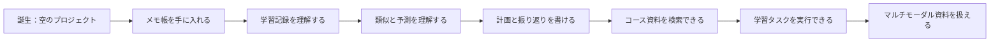

# AI 学習アシスタントのストーリー任務ライン

このコースは、育成ゲームのように考えることができます。あなたは章をただ機械的にこなすのではなく、AI 学習アシスタントを育てています。最初は何も知らない、ただの空のプロジェクトです。そこから、ツール、Python、データ、モデル、Prompt、RAG、Agent を学ぶにつれて、資料を読める、計画を立てられる、問題を調べられる、失敗を記録できる、復習を助けられる AI の相棒へと少しずつ成長していきます。

このストーリーラインはコースの本筋を置き換えるものではなく、各段階にもっと気楽な目標を与えるものです。1 つのステージを終えるたびに、アシスタントに新しい能力がアンロックされます。

## まずは4幕のストーリーを見る

| 幕 | アシスタントに起きる変化 | 対応する学習ポイント |
|---|---|---|
| 第一幕 | 空のプロジェクトから、記録できるツールになる | 開発環境、Python、データ分析 |
| 第二幕 | 判断力を持ち始める | 数学、機械学習、深層学習 |
| 第三幕 | 会話できる、資料を調べられる、タスクをこなせる | Prompt、RAG、Agent |
| 第四幕 | 発表できるプロダクトになる | CV、NLP、マルチモーダル、卒業プロジェクト |

## 全体のストーリー：空白のアシスタントから AI の相棒へ



ストーリー任務のルールはとてもシンプルです。各段階では最小限のタスクだけを 1 つ行い、見える証拠を 1 つ残します。もしタスクに失敗しても、失敗サンプルを残してください。それこそが AI エンジニアリング能力の一部だからです。

## 第一幕：アシスタントを目覚めさせる

| 段階 | ストーリー任務 | 学ぶ能力 | タスクの証拠 |
|---|---|---|---|
| 1 開発者ツールの基礎 | アシスタントの作業台を作る | ターミナル、ディレクトリ、Git、環境 | プロジェクトディレクトリ、最初の commit、実行スクリーンショット |
| 2 Python プログラミングの基礎 | アシスタントにメモ帳を持たせる | 変数、関数、ファイル、例外、JSON | `tasks.json`、コマンド出力、エラー処理の例 |
| 3 データ分析と可視化 | アシスタントに学習記録を読ませる | Pandas、クリーニング、集計、グラフ | 学習時間のグラフ、完了率のグラフ、データ品質チェック |

この幕の目的は、初心者がすばやく「本当に何かを作れた」と感じられるようにすることです。機能の複雑さを追い求める必要はありません。アシスタントが安定して動き、データを保存し、結果を出力できれば、それで合格です。

## 第二幕：アシスタントに判断力を持たせる

| 段階 | ストーリー任務 | 学ぶ能力 | タスクの証拠 |
|---|---|---|---|
| 4 AI 数学の基礎 | アシスタントに類似、確率、変化を理解させる | ベクトル、確率、勾配、指標 | 小さな実験、指標の説明、手計算の例 |
| 5 機械学習 | アシスタントに学習リスクを予測させる | baseline、訓練テスト分割、分類、評価 | 指標表、エラーサンプル、改善記録 |
| 6 深層学習と Transformer | アシスタントに学習失敗を認識させる | 学習ループ、loss、過学習、Transformer の直感 | loss カーブ、設定、失敗サンプル |

この幕の重点は、モデルを強く作ることではなく、学習者が「モデルの判断はどこから来るのか」「なぜ間違えるのか」「どうやって改善が有効だと証明するのか」を理解することです。

## 第三幕：アシスタントに会話と資料検索を覚えさせる

| 段階 | ストーリー任務 | 学ぶ能力 | タスクの証拠 |
|---|---|---|---|
| 7 大規模モデルと Prompt | アシスタントに学習計画と振り返りカードを書かせる | Prompt、構造化出力、schema、評価 | Prompt のバージョン、固定された入出力、失敗サンプル |
| 8 LLM アプリケーションと RAG | アシスタントにコース資料を読んで質問に答えさせる | 文書分割、検索、引用、RAGOps | eval questions、retrieval logs、citation check |
| 9 AI Agent | アシスタントに学習タスクを分解して実行させる | ツール呼び出し、trace、権限、停止条件 | agent trace、tool calls、安全境界の説明 |

この幕では、アシスタントが「会話できる」存在から「資料に基づいて仕事ができる」存在へ変わります。初心者が混同しやすい Prompt、RAG、Agent は、ストーリーで理解すると分かりやすいです。Prompt は話せる、RAG は調べられる、Agent は手順を分けて動ける、というイメージです。

## 第四幕：卒業タスク

| 段階 | ストーリー任務 | 学ぶ能力 | タスクの証拠 |
|---|---|---|---|
| 10 コンピュータビジョン | アシスタントにスクリーンショットや画像を理解させる | 画像読み込み、分類、OCR、可視化 | 入力画像、予測結果、失敗画像 |
| 11 自然言語処理 | アシスタントにテキストタスクを理解させる | 分類、抽出、要約、ラベル体系 | ラベル付け例、指標、誤ったテキスト |
| 12 AIGC とマルチモーダル | アシスタントにレビュー可能なコンテンツを生成させる | 画像、音声、動画、マルチモーダルワークフロー | 素材の出典、生成記録、人手レビュー |
| 卒業プロジェクト | アシスタントを発表できるプロダクトにする | 総合設計、デプロイ、評価、振り返り | Demo、README、評価レポート、デモ用スクリプト |

方向の拡張は、全部を深くやる必要はありません。卒業プロジェクトに合わせて 1 つの方向を選び、それを AI 学習アシスタントに組み込めば十分です。CV、NLP、マルチモーダルを全部同時に作る必要はありません。

## 各ストーリー任務の共通フォーマット

各ストーリー任務を終えたら、README か `reports/improvement_record.md` に短い記録を書いておくことをおすすめします。

```md
## ストーリー任務：アシスタントにメモ帳を持たせる

### 今回アンロックした能力
アシスタントは学習タスクを追加、確認、完了でき、JSON ファイルに保存できます。

### 学んだ内容
Python の関数、リスト、辞書、ファイルの読み書き、例外処理。

### 実行方法
python main.py add "学習 Python ファイル読み書き"

### 成功の証拠
tasks.json が生成され、再度読み込めることを確認できました。

### 失敗サンプル
tasks.json を手動で壊したとき、最初はプログラムが落ちました。

### 修復記録
JSONDecodeError の処理を追加し、ユーザーにバックアップまたは再作成を促すようにしました。
```

このフォーマットを使うと、学習の流れがゲームのセーブデータのようになります。毎回、能力、証拠、失敗、修復が残るので、最後には自然と作品集になります。

## ストーリー内の NPC のヒント

学習するときは、よくある役割を NPC だと考えると便利です。NPC は、いろいろな角度から問いかけを続けてくれます。

| NPC | 何を聞いてくるか | 対応する能力 |
|---|---|---|
| プロダクトマネージャー | このアシスタントは、誰のどんな問題を解決するのか | 問題定義、ユーザーシーン |
| テスト担当 | 入力が空、間違い、不正な場合はどうなるか | 例外処理、テストケース |
| データ探偵 | データはどこから来て、信頼できるのか | データクリーニング、品質チェック |
| モデルコーチ | baseline は何か、指標は信頼できるか | 評価、誤差分析 |
| セキュリティ担当 | Agent は危険な動作をしてよいのか | 権限、人手確認、安全境界 |
| 面接官 | このプロジェクトが本当に有効だと、どう証明するのか | README、デモ、失敗の振り返り |

次に何をすればいいか分からなくなったら、この NPC のうち 1 人に質問してみてください。これらの質問に答えられるなら、プロジェクトは確実に成熟してきています。

## 初心者向けの進め方

1 回目は満点クリアを目指さなくて大丈夫です。各ストーリー任務では、基本版だけ完成させれば十分です。つまり、動く、スクリーンショットを残せる、失敗を 1 つ記録できる、これだけで OK です。メインの流れが動いたら、あとで一部の任務を標準版や作品集版にアップグレードしましょう。

あるステージがとても難しいと感じたら、目標を「アシスタントに最小能力を 1 つ解放させる」まで小さくしてください。たとえば RAG の段階で、最初から企業ナレッジベースを作る必要はありません。3 つの Markdown ファイルを読み込んで 5 つの質問に答えられれば、それだけで十分な前進です。

学習の達成感は、目に見える進捗から生まれます。ストーリー任務を 1 つ終えるたびに、README に 1 行のバージョン記録を追加して、空のプロジェクトからアシスタントがどう育っていったのかをはっきり見えるようにしましょう。
