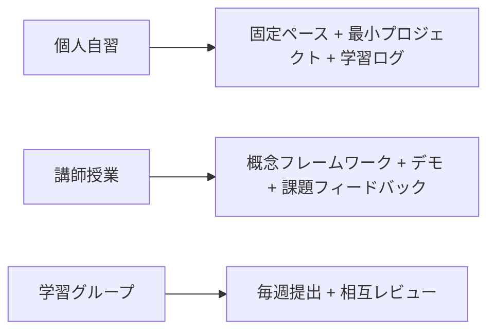

# 学習と自習の使用ガイド

このコースは、個人の自習ルートとしても、ブートキャンプ、コミュニティ学習、企業内研修のカリキュラムの骨組みとしても使えます。使い方による大きな違いは、内容の順番ではなく、進める速さ、課題の密度、議論の進め方、そしてプロジェクトの合格基準にあります。

自習者なら、まずは安定したペースを作ることが大切です。章の数に圧倒されないようにしましょう。講師なら、各段階を「教えられる・練習できる・評価できる」学習単元にまとめることが大切です。学習グループを運営するなら、ただ読むだけでなく、メンバーが継続的にプロジェクトの証拠を出せるようにすることが大切です。

## 先に使い方を選ぶ

| 使用者 | 最も重要な行動 |
|---|---|
| 自習者 | 毎週、動く結果を1つ残し、振り返りを1行書く |
| 講師 | 章を、教えられる・練習できる・評価できる単元にまとめる |
| 学習グループ | 読書の進度だけでなく、プロジェクトの証拠もそろえる |

## 自習者の使い方

自習するときは、まず「必読 5 本」の案内を読んでから、主な進路を1つ選ぶのがおすすめです。できるだけ早く LLM アプリを作りたい人は、開発ツール、Python、データ分析の基礎を先に終えてから、LLM アプリ、RAG、Agent に進むとよいでしょう。モデルの理解を補いたい人は、数学、機械学習、深層学習、Transformer の順で進めるとよいでしょう。作品集を作りたい人は、最後まで待たずに、各段階で小さなプロジェクトを1つずつ残すべきです。

自習では、1章を一度で完全に理解しようとしないでください。よりよい進め方は、まず章をざっと読み、最小限のコードを動かし、1つ問題をメモし、その後でプロジェクトに戻ってその知識を具体的な課題解決に使うことです。コース内の各知識点は、できるだけ何らかの成果物につなげましょう。たとえば、スクリプト、図、実験記録、README、デモ可能な機能などです。

## 講師の使い方

講師はすべてのページを逐語的に説明する必要はありません。このコースは講義資料の土台として使うのに向いています。授業時間は、概念フレームワーク、重要なつまずきポイント、コードデモ、課題の講評に優先的に使うべきです。各段階は、「導入問題、中心概念、最小デモ、授業内演習、課後プロジェクト、振り返りと講評」という形で設計できます。

初級クラスでは、数学やモデル導出の比率を下げ、Python、データ処理、API 呼び出し、RAG、プロジェクト提出を重視するのがおすすめです。上級クラスでは、モデル評価、エンジニアリング化、Agent の安全性、デプロイ、コスト最適化を追加できます。企業内研修では、汎用プロジェクトを社内文書、業務フロー、データサンプルに置き換えつつ、評価、ログ、安全境界の要件はそのまま残すべきです。

## 学習グループの使い方

学習グループが失敗しやすい最大の理由は、読む進度だけをそろえて、成果物の質をそろえないことです。毎週、実験記録、Notebook、動くスクリプト、プロジェクトのスクリーンショット、失敗例の分析など、1つの小さな提出物を決めるのがおすすめです。メンバー同士で README、実行コマンド、サンプル出力をレビューし、「読み終わったか」だけを話すのは避けましょう。

共同学習では、3つの役割を設定できます。説明者は今週の中心概念を言い換え、実践者はコードやプロジェクトをデモし、質問者はつまずきポイントや反例を集めます。役割は毎週交代します。こうすることで、全員が理解、表現、実装、疑問視の4つの学習行動を経験できます。

## おすすめの進め方

| ペース | 向いている人 | 目安期間 | 使い方 |
| --- | --- | --- | --- |
| 速習体験 | すでにプログラミング経験があり、AI アプリを素早く知りたい人 | 2-4 週間 | 細かい導出は飛ばし、API、RAG、Agent の小さなプロジェクトを優先する |
| 標準自習 | ある程度時間をかけて体系的に学びたい人 | 3-6 か月 | 主線に沿って進み、各段階で1つのプロジェクトと振り返りを完成させる |
| ブートキャンプ | 講師と課題フィードバックがある環境 | 8-12 週間 | 毎週、中心概念を学び、課題はプロジェクトの完結を軸に設計する |
| 深い上達 | モデル原理とエンジニアリング能力を補いたい人 | 6-12 か月 | モデル、評価、デプロイ、安全性、マルチモーダルの章を丁寧に読む |

どのペースを選んでも、「学習ログ」は残すことをおすすめします。学習ログは長くなくて大丈夫ですが、今週何を学んだか、何を作ったか、どこでつまずいたか、次に何を直すかを書いておきましょう。長い目で見ると、学習ログは単なる読書進度よりも、実際の成長をよく表してくれます。

## 課題設計のおすすめ

よい課題は、動かせる、確認できる、振り返れる、という条件を満たすべきです。「ある章を読む」「ある概念を理解する」だけでは不十分です。よりよい課題の形は、NumPy で小さな計算を実装する、Pandas でデータを1つきれいにする、sklearn で baseline を学習する、PyTorch で1回の訓練ループを完成させる、RAG でコースの質問に答える、Agent でツールを呼び出して学習計画を作る、などです。

各課題には、できれば基本要件とチャレンジ要件の両方を入れましょう。基本要件は全員が閉ループを動かせるようにし、チャレンジ要件は上級学習者がさらに深められる余地を作ります。採点や講評では、最終結果がきれいかどうかだけでなく、再現できるか、サンプル入力と出力があるか、エラーを記録しているか、技術選択を説明しているかを優先して見ましょう。

## プロジェクト合格のおすすめ

プロジェクトの合格は、4つの観点から見られます。機能が閉じているか、エンジニアリングが再現可能か、効果が評価されているか、振り返りが具体的か、です。機能の閉ループとは、ユーザーの入力に対してシステムが使える出力を返せることです。再現可能なエンジニアリングとは、他の人が README に従って動かせることです。効果の評価とは、テストサンプル、指標、または人手評価の基準があることです。具体的な振り返りとは、失敗例、原因、次の改善点をはっきり説明できることです。

授業で使う場合は、各段階のプロジェクトで3つのファイルを提出させるとよいでしょう。README、実験記録、失敗サンプル分析です。README は動かし方、実験記録は試した内容、失敗サンプル分析はシステムがまだ苦手なことを説明します。こうすると、学生が最終コードだけを出して、自分のプロジェクトを説明できない、ということを防げます。

## 説明順のおすすめ

ゼロから学ぶ人や基礎が弱い人には、まず「AI アプリは1つのシステムである」という全体像をつかんでもらってから、コードの細部に進むのがおすすめです。まず、完成した AI アシスタントの入力と出力を見せ、そのあとで、その裏にある Python、データ、モデル、検索、Prompt、ツール、ログ、デプロイを分解していきます。こうすると、なぜ前の基礎内容を学ぶ必要があるのかが、よりはっきりします。

開発経験がある人には、逆にプロジェクトの要求から入り、作りながら基礎を補う方法が向いています。たとえば、まず最小限の RAG 質問応答を作り、そのあとでテキスト分割、embedding、ベクトルデータベース、評価指標、エンジニアリング化デプロイを説明します。こうすると、「たくさん学んだけれど、どこで使うのかわからない」という感覚を減らせます。

## コース保守のおすすめ

このコースは継続的に更新すべきですが、新しいモデルや新しいフレームワークを追いかけすぎるのはおすすめしません。より安定した保守方法は、能力マップ、プロジェクトルート、評価基準、ツールエコシステム、典型的な間違いを優先して更新することです。具体的なモデルやフレームワークは事例として出してよいですが、コースの主線は、課題の分解、システム設計、エンジニアリング提出、評価と振り返りに置くべきです。

新しい章を追加するときは、その章が前後の章とどうつながるか、どのプロジェクト能力に結びつくか、合格基準は何か、の3点も一緒に補うのがよいでしょう。こうすることで、コースが孤立した知識点の寄せ集めにならず、明確な AI フルスタック成長ルートとして保ち続けられます。
