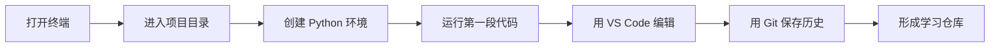
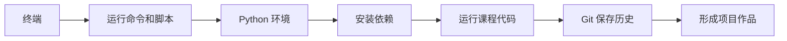

# 1 开发者工具基础


这一阶段解决的是“能不能稳定地写代码、运行代码、保存代码”。很多新人后面学 AI 卡住，并不是因为模型太难，而是因为命令行不会用、环境混乱、依赖装错、代码没有版本管理。

## 故事化导入：先打造你的 AI 工作台

在开始写模型和应用之前，先把工作台搭稳。终端像控制台，Git 像存档系统，Python 环境像实验室，VS Code 和 Jupyter 像两种不同的操作台。工具阶段的目标不是学很多命令，而是让你以后遇到项目时能自己创建、运行、保存和恢复。


:::tip 把漫画当成工作流读
这一阶段如果把工具看成一个工作站，而不是五个零散主题，会更容易理解：终端负责发出可复现命令，Python 环境负责隔离实验，VS Code 负责组织项目代码，Jupyter 负责记录探索，Git 负责保存每个稳定检查点。
:::

## 学习闯关地图



## 互动练习：每天留下一个可复现记录

每完成一个工具操作，都在学习仓库里记下一条“我做了什么、用了什么命令、遇到什么报错、最后怎么解决”。这些记录会成为你自己的开发说明书。后面环境出问题时，你不是从零开始猜，而是能回到历史记录里找线索。

## 项目彩蛋

本阶段的彩蛋作品是一个 `ai-learning-lab` 仓库。它看起来只是一个简单文件夹，但以后会逐步装进 Python 脚本、数据分析 Notebook、模型实验、RAG 项目和 Agent Demo。也就是说，这个仓库会从第一天的小工具箱，成长为你的 AI 全栈作品集。

## 阶段定位

| 信息 | 说明 |
|---|---|
| 适合对象 | 刚开始系统学习 AI 全栈，或开发工具链不稳定的学习者 |
| 预估学时 | 8～12 小时 |
| 前置要求 | 无 |
| 阶段产出 | 一个可复现的 Python 开发环境，一个能用 Git 管理的学习仓库 |

## 新手最小通关路线

新手先把终端基础、Git 基本操作和 Python 环境配置跑通，不需要一开始掌握复杂分支模型或所有命令参数。只要你能创建项目、运行 Python 文件、安装依赖、提交一次 Git 记录，就算完成本阶段最小通关。

## 进阶深入路线

如果你已经有开发经验，可以重点补齐环境隔离、Git 分支协作、远程仓库同步和可复现项目说明。进一步尝试把 `ai-learning-lab` 写成一个标准项目仓库，包含环境说明、运行命令、目录结构和常见问题记录。

## 新人先做什么，进阶再做什么

新人第一次学这一阶段时，先把目标压到最低：能打开终端、进入项目目录、运行一个 Python 文件、安装一个依赖、完成一次 Git 提交。不要被命令参数吓到，先形成“遇到问题会看路径、看报错、看当前环境”的习惯。

有经验的学习者可以把重点放在可复现性上：不同项目如何隔离环境，README 怎样写运行步骤，依赖版本怎样记录，Git 历史怎样帮助回滚。你的目标不是“会用工具”，而是让后面的每个 AI 项目都能被别人重新跑起来。

## 运行命令前的安全护栏

工具强大，是因为它能很快改变文件、环境和仓库。新手规则很简单：**有风险的命令，只在本章创建的练习仓库里操作。**

| 场景 | 更安全的习惯 |
|---|---|
| 删除文件前 | 先运行 `pwd` 和 `ls`，确认自己在练习目录里 |
| 安装依赖前 | 用 `which python` 或 `conda info --envs` 确认当前 Python 环境 |
| 提交代码前 | 运行 `git status`，读懂这次会记录哪些文件 |
| 撤销 Git 历史前 | 先用 `git status`、`git diff`、`git restore --staged`，不要一上来做破坏性回滚 |
| 分享代码前 | 确认 `.env`、API key、大数据和模型权重都被忽略 |

这不是为了让你害怕工具，而是相反：有了这些小检查，终端和 Git 会变得不那么神秘。

## 为什么先学工具

AI 学习不是只在网页上看概念。你后面会不断安装库、运行脚本、打开 Notebook、下载数据、调用 API、训练模型、启动服务、排查报错。工具链越早稳定，后面越少在无关问题上消耗精力。



## 本阶段学习路径

第一章先学终端与命令行。你需要能进入目录、查看文件、运行命令、理解路径和常见报错。

第二章再学 Git 与版本管理。你需要养成边写边提交的习惯，知道如何查看历史、回滚改动、管理分支和同步远程仓库。

第三章最后学开发环境配置。你会搭建 Python 环境、配置 VS Code、使用 Jupyter，并理解为什么要用虚拟环境隔离依赖。

## 学完后你应该能做到

- 能在终端中完成基本文件和项目操作
- 能创建、激活和管理 Python 环境
- 能使用 VS Code 编写、运行和调试 Python 文件
- 能用 Git 保存学习过程，并把项目推送到 GitHub
- 遇到环境问题时，能先判断是路径、解释器、依赖还是权限问题

## 常见误区

很多新人会觉得“命令行和 Git 以后再补也行”。但 AI 项目里，环境、依赖、数据路径、模型文件和部署命令几乎每天都会出现。如果工具基础不稳，后面的每个阶段都会反复被打断。

另一个常见误区是把所有 Python 包都装进同一个环境。短期看方便，长期会出现版本冲突。你应该从一开始就理解虚拟环境的意义。

## 工具错误剧场：环境问题先看哪里

如果终端提示找不到命令，先检查命令是否安装、当前 shell 是否刷新、路径是否写错；如果 Python 能运行但包导入失败，先确认当前解释器和安装依赖的环境是不是同一个；如果 Git 提交失败，先看是否初始化仓库、是否配置用户名邮箱、是否真的把文件加入暂存区。

## 最小可运行实验：从空文件夹到可复现仓库

本阶段最小实验不是写复杂代码，而是完整走一遍开发工作流：创建一个 `ai-learning-lab` 文件夹，写一个 `hello_ai.py`，在终端运行它，把命令和输出写进 README，然后用 Git 提交一次。

```bash
mkdir ai-learning-lab
cd ai-learning-lab
python -m venv .venv
python hello_ai.py
git init
git add .
git commit -m "init learning lab"
```

如果这条链路能独立完成，后面学习 Python、数据分析、RAG 和 Agent 时就有了稳定工作台。

## 工具失败案例库：先看路径、环境和版本

| 现象 | 常见原因 | 定位方法 | 修复方向 |
|---|---|---|---|
| 终端提示 command not found | 命令未安装或 PATH 未生效 | 查看安装位置和当前 shell | 重新安装，刷新终端，检查 PATH |
| Python 能运行但导包失败 | pip 和 python 不是同一环境 | 比较 `which python` 和 `python -m pip --version` | 用虚拟环境并通过 `python -m pip install` 安装 |
| Git 提交失败 | 未初始化、未暂存或未配置身份 | 运行 `git status` 和 `git config --list` | 初始化仓库，配置用户名邮箱，先 add 再 commit |
| README 里的命令跑不通 | 路径、文件名或依赖缺失 | 在新终端按 README 重跑 | 补充目录、依赖和完整命令 |

## 阶段验收 Rubric

| 等级 | 验收标准 | 作品集证据 |
|---|---|---|
| 最低通关 | 能打开终端、运行 Python、完成一次 Git 提交 | 运行截图、commit 记录 |
| 推荐通关 | 能创建虚拟环境、安装依赖、写清 README | `.venv` 说明、`requirements.txt`、README |
| 作品集通关 | 能把工具链沉淀成后续课程通用仓库 | 目录结构、命令记录、排障笔记、远程仓库链接 |

## 阶段项目

基础版是创建一个 `ai-learning-lab` 学习仓库，包含一个能运行的 `hello_ai.py`、一次 Git 提交和一份命令记录。标准版需要补充 Python 环境说明、依赖安装方式、VS Code 或 Jupyter 使用记录，并把仓库推送到远程平台。挑战版可以把它整理成后续 12 个学习站的作品集根目录，提前设计 `scripts/`、`notebooks/`、`projects/`、`notes/` 等目录，让整个课程的成果都能持续沉淀。


如果你想看更细的学习节奏，可以阅读 [阶段学习任务单：开发者工具基础](task-list.md)。


## 本阶段趣味任务卡

| 玩法 | 本阶段任务 |
|---|---|
| 剧情任务 | 帮 AI 学习助手搭建第一张工作台：能打开终端、运行 Python、写 README，并完成一次 Git 存档。 |
| Boss 战 | **工作台守门人** |
| 可解锁徽章 | 终端生存者、Git 存档师 |
| 新手轻松版 | 只完成一个最小输入到输出闭环，先留下运行截图或命令输出 |
| 作品集证据 | 从空文件夹到一次可复现提交 |

如果你觉得本阶段内容很多，先把这张任务卡当作最低目标。能完成新手轻松版，就可以继续往后学；以后准备作品集时，再回来升级标准版和挑战版。

## 阶段交付物

| 交付物 | 最小版 | 作品集版 |
|---|---|---|
| 学习仓库 | 创建 `ai-learning-lab` 并运行一个 Python 文件 | 有清晰目录、README、截图和提交历史 |
| 环境说明 | 记录 Python 版本和安装命令 | 提供虚拟环境、依赖文件和常见问题排查 |
| 命令记录 | 保存 5～10 条常用终端命令 | 说明每条命令的用途、输出和失败处理 |
| Git 记录 | 完成一次本地提交 | 有分支、远程仓库、提交说明和回滚记录 |
| README | 写清如何运行 `hello_ai.py` | 说明项目目标、目录结构、环境配置和下一步 |

## 和 AI 学习助手贯穿项目的关系

本阶段可以对应 AI 学习助手 v0.1：创建仓库、配置 Python 环境、写 README，并保存第一次运行截图。 如果你正在按贯穿项目路线学习，建议本阶段结束时至少提交一次版本记录：本阶段新增了什么能力、如何运行、示例输入输出是什么、遇到了什么问题、下一步准备怎么改。


## 阶段通关标准

| 通关层级 | 你需要做到什么 |
|---|---|
| 最低通关 | 能独立使用终端、Git、编辑器和 Python/Jupyter 环境。 |
| 推荐通关 | 完成本阶段至少一个可运行小项目，并在 README 中记录运行方式、示例输入输出和遇到的问题。 |
| 作品集通关 | 把本阶段产出接入“AI 学习助手”贯穿项目，留下截图、日志、评估样例和下一步计划。 |

学完本阶段后，不需要把所有细节都背下来。更重要的是能说清楚：本阶段解决什么问题，它和上一阶段的关系是什么，以及它会怎样支撑后续学习。下一阶段会用这些工具写 Python 程序和保存项目代码。
