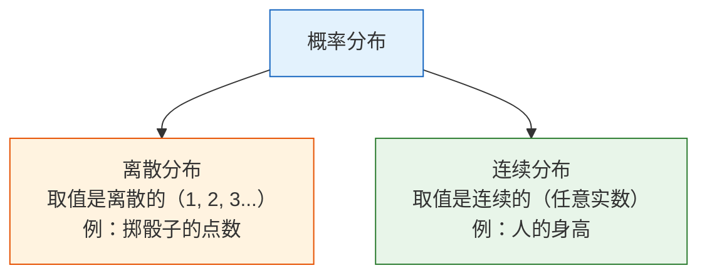
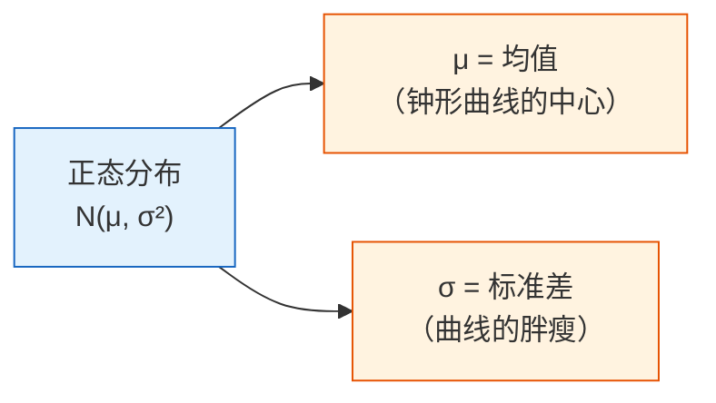

# 4.2.3 概率分布：数据背后的规律


## 学习目标

- 理解什么是概率分布
- 掌握常见的离散分布（伯努利、二项、泊松）
- 掌握常见的连续分布（均匀、正态/高斯）
- 直觉理解中心极限定理——为什么正态分布无处不在
- 用 Python 生成和可视化各种分布

## 画图前先解码这些术语

这一节会出现很多看起来很短、但信息量很大的分布术语：

| 术语 | 全称/含义 | 新人先怎么理解 |
|---|---|---|
| `random variable` | 随机变量 | 我们观察的不确定对象，比如点击、身高、骰子点数、客人数 |
| `PMF` | Probability Mass Function | 对离散值来说，每个值分到多少概率 |
| `PDF` | Probability Density Function | 对连续值来说，哪里的概率密度高、哪里的概率密度低 |
| `CDF` | Cumulative Distribution Function | 小于等于某个阈值的累计概率 |
| `μ` / `mu` | 均值 | 分布的中心或平均位置 |
| `σ` / `sigma` | 标准差 | 分布有多分散、多宽 |
| `λ` / `lambda_` | 速率或平均次数 | 在泊松分布里，固定区间内事件平均发生多少次 |
| `SciPy stats` | SciPy 里的统计函数模块 | Python 里计算 PMF、PDF、CDF 和常见分布的工具箱 |

如果你在本地运行本节代码，可以先安装这三个库：

```bash
python3 -m pip install numpy matplotlib scipy
```

代码里写 `lambda_` 而不是 `lambda`，是因为 `lambda` 是 Python 的匿名函数关键字，不能直接当变量名。

## 先说一个很重要的学习预期

这一节不是要把所有分布都讲成“考试大全”，
而是要先让你建立一个特别关键的感觉：

- 概率基础在看单个事件
- 概率分布开始看“随机现象整体长什么样”

---

## 先建立一张地图

如果上一节学的是“单个事件的概率”，这一节学的就是：

> **一个随机现象整体会长成什么样。**


这节课的重点不是背所有分布，而是先知道：

- 什么情况下会出现某种分布
- 它大概长什么样
- 在 AI 里你为什么会反复遇到它

## 一、什么是概率分布？

**概率分布 = 一个随机变量所有可能取值以及每个值出现的概率。**

### 一个更适合新人的类比

如果概率像“某次会不会发生”，
那分布就更像：

- 一张长期统计出来的“可能性地图”



```python
import numpy as np
import matplotlib.pyplot as plt
from scipy import stats

plt.rcParams['font.sans-serif'] = ['Arial Unicode MS']
plt.rcParams['axes.unicode_minus'] = False
```

`stats` 是 SciPy 的分布工具模块。本节用它来避免手写二项、泊松、正态分布公式，把注意力放在分布直觉上。

---

## 二、离散分布

### 伯努利分布——只有两种结果

**只做一次实验**，结果只有"成功"（1）或"失败"（0）。

```python
# 伯努利分布：抛一次硬币
# p = 成功的概率
p = 0.6  # 不公平硬币，正面概率 60%

# 模拟 10000 次
rng = np.random.default_rng(seed=42)
samples = rng.binomial(1, p, 10000)
print(f"正面比例: {samples.mean():.3f}")  # ≈ 0.6

fig, ax = plt.subplots(figsize=(6, 4))
values, counts = np.unique(samples, return_counts=True)
ax.bar(['反面 (0)', '正面 (1)'], counts / len(samples),
       color=['coral', 'steelblue'], edgecolor='white')
ax.set_ylabel('概率')
ax.set_title(f'伯努利分布 (p={p})')
ax.set_ylim(0, 1)
plt.show()
```

使用 `seed=42` 时，预期输出：

```text
正面比例: 0.605
```

**AI 中的应用**：二分类任务的标签就是伯努利分布（0 或 1）。

### 二项分布——多次伯努利的总和

**做 n 次伯努利实验，成功的总次数**服从二项分布。

```python
# 二项分布：抛 20 次硬币，正面出现的次数
n = 20   # 实验次数
p = 0.5  # 每次成功概率

# 理论分布
x = np.arange(0, n + 1)
pmf = stats.binom.pmf(x, n, p)

# 模拟
rng = np.random.default_rng(seed=42)
samples = rng.binomial(n, p, 10000)
print(f"期望正面次数 n*p: {n*p:.1f}")
print(f"最可能出现的正面次数: {x[pmf.argmax()]}")
print(f"模拟平均正面次数: {samples.mean():.3f}")

fig, axes = plt.subplots(1, 2, figsize=(14, 5))

# 理论
axes[0].bar(x, pmf, color='steelblue', edgecolor='white')
axes[0].set_xlabel('正面次数')
axes[0].set_ylabel('概率')
axes[0].set_title(f'二项分布 B(n={n}, p={p})（理论）')

# 模拟
axes[1].hist(samples, bins=range(n+2), density=True, color='coral', edgecolor='white', alpha=0.7)
axes[1].set_xlabel('正面次数')
axes[1].set_ylabel('频率')
axes[1].set_title(f'二项分布 B(n={n}, p={p})（模拟 10000 次）')

plt.tight_layout()
plt.show()
```

使用 `seed=42` 时，预期输出：

```text
期望正面次数 n*p: 10.0
最可能出现的正面次数: 10
模拟平均正面次数: 9.984
```

**关键参数**：
- 均值 = n × p（抛 20 次公平硬币，期望正面 10 次）
- 方差 = n × p × (1-p)

### 泊松分布——"稀有事件"的计数

**在固定时间/空间内，某稀有事件发生的次数**。

```python
# 泊松分布：一家奶茶店每小时平均来 5 个客人
lambda_ = 5  # 平均值（λ）

x = np.arange(0, 20)
pmf = stats.poisson.pmf(x, lambda_)

fig, ax = plt.subplots(figsize=(8, 5))
ax.bar(x, pmf, color='mediumseagreen', edgecolor='white')
ax.set_xlabel('每小时客人数')
ax.set_ylabel('概率')
ax.set_title(f'泊松分布 Poisson(λ={lambda_})')
ax.set_xticks(x)
plt.show()

print(f"来 0 个客人的概率: {stats.poisson.pmf(0, lambda_):.4f}")
print(f"来 5 个客人的概率: {stats.poisson.pmf(5, lambda_):.4f}")
print(f"来 10+ 个客人的概率: {1 - stats.poisson.cdf(9, lambda_):.4f}")
```

预期输出：

```text
来 0 个客人的概率: 0.0067
来 5 个客人的概率: 0.1755
来 10+ 个客人的概率: 0.0318
```

**AI 中的应用**：文本中某个罕见词出现的次数、网站的访问量、异常事件的检测。

---

## 三、连续分布

### 均匀分布——完全随机

每个值出现的概率完全相同。

```python
# 均匀分布 U(0, 1)
rng = np.random.default_rng(seed=42)
samples = rng.uniform(0, 1, 10000)
print(f"均匀分布样本均值: {samples.mean():.3f}")
print(f"均匀分布样本最小/最大值: {samples.min():.3f}/{samples.max():.3f}")

fig, ax = plt.subplots(figsize=(8, 4))
ax.hist(samples, bins=50, density=True, color='steelblue', edgecolor='white', alpha=0.7)
ax.axhline(y=1, color='red', linestyle='--', label='理论密度 = 1')
ax.set_xlabel('值')
ax.set_ylabel('概率密度')
ax.set_title('均匀分布 U(0, 1)')
ax.legend()
plt.show()
```

使用 `seed=42` 时，预期输出：

```text
均匀分布样本均值: 0.497
均匀分布样本最小/最大值: 0.000/1.000
```

**AI 中的应用**：随机初始化权重、随机采样、数据增强中的随机变换。

### 正态分布（高斯分布）——最重要的分布

正态分布也常叫 **高斯分布**。`stats.norm.pdf(x, mu, sigma)` 返回的是钟形曲线在 `x` 位置的高度。对连续分布来说，曲线高度本身不是概率；某个区间内的概率是曲线下面积。



```python
fig, axes = plt.subplots(1, 2, figsize=(14, 5))

# 不同均值
x = np.linspace(-8, 12, 1000)
for mu in [-2, 0, 3, 5]:
    axes[0].plot(x, stats.norm.pdf(x, mu, 1), linewidth=2, label=f'μ={mu}, σ=1')
axes[0].set_title('不同均值 μ（中心位置不同）')
axes[0].legend()
axes[0].set_xlabel('x')
axes[0].set_ylabel('概率密度')

# 不同标准差
for sigma in [0.5, 1, 2, 4]:
    axes[1].plot(x, stats.norm.pdf(x, 0, sigma), linewidth=2, label=f'μ=0, σ={sigma}')
axes[1].set_title('不同标准差 σ（胖瘦不同）')
axes[1].legend()
axes[1].set_xlabel('x')
axes[1].set_ylabel('概率密度')

plt.tight_layout()
plt.show()
```

### 68-95-99.7 法则

正态分布有一个非常实用的规律：

```python
mu, sigma = 0, 1

print("68-95-99.7 法则：")
for k, pct in [(1, '68.3%'), (2, '95.4%'), (3, '99.7%')]:
    area = stats.norm.cdf(mu + k*sigma) - stats.norm.cdf(mu - k*sigma)
    print(f"  μ ± {k}σ 范围内: {area:.1%} 的数据（理论 {pct}）")
```

预期输出：

```text
68-95-99.7 法则：
  μ ± 1σ 范围内: 68.3% 的数据（理论 68.3%）
  μ ± 2σ 范围内: 95.4% 的数据（理论 95.4%）
  μ ± 3σ 范围内: 99.7% 的数据（理论 99.7%）
```

```python
# 可视化 68-95-99.7
fig, ax = plt.subplots(figsize=(10, 5))
x = np.linspace(-4, 4, 1000)
y = stats.norm.pdf(x)

ax.plot(x, y, 'k-', linewidth=2)

# 填充区域
colors = ['steelblue', 'cornflowerblue', 'lightblue']
labels = ['68.3%（±1σ）', '95.4%（±2σ）', '99.7%（±3σ）']
for k, color, label in zip([3, 2, 1], colors[::-1], labels[::-1]):
    mask = (x >= -k) & (x <= k)
    ax.fill_between(x[mask], y[mask], alpha=0.5, color=color, label=label)

ax.set_xlabel('标准差')
ax.set_ylabel('概率密度')
ax.set_title('正态分布的 68-95-99.7 法则')
ax.legend(loc='upper right')
plt.show()
```

### 正态分布在 AI 中的应用

| 应用场景 | 说明 |
|---------|------|
| 权重初始化 | 神经网络的权重通常用正态分布初始化（如 He 初始化、Xavier 初始化） |
| 数据标准化 | 把数据变成均值 0、标准差 1 的"标准正态" |
| 噪声建模 | 传感器噪声、测量误差通常假设为正态分布 |
| 生成模型 | VAE 和扩散模型从正态分布采样生成新数据 |
| 异常检测 | 偏离均值超过 3σ 的数据点可能是异常值 |

---

## 四、中心极限定理——最重要的定理

### 核心思想

**不管原始数据是什么分布，大量独立样本的平均值趋近于正态分布。**

这就是为什么正态分布在自然界和数据科学中无处不在——很多现象本质上是大量独立因素的叠加效果。

### 用代码验证

```python
fig, axes = plt.subplots(2, 3, figsize=(16, 10))

# 三种完全不同的原始分布
rng = np.random.default_rng(seed=42)
distributions = [
    ('均匀分布', lambda n: rng.uniform(0, 1, n)),
    ('指数分布', lambda n: rng.exponential(1, n)),
    ('二项分布', lambda n: rng.binomial(10, 0.3, n)),
]

for col, (name, dist_func) in enumerate(distributions):
    # 上面：原始分布
    samples = dist_func(10000)
    axes[0, col].hist(samples, bins=50, density=True, color='coral',
                       edgecolor='white', alpha=0.7)
    axes[0, col].set_title(f'原始分布：{name}')
    axes[0, col].set_ylabel('概率密度')

    # 下面：取 30 个样本的平均值，重复 10000 次
    n_samples = 30
    means = np.array([dist_func(n_samples).mean() for _ in range(10000)])

    axes[1, col].hist(means, bins=50, density=True, color='steelblue',
                       edgecolor='white', alpha=0.7)

    # 叠加正态分布曲线
    x = np.linspace(means.min(), means.max(), 100)
    axes[1, col].plot(x, stats.norm.pdf(x, means.mean(), means.std()),
                       'r-', linewidth=2, label='正态分布拟合')
    axes[1, col].set_title(f'样本均值的分布（n={n_samples}）')
    axes[1, col].set_ylabel('概率密度')
    axes[1, col].legend()
    print(f"{name}: 样本均值的平均={means.mean():.3f}, 标准差={means.std():.3f}")

plt.suptitle('中心极限定理：无论原始分布是什么，样本均值都趋近正态分布',
             fontsize=14, y=1.01)
plt.tight_layout()
plt.show()
```

使用 `seed=42` 时，预期输出：

```text
均匀分布: 样本均值的平均=0.500, 标准差=0.053
指数分布: 样本均值的平均=0.999, 标准差=0.182
二项分布: 样本均值的平均=3.005, 标准差=0.262
```

**解读**：不管原始数据是均匀的、偏斜的还是离散的，只要取足够多样本的平均值，分布就会变成正态分布。

### 样本量的影响

```python
fig, axes = plt.subplots(1, 4, figsize=(18, 4))

# 用指数分布（非常偏斜）做实验
rng = np.random.default_rng(seed=42)
for ax, n in zip(axes, [1, 5, 30, 100]):
    means = [rng.exponential(1, n).mean() for _ in range(10000)]
    ax.hist(means, bins=50, density=True, color='steelblue', edgecolor='white', alpha=0.7)

    x = np.linspace(min(means), max(means), 100)
    ax.plot(x, stats.norm.pdf(x, np.mean(means), np.std(means)), 'r-', linewidth=2)
    ax.set_title(f'n = {n}')
    ax.set_xlabel('样本均值')

plt.suptitle('样本量越大，均值分布越接近正态', fontsize=13)
plt.tight_layout()
plt.show()
```

:::tip 经验法则
通常 n ≥ 30 时，中心极限定理的效果就很好了。这就是为什么很多统计方法要求"样本量至少 30"。
:::

---

## 五、分布一览表

| 分布 | 类型 | 参数 | 典型场景 | NumPy 生成 |
|------|------|------|---------|-----------|
| 伯努利 | 离散 | p（成功概率） | 二分类标签 | `rng.binomial(1, p)` |
| 二项 | 离散 | n, p | n 次实验成功次数 | `rng.binomial(n, p)` |
| 泊松 | 离散 | λ（平均次数） | 稀有事件计数 | `rng.poisson(lam)` |
| 均匀 | 连续 | a, b（范围） | 随机初始化 | `rng.uniform(a, b)` |
| 正态 | 连续 | μ, σ（均值, 标准差） | 噪声、权重初始化 | `rng.normal(mu, sigma)` |
| 指数 | 连续 | λ（速率） | 事件间隔时间 | `rng.exponential(1/lam)` |

---

## 学到这里，下一节该带着什么问题走？

看完分布以后，最值得带去下一节的问题是：

1. 如果我已经知道某类分布长什么样，怎样从观测数据反推出它的参数？
2. “最能解释数据”到底是什么意思？
3. A/B 测试里看到一个差异时，怎样判断它是真差异还是随机波动？

这几个问题，正好会把你自然带到：

- [4.2.4 统计推断基础](./03-statistical-inference.md)

:::info 连接后续
- **下一节**：统计推断——从数据推断分布的参数
- **5 机器学习入门到实战**：逻辑回归用 sigmoid 函数输出伯努利分布的参数 p
- **6 深度学习与 Transformer 基础**：神经网络权重用正态分布初始化（He/Xavier 初始化）
- **7 大模型原理、Prompt 与微调**：VAE 模型假设隐变量服从正态分布
:::

---

## 留下的证据

学完这一页，至少保留这张证据卡：

```text
random_process: event, distribution, sample, likelihood, entropy, or Bayes update
simulation_or_formula: code or formula used to make uncertainty visible
output: probability, sample statistic, interval, entropy, or updated belief
failure_check: base-rate confusion, p-value misuse, sample bias, or mixing probability with certainty
Expected_output: numeric result plus interpretation in plain language
```

## 小结

| 概念 | 直觉 |
|------|------|
| 概率分布 | 随机变量的"可能性地图" |
| 离散分布 | 取有限个值，每个值有确定的概率 |
| 连续分布 | 取任意值，用概率密度函数描述 |
| PMF | 每个离散取值对应的概率 |
| PDF | 连续值的概率密度曲线；概率是曲线下面积 |
| CDF | 到某个值为止的累计概率 |
| 正态分布 | 最重要的分布——钟形曲线，由 μ 和 σ 决定 |
| 中心极限定理 | 样本均值趋近正态分布，与原始分布无关 |

## 这节最该带走什么

- 概率分布最重要的直觉是“随机现象整体长什么样”
- 伯努利、二项、泊松是在看离散计数问题
- 正态分布和中心极限定理会在后面 AI 里反复出现

## 动手练习

### 练习 1：画出所有分布

在一张 2×3 的子图中，分别画出伯努利、二项、泊松、均匀、正态、指数分布的图形。

参考实现：

```python
rng = np.random.default_rng(seed=42)
fig, axes = plt.subplots(2, 3, figsize=(15, 8))
axes = axes.ravel()

axes[0].bar([0, 1], [0.4, 0.6], color=["coral", "steelblue"])
axes[0].set_title("Bernoulli(p=0.6)")

x = np.arange(0, 21)
axes[1].bar(x, stats.binom.pmf(x, 20, 0.5), color="steelblue")
axes[1].set_title("Binomial(n=20, p=0.5)")

x = np.arange(0, 16)
axes[2].bar(x, stats.poisson.pmf(x, 5), color="mediumseagreen")
axes[2].set_title("Poisson(lambda=5)")

samples = rng.uniform(0, 1, 10000)
axes[3].hist(samples, bins=40, density=True, color="steelblue", alpha=0.7)
axes[3].set_title("Uniform(0, 1)")

x = np.linspace(-4, 4, 300)
axes[4].plot(x, stats.norm.pdf(x), color="black")
axes[4].set_title("Normal(0, 1)")

samples = rng.exponential(1, 10000)
axes[5].hist(samples, bins=40, density=True, color="orange", alpha=0.7)
axes[5].set_title("Exponential(scale=1)")

plt.tight_layout()
plt.show()
```

### 练习 2：验证 68-95-99.7

生成 100000 个 N(170, 5) 的身高数据（均值 170cm，标准差 5cm），验证有多少比例的人身高在 160-180cm 之间（±2σ）。

参考实现：

```python
rng = np.random.default_rng(seed=42)
heights = rng.normal(170, 5, 100000)
within = ((heights >= 160) & (heights <= 180)).mean()
print(f"身高在 160-180cm 内的比例: {within:.1%}")
```

预期输出：

```text
身高在 160-180cm 内的比例: 95.4%
```

### 练习 3：中心极限定理实验

用骰子（1-6 均匀分布）做中心极限定理实验：掷 1 次、10 次、50 次、200 次骰子取平均值，各重复 10000 组，画出平均值的分布图。

参考实现：

```python
rng = np.random.default_rng(seed=42)
for n_rolls in [1, 10, 50, 200]:
    means = rng.integers(1, 7, size=(10000, n_rolls)).mean(axis=1)
    print(f"骰子 n={n_rolls}: 平均={means.mean():.3f}, 标准差={means.std():.3f}")
```

预期输出：

```text
骰子 n=1: 平均=3.475, 标准差=1.704
骰子 n=10: 平均=3.503, 标准差=0.541
骰子 n=50: 平均=3.499, 标准差=0.241
骰子 n=200: 平均=3.500, 标准差=0.120
```

均值一直接近 3.5，但平均值的标准差越来越小。这就是中心极限定理在代码里变得可见。


<details>
<summary>参考答案与讲解</summary>

- 六宫格分布图应让离散计数和连续测量的区别可见。Bernoulli、binomial、Poisson 适合柱状图；连续分布适合曲线或直方图。
- 从 `N(170,5)` 生成身高时，160 到 180 cm 位于均值正负两个标准差内，模拟比例应接近 `95%`。
- 样本均值实验中，样本量越大，样本均值的分布应越窄，也更像正态。这就是中心极限定理的实践样子。

</details>
