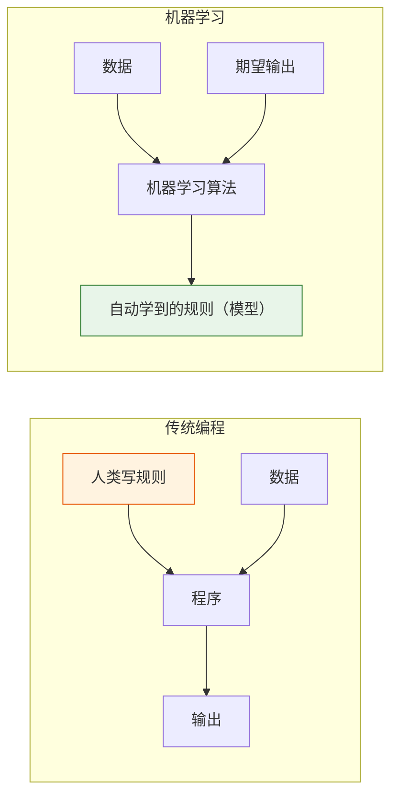
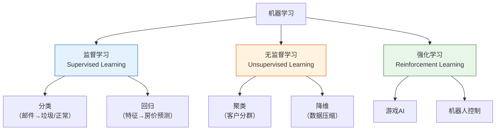
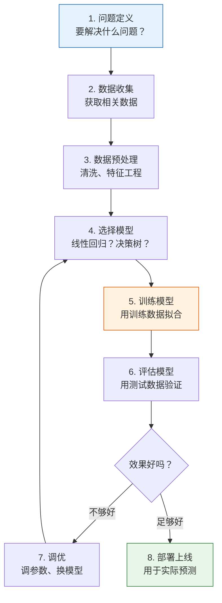
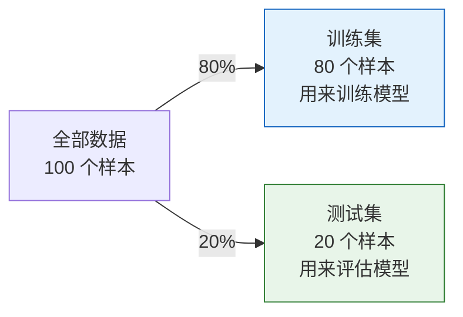
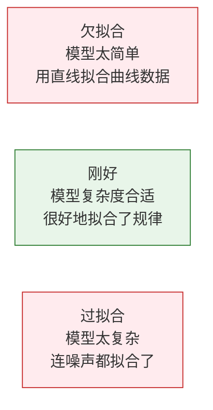

# 5.1.2 什么是机器学习


## 本节定位

这一节是你正式进入机器学习的第一站。重点不是背定义，而是理解机器学习和传统编程的区别，建立“问题类型 → 数据形式 → 学习方法”的判断框架，为后面的监督学习、无监督学习和模型评估打底。

:::tip 欢迎来到机器学习阶段
前三个阶段你学了 Python、数据分析和数学基础。现在，你终于要开始让计算机**自己"学"东西**了。这是整个 AI 旅程中最激动人心的阶段之一。
:::

## 学习目标

- 理解什么是机器学习以及它与传统编程的区别
- 掌握机器学习的三大分类（监督学习、无监督学习、强化学习）
- 理解机器学习的完整工作流程
- 建立正确的 ML 思维框架

---

## 先建立一张地图

这篇最重要的任务，不是把定义背下来，而是先帮你建立一个判断框架：


如果这张图你看懂了，后面第 5 站很多章节都会突然顺起来。


可以把这张漫画当成快速入门检查表：如果规则能写清楚，普通程序可能就够了；如果规律藏在大量案例里，机器学习就开始有价值。然后再判断你有没有标签、输出是类别还是数值、评估指标能不能证明模型真的有用。

---

## 一、机器学习到底是什么？

### 一句话定义

**机器学习 = 让计算机从数据中自动发现规律，而不是由人类手写规则。**

### 传统编程 vs 机器学习



| | 传统编程 | 机器学习 |
|---|---------|---------|
| 输入 | 规则 + 数据 | 数据 + 期望输出 |
| 输出 | 结果 | 规则（模型） |
| 适用场景 | 规则明确（如计算税额） | 规则难以描述（如识别猫） |
| 编写方式 | 人工编写 if-else 逻辑 | 算法自动从数据中学习 |

### 为什么需要机器学习？

有些任务，人类**说不清规则**：

```python
# 传统编程：判断邮件是否是垃圾邮件
def is_spam_traditional(email):
    if "免费" in email:
        return True
    if "中奖" in email:
        return True
    if "点击领取" in email:
        return True
    # ... 还有多少规则？永远写不完！
    return False

# 机器学习：给模型 10 万封已标注的邮件，让它自己学
# model.fit(emails, labels)
# model.predict(new_email)  → 自动判断
```

机器学习适用的场景：
- 规则复杂或未知（图像识别、语音识别）
- 规则会变化（推荐系统、欺诈检测）
- 数据量大到人类无法手动分析
- 需要个性化的结果

### 第一次学机器学习，最该先抓住什么？

最该先抓住的不是“模型有多少种”，而是这一句：

> **机器学习是在用数据替代手写规则。**

一旦你抓住这句，后面很多问题都会更好判断：

- 什么时候适合传统编程
- 什么时候应该交给模型去学
- 为什么数据质量会直接决定模型上限

### 新人应该提前拆开的术语

| 术语 | 它是什么 | 在本章为什么重要 |
|---|---|---|
| `ML` | Machine Learning 的缩写 | 你会在图、文件名和项目记录里反复看到 |
| `model` | 学到的规则或函数 | 训练完成后被保存、复用、拿去预测的就是模型 |
| `algorithm` | 学习方法 | 决策树、逻辑回归、K-Means 在训练前都是算法 |
| `training` | 从数据中学习的过程 | 在代码里通常发生在调用 `fit` 的时候 |
| `inference` | 用训练好的模型处理新数据 | 在 sklearn 里通常对应 `predict` 或 `predict_proba` |
| `baseline` | 最简单、最先做出来的对照结果 | 它能告诉你后面的优化是不是真的有效 |
| `metric` | 衡量模型成败的尺子 | Accuracy、F1、MAE、RMSE 回答的是不同评估问题 |

对新人来说，最重要的是先区分 `algorithm` 和 `model`：算法是学习配方，模型是这个配方看过数据以后训练出来的结果。

---

## 二、机器学习的三大分类



### 监督学习——有"标准答案"

**核心**：给模型大量"输入-输出"配对数据，让它学习映射关系。

| 类型 | 输出 | 例子 |
|------|------|------|
| **分类** | 离散类别 | 邮件→垃圾/正常，图片→猫/狗 |
| **回归** | 连续数值 | 面积→房价，特征→温度 |

```python
# 监督学习的数据格式
# X（特征/输入）       y（标签/输出）
# [面积, 房间数, 楼层]   → 房价
# [120,  3,    15]      → 350万
# [80,   2,    8]       → 220万
# [200,  4,    20]      → 580万
```

**关键**：训练数据必须有**标签**（标准答案）。模型的目标是学会从 X 预测 y。

### 怎么最快判断一个问题是不是监督学习？

可以直接问自己：

- 我手里有没有“输入 -> 正确输出”这样的配对数据？

如果有，通常就是监督学习。
然后再继续问：

- 输出是类别，还是连续数值？

这就会自然分出：

- 分类
- 回归

### 无监督学习——没有"标准答案"

**核心**：只有输入数据，没有标签。让模型自己发现数据中的结构和模式。

| 类型 | 做什么 | 例子 |
|------|--------|------|
| **聚类** | 把相似的数据分组 | 客户分群、新闻归类 |
| **降维** | 减少特征数量 | PCA（第 4 站学过） |
| **异常检测** | 找出不正常的数据 | 信用卡欺诈检测 |

```python
# 无监督学习的数据：没有标签
# X（特征）
# [消费金额, 消费频次, 最近消费]
# [500,      10,      3天前]
# [50,       2,       30天前]
# [1000,     20,      1天前]
# → 模型自动分成 "高价值客户"、"低频客户" 等群组
```

### 无监督学习最容易被误解的地方

很多新人会把无监督学习理解成“机器自己就能找到真正答案”。
其实更准确的说法是：

- 模型会帮你发现一种可能的结构
- 但这个结构有没有业务价值，最后还得靠你解释

所以无监督学习里，“解释结果”往往和“跑出结果”同样重要。

### 强化学习——通过"试错"学习

**核心**：智能体（Agent）在环境中采取行动，根据奖励/惩罚调整策略。

| 要素 | 说明 |
|------|------|
| 智能体 | 做决策的 AI |
| 环境 | 智能体所在的世界 |
| 状态 | 当前环境的信息 |
| 行动 | 智能体能做的选择 |
| 奖励 | 行动后得到的反馈 |

```python
# 强化学习的直觉：训练小狗
# 状态：小狗看到的环境
# 行动：坐下 / 站起 / 握手
# 奖励：做对了 → 给零食（+1），做错了 → 不给（0）
# 经过多次试错，小狗学会了正确的行为
```

:::info 本课程的重点
本阶段主要学习**监督学习**和**无监督学习**。强化学习会在后面的智能体系统内容中涉及。
:::

### 三种学习方式对比

| | 监督学习 | 无监督学习 | 强化学习 |
|---|---------|----------|---------|
| 数据有标签？ | 有 | 没有 | 有奖励信号 |
| 目标 | 预测标签 | 发现结构 | 最大化奖励 |
| 典型算法 | 线性回归、决策树 | K-Means、PCA | Q-Learning、PPO |
| AI 应用 | 图像分类、翻译 | 客户分群、推荐 | 游戏 AI、机器人 |

---

## 三、机器学习的工作流程

### 完整流程



### 先把流程读成一句人话

这条流程可以先翻译成一句更适合新人的话：

> **先定义问题，再准备数据，先做一个能跑的版本，再看结果，最后一点点改进。**

这句话其实就是第 5 站整条主线的底层逻辑。

### 训练集 vs 测试集

这是 ML 中最重要的概念之一：**不能用训练数据来评估模型。**

```python
import numpy as np

# 模拟数据集
rng = np.random.default_rng(seed=42)
n = 100
X = rng.normal(size=(n, 3))
y = rng.integers(0, 2, n)

# 通常 80% 训练，20% 测试
from sklearn.model_selection import train_test_split

X_train, X_test, y_train, y_test = train_test_split(
    X, y, test_size=0.2, random_state=42
)

print(f"训练集: {X_train.shape[0]} 个样本")
print(f"测试集: {X_test.shape[0]} 个样本")
```

预期输出：

```text
训练集: 80 个样本
测试集: 20 个样本
```



:::warning 为什么要分开？
如果你用同一份数据训练和评估，模型可以通过"记住"数据来获得满分——但面对新数据时表现很差。这叫**过拟合**（overfit）。就像考试前把答案背下来，换一套题就不会了。
:::


读这张图时，先看三条边界：训练集用来学，验证集用来选方案，测试集只在最后验收。只要某个处理步骤提前看到了测试集信息，比如先对全量数据标准化、先用全量数据选特征，模型分数就可能变得“虚高”。

### 新人最容易踩的坑：把“学会”误当成“记住”

机器学习里一个特别重要的分界点就是：

- 模型在训练集上做得好，不等于它真的学会了规律
- 它也可能只是把训练数据记住了

所以从这一节开始，你就应该养成一个习惯：

- 看到高分，先问这是训练集分数还是测试集分数

### 一个最小的完整例子

先别急着看代码，先看完整闭环：


这张图就是一个最小可用 ML 项目的形状：定义问题，准备 `X` 和 `y`，训练模型，用指标评估，再决定下一步改哪里。下面的代码故意写得很小，是为了让你把每一行都对应到图里的一个步骤，而不是一上来就被框架细节淹没。

```python
from sklearn.datasets import load_iris
from sklearn.model_selection import train_test_split
from sklearn.tree import DecisionTreeClassifier
from sklearn.metrics import accuracy_score

# 1. 加载数据
iris = load_iris()
X, y = iris.data, iris.target
print(f"数据集: {X.shape[0]} 个样本, {X.shape[1]} 个特征, {len(set(y))} 个类别")

# 2. 划分训练集和测试集
X_train, X_test, y_train, y_test = train_test_split(X, y, test_size=0.2, random_state=42)

# 3. 选择模型并训练
model = DecisionTreeClassifier(random_state=42)
model.fit(X_train, y_train)  # 训练！

# 4. 预测和评估
y_pred = model.predict(X_test)
accuracy = accuracy_score(y_test, y_pred)
print(f"测试集准确率: {accuracy:.1%}")
```

预期输出：

```text
数据集: 150 个样本, 4 个特征, 3 个类别
测试集准确率: 100.0%
```

**只用几行代码就完成了一个完整的 ML 项目！** 接下来的章节会逐步深入每个环节。

如果这段代码报错 `ModuleNotFoundError: No module named 'sklearn'`，先安装本章依赖：

```bash
python -m pip install --upgrade scikit-learn
```

这里 `scikit-learn` 是安装包名，`sklearn` 是 Python 代码里的导入模块名。

可以按下面这张表读代码：

| 代码关键词 | 它是什么意思 | 为什么重要 |
|---|---|---|
| `load_iris()` | 加载一个内置的玩具数据集 | 不需要下载文件，就能安全完成第一次练习 |
| `X` | 特征矩阵，也就是输入列 | 模型从这些数值里学习规律 |
| `y` | 目标向量，也就是标准答案 | 监督学习需要标签才能学习 |
| `train_test_split` | 把数据分成学习部分和检查部分 | 避免用模型已经看过的样本来评价模型 |
| `fit` | 训练模型 | 算法在这里变成训练好的模型 |
| `predict` | 用训练好的模型处理新输入 | 这就是实际应用中的推理步骤 |
| `accuracy_score` | 计算预测正确的比例 | 把模型表现变成一个可度量的结果 |
| `random_state` | 固定随机切分或模型随机性 | 让新人反复运行时能得到一致结果 |

---

## 四、关键术语速查

| 术语 | 英文 | 含义 |
|------|------|------|
| 样本 | Sample | 一条数据 |
| 特征 | Feature | 描述样本的属性（输入的每一列） |
| 标签 | Label / Target | 样本的"答案"（要预测的值） |
| 训练集 | Training Set | 用来训练模型的数据 |
| 测试集 | Test Set | 用来评估模型的数据 |
| 过拟合 | Overfitting | 模型"死记硬背"训练数据，泛化能力差 |
| 欠拟合 | Underfitting | 模型太简单，连训练数据都学不好 |
| 泛化 | Generalization | 模型在新数据上表现好的能力 |
| 超参数 | Hyperparameter | 需要人为设定的参数（如学习率、树深度） |
| 数据泄漏 | Data leakage | 测试集或未来信息意外进入训练流程，让分数看起来虚高 |
| 验证集 | Validation Set | 最终测试前，用来选择模型或超参数的数据 |

### 过拟合 vs 欠拟合



```python
import matplotlib.pyplot as plt

rng = np.random.default_rng(seed=42)
x = np.linspace(0, 1, 20)
y = np.sin(2 * np.pi * x) + rng.normal(size=20) * 0.3

fig, axes = plt.subplots(1, 3, figsize=(15, 4))
x_smooth = np.linspace(0, 1, 200)

# 欠拟合：1 次多项式（直线）
coeffs = np.polyfit(x, y, 1)
axes[0].scatter(x, y, color='steelblue', s=40)
axes[0].plot(x_smooth, np.polyval(coeffs, x_smooth), 'r-', linewidth=2)
axes[0].set_title('欠拟合（直线）\n太简单，无法捕捉规律')

# 刚好：3 次多项式
coeffs = np.polyfit(x, y, 3)
axes[1].scatter(x, y, color='steelblue', s=40)
axes[1].plot(x_smooth, np.polyval(coeffs, x_smooth), 'r-', linewidth=2)
axes[1].set_title('刚好（3 次多项式）\n较好地拟合了规律')

# 过拟合：18 次多项式
coeffs = np.polyfit(x, y, 18)
axes[2].scatter(x, y, color='steelblue', s=40)
y_overfit = np.polyval(coeffs, x_smooth)
y_overfit = np.clip(y_overfit, -3, 3)
axes[2].plot(x_smooth, y_overfit, 'r-', linewidth=2)
axes[2].set_title('过拟合（18 次多项式）\n连噪声都拟合了')
axes[2].set_ylim(-3, 3)

for ax in axes:
    ax.grid(True, alpha=0.3)

plt.tight_layout()
plt.show()
```

---

## 小结

| 要点 | 说明 |
|------|------|
| 机器学习 | 让计算机从数据中学习规律 |
| 监督学习 | 有标签，学预测（分类/回归） |
| 无监督学习 | 无标签，发现结构（聚类/降维） |
| 强化学习 | 通过试错学策略（奖励驱动） |
| 核心流程 | 数据 → 预处理 → 训练 → 评估 → 部署 |
| 训练/测试分割 | 必须分开，防止过拟合 |

## 这节最该带走什么

如果只带走一句话，我希望你记住：

> **机器学习阶段真正的起点，不是学某个模型，而是先学会把问题、数据和评估方式对上。**

所以这一节最重要的收获应该是：

- 能分清监督学习和无监督学习
- 能分清分类和回归
- 知道为什么一定要分训练集和测试集
- 知道第 5 站后面所有算法其实都在这张地图里

:::info 连接后续
- **下一节**：Scikit-learn 框架入门——ML 实战的标准工具
- **第 2 章**：学习具体的算法（线性回归、逻辑回归、决策树等）
- **第 4 章**：深入模型评估——如何科学判断模型好不好
:::

---

## 动手练习

### 练习 1：分类 vs 回归

判断以下任务属于分类还是回归：
1. 预测明天的气温
2. 判断一张照片中是否有人脸
3. 预测一只股票明天的收盘价
4. 将新闻分为体育/科技/娱乐/财经
5. 预测一个用户会不会流失

### 练习 2：第一个 ML 模型

用 scikit-learn 的 `load_wine()` 数据集，训练一个决策树分类器，输出测试集的准确率。

```python
from sklearn.datasets import load_wine
from sklearn.model_selection import train_test_split
from sklearn.tree import DecisionTreeClassifier

wine = load_wine()
X_train, X_test, y_train, y_test = train_test_split(
    wine.data, wine.target, test_size=0.2, random_state=42, stratify=wine.target
)

model = DecisionTreeClassifier(random_state=42)
model.fit(X_train, y_train)
accuracy = model.score(X_test, y_test)
print(f"Test accuracy: {accuracy:.3f}")
```

在当前 sklearn 版本上，预期输出约为：

```text
Test accuracy: 0.944
```

如果 sklearn 版本或数据切分设置不同，结果可能有轻微变化。这里最重要的是流程：加载数据、划分数据、只在训练集训练、在测试集评估。

### 练习 3：观察过拟合

修改 4.3 节的过拟合示例，用不同次数的多项式（1, 3, 5, 10, 18）拟合数据，画出 5 张子图，观察复杂度对拟合效果的影响。
