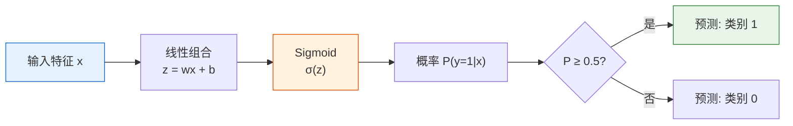
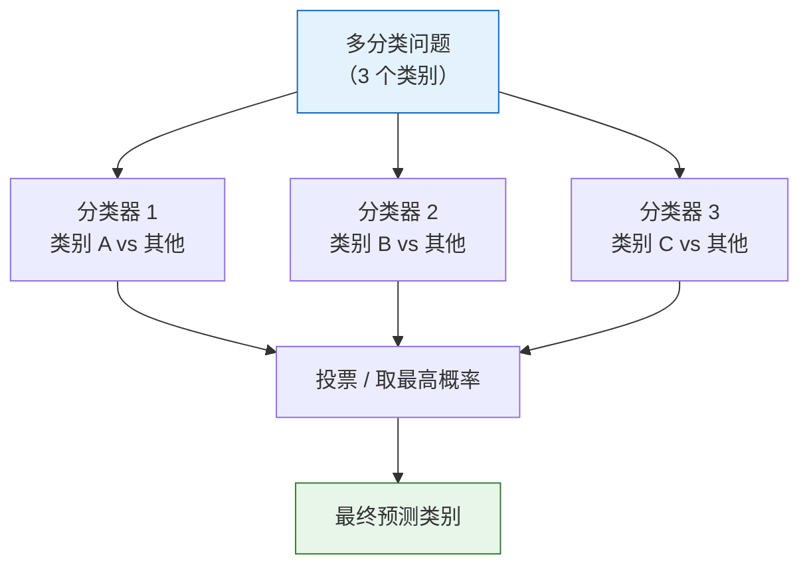

# 逻辑回归


:::tip 本节定位
逻辑回归虽然名字里带"回归"，其实是一个**分类**算法。它在线性回归的基础上加了一个 Sigmoid 函数，就能把连续值映射为概率。这是最经典的分类算法，也是理解神经网络的关键。
:::

## 学习目标

- 理解从线性回归到分类的过渡
- 掌握 Sigmoid 函数与决策边界
- 理解交叉熵损失函数（与第 4 站信息论衔接）
- 掌握多分类扩展（One-vs-Rest、Softmax）
- 能用 Scikit-learn 实现逻辑回归

## 先说一个很重要的学习预期

这一节很容易让新人一下子卡在三个词上：

- `Sigmoid`
- `交叉熵`
- `决策边界`

但更适合第一遍学习的目标，不是一下子把所有推导都吃透，而是先把下面这条主线看顺：

> **线性回归是在学连续值，逻辑回归是在学概率，再把概率变成分类决策。**

只要这条线先立住，后面的交叉熵、阈值、Softmax 就都会更容易落位。

---

## 先建立一张地图

逻辑回归这节最适合新人的理解顺序不是“线性回归 + Sigmoid 就行了”，而是先看清它在分类主线里的位置：


这节真正要讲清的是：

- 为什么分类任务不能直接套线性回归
- 逻辑回归到底是在学概率，还是在学边界
- 为什么它会成为后面神经网络的桥梁

### 术语解码

| 术语 | 在本节里是什么意思 | 在真实项目中为什么重要 |
|------|------|------|
| `logit` | Sigmoid 之前的原始分数 `z = wᵀx + b` | 它还不是概率，不应该直接拿来和业务阈值比较 |
| `Sigmoid` | 把任意实数压缩到 `(0, 1)` 的函数 | 它把原始分数变成类似概率的值 |
| `BCE` | Binary Cross-Entropy，二分类概率预测的损失函数 | 它会强烈惩罚“非常自信但预测错”的情况 |
| `OvR` | One-vs-Rest，每个类别训练一个二分类器 | 适合把多分类理解成多个“是不是这个类”的问题 |
| `Softmax` | 把多个分数变成总和为 1 的概率分布 | 多分类和神经网络输出层常用 |
| `threshold` | 把概率变成类别的分界值 | 调整它会改变召回率和误报之间的取舍 |
| `solver` | sklearn 用来求解参数的数值优化器 | 不同优化器支持的正则化形式可能不同 |
| `C` | sklearn 逻辑回归中的正则化强度倒数 | `C` 越小，正则化越强，系数通常越简单 |

## 一、从回归到分类

### 1.1 问题：输出不再是数值

| 线性回归 | 逻辑回归 |
|---------|---------|
| 预测连续值（房价、温度） | 预测类别（垃圾/正常、猫/狗） |
| 输出：任意实数 | 输出：概率 [0, 1] |

**关键问题**：线性回归的输出 `wx + b` 可以是任意实数，但概率必须在 [0, 1] 之间。怎么转换？

### 1.2 为什么“线性回归硬套分类”会出问题？

这一步最值得先记住的不是“公式不一样”，而是：

- 线性回归的输出没有概率意义

比如预测值可能是：

- `1.7`
- `-0.4`

如果你把它理解成“是正类的概率”，就会立刻变得很奇怪。
所以逻辑回归真正解决的第一件事，不是“换个边界”，而是：

- **让输出先成为概率**

### 1.2.1 一个更适合新人的类比

你可以先把这件事想成：

- 线性回归像是在直接报一个“分数”
- 逻辑回归则是在先报“把握有多大”

比如：

- `0.92` 更像“我很确定它是正类”
- `0.51` 更像“我只是略微倾向它是正类”

所以逻辑回归最关键的升级，不是模型突然复杂了，而是：

- 它开始把输出变成“置信程度”而不是裸分数


先看图，再看公式：逻辑回归先算出原始 `logit` 分数，再用 Sigmoid 把分数变成概率，最后才用阈值把概率变成类别。这个拆分在真实项目里很重要，因为概率模型可以不变，但当误报和漏报的业务成本变化时，阈值可以单独调整。

### 1.3 Sigmoid 函数——压缩到 [0, 1]

> **σ(z) = 1 / (1 + e⁻ᶻ)**

```python
import numpy as np
import matplotlib.pyplot as plt

def sigmoid(z):
    return 1 / (1 + np.exp(-z))

z = np.linspace(-8, 8, 200)
plt.figure(figsize=(8, 5))
plt.plot(z, sigmoid(z), 'b-', linewidth=2)
plt.axhline(y=0.5, color='r', linestyle='--', alpha=0.5, label='y = 0.5')
plt.axvline(x=0, color='gray', linestyle='--', alpha=0.5)
plt.fill_between(z, sigmoid(z), alpha=0.1, color='blue')
plt.xlabel('z = wx + b')
plt.ylabel('σ(z) = 概率')
plt.title('Sigmoid 函数：把任意实数压缩到 (0, 1)')
plt.legend()
plt.grid(True, alpha=0.3)
plt.ylim(-0.05, 1.05)
plt.show()

for value in [-8, -2, 0, 2, 8]:
    print(f"z={value:>2}: σ(z)={sigmoid(value):.4f}")
```

预期输出：

```text
z=-8: σ(z)=0.0003
z=-2: σ(z)=0.1192
z= 0: σ(z)=0.5000
z= 2: σ(z)=0.8808
z= 8: σ(z)=0.9997
```

Sigmoid 的性质：
| 性质 | 说明 |
|------|------|
| z → +∞ | σ(z) → 1 |
| z → -∞ | σ(z) → 0 |
| z = 0 | σ(z) = 0.5 |
| 导数 | σ'(z) = σ(z) × (1 - σ(z)) |

### 1.4 逻辑回归的完整模型



> **P(y=1|x) = σ(wᵀx + b) = 1 / (1 + e^-(wᵀx + b))**

### 1.5 一个很重要但经常被忽略的点

逻辑回归输出的不是最终类别，
而是：

- 某一类发生的概率估计

类别只是你在这个概率上再加一个阈值判断后的结果。

所以它其实天然分成两层：

1. 概率建模
2. 阈值决策

---

## 二、决策边界

### 2.1 什么是决策边界？

决策边界是**模型判断"类别 0"和"类别 1"的分界线**。

对于逻辑回归，决策边界是 `wᵀx + b = 0` 的直线（或超平面）。

### 2.2 为什么决策边界会落在 `wᵀx + b = 0`？

因为：

- 当 `σ(z) = 0.5` 时，正好是两类打平
- Sigmoid 在 `z = 0` 时输出 `0.5`

所以这条边界不是拍脑袋来的，
而是概率意义下“刚好一半一半”的位置。

```python
from sklearn.datasets import make_classification
from sklearn.linear_model import LogisticRegression

# 生成二分类数据
X, y = make_classification(n_samples=200, n_features=2, n_informative=2,
                           n_redundant=0, n_clusters_per_class=1, random_state=42)

# 训练逻辑回归
model = LogisticRegression(random_state=42)
model.fit(X, y)

# 可视化决策边界
fig, ax = plt.subplots(figsize=(8, 6))

# 画数据点
scatter = ax.scatter(X[:, 0], X[:, 1], c=y, cmap='coolwarm', s=30, alpha=0.7, edgecolors='w', linewidth=0.5)

# 画决策边界
x_min, x_max = X[:, 0].min() - 1, X[:, 0].max() + 1
y_min, y_max = X[:, 1].min() - 1, X[:, 1].max() + 1
xx, yy = np.meshgrid(np.linspace(x_min, x_max, 200),
                      np.linspace(y_min, y_max, 200))
Z = model.predict_proba(np.c_[xx.ravel(), yy.ravel()])[:, 1]
Z = Z.reshape(xx.shape)

ax.contourf(xx, yy, Z, levels=np.linspace(0, 1, 11), cmap='coolwarm', alpha=0.3)
ax.contour(xx, yy, Z, levels=[0.5], colors='black', linewidths=2)

ax.set_xlabel('特征 1')
ax.set_ylabel('特征 2')
ax.set_title('逻辑回归的决策边界')
plt.colorbar(scatter, label='类别')
plt.grid(True, alpha=0.3)
plt.show()

print(f"权重: w = {model.coef_[0]}")
print(f"截距: b = {model.intercept_[0]:.4f}")
print(f"准确率: {model.score(X, y):.1%}")
```

预期输出：

```text
权重: w = [ 1.818 -0.409]
截距: b = 0.1873
准确率: 84.0%
```

图中的黑色等高线就是 `0.5` 概率边界。一边满足 `P(y=1|x) >= 0.5`，另一边满足 `P(y=1|x) < 0.5`。

---

## 三、损失函数——交叉熵

### 3.1 为什么不用 MSE？

对于分类问题，MSE 的损失曲面是**非凸的**，梯度下降容易陷入局部最优。需要一个更好的损失函数。

### 3.2 这一步最值得先记的不是“非凸”两个字

对新人来说，更实用的理解是：

- MSE 更适合连续值误差
- 分类问题更关心“概率分布对不对”

而交叉熵更像是在问：

> **你给真正类别分到的概率，究竟够不够高？**

### 3.3 二元交叉熵


这张图先展示最重要的行为：当模型把高概率给了真实标签时，BCE 很温和；当模型非常自信但预测错时，BCE 会变得很大。所以 BCE 比“最终类别对不对”更适合教会模型如何调整概率。

> **BCE = -(1/n) × Σ[ yi × log(p̂i) + (1-yi) × log(1-p̂i) ]**

:::info 与第 4 站的衔接
这就是你在第 4 站"2.4 信息论基础"中学过的**交叉熵**。当时的公式是 `H(P,Q) = -Σ p(x) log q(x)`。现在，`p` 是真实标签，`q` 是模型预测的概率。
:::

```python
def binary_cross_entropy(y_true, y_pred_prob):
    """二元交叉熵损失"""
    eps = 1e-15  # 防止 log(0)
    y_pred_prob = np.clip(y_pred_prob, eps, 1 - eps)
    return -np.mean(
        y_true * np.log(y_pred_prob) + (1 - y_true) * np.log(1 - y_pred_prob)
    )

# 直觉：当真实标签为 1 时
p = np.linspace(0.01, 0.99, 100)
loss_y1 = -np.log(p)      # y=1 时的损失
loss_y0 = -np.log(1 - p)  # y=0 时的损失

fig, axes = plt.subplots(1, 2, figsize=(12, 4))
axes[0].plot(p, loss_y1, 'b-', linewidth=2)
axes[0].set_xlabel('预测概率 P(y=1)')
axes[0].set_ylabel('损失')
axes[0].set_title('真实标签 y=1 时\n预测越接近 1，损失越小')

axes[1].plot(p, loss_y0, 'r-', linewidth=2)
axes[1].set_xlabel('预测概率 P(y=1)')
axes[1].set_ylabel('损失')
axes[1].set_title('真实标签 y=0 时\n预测越接近 0，损失越小')

for ax in axes:
    ax.grid(True, alpha=0.3)

plt.tight_layout()
plt.show()

examples = [
    (np.array([1]), np.array([0.9])),
    (np.array([1]), np.array([0.1])),
    (np.array([0]), np.array([0.1])),
    (np.array([0]), np.array([0.9])),
]
for y_true, y_prob in examples:
    print(
        f"真实={y_true[0]}, 预测概率={y_prob[0]:.1f}, "
        f"损失={binary_cross_entropy(y_true, y_prob):.4f}"
    )
```

预期输出：

```text
真实=1, 预测概率=0.9, 损失=0.1054
真实=1, 预测概率=0.1, 损失=2.3026
真实=0, 预测概率=0.1, 损失=0.1054
真实=0, 预测概率=0.9, 损失=2.3026
```

最关键的直觉是：交叉熵不只是问“对不对”，还会问“你把多少概率分给了真正答案”。

### 3.4 从零实现逻辑回归

```python
# 用梯度下降从零实现逻辑回归

# 生成简单数据
from sklearn.datasets import make_classification
X_train, y_train = make_classification(n_samples=200, n_features=2, n_informative=2,
                                        n_redundant=0, random_state=42)

# 标准化
X_mean = X_train.mean(axis=0)
X_std = X_train.std(axis=0)
X_norm = (X_train - X_mean) / X_std

# 初始化参数
w = np.zeros(2)
b = 0.0
lr = 0.1
epochs = 200
history = []

for epoch in range(epochs):
    # 前向传播
    z = X_norm @ w + b
    p = sigmoid(z)

    # 计算损失
    loss = binary_cross_entropy(y_train, p)
    history.append(loss)

    # 计算梯度
    error = p - y_train
    dw = (X_norm.T @ error) / len(y_train)
    db = np.mean(error)

    # 更新参数
    w -= lr * dw
    b -= lr * db

print(f"训练完成: w = {w}, b = {b:.4f}")
print(f"最终损失: {history[-1]:.4f}")

# 计算训练准确率
predictions = (sigmoid(X_norm @ w + b) >= 0.5).astype(int)
accuracy = np.mean(predictions == y_train)
print(f"训练准确率: {accuracy:.1%}")

# 可视化损失曲线
plt.figure(figsize=(8, 4))
plt.plot(history)
plt.xlabel('Epoch')
plt.ylabel('交叉熵损失')
plt.title('从零实现逻辑回归的训练过程')
plt.grid(True, alpha=0.3)
plt.show()
```

预期输出：

```text
训练完成: w = [ 2.101 -0.201], b = -0.0519
最终损失: 0.3577
训练准确率: 86.0%
```

这段循环可以读成五步：算分数、转概率、用 BCE 衡量概率错误、算梯度、轻轻调整 `w` 和 `b`。神经网络里也会反复出现同样的模式：前向传播、损失、反向传播、参数更新。

---

## 四、多分类扩展

### 4.1 One-vs-Rest（OvR）

对于 K 个类别，训练 K 个二分类器，每个分类器判断"是这个类 vs 不是这个类"。

### 4.2 新人第一次做多分类时怎么理解最稳？

一个更稳的顺序通常是：

1. 先理解二分类版逻辑回归
2. 再把多分类理解成“一组二分类器”或 Softmax 概率分布
3. 最后再回到 sklearn 看 `Softmax`、`OvR` 和优化器这些实现细节



### 4.3 Softmax 回归

直接输出 K 个类别的概率分布：

> **P(y=k|x) = e^(zk) / Σ e^(zj)**

其中 `zk = wk·x + bk`。

**直觉**：Softmax 就是多类别的 Sigmoid。所有类别的概率之和为 1。

```python
def softmax(z):
    """Softmax 函数"""
    exp_z = np.exp(z - np.max(z))  # 减去最大值防止溢出
    return exp_z / exp_z.sum()

# 示例
z = np.array([2.0, 1.0, 0.5])
probs = softmax(z)
print(f"原始分数: {z}")
print(f"Softmax 概率: {probs.round(3)}")
print(f"概率之和: {probs.sum():.4f}")
```

预期输出：

```text
原始分数: [2.  1.  0.5]
Softmax 概率: [0.629 0.231 0.14 ]
概率之和: 1.0000
```

### 4.4 sklearn 多分类实战

```python
from sklearn.datasets import load_iris
from sklearn.linear_model import LogisticRegression
from sklearn.model_selection import train_test_split
from sklearn.metrics import classification_report, confusion_matrix
from sklearn.pipeline import make_pipeline
from sklearn.preprocessing import StandardScaler
import matplotlib.pyplot as plt
import numpy as np

# 加载数据
iris = load_iris()
X, y = iris.data, iris.target
X_train, X_test, y_train, y_test = train_test_split(X, y, test_size=0.2, random_state=42)

# 多分类逻辑回归。
# 新版 sklearn 会在优化器支持时自动使用合适的多分类目标。
# 标准化可以让优化过程更稳定。
model = make_pipeline(
    StandardScaler(),
    LogisticRegression(max_iter=500, random_state=42)
)
model.fit(X_train, y_train)

# 评估
y_pred = model.predict(X_test)
print("分类报告:")
print(classification_report(y_test, y_pred, target_names=iris.target_names, zero_division=0))

# 混淆矩阵
cm = confusion_matrix(y_test, y_pred)
fig, ax = plt.subplots(figsize=(6, 5))
im = ax.imshow(cm, cmap='Blues')
ax.set_xticks(range(3))
ax.set_yticks(range(3))
ax.set_xticklabels(iris.target_names, rotation=45)
ax.set_yticklabels(iris.target_names)
ax.set_xlabel('预测类别')
ax.set_ylabel('真实类别')
ax.set_title('混淆矩阵')

# 在每个格子中显示数值
for i in range(3):
    for j in range(3):
        color = 'white' if cm[i, j] > cm.max() / 2 else 'black'
        ax.text(j, i, str(cm[i, j]), ha='center', va='center', color=color, fontsize=16)

plt.colorbar(im)
plt.tight_layout()
plt.show()
```

预期输出：

```text
分类报告:
              precision    recall  f1-score   support

      setosa       1.00      1.00      1.00        10
  versicolor       1.00      1.00      1.00         9
   virginica       1.00      1.00      1.00        11

    accuracy                           1.00        30
   macro avg       1.00      1.00      1.00        30
weighted avg       1.00      1.00      1.00        30
```

:::tip 新版 sklearn 提醒
旧教程里经常写 `multi_class='multinomial'` 或 `multi_class='ovr'`。在较新的 sklearn 版本中，默认多分类行为已经适合普通多分类逻辑回归。如果你明确想要 One-vs-Rest 行为，可以使用 `OneVsRestClassifier(LogisticRegression(...))`，意图会更清楚。
:::

### 4.5 预测概率

```python
# 查看 Softmax 输出的概率
proba = model.predict_proba(X_test[:5])
print("前 5 个样本的预测概率:")
for i, p in enumerate(proba):
    pred_class = str(iris.target_names[y_pred[i]])
    true_class = str(iris.target_names[y_test[i]])
    probability_map = {
        str(name): float(round(probability, 3))
        for name, probability in zip(iris.target_names, p)
    }
    print(f"  样本 {i}: {probability_map} "
          f"→ 预测: {pred_class}, 真实: {true_class}")
```

预期输出：

```text
前 5 个样本的预测概率:
  样本 0: {'setosa': 0.011, 'versicolor': 0.876, 'virginica': 0.113} → 预测: versicolor, 真实: versicolor
  样本 1: {'setosa': 0.964, 'versicolor': 0.036, 'virginica': 0.0} → 预测: setosa, 真实: setosa
  样本 2: {'setosa': 0.0, 'versicolor': 0.003, 'virginica': 0.997} → 预测: virginica, 真实: virginica
```

---

## 五、正则化与超参数

### 5.1 C 参数

sklearn 的逻辑回归用 `C` 参数控制正则化强度（注意：**C 越小，正则化越强**，与 Ridge 的 alpha 相反）。

> **C = 1 / α**

```python
from sklearn.datasets import make_classification
from sklearn.linear_model import LogisticRegression
from sklearn.model_selection import train_test_split
from sklearn.pipeline import make_pipeline
from sklearn.preprocessing import StandardScaler

# 生成数据
X, y = make_classification(n_samples=300, n_features=20, n_informative=5,
                           n_redundant=10, random_state=42)
X_train, X_test, y_train, y_test = train_test_split(X, y, test_size=0.2, random_state=42)

# 不同 C 值
C_values = [0.001, 0.01, 0.1, 1, 10, 100]
train_scores = []
test_scores = []

for C in C_values:
    model = make_pipeline(
        StandardScaler(),
        LogisticRegression(C=C, max_iter=1000, random_state=42)
    )
    model.fit(X_train, y_train)
    train_scores.append(model.score(X_train, y_train))
    test_scores.append(model.score(X_test, y_test))
    print(f"C={C:>6}: train={train_scores[-1]:.3f}, test={test_scores[-1]:.3f}")

plt.figure(figsize=(8, 5))
plt.plot(C_values, train_scores, 'bo-', label='训练集')
plt.plot(C_values, test_scores, 'ro-', label='测试集')
plt.xscale('log')
plt.xlabel('C（正则化强度的倒数）')
plt.ylabel('准确率')
plt.title('C 参数对模型性能的影响')
plt.legend()
plt.grid(True, alpha=0.3)
plt.show()
```

预期输出：

```text
C= 0.001: train=0.796, test=0.750
C=  0.01: train=0.850, test=0.783
C=   0.1: train=0.850, test=0.783
C=     1: train=0.867, test=0.767
C=    10: train=0.867, test=0.767
C=   100: train=0.867, test=0.767
```

### 5.2 L1 vs L2 正则化

```python
# L1 正则化 → 稀疏参数（特征选择）
# L2 正则化 → 参数缩小（默认）
# sklearn 1.8+ 推荐用 l1_ratio 代替已弃用的 penalty 参数。

model_l1 = make_pipeline(
    StandardScaler(),
    LogisticRegression(l1_ratio=1.0, solver='saga', C=1.0, max_iter=5000, random_state=42)
)
model_l2 = make_pipeline(
    StandardScaler(),
    LogisticRegression(l1_ratio=0.0, solver='saga', C=1.0, max_iter=5000, random_state=42)
)

model_l1.fit(X_train, y_train)
model_l2.fit(X_train, y_train)

coef_l1 = model_l1.named_steps["logisticregression"].coef_[0]
coef_l2 = model_l2.named_steps["logisticregression"].coef_[0]

fig, axes = plt.subplots(1, 2, figsize=(12, 4))

axes[0].bar(range(20), np.abs(coef_l1), color='coral')
axes[0].set_title(f'L1 正则化（非零参数: {np.sum(coef_l1 != 0)}/20）')
axes[0].set_xlabel('特征序号')
axes[0].set_ylabel('|参数值|')

axes[1].bar(range(20), np.abs(coef_l2), color='steelblue')
axes[1].set_title(f'L2 正则化（非零参数: {np.sum(coef_l2 != 0)}/20）')
axes[1].set_xlabel('特征序号')
axes[1].set_ylabel('|参数值|')

for ax in axes:
    ax.grid(axis='y', alpha=0.3)

plt.tight_layout()
plt.show()

print(f"L1 非零参数数量: {np.sum(coef_l1 != 0)}/20")
print(f"L2 非零参数数量: {np.sum(coef_l2 != 0)}/20")
print(f"L1 测试准确率: {model_l1.score(X_test, y_test):.1%}")
print(f"L2 测试准确率: {model_l2.score(X_test, y_test):.1%}")
```

预期输出：

```text
L1 非零参数数量: 9/20
L2 非零参数数量: 20/20
L1 测试准确率: 76.7%
L2 测试准确率: 76.7%
```

可以把 L1 想成“只保留少数有用旋钮”，L2 则像“所有旋钮都可以保留，但不要把任何一个拧得太夸张”。所以 L1 常用于特征选择，L2 通常是更稳的 baseline 默认项。

### 5.3 第一次做分类项目时，为什么逻辑回归仍然特别值得先试？

因为它通常同时具备：

- 可解释
- 速度快
- baseline 强
- 概率输出自然

所以很多文本分类、表格分类问题里，
它仍然是特别好的第一选择。

---

## 六、决策边界可视化对比

```python
from sklearn.datasets import make_moons, make_circles

datasets = [
    ("线性可分", make_classification(n_samples=200, n_features=2,
                                    n_informative=2, n_redundant=0, random_state=42)),
    ("半月形", make_moons(n_samples=200, noise=0.2, random_state=42)),
    ("同心圆", make_circles(n_samples=200, noise=0.1, factor=0.5, random_state=42)),
]

fig, axes = plt.subplots(1, 3, figsize=(15, 4))

for ax, (title, (X_d, y_d)) in zip(axes, datasets):
    model = LogisticRegression(random_state=42)
    model.fit(X_d, y_d)

    x_min, x_max = X_d[:, 0].min() - 0.5, X_d[:, 0].max() + 0.5
    y_min, y_max = X_d[:, 1].min() - 0.5, X_d[:, 1].max() + 0.5
    xx, yy = np.meshgrid(np.linspace(x_min, x_max, 200),
                          np.linspace(y_min, y_max, 200))
    Z = model.predict(np.c_[xx.ravel(), yy.ravel()]).reshape(xx.shape)

    ax.contourf(xx, yy, Z, alpha=0.3, cmap='coolwarm')
    ax.scatter(X_d[:, 0], X_d[:, 1], c=y_d, cmap='coolwarm', s=20, edgecolors='w', linewidth=0.5)
    ax.set_title(f'{title}\n准确率: {model.score(X_d, y_d):.1%}')
    ax.grid(True, alpha=0.3)

plt.suptitle('逻辑回归的决策边界（线性分界线）', fontsize=13)
plt.tight_layout()
plt.show()
```

典型结果：

```text
线性可分: 约 86.5%
半月形: 约 85.0%
同心圆: 约 50.5%
```

:::note 逻辑回归的局限
逻辑回归的决策边界是**线性**的（直线/平面）。对于非线性数据（半月形、同心圆），效果较差。后续的决策树、SVM 等可以处理非线性数据。
:::


逻辑回归输出的不是“天然类别”，而是概率。阈值从 0.5 往下调，通常会抓到更多正例，但误报也会变多；阈值往上调，预测会更谨慎，但可能漏掉更多正例。分类项目里，阈值是业务决策的一部分。

---

## 第一次做分类题时，最稳的默认顺序

如果你第一次做分类题，还不太确定从哪下手，可以先按这个顺序：

1. 先确认目标是不是类别，不是连续值
2. 先用逻辑回归立一个 baseline
3. 先看混淆矩阵和 `Precision / Recall / F1`
4. 再看概率输出和阈值要不要调整
5. 最后再决定是不是要换更复杂模型

这个顺序会比一上来就比较很多模型更稳，因为它先把：

- 概率
- 分类
- 评估
- 决策阈值

这条最短主线练顺了。

---

## 小结

| 要点 | 说明 |
|------|------|
| 核心公式 | `P(y=1) = σ(wx + b)` |
| Sigmoid | 把线性输出压缩到 (0, 1) |
| 损失函数 | 二元交叉熵（BCE） |
| 决策边界 | 线性（直线/超平面） |
| 多分类 | OvR 或 Softmax |
| 正则化 | C 参数（C 越小，正则化越强） |

:::info 连接后续
- **下一节**：决策树——非线性决策边界，高可解释性
- **第 4 站回顾**：Sigmoid 导数（3.1 节）、交叉熵（2.4 节）、梯度下降（3.3 节）
:::

## 这节最该带走什么

- 逻辑回归真正做的是“学概率，再做分类”
- 它是从回归主线走向分类主线的第一座桥
- 如果你能把 Sigmoid、决策边界和交叉熵三者关系讲清楚，这一节就真正学会了

## 动手练习

### 练习 1：从零实现 Softmax 回归

扩展本节的"从零实现逻辑回归"，改为 Softmax 多分类版本，在 Iris 数据集上训练。

### 练习 2：决策边界对比

用 `make_moons` 数据，对比不同 C 值（0.01, 1, 100）的逻辑回归决策边界有什么变化。

### 练习 3：特征重要性分析

用 Iris 数据集训练逻辑回归，查看 `model.coef_`，分析哪些特征对区分不同鸢尾花品种最重要。用柱状图可视化。
