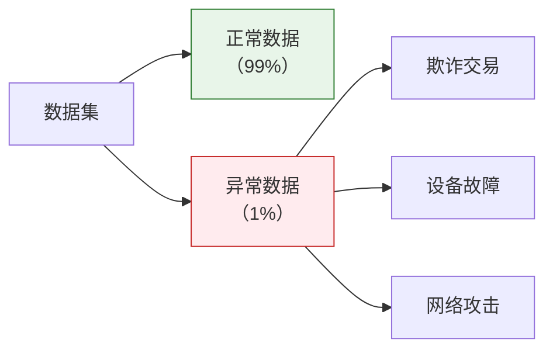
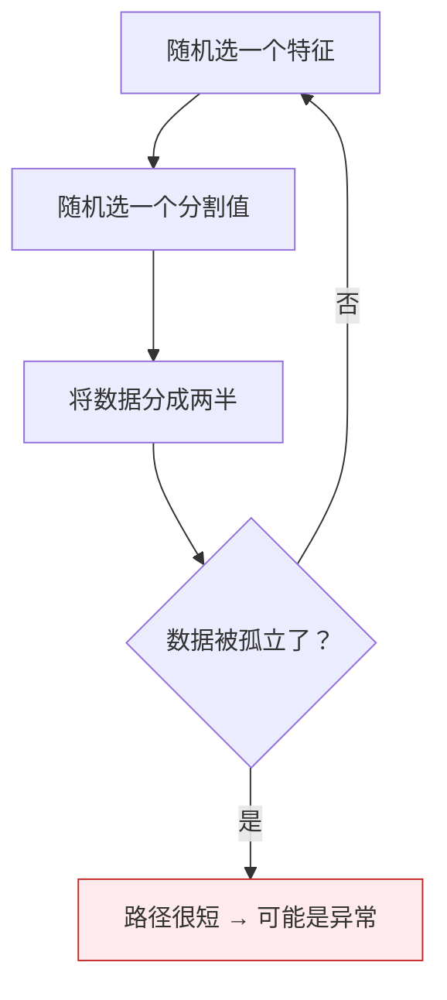
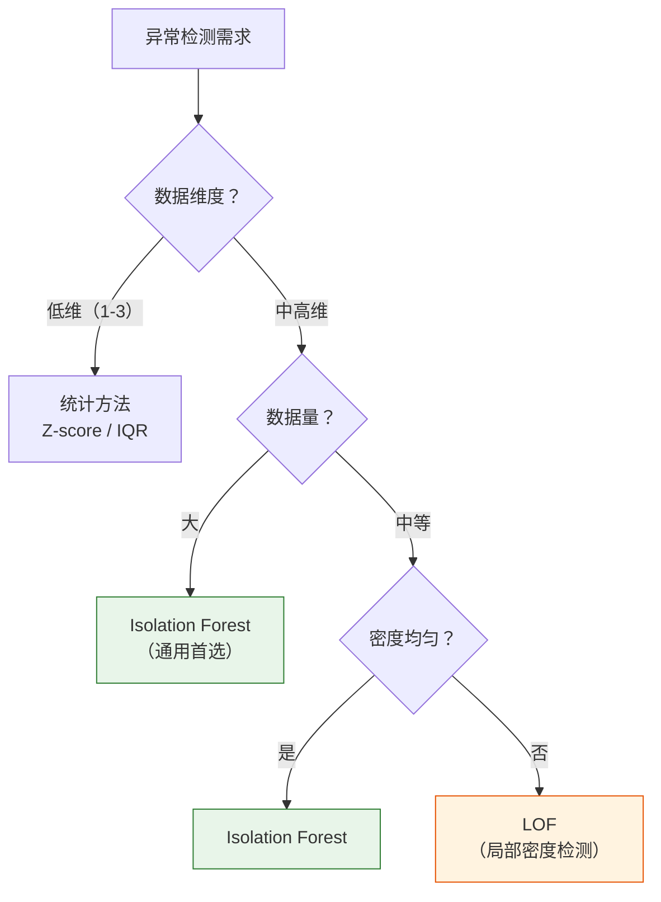

# 5.3.4 异常检测


:::tip 本节定位
异常检测用于发现数据中**"不正常"的样本**——信用卡欺诈、网络入侵、设备故障等。与分类不同，异常通常是稀有的，没有足够的标签，所以需要特殊的算法。
:::

## 学习目标

- 掌握统计方法异常检测（Z-score、IQR）
- 掌握 Isolation Forest
- 了解 One-Class SVM
- 了解 LOF（局部离群因子）
- 能对比选择合适的方法

## 先说一个很重要的学习预期

这一节对新人最容易卡住的地方，是它不像普通分类那样有很清楚的标签和边界。
更适合第一遍先学会的，不是把每个方法都背熟，而是先建立这条线：

> **异常检测很多时候是在先定义“正常长什么样”，再判断谁偏离得太远。**

只要这条线立住，后面的统计方法、Isolation Forest、LOF 和阈值选择就会顺很多。

---

## 先建立一张地图

异常检测对新人来说最难的地方在于：
它不像普通分类那样“标签很清楚，直接学就行”。很多时候你面对的是：

- 异常非常少
- 异常标签不完整
- 新异常长得和旧异常还不一样

更稳的理解顺序是：


所以异常检测最重要的不是先记模型名，而是先把“你眼里的异常到底是什么”想清楚。


这张漫画是本节的核心提醒：异常检测不是简单地“找奇怪点”。一个点是否重要，取决于它是否异常到值得触发行动。所以阈值、`contamination`、误报、漏报和业务代价，都是建模问题的一部分，不是最后才补一句的附属内容。

### 开始前先解码几个关键词

| 术语 | 新人友好的解释 | 在本节里的作用 |
|---|---|---|
| anomaly / outlier | 不符合正常模式的样本 | 同一个点在不同业务里，可能是无害波动，也可能是紧急风险 |
| 阈值 | 决定“报警”还是“忽略”的分界线 | 调整它会改变误报和漏报 |
| 误报 false positive | 正常点被错判成异常 | 太多误报会让用户不再信任系统 |
| 漏报 false negative | 真异常被模型漏掉 | 在欺诈、安全、设备监控里可能代价很高 |
| `contamination` | 你预估的异常比例 | 很多 sklearn 异常检测模型用它决定大概要标多少点 |
| `decision_function()` | 异常检测分数，很多 sklearn 检测器里通常越大越正常 | 可用于画分数热图和调阈值 |
| `fit_predict()` | 训练检测器并直接输出标签 | 本节例子里 `1` 表示正常，`-1` 表示异常 |
| LOF | Local Outlier Factor，局部离群因子 | 当“异常”取决于局部密度时很有用 |

---

## 一、异常检测概述

### 什么是异常？

**异常（Anomaly / Outlier）**= 与大多数数据显著不同的样本。



| 应用场景 | 正常数据 | 异常数据 |
|---------|---------|---------|
| 信用卡欺诈 | 正常消费 | 盗刷交易 |
| 工业监控 | 设备正常运行 | 设备即将故障 |
| 网络安全 | 正常流量 | DDoS 攻击 |
| 医疗诊断 | 健康指标正常 | 疾病信号 |

### 为什么不用分类器？

| 问题 | 说明 |
|------|------|
| **数据不平衡** | 异常样本可能只有 0.1% |
| **缺乏标签** | 很多异常事先不知道长什么样 |
| **异常多变** | 新型欺诈手段不断出现 |

### 异常检测和分类真正差在哪？

分类通常是在学：

- “A 和 B 怎么分”

而异常检测更常见的是在学：

- “大多数正常样本长什么样”
- “偏离到什么程度该开始警觉”

这也是为什么异常检测里，阈值、误报、漏报和业务代价会格外重要。

### 一个更适合新人的类比

你可以先把异常检测想成：

- 先理解“正常人的日常节奏”

比如：

- 正常设备的温度波动大概在哪
- 正常用户的登录时间和操作频率大概在哪

这时异常并不一定是“完全没见过”，
而是：

- 偏离正常模式偏得太远
- 或者落在很少有人会去的位置上

### 生成演示数据

```python
import numpy as np
import matplotlib.pyplot as plt

rng = np.random.default_rng(seed=42)

# 正常数据：二维高斯分布
n_normal = 300
X_normal = rng.normal(size=(n_normal, 2)) * 1.5 + [5, 5]

# 异常数据：随机散布
n_anomaly = 15
X_anomaly = rng.uniform(0, 12, (n_anomaly, 2))

# 合并
X_all = np.vstack([X_normal, X_anomaly])
y_true = np.array([1] * n_normal + [-1] * n_anomaly)  # 1=正常, -1=异常

print(f"Total samples: {X_all.shape[0]}")
print(f"Normal samples: {n_normal}")
print(f"Injected anomalies: {n_anomaly}")
print(f"True anomaly ratio: {n_anomaly / len(X_all):.1%}")

plt.figure(figsize=(8, 6))
plt.scatter(X_normal[:, 0], X_normal[:, 1], s=20, alpha=0.6, label='正常', color='steelblue')
plt.scatter(X_anomaly[:, 0], X_anomaly[:, 1], s=80, marker='x', color='red',
            linewidths=2, label='异常')
plt.title('异常检测演示数据')
plt.xlabel('特征 1')
plt.ylabel('特征 2')
plt.legend()
plt.grid(True, alpha=0.3)
plt.show()
```

预期输出：

```text
Total samples: 315
Normal samples: 300
Injected anomalies: 15
True anomaly ratio: 4.8%
```

真实项目里，你通常不知道真正的异常比例。这里知道它，只是因为我们在用人工生成的教学数据，方便学习和评估。

---

## 二、统计方法

### Z-score 方法

**原理**：假设数据服从正态分布，距离均值超过 N 个标准差的样本视为异常。

> **Z = (x - μ) / σ**

通常 |Z| > 3 被视为异常（99.7% 的数据在 3σ 以内）。

```python
from scipy import stats

# 一维示例
rng = np.random.default_rng(seed=42)
data_1d = np.concatenate([rng.normal(size=200) * 2 + 10, [25, -5, 30]])

z_scores = np.abs(stats.zscore(data_1d))
threshold = 3
anomalies = z_scores > threshold
print(f"Z-score anomalies found: {anomalies.sum()}")
print("Z-score anomaly values:", np.round(data_1d[anomalies], 2).tolist())

plt.figure(figsize=(10, 4))
plt.scatter(range(len(data_1d)), data_1d, c=['red' if a else 'steelblue' for a in anomalies],
            s=20, alpha=0.7)
plt.axhline(y=data_1d[~anomalies].mean() + threshold * data_1d[~anomalies].std(),
            color='orange', linestyle='--', label='+3σ')
plt.axhline(y=data_1d[~anomalies].mean() - threshold * data_1d[~anomalies].std(),
            color='orange', linestyle='--', label='-3σ')
plt.title(f'Z-score 异常检测（发现 {anomalies.sum()} 个异常）')
plt.legend()
plt.grid(True, alpha=0.3)
plt.show()
```

预期输出：

```text
Z-score anomalies found: 3
Z-score anomaly values: [25.0, -5.0, 30.0]
```

### IQR 方法

**原理**：基于四分位数，不依赖正态分布假设。

- IQR = Q3 - Q1（四分位距）
- 异常：x < Q1 - 1.5×IQR 或 x > Q3 + 1.5×IQR

```python
# IQR 方法
Q1 = np.percentile(data_1d, 25)
Q3 = np.percentile(data_1d, 75)
IQR = Q3 - Q1
lower = Q1 - 1.5 * IQR
upper = Q3 + 1.5 * IQR
anomalies_iqr = (data_1d < lower) | (data_1d > upper)
print(f"Q1={Q1:.2f}, Q3={Q3:.2f}, IQR={IQR:.2f}")
print(f"Lower={lower:.2f}, Upper={upper:.2f}")
print(f"IQR anomalies found: {anomalies_iqr.sum()}")
print("IQR anomaly values:", np.round(data_1d[anomalies_iqr], 2).tolist())

fig, axes = plt.subplots(1, 2, figsize=(12, 4))

# 箱线图
axes[0].boxplot(data_1d, vert=False)
axes[0].set_title('箱线图（自动标记异常值）')

# 散点图
axes[1].scatter(range(len(data_1d)), data_1d,
                c=['red' if a else 'steelblue' for a in anomalies_iqr], s=20, alpha=0.7)
axes[1].axhline(y=upper, color='orange', linestyle='--', label=f'上界={upper:.1f}')
axes[1].axhline(y=lower, color='orange', linestyle='--', label=f'下界={lower:.1f}')
axes[1].set_title(f'IQR 异常检测（发现 {anomalies_iqr.sum()} 个异常）')
axes[1].legend()
axes[1].grid(True, alpha=0.3)

plt.tight_layout()
plt.show()
```

预期输出：

```text
Q1=8.68, Q3=11.13, IQR=2.45
Lower=5.01, Upper=14.80
IQR anomalies found: 4
IQR anomaly values: [15.83, 25.0, -5.0, 30.0]
```

注意 IQR 在这里比 Z-score 多找到了一个点，这不是错误，而是因为两种方法对“离得太远”的定义不同。

### Z-score vs IQR

| | Z-score | IQR |
|---|---------|-----|
| 假设 | 正态分布 | 无分布假设 |
| 鲁棒性 | 受极端值影响 | 更鲁棒 |
| 适用 | 大致正态的数据 | 任何分布 |
| 阈值 | 通常 3σ | 1.5×IQR |

### 统计方法什么时候还特别值得先试？

如果你现在遇到的是：

- 低维数据
- 规则很简单
- 只是想先快速发现明显离群点

那统计方法仍然非常值得先试。
它的价值不只是“简单”，还在于：

- 你能很快得到一个可解释 baseline
- 你能先大致感受异常比例
- 你能更早发现数据分布本身的问题


读这张图时，先问异常像什么：如果只是单列极端值，Z-score 或 IQR 就够快；如果是高维空间里的少数孤立点，Isolation Forest 更合适；如果异常依赖局部密度差异，可以看 LOF；如果你只想学正常边界，再考虑 One-Class SVM。

---

## 三、Isolation Forest

### 原理

Isolation Forest（孤立森林）的思路非常巧妙：

**异常点更容易被"孤立"——只需很少的分割就能把它隔开。**



| 概念 | 说明 |
|------|------|
| 路径长度 | 从根节点到叶节点的步数 |
| 异常分数 | 路径越短 → 分数越高 → 越可能是异常 |
| 正常点 | 被"正常"数据包围，需要更多次分割才能孤立 |

### sklearn 实现

```python
from sklearn.ensemble import IsolationForest

# 训练 Isolation Forest
iso = IsolationForest(
    n_estimators=100,
    contamination=0.05,  # 预估异常比例
    random_state=42
)
y_pred_iso = iso.fit_predict(X_all)  # 1=正常, -1=异常
print(f"Isolation Forest detected: {(y_pred_iso == -1).sum()}")

# 可视化
fig, axes = plt.subplots(1, 2, figsize=(14, 5))

# 预测结果
colors_pred = ['red' if p == -1 else 'steelblue' for p in y_pred_iso]
axes[0].scatter(X_all[:, 0], X_all[:, 1], c=colors_pred, s=20, alpha=0.7)
n_detected = (y_pred_iso == -1).sum()
axes[0].set_title(f'Isolation Forest 检测结果\n（检测到 {n_detected} 个异常）')

# 异常分数热图
xx, yy = np.meshgrid(np.linspace(-2, 14, 200), np.linspace(-2, 14, 200))
Z = iso.decision_function(np.c_[xx.ravel(), yy.ravel()])
Z = Z.reshape(xx.shape)
axes[1].contourf(xx, yy, Z, levels=20, cmap='RdBu')
axes[1].scatter(X_all[:, 0], X_all[:, 1], c=colors_pred, s=20, edgecolors='white', linewidth=0.5)
axes[1].set_title('异常分数热图\n（蓝=正常，红=异常）')

for ax in axes:
    ax.grid(True, alpha=0.3)

plt.tight_layout()
plt.show()

# 评估
from sklearn.metrics import classification_report
print("Isolation Forest 评估:")
print(classification_report(y_true, y_pred_iso, target_names=['异常(-1)', '正常(1)']))
```

预期输出节选：

```text
Isolation Forest detected: 16
              precision    recall  f1-score   support

      异常(-1)      0.75      0.80      0.77        15
       正常(1)      0.99      0.99      0.99       300
```

我们注入了 15 个异常，但模型标出了 16 个点。这正好说明异常检测是“阈值和代价”的问题：在欺诈监控里，多几个提醒可能能接受；但在面向用户的通知系统里，误报太多会很烦。

### 关键参数

| 参数 | 说明 | 推荐 |
|------|------|------|
| `n_estimators` | 树的数量 | 100（默认） |
| `contamination` | 异常比例的估计 | 根据业务设定 |
| `max_samples` | 每棵树的采样数 | 'auto' 或 256 |
| `max_features` | 每棵树使用的特征比例 | 1.0（默认） |

### 为什么 Isolation Forest 常常是第一选择？

因为它在很多真实任务里，正好卡在一个很实用的平衡点上：

- 比统计方法更能处理高维数据
- 比 One-Class SVM 更容易扩展到更大数据
- 比 LOF 更适合作为通用 baseline

所以第一次做异常检测项目时，如果你还没有特别明确的结构假设，先试 Isolation Forest 往往是最稳的。

---

## 四、One-Class SVM

### 原理

**只用正常数据训练**，学习一个"正常"的边界。落在边界外的就是异常。

```python
from sklearn.svm import OneClassSVM

# One-Class SVM
ocsvm = OneClassSVM(kernel='rbf', gamma='auto', nu=0.05)  # nu ≈ 异常比例
y_pred_svm = ocsvm.fit_predict(X_all)
print(f"One-Class SVM detected: {(y_pred_svm == -1).sum()}")

# 可视化
fig, axes = plt.subplots(1, 2, figsize=(14, 5))

colors_svm = ['red' if p == -1 else 'steelblue' for p in y_pred_svm]
axes[0].scatter(X_all[:, 0], X_all[:, 1], c=colors_svm, s=20, alpha=0.7)
n_detected = (y_pred_svm == -1).sum()
axes[0].set_title(f'One-Class SVM 检测结果\n（检测到 {n_detected} 个异常）')

# 决策边界
Z_svm = ocsvm.decision_function(np.c_[xx.ravel(), yy.ravel()])
Z_svm = Z_svm.reshape(xx.shape)
axes[1].contourf(xx, yy, Z_svm, levels=20, cmap='RdBu')
axes[1].contour(xx, yy, Z_svm, levels=[0], colors='black', linewidths=2)
axes[1].scatter(X_all[:, 0], X_all[:, 1], c=colors_svm, s=20, edgecolors='white', linewidth=0.5)
axes[1].set_title('One-Class SVM 决策边界')

for ax in axes:
    ax.grid(True, alpha=0.3)

plt.tight_layout()
plt.show()
```

预期输出：

```text
One-Class SVM detected: 60
```

这个结果很适合学习：在这组玩具数据和 `gamma='auto'` 下，One-Class SVM 比 Isolation Forest 激进很多。不要把 `nu=0.05` 理解成“一定只标 5% 的点”，它更像约束参数，不是魔法百分比开关。

### 关键参数

| 参数 | 说明 |
|------|------|
| `kernel` | 核函数（'rbf' 最常用） |
| `nu` | 异常比例的上界（0 到 1） |
| `gamma` | RBF 核参数（'auto' 或 'scale'） |

---

## 五、LOF（局部离群因子）

### 原理

LOF（Local Outlier Factor）通过比较**一个点与其邻居的密度**来判断异常。

- 正常点：周围邻居密度和自己差不多
- 异常点：周围邻居密度比自己高得多（自己在"低密度区"）

LOF 的优势：**能检测到"局部异常"**——在不同密度的区域中也能工作。

### sklearn 实现

```python
from sklearn.neighbors import LocalOutlierFactor

# LOF
lof = LocalOutlierFactor(n_neighbors=20, contamination=0.05)
y_pred_lof = lof.fit_predict(X_all)
print(f"LOF detected: {(y_pred_lof == -1).sum()}")

# 可视化
fig, ax = plt.subplots(figsize=(8, 6))
colors_lof = ['red' if p == -1 else 'steelblue' for p in y_pred_lof]

# LOF 分数（绝对值越大越异常）
lof_scores = -lof.negative_outlier_factor_
sizes = 20 + (lof_scores - lof_scores.min()) / (lof_scores.max() - lof_scores.min()) * 200
print(f"LOF score range: {lof_scores.min():.2f} to {lof_scores.max():.2f}")

ax.scatter(X_all[:, 0], X_all[:, 1], c=colors_lof, s=sizes, alpha=0.6,
           edgecolors='white', linewidth=0.5)
n_detected = (y_pred_lof == -1).sum()
ax.set_title(f'LOF 检测结果（圆越大 = 越异常，检测到 {n_detected} 个）')
ax.grid(True, alpha=0.3)
plt.tight_layout()
plt.show()
```

预期输出：

```text
LOF detected: 16
LOF score range: 0.96 to 3.21
```

LOF 分数更适合作相对信号来看。分数越大，表示“这个点越不像它周围的邻居”，不一定表示它在全局空间里离所有点都很远。

### 关键参数

| 参数 | 说明 | 推荐 |
|------|------|------|
| `n_neighbors` | 考虑的邻居数 | 20（默认） |
| `contamination` | 异常比例 | 'auto' 或手动设定 |

### LOF 最适合解决什么问题？

LOF 最值得记住的不是公式，而是它特别适合处理：

- 整体上看不算很极端
- 但放到局部邻域里明显不合群

这就是“局部异常”的概念。
如果你的数据不同区域密度差异很大，LOF 往往比只看全局边界的方法更有感觉。

---

## 六、方法综合对比

```python
from sklearn.ensemble import IsolationForest
from sklearn.svm import OneClassSVM
from sklearn.neighbors import LocalOutlierFactor

methods = {
    'Isolation Forest': IsolationForest(contamination=0.05, random_state=42),
    'One-Class SVM': OneClassSVM(nu=0.05, kernel='rbf', gamma='auto'),
    'LOF': LocalOutlierFactor(n_neighbors=20, contamination=0.05),
}

fig, axes = plt.subplots(1, 3, figsize=(18, 5))

for ax, (name, model) in zip(axes, methods.items()):
    y_pred = model.fit_predict(X_all)
    colors = ['red' if p == -1 else 'steelblue' for p in y_pred]
    ax.scatter(X_all[:, 0], X_all[:, 1], c=colors, s=20, alpha=0.7)
    n_anomalies = (y_pred == -1).sum()
    print(f"{name}: {n_anomalies} anomalies detected")
    ax.set_title(f'{name}\n检测到 {n_anomalies} 个异常')
    ax.grid(True, alpha=0.3)

plt.suptitle('三种异常检测方法对比', fontsize=13)
plt.tight_layout()
plt.show()
```

预期输出：

```text
Isolation Forest: 16 anomalies detected
One-Class SVM: 60 anomalies detected
LOF: 16 anomalies detected
```

| | 统计方法 | Isolation Forest | One-Class SVM | LOF |
|---|---------|-----------------|---------------|-----|
| 原理 | 距离均值/四分位 | 随机分割隔离 | 学习正常边界 | 局部密度比较 |
| 速度 | 最快 | 快 | 中等 | 中等 |
| 高维数据 | 差 | 好 | 好 | 中等 |
| 局部异常 | 检测不到 | 一般 | 一般 | 好 |
| 大数据 | 好 | 好 | 差 | 中等 |
| 适用场景 | 简单、低维 | 通用首选 | 有核函数需求 | 密度不均匀 |

---

## 七、实战：信用卡欺诈检测模拟

```python
from sklearn.datasets import make_classification
from sklearn.ensemble import IsolationForest
from sklearn.metrics import classification_report, confusion_matrix
from sklearn.preprocessing import StandardScaler

# 模拟高度不平衡的数据
X_cc, y_cc = make_classification(
    n_samples=5000, n_features=10, n_informative=5,
    n_redundant=3, n_classes=2,
    weights=[0.97, 0.03],  # 97% 正常，3% 异常
    random_state=42
)

print(f"正常样本: {(y_cc == 0).sum()}")
print(f"异常样本: {(y_cc == 1).sum()}")

# 标准化
scaler = StandardScaler()
X_cc_scaled = scaler.fit_transform(X_cc)

# 用 Isolation Forest 检测
iso = IsolationForest(contamination=0.05, random_state=42)
y_pred = iso.fit_predict(X_cc_scaled)

# 转换标签格式（iso: 1=正常,-1=异常 → 0=正常,1=异常）
y_pred_binary = (y_pred == -1).astype(int)

print("\n检测结果:")
print(classification_report(y_cc, y_pred_binary, target_names=['正常', '异常']))

# 混淆矩阵
cm = confusion_matrix(y_cc, y_pred_binary)
fig, ax = plt.subplots(figsize=(6, 5))
im = ax.imshow(cm, cmap='Blues')
ax.set_xticks([0, 1])
ax.set_yticks([0, 1])
ax.set_xticklabels(['正常', '异常'])
ax.set_yticklabels(['正常', '异常'])
ax.set_xlabel('预测')
ax.set_ylabel('真实')
ax.set_title('Isolation Forest 欺诈检测混淆矩阵')

for i in range(2):
    for j in range(2):
        color = 'white' if cm[i, j] > cm.max() / 2 else 'black'
        ax.text(j, i, str(cm[i, j]), ha='center', va='center', color=color, fontsize=16)

plt.colorbar(im)
plt.tight_layout()
plt.show()
```

预期输出节选：

```text
正常样本: 4823
异常样本: 177

              precision    recall  f1-score   support

          正常      0.968     0.953     0.960      4823
          异常      0.096     0.136     0.112       177
```

这个模拟欺诈例子故意比较难：整体准确率看起来很高，是因为正常样本占多数；但异常类的 precision 和 recall 都很弱。异常检测一定要看少数类指标和混淆矩阵。

---

## 八、如何选择方法？



:::tip 实用建议
1. **第一选择**：Isolation Forest（通用、快速、效果好）
2. **低维简单场景**：Z-score 或 IQR 就够了
3. **密度不均匀**：LOF
4. **设定 contamination**：根据业务知识估算异常比例
:::

### 第一次做异常检测项目时，更稳的顺序是什么？

建议按这个顺序走：

1. 先用统计方法看一眼数据分布和明显离群点
2. 再上 `Isolation Forest` 做通用 baseline
3. 如果发现局部密度差异大，再补 `LOF`
4. 如果你真的有比较清楚的“正常边界”概念，再尝试 `One-Class SVM`
5. 最后根据误报 / 漏报成本去定阈值和 contamination

这样会比直接堆高级模型更稳，因为你先有了分布感和 baseline。

---

## 九、第一次把异常检测放进项目里，最稳的默认顺序

第一次把异常检测真正放进项目里，可以先按这个顺序：

1. 先定义什么叫异常
2. 先估一个异常比例范围
3. 低维简单数据先试统计方法
4. 高维通用 baseline 先试 Isolation Forest
5. 局部密度差异很大时再看 LOF
6. 最后再根据误报和漏报代价定阈值

这样更稳，因为你不是一上来就比模型，
而是先把：

- 异常定义
- 异常比例
- 评估代价

这三件最关键的事想清楚。

:::info 连接后续
- **第 4 章**：模型评估——如何科学评估异常检测效果
- **第 5 章**：特征工程——为异常检测准备更好的特征
:::

---

## 小结

| 要点 | 说明 |
|------|------|
| 统计方法 | Z-score（正态假设）、IQR（无假设） |
| Isolation Forest | 随机分割隔离，通用首选 |
| One-Class SVM | 学习正常边界，核函数灵活 |
| LOF | 局部密度比较，能检测局部异常 |
| contamination | 大多数方法需要估算异常比例 |

## 这节最该带走什么

如果只带走一句话，我希望你记住：

> **异常检测不是在找“奇怪的点”这么简单，而是在用有限信息去定义“什么程度的不正常值得被报警”。**

所以真正该学会的是：

- 先理解异常的业务含义
- 再选方法
- 再结合误报和漏报成本解释结果

## 动手练习

### 练习 1：IQR vs Z-score

生成一个包含异常值的一维数据（混合高斯 + 均匀噪声），分别用 Z-score 和 IQR 检测异常，对比结果差异。

### 练习 2：Isolation Forest 调参

用演示数据，尝试不同的 `contamination` 值（0.01, 0.05, 0.1, 0.2），观察检测结果的变化。画出 4 张子图对比。

### 练习 3：真实数据集

用 sklearn 的 `fetch_kddcup99`（网络入侵检测数据集的子集，可用 `subset='SA'`）做异常检测。对比 Isolation Forest 和 LOF 的效果。

### 练习 4：多方法融合

用相同的数据，分别用 Isolation Forest、One-Class SVM、LOF 检测异常，然后用"多数投票"（至少 2 个方法标为异常才算异常）融合结果。对比单个方法和融合方法的效果。
