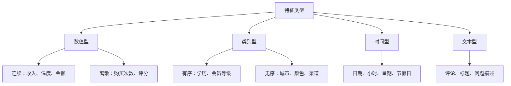

# 5.5.2 特征理解与探索


:::tip 本节定位
特征工程是机器学习项目里投入产出比最高的环节之一，但它不是一上来就“造新列”。真正的第一步是理解数据：每一列代表什么、分布是否异常、和目标有没有关系、会不会泄漏未来信息。
:::

## 学习目标

- 掌握数值、类别、时间、文本等常见特征类型
- 能用分布图和统计摘要发现异常、偏斜和缺失
- 能分析特征和目标变量的关系
- 能初步识别冗余特征和目标泄漏风险

---

## 先建立一张地图


这一步做得越稳，后面越不容易盲目试模型。很多模型效果差，并不是算法不够高级，而是数据含义、异常值、目标泄漏或训练测试分布差异没有看清。

## 一、特征类型



不同类型决定了后续处理方式。数值型可能需要缩放或分箱，类别型可能需要编码，时间型常常要拆出周期特征，文本型可能需要向量化或 embedding。

## 二、快速识别特征类型

```python
import pandas as pd
import seaborn as sns

df = sns.load_dataset("titanic")
print(df.head())
print(df.dtypes)

num_cols = df.select_dtypes(include="number").columns.tolist()
cat_cols = df.select_dtypes(include=["object", "category", "bool"]).columns.tolist()

print("数值特征:", num_cols)
print("类别特征:", cat_cols)
```

自动识别只是起点，不是最终判断。比如邮编、用户 id、商品 id 可能看起来是数字，但业务上是类别或标识符，不能直接当连续数值使用。

## 三、分布分析

分布分析要回答三个问题：数值范围是否合理，是否有明显偏斜，是否存在极端值。

```python
import matplotlib.pyplot as plt

num_cols = ["age", "fare", "sibsp", "parch"]
fig, axes = plt.subplots(2, 2, figsize=(12, 8))

for ax, col in zip(axes.ravel(), num_cols):
    df[col].hist(bins=30, ax=ax, color="steelblue", edgecolor="white", alpha=0.8)
    ax.axvline(df[col].mean(), color="red", linestyle="--", label="mean")
    ax.axvline(df[col].median(), color="green", linestyle="--", label="median")
    ax.set_title(col)
    ax.legend()

plt.tight_layout()
plt.show()
```

如果均值和中位数差距很大，通常说明分布偏斜。偏斜不一定要处理，但你应该知道它存在。比如收入、消费额、访问次数经常是长尾分布。

## 四、类别特征分析

类别特征要重点看取值数量、长尾类别和是否有未知类别风险。

```python
for col in ["sex", "embarked", "class"]:
    print(col)
    print(df[col].value_counts(dropna=False))
```

如果一个类别特征有上千个取值，直接 one-hot 可能会让特征维度暴涨。如果训练集中没有出现的新类别在测试或线上出现，也需要提前用 `handle_unknown="ignore"` 这类策略处理。

## 五、与目标变量的关系

特征探索不能只看单列，还要看它和目标变量的关系。

```python
pd.crosstab(df["sex"], df["survived"], normalize="index")
```

数值特征可以按目标分组看分布，类别特征可以看不同类别的目标均值。但要小心：相关不等于因果。你看到某个特征和目标关系很强，只能说明它可能有预测价值，还不能说明它导致了结果。

## 六、相关性和冗余

```python
corr = df[["survived", "age", "fare", "sibsp", "parch", "pclass"]].corr()
sns.heatmap(corr, annot=True, cmap="coolwarm", center=0)
plt.show()
```

高度相关的特征可能带来冗余。对于线性模型，冗余特征可能影响系数解释；对于树模型，影响通常较小，但仍可能增加噪声和训练成本。

## 七、目标泄漏检查

目标泄漏是特征工程里最危险的问题之一。它指训练时用了预测时不可能知道的信息。比如预测用户是否流失时，使用“流失后客服回访次数”；预测贷款违约时，使用“逾期后催收状态”。

检查目标泄漏时，可以问三个问题：这个特征在预测时刻是否已经存在；它是不是目标结果的后续产物；它和目标过于完美相关是否可疑。如果答案不确定，宁愿先从 baseline 中移除，再做对比实验。


这张图建议你在每次建模前扫一遍：时间上发生在预测之后的字段、由目标结果派生出来的字段、和目标几乎完美相关的字段、只在线下数据里存在的字段，都要先当作高风险特征处理。分数越高越离谱，越要先怀疑泄漏。

## 新人最实用的特征探索清单

在真正建模前，至少先回答：哪些列是数值、类别、时间、文本；哪些列缺失很多；哪些数值特征明显偏斜；哪些类别特征取值特别多；哪些特征彼此高度相关；哪些特征可能泄漏目标；训练集和测试集分布是否明显不同。

## 练习

1. 用 Titanic 数据集识别所有数值和类别特征，并手动纠正自动识别不合理的列。
2. 画出 `age`、`fare` 的分布，判断是否偏斜。
3. 找出与 `survived` 关系最明显的 3 个特征，并说明它们是否可能存在泄漏。
4. 选一个你自己的表格数据，写一份“特征探索记录”。

## 过关标准

学完本节后，你应该能拿到一份表格数据后先做系统探索，而不是直接训练模型；能解释每类特征适合怎样处理；能发现明显异常、冗余和泄漏风险，并把这些观察写进项目 README。
