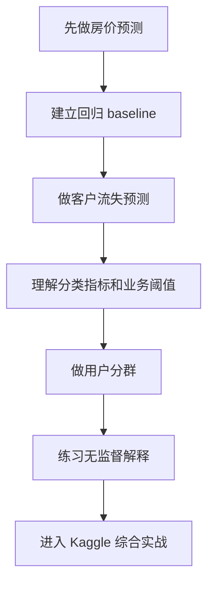

# 学前导读：项目实战这一章到底该怎么学

这一章不是新的算法课，而是把前面五章真正串成项目闭环。前面你学的是任务类型、监督学习、无监督学习、模型评估和特征工程；项目章要训练的是：拿到一个问题后，怎样把它变成可建模、可评估、可解释、可交付的机器学习作品。

## 这一章在整个课程里的位置

机器学习项目章是第 5 站的出口。它要证明你不是只会调用 `sklearn`，也不是只会背算法名称，而是能把业务问题、数据、模型、指标和结论放进同一个流程里。

从课程主线看，这一章也会为后面的深度学习、大模型应用和 Agent 打基础。因为无论模型多复杂，项目思维都是类似的：先定义问题，再建立 baseline，然后评估、改进、解释和交付。

## 这一章真正要解决的问题

这一章要回答五个问题：如何把一个现实问题定义成回归、分类或聚类任务；如何建立一个最小 baseline，而不是一开始追复杂模型；如何选择主指标和辅助指标；如何通过特征工程、调参和模型对比做可解释改进；如何把模型结果翻译成业务语言或项目报告。

新人最容易犯的错误，是把项目章当成“照着代码跑完”。真正的项目不是模型跑出来了，而是你能说清楚：为什么这样定义问题，为什么选这个指标，为什么这次改进有效，模型错在哪里，下一步应该做什么。

:::info 大项目之前的引导练习
如果这条项目闭环还比较抽象，可以先跑 [实操工作坊：构建可复现的 ML 证据包](./05-hands-on-ml-workshop.md)。它会在房价、客户流失、用户分群和 Kaggle 项目前，给你一次完整可运行的项目彩排。
:::

## 新人推荐学习顺序

建议先做房价预测，因为回归任务最容易理解“预测一个连续数值”。然后做客户流失预测，重点学习分类指标、不平衡数据和业务阈值。接着做用户分群分析，理解无监督项目怎样解释结果。最后再做 Kaggle 竞赛实战，把数据处理、建模、评估和提交放进真实评测环境。

## 学这一章时要抓住的主线

这一章的主线可以概括为：机器学习项目不是一次训练，而是一组可记录、可比较、可解释的实验。

看懂这条线后，你会知道为什么每个项目都应该保留实验记录。没有 baseline，就不知道改进是否真的有效；没有错误分析，就不知道模型在什么情况下会失败；没有交付表达，就很难把项目放进作品集。

## 四个项目分别在练什么

| 项目 | 任务类型 | 你真正要练什么 |
|---|---|---|
| 房价预测 | 回归 | 从 baseline 到调参的完整回归闭环 |
| 客户流失预测 | 分类 | 不平衡数据、业务指标和分类评估 |
| 用户分群分析 | 聚类 | 无监督项目的解释与业务落地 |
| Kaggle 竞赛实战 | 综合 | 把整套 ML 流程放进真实评测环境 |

## 这一章和后面阶段的关系

机器学习项目会把“实验意识”带到后面的深度学习和大模型项目中。深度学习项目也需要 baseline、训练记录和错误分析；RAG 项目也需要评估集和失败样例；Agent 项目也需要过程日志和结果评估。

如果这一章没学稳，后面常见的问题是：只会跑模型，不会设计实验；只看分数，不知道指标是否合适；模型结果无法解释；项目不能形成清晰作品集表达。

## 新人和进阶学习者怎么读

新人第一次学这一章时，先抓住主线和最小可运行例子。你不需要一次理解所有细节，只要能说清楚这一章解决什么问题、输入输出是什么、最小项目怎么跑起来，就可以继续往后走。

有经验的学习者可以把这一章当成查漏补缺和工程化练习：关注边界条件、失败案例、评估方式、代码可复现性，以及它和前后阶段的连接。读完后最好能把本章内容沉淀到自己的作品 README 或实验记录里。

## 学习时间与难度建议

| 学习方式 | 建议投入 | 目标 |
|---|---|---|
| 快速浏览 | 20～30 分钟 | 看懂本章解决什么问题，知道后面会用到哪里 |
| 最小通关 | 1～2 小时 | 跑通一个最小例子，完成本章小项目出口 |
| 深入练习 | 半天～1 天 | 补充错误分析、对比实验或项目 README 记录 |

## 本章自测问题

| 自测问题 | 通过标准 |
|---|---|
| 这一章解决什么问题？ | 能用一句话说明它在整门课里的位置 |
| 最小输入输出是什么？ | 能说清楚例子需要什么输入，会产生什么结果 |
| 常见失败点在哪里？ | 能列出至少一个报错、效果差或理解偏差的原因 |
| 学完后能沉淀什么？ | 能把本章产出写进项目 README、实验记录或作品集 |

## 本章小项目出口

学完这一章后，建议至少完成一个“可复盘的机器学习项目报告”。报告需要包含问题定义、数据说明、baseline、评估指标、至少两轮改进、错误分析、最终结论和下一步计划。

建议每个项目保留一张实验记录表，字段包括版本、改了什么、主指标、辅助指标、我的判断和下一步。这样你会从“跑代码”逐渐转向“做实验”。

## Debug 侦探案件

| 案件 | 内容 |
|---|---|
| 案件名 | 高得离谱的模型分数 |
| 案发现场 | 模型指标异常好，但换测试集表现明显下降。 |
| 侦查步骤 | 检查 train/test 划分、重复样本、目标泄漏和 Dummy baseline。 |
| 结案证据 | 泄漏检查记录、baseline 指标、错误样本。 |

项目练习不要只保留成功截图。至少挑一个真实失败样本，按“现象、线索、嫌疑原因、侦查步骤、修复动作、回归检查”写进 `reports/failure_cases.md`，这样项目会更像真实工程作品。

## 项目交付物标准

每个综合项目都建议按同一套作品集标准交付，而不是只把代码跑通。最小交付物应该包括：一份 README、一条可复现运行命令、一组示例输入输出、一张关键流程图、一次失败样本分析，以及下一步改进计划。

| 交付物 | 最低要求 | 进阶要求 |
|---|---|---|
| README | 写清项目目标、运行方式、依赖和示例 | 增加架构图、设计取舍和复盘 |
| 示例输入输出 | 至少保留 1 个完整案例 | 保留成功、失败和边界案例 |
| 评估记录 | 写清用什么指标判断效果 | 加入 baseline、对比实验和错误分析 |
| 工程记录 | 记录一次环境或接口问题 | 记录日志、成本、耗时和排障过程 |
| 展示材料 | 截图或短 GIF 证明能运行 | 做成可讲解的作品集页面 |

做项目时最重要的不是功能堆得多，而是能讲清楚：你解决了什么问题，系统怎样工作，效果怎么判断，失败时怎么定位，下一版准备怎样改。

这张图可以当作项目报告模板：先说明问题和数据，再展示 baseline、指标、模型对比、错误样本和下一步计划。作品集里最打动人的不是“我跑了很多模型”，而是“我知道模型为什么这样错，以及下一轮要怎么改”。

## 过关标准

这一章结束时，你应该能把一个经典 ML 问题拆成清晰建模流程，能根据任务类型选择指标和 baseline，能做一轮可解释改进，能用错误分析说明模型局限，能把结果写成别人看得懂的项目报告。

如果你能清楚说出“我怎么定义问题、为什么这样评估、模型错在哪里、下一步该怎么改”，就达到了机器学习阶段的作品集出口标准。

## 版本路线建议

| 版本 | 目标 | 交付重点 |
|---|---|---|
| 基础版 | 跑通最小闭环 | 能输入、能处理、能输出，并保留一组示例 |
| 标准版 | 形成可展示项目 | 增加配置、日志、错误处理、README 和截图 |
| 挑战版 | 接近作品集质量 | 增加评估、对比实验、失败样本分析和下一步路线 |

建议先完成基础版，不要一开始就追求大而全。每提升一个版本，都要把“新增了什么能力、怎么验证、还有什么问题”写进 README。
