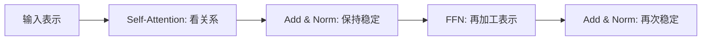
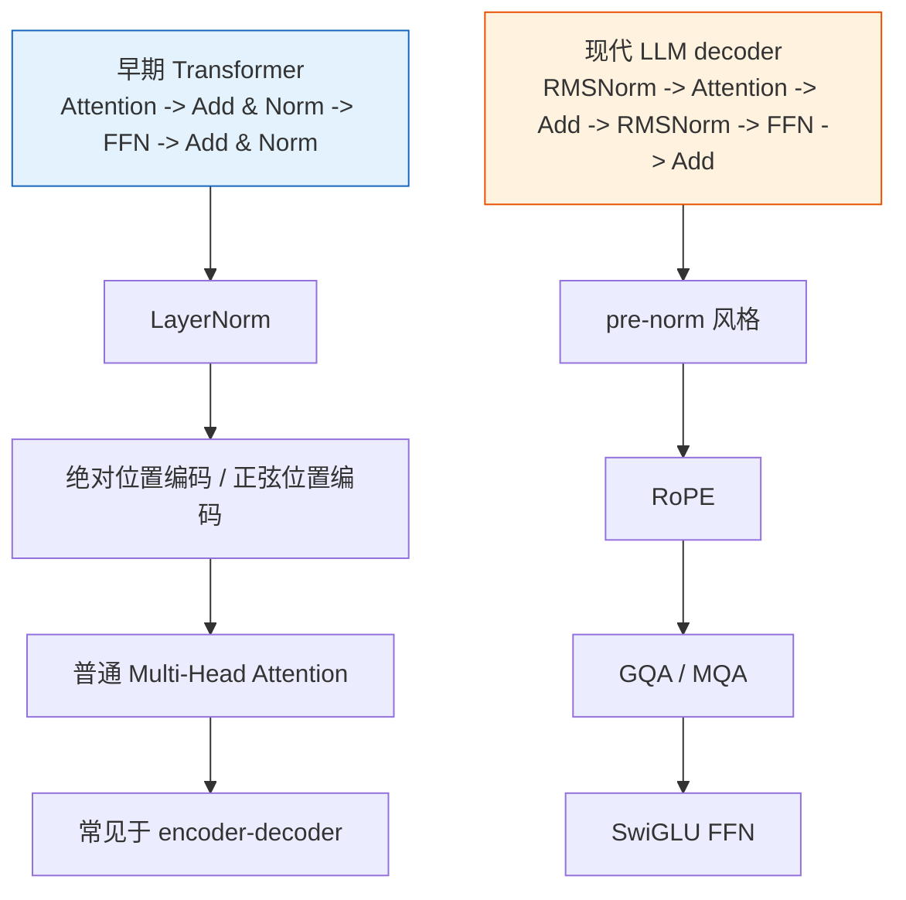

# Transformer 架构


:::tip 本节定位
上一节你已经知道注意力机制是 Transformer 的心脏。
这一节我们要把心脏和其他器官拼起来，看完整系统：

> **一个 Transformer Block 到底由哪些部件组成，它们为什么这样排列？**

理解这一节以后，你看 GPT、BERT、T5 这些模型时，才不会只看到一个名字。
:::

## 学习目标

- 理解一个 Transformer Block 的标准结构
- 理解残差连接、LayerNorm、前馈网络各自的作用
- 分清 encoder-only、decoder-only、encoder-decoder 三种主路线
- 理解位置编码为什么不可缺
- 看懂一个最小 Transformer 编码器示例

---

## 先建立一张地图

Transformer 架构更适合按“一个 block 里谁在负责什么”来理解：



所以这节真正想解决的是：

- 注意力之外，Transformer 剩下那些模块到底在补什么
- 为什么 GPT、BERT、T5 虽然长得不完全一样，但骨架会这么像

---

## 一、Transformer 不只等于“注意力”

### 1.1 一个常见误解

很多人一提 Transformer，就只记得：

- self-attention
- Q/K/V
- multi-head

但真实的 Transformer Block 并不是“只有注意力层”。

一个典型 block 至少还会包含：

- 残差连接（Residual）
- 层归一化（LayerNorm）
- 前馈网络（Feed Forward Network, FFN）

### 1.2 为什么要加这么多东西？

因为注意力层虽然擅长“建关系”，但一个稳定、可训练的大模型还需要：

- 更顺的梯度传播
- 更稳定的数值分布
- 更强的非线性变换能力

所以可以粗略记成：

> 注意力负责“看哪里”，FFN 负责“怎么进一步加工”，残差和归一化负责“让整个系统更稳”。

### 1.3 一个更适合新人的总类比

你可以把一个 Transformer Block 理解成：

- 一个先开会、再整理笔记、再深加工、最后再次整理的工作小组

其中：

- Attention 像大家先互相交流信息
- FFN 像每个人再把收到的信息单独加工一遍
- 残差和归一化像让整个流程别越来越乱

这样理解后，它就不再像：

- 一堆神秘层叠在一起


:::tip 读图提示
这张图建议按职责读：Attention 负责混合上下文，Residual 负责保留原信息，LayerNorm 负责稳定数值，FFN 负责对每个位置再加工。Transformer 不是只有注意力，而是一套让注意力可堆深、可训练的工程结构。
:::

---

## 二、一个 Encoder Block 长什么样？

### 2.1 结构图


### 2.2 翻译成人话

对于每个 block 来说：

1. 先用 self-attention 看全局关系
2. 再把输入加回来，做归一化
3. 再过一个逐位置的前馈网络
4. 再把中间结果加回来，再归一化

这就是 Transformer 编码器 block 的主线。

### 2.3 一个很适合初学者先记的模块作用表

| 模块 | 最值得先记住的作用 |
|---|---|
| Self-Attention | 看序列里谁和谁相关 |
| Residual | 别把原信息丢掉 |
| LayerNorm | 让表示保持稳定 |
| FFN | 对每个位置再做一次非线性加工 |

这个表很适合新人，因为它会把一个 block 从“结构图”重新压缩成几句能记住的话。

---

## 三、残差连接到底在帮什么忙？

### 3.1 最直觉的理解

残差连接就是：

> 把输入直接绕一条“近路”加回输出。

形式上看很简单：

> `y = f(x) + x`

### 3.2 为什么这会有帮助？

因为深网络容易出现：

- 信息越传越弱
- 梯度越传越难

残差连接像是在说：

> “就算这层新学的东西暂时不太好，至少原始信息别彻底丢掉。”

这让网络更容易训练、更容易堆深。

### 3.3 一个最小示例

```python
import torch

x = torch.tensor([[1.0, 2.0, 3.0]])
f_x = torch.tensor([[0.1, -0.2, 0.3]])

y = x + f_x

print("x   =", x)
print("f(x)=", f_x)
print("y   =", y)
```

---

## 四、LayerNorm 在做什么？

### 4.1 为什么需要归一化？

深层网络里，每层输出的数值分布可能会漂得很厉害。
这会让训练变得不稳定。

LayerNorm 的作用是：

> 在特征维度上，把每个位置的表示拉回一个更稳定的尺度。

### 4.2 一个直觉类比

你可以把 LayerNorm 想成：

> 每处理完一层，都先把数值“摆正姿态”，别让后面层接到太离谱的输入。

### 4.3 最小示例

```python
import torch
from torch import nn

x = torch.tensor([
    [1.0, 2.0, 3.0, 10.0],
    [2.0, 2.5, 3.5, 9.0]
])

ln = nn.LayerNorm(4)
y = ln(x)

print("before =\n", x)
print("after  =\n", y)
print("row means:", y.mean(dim=1))
```

你会看到每一行都被拉到更稳定的分布附近。

---

## 五、前馈网络（FFN）为什么也很重要？

### 5.1 不是注意力之后就结束了

很多人容易以为：

- 既然注意力已经把关系看到了
- 那后面是不是就不重要了？

其实不是。

注意力更擅长“混合不同位置的信息”，
而 FFN 更擅长“对当前位置的表示再做一层非线性加工”。

### 5.2 一个标准 FFN

通常可以粗略写成：

> `Linear -> Activation -> Linear`

```python
import torch
from torch import nn

x = torch.randn(2, 5, 8)

ffn = nn.Sequential(
    nn.Linear(8, 32),
    nn.ReLU(),
    nn.Linear(32, 8)
)

y = ffn(x)

print("input shape :", x.shape)
print("output shape:", y.shape)
```

注意：

- 序列长度不变
- 每个位置都单独经过同一个前馈网络

---

## 六、位置编码为什么不可缺？

### 6.1 注意力本身不带顺序感

self-attention 很擅长看“谁和谁相关”，
但如果你只给它 token 向量，不告诉它位置：

- “猫追狗”
- “狗追猫”

在某些情况下它可能很难直接区分顺序差异。

### 6.2 所以要加位置编码

位置编码告诉模型：

- 这个 token 在第几个位置
- 和其他 token 的相对位置怎样

### 6.3 一个简单的正弦位置编码示例

```python
import numpy as np

positions = np.arange(5)
encoding = np.stack([
    np.sin(positions),
    np.cos(positions)
], axis=1)

print(np.round(encoding, 4))
```

真实位置编码会更高维、更复杂，但直觉上你可以先把它理解成：

> 给每个位置打一张不会重复的“坐标标签”。

---

## 七、一个最小 Transformer 编码器示例

### 7.1 可运行代码

```python
import torch
from torch import nn

torch.manual_seed(42)

# batch=2, seq_len=6, d_model=16
x = torch.randn(2, 6, 16)

layer = nn.TransformerEncoderLayer(
    d_model=16,
    nhead=4,
    dim_feedforward=32,
    batch_first=True
)

y = layer(x)

print("input shape :", x.shape)
print("output shape:", y.shape)
```

### 7.2 这段代码在教什么？

它在教你两个非常重要的事实：

1. 一个 block 处理完后，shape 通常不变
2. 变化的是表示质量，而不是张量的外观

也就是说 Transformer 的很多层，表面上 shape 不怎么变，
真正变的是：

- 每个位置怎样融入全局上下文
- 表示中携带的语义信息有多丰富


:::tip 读图提示
读这张图时不要只看 shape：`[batch, seq_len, d_model]` 可能每层都一样，但每个 token 表示已经混入更多上下文。Transformer 的“变强”常常发生在表示内容里，而不是外形尺寸上。
:::

---

## 八、Decoder Block 又多了什么？

### 8.1 Decoder 和 Encoder 的关键区别

Decoder Block 通常会多一个模块：

- **Cross-Attention**

所以 decoder 里的典型结构会是：

1. Masked Self-Attention
2. Cross-Attention
3. Feed Forward

### 8.2 为什么多一个 Cross-Attention？

因为 decoder 不只要看自己已经生成的历史内容，还要看 encoder 传来的输入信息。

这在：

- 机器翻译
- 摘要生成
- 问答生成

里都很常见。

### 8.3 Encoder-only / Decoder-only / Encoder-Decoder 最稳的区分方式

第一次学这三条路线时，更稳的区分方式通常是：

1. Encoder-only：更偏理解
2. Decoder-only：更偏生成
3. Encoder-Decoder：更偏“读一段，再生成一段”

先记这个主线，后面再去看：

- BERT
- GPT
- T5

就不会只剩模型名字。

---

## 九、三种主流 Transformer 路线

### 9.1 Encoder-only

代表：

- BERT

特点：

- 更偏理解任务

### 9.2 Decoder-only

代表：

- GPT

特点：

- 更偏生成任务

### 9.3 Encoder-Decoder

代表：

- T5

特点：

- 输入输出都很灵活

---

## 十、早期 Transformer 与现代 LLM decoder 的对比

最早的 Transformer 论文，主要是把它当作序列到序列任务的编码器-解码器架构来使用，比如机器翻译。现代大语言模型通常使用 decoder-only 结构，并且优化的是“下一个 token 预测”和大规模预训练。骨架还是 Transformer，但设计选择已经不一样了。


:::tip 读图提示
从上往下读这张图。左边是原版 post-norm 的 encoder-decoder 思路，右边是现代 pre-norm 的 decoder-only 思路。名字变多不是为了炫技，而是为了解决更深模型训练稳定性、推理成本和长上下文能力这些真实问题。
:::



### 10.1 初学者最该记住的快速对照

| 部分 | 早期 Transformer | 现代 LLM decoder | 为什么会这样演进 |
|---|---|---|---|
| 归一化 | LayerNorm | RMSNorm（Root Mean Square Normalization） | 更简单的归一化方式，在大型 decoder 堆栈里常常更合适 |
| Block 顺序 | Attention -> Add & Norm -> FFN -> Add & Norm | RMSNorm -> Attention -> Add -> RMSNorm -> FFN -> Add | pre-norm 让非常深的训练更稳定 |
| 位置信息 | 绝对位置编码 / 正弦位置编码 | RoPE（Rotary Positional Embedding） | 更适合相对位置和更长上下文 |
| Attention 头 | 普通 Multi-Head Attention | GQA / MQA（Grouped-Query / Multi-Query Attention） | 降低 KV cache 成本，让推理更快 |
| FFN | 普通 FFN，常见 ReLU/GELU | SwiGLU FFN | 门控更强，扩展效果更好 |
| 常见结构 | encoder-decoder | decoder-only | 下一个 token 预测更适合大规模预训练 |

### 10.2 这些缩写用大白话解释

- **RMSNorm**：只按特征的均方根做归一化，不再显式减均值
- **RoPE**：把位置信息“旋转”进注意力空间，让模型更自然地感知顺序
- **GQA**：多个 query 组共享 key/value 头
- **MQA**：很多 query 头共享一组 key/value
- **SwiGLU**：带门控的前馈模块，用 Swish 风格的门来控制信息流

### 10.3 为什么现代 LLM decoder 要这样改

这些变化不是“换个名字”，而是为了解决扩展时的现实问题：

- 模型更深了，所以更需要稳定梯度，pre-norm 更合适
- 上下文更长了，所以更需要好的位置处理，RoPE 更常见
- 推理成本更敏感了，所以 GQA/MQA 可以减轻 KV cache 压力
- 生成任务规模更大了，所以 SwiGLU 这类更强的非线性模块更常见

如果只记一句话，可以记成：

> 早期 Transformer 主要是在说明如何搭一个强的序列到序列块；现代 LLM decoder 主要是在说明如何把这个块扩展到超大语言模型。

## 如果把它做成笔记或项目，最值得展示什么

最值得展示的通常不是：

- 一张很复杂的总架构图

而是：

1. 一个 block 里每个模块的职责
2. Encoder 和 Decoder 的差别
3. 三条主路线分别更偏什么任务
4. 为什么这些模块组合起来后训练更稳

这样别人会更容易看出：

- 你理解的是 Transformer 的骨架
- 不只是会背 QKV

所以你后面学模型时，不要只看名字，而要先问：

> 它到底是 encoder-only、decoder-only，还是 encoder-decoder？

这个问题几乎直接决定了它擅长什么。

---

## 十一、初学者最常踩的坑

### 11.1 把 Transformer 误解成“只有注意力”

注意力很重要，但不是全部。
残差、归一化、FFN 都是架构能跑稳的关键。

### 11.2 只盯着 shape，不理解信息流

很多时候 shape 不变，但语义表示已经在层层重构。

### 11.3 不知道 encoder / decoder 的差异

这会让你后面看 BERT、GPT、T5 时一直混。

---

## 小结

这一节最重要的不是背结构图，而是抓住这条主线：

> **Transformer Block = 注意力建关系 + 残差保信息 + 归一化稳训练 + FFN 做非线性加工。**

有了这条主线，后面你看 BERT、GPT、T5 这些具体模型时，就能马上定位它们是在这个大框架上怎样裁剪和扩展的。

如果再往前一步，还要能分清原版 Transformer 块和现代 LLM decoder 块：

> **早期 Transformer = LayerNorm + 绝对位置 + 普通多头注意力 + encoder-decoder。**
>
> **现代 LLM decoder = pre-norm + RMSNorm + RoPE + GQA/MQA + SwiGLU + decoder-only。**

---

## 练习

1. 把最小 Transformer 示例里的 `d_model` 改成 32，再看输出 shape。
2. 用自己的话解释：为什么说注意力解决的是“看哪里”，FFN 解决的是“怎么进一步加工”？
3. 试着画出 decoder block 比 encoder block 多出来的那一层。
4. 想一想：为什么 Transformer 明明没有卷积和循环，却依然能处理序列？
