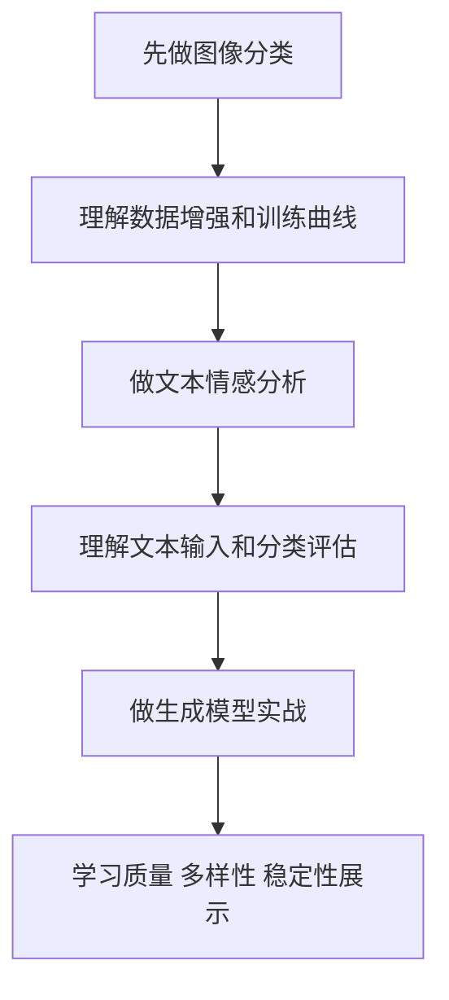

# 6.8.1 学前导读：项目实战这一章到底该怎么学

这一章不是继续堆概念，而是把前面学过的神经网络、PyTorch、CNN、RNN、Transformer、生成模型和训练技巧真正做成项目。

深度学习项目和传统机器学习项目最大的不同，是你会更频繁地面对数据规模、训练成本、模型收敛、过拟合、GPU 环境、超参数和结果可视化问题。因此这一章不只是让模型跑起来，更要训练你管理训练过程和解释模型表现的能力。

## 这一章在整个课程里的位置

深度学习项目章是第 6 站的出口。它要证明你能把深度学习知识用于真实任务，而不是只理解单个模型结构。

从课程主线看，这一章也是通往大模型阶段的重要桥梁。你在这里学到的训练闭环、数据划分、loss 曲线、验证集、错误分析和实验记录，会在后面理解预训练、微调和大模型评估时继续发挥作用。

前半段先确定任务、数据和训练方案，后半段再围绕指标、曲线、失败样本和报告完成项目复盘。

## 这一章真正要解决的问题

这一章要回答五个问题：如何为深度学习任务准备数据集和数据加载器；如何设计训练循环、验证循环和保存最佳模型；如何根据 loss、accuracy、F1、样例输出和错误案例判断模型表现；如何处理过拟合、欠拟合、类别不平衡和训练不稳定；如何把项目整理成可复现 Notebook、脚本或报告。

新人最容易犯的错误，是只关心“代码有没有跑完”。深度学习项目更应该关心：训练是否收敛，验证集是否提升，错误样例有什么规律，模型失败时是数据问题、模型问题还是训练设置问题。

:::info 大项目之前的引导练习
如果这条项目闭环还比较抽象，可以先跑 [6.8.5 实操工作坊：构建 PyTorch 训练证据包](./04-hands-on-dl-workshop.md)。它会在图像分类、情感分析和生成模型项目前，给你一次完整可运行的项目彩排。
:::

## 新人推荐学习顺序

建议先做图像分类，因为它最适合理解数据增强、CNN、迁移学习和训练曲线。然后做文本情感分析，把文本数据、token、embedding、序列模型和分类评估连接起来。最后做生成模型实战，关注生成结果的质量、多样性、稳定性和展示方式。

## 学这一章时要抓住的主线

这一章的主线可以概括为：深度学习项目是数据、模型、训练、验证和错误分析的循环。

前半段先确定任务、数据和训练方案，后半段再围绕指标、曲线、失败样本和报告完成项目复盘。

看懂这条线后，你会知道深度学习项目不能只展示最终指标。训练曲线、验证曲线、混淆矩阵、错误样例和可视化结果，都是作品集里非常重要的证据。

## 三个项目分别在练什么

| 项目 | 任务类型 | 你真正要练什么 |
|---|---|---|
| 图像分类 | CNN 项目 | 从训练到评估的完整图像任务闭环 |
| 文本情感分析 | 文本分类项目 | 标签设计、baseline、错误分析和升级路线 |
| 生成模型实战 | 生成项目 | 质量、多样性、稳定性和展示框架 |

## 这一章和后面阶段的关系

深度学习项目会帮助你更好地理解大模型不是黑箱魔法。后面学预训练、微调、RAG 评估和 Agent 评估时，你会不断用到这里的训练记录、验证集、错误分析和可复现思维。

如果这一章没学稳，后面常见的问题是：看到 loss 下降却不知道是否过拟合；不知道验证集和测试集的区别；只会调用预训练模型，不会判断模型失败原因；做微调时没有 baseline 和评估方案。

## 新人和进阶学习者怎么读

新人第一次学这一章时，先抓住主线和最小可运行例子。你不需要一次理解所有细节，只要能说清楚这一章解决什么问题、输入输出是什么、最小项目怎么跑起来，就可以继续往后走。

有经验的学习者可以把这一章当成查漏补缺和工程化练习：关注边界条件、失败案例、评估方式、代码可复现性，以及它和前后阶段的连接。读完后最好能把本章内容沉淀到自己的作品 README 或实验记录里。

## 学习时间与难度建议

| 学习方式 | 建议投入 | 目标 |
|---|---|---|
| 快速浏览 | 20～30 分钟 | 看懂本章解决什么问题，知道后面会用到哪里 |
| 最小通关 | 1～2 小时 | 跑通一个最小例子，完成本章小项目出口 |
| 深入练习 | 半天～1 天 | 补充错误分析、对比实验或项目 README 记录 |

## 本章自测问题

| 自测问题 | 通过标准 |
|---|---|
| 这一章解决什么问题？ | 能用一句话说明它在整门课里的位置 |
| 最小输入输出是什么？ | 能说清楚例子需要什么输入，会产生什么结果 |
| 常见失败点在哪里？ | 能列出至少一个报错、效果差或理解偏差的原因 |
| 学完后能沉淀什么？ | 能把本章产出写进项目 README、实验记录或作品集 |

## 本章小项目出口

学完这一章后，建议至少完成一个“可复现深度学习训练项目”。项目需要包含数据准备、训练/验证划分、模型结构、训练曲线、评估指标、错误案例、模型保存和结果展示。

如果做图像分类，建议展示几张预测正确和预测错误的样例；如果做文本情感分析，建议展示错误文本和可能原因；如果做生成项目，建议展示不同参数或版本下的生成结果对比。

## Debug 侦探案件

| 案件 | 内容 |
|---|---|
| 案件名 | Shape 巨兽出没 |
| 案发现场 | 训练脚本报 shape mismatch，或 loss 长时间不下降。 |
| 侦查步骤 | 打印每层 tensor shape，用小数据过拟合测试确认训练循环是否正确。 |
| 结案证据 | 错误日志、修复前后 shape 记录、训练曲线。 |

项目练习不要只保留成功截图。至少挑一个真实失败样本，按“现象、线索、嫌疑原因、侦查步骤、修复动作、回归检查”写进 `reports/failure_cases.md`，这样项目会更像真实工程作品。

## 项目交付物标准

每个综合项目都建议按同一套作品集标准交付，而不是只把代码跑通。最小交付物应该包括：一份 README、一条可复现运行命令、一组示例输入输出、一张关键流程图、一次失败样本分析，以及下一步改进计划。

| 交付物 | 最低要求 | 进阶要求 |
|---|---|---|
| README | 写清项目目标、运行方式、依赖和示例 | 增加架构图、设计取舍和复盘 |
| 示例输入输出 | 至少保留 1 个完整案例 | 保留成功、失败和边界案例 |
| 评估记录 | 写清用什么指标判断效果 | 加入 baseline、对比实验和错误分析 |
| 工程记录 | 记录一次环境或接口问题 | 记录日志、成本、耗时和排障过程 |
| 展示材料 | 截图或短 GIF 证明能运行 | 做成可讲解的作品集页面 |

做项目时最重要的不是功能堆得多，而是能讲清楚：你解决了什么问题，系统怎样工作，效果怎么判断，失败时怎么定位，下一版准备怎样改。

## 过关标准

这一章结束时，你应该能独立写出一个基础 PyTorch 训练流程，能解释训练集、验证集和测试集的作用，能根据训练曲线判断过拟合或欠拟合，能保存和加载模型，能用错误分析说明模型局限。

如果你能把一个深度学习项目整理成可复现 Notebook 或脚本，并用指标、曲线和样例说明模型表现，就达到了深度学习阶段的作品集出口标准。

## 版本路线建议

| 版本 | 目标 | 交付重点 |
|---|---|---|
| 基础版 | 跑通最小闭环 | 能输入、能处理、能输出，并保留一组示例 |
| 标准版 | 形成可展示项目 | 增加配置、日志、错误处理、README 和截图 |
| 挑战版 | 接近作品集质量 | 增加评估、对比实验、失败样本分析和下一步路线 |

建议先完成基础版，不要一开始就追求大而全。每提升一个版本，都要把“新增了什么能力、怎么验证、还有什么问题”写进 README。
