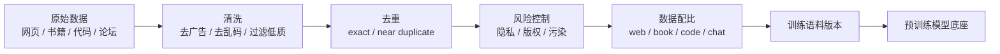

# 7.4.2 预训练数据


:::tip 本节定位
很多人提到大模型，会先想到：

- 参数有多大
- 架构有多新
- 训练了多久

但真正决定模型“学到什么”和“没学到什么”的底盘，往往是预训练数据。

而且这里最难的并不是：

- 找更多文本

而是：

- 找什么文本
- 怎么清洗
- 怎么配比
- 怎么避免重复和污染

这节课的目标，就是把“数据很重要”这句空话拆成真正可操作的判断。
:::

## 学习目标

- 理解预训练数据的核心质量维度
- 理解为什么“更多数据”不一定等于“更好数据”
- 通过一个可运行示例理解清洗、去重和数据配比的意义
- 建立对污染、重复和低质量语料的风险意识

---

## 这节和前面 LLM / 预训练主线是怎么接上的

如果你已经接受了“预训练会决定模型底座”这件事，这一节最自然的续接就是：

- 前面你知道模型能力来自预训练
- 这一节开始更具体地问：这些能力到底是被什么数据喂出来的

所以这节真正想解决的不是“数据很重要”这种空话，而是：

- 预训练数据到底在决定什么
- 为什么数据工程会直接影响模型上限

## 一、为什么预训练数据会决定模型底盘？

### 先看一个故事：两个学生读了不同的书

想象有两个学生都很聪明，也都用同样的学习方法。

第一个学生每天读的是高质量教材、论文、技术文档和经过编辑的长文。第二个学生每天读的是重复广告、标题党、搬运网页和混乱评论。半年后，他们的表达能力、事实可靠性和问题分析习惯大概率会很不一样。

预训练数据对模型的影响也类似。模型架构像学习方法，算力像学习时间，而数据就是它每天读进去的材料。材料不同，最后形成的能力底色就不同。

### 模型学到的，不只是知识，还有语言习惯和世界分布

预训练阶段模型并不会自动区分：

- 哪些内容更可信
- 哪些文本只是噪音
- 哪些表达更值得模仿

它看到什么，就会尽力去拟合什么。

所以预训练数据最后影响的不只是：

- 知识覆盖

还会影响：

- 语言风格
- 事实可靠性
- 偏见分布
- 安全风险

### 一个类比：地基质量决定后面所有装修的上限

你可以把预训练数据想成地基。

- 微调像装修
- 对齐像护栏和规范

如果地基本身就很混乱，
后面再怎么微调，也更多是在一个已经定型的底盘上修修补补。

### 为什么“互联网很大”不等于“能直接拿来训”？

因为真实世界文本里混着很多问题：

- 重复内容
- 低质量搬运
- 广告和垃圾页
- 模板化 SEO 文本
- 非法或敏感内容
- 评测集污染

大模型真正难的地方，不是抓不到数据，
而是：

> **如何把海量原始文本整理成一个高质量、可控、可复用的数据底盘。**

### 第一次学预训练数据，最该先抓住什么？

最该先抓住的不是具体语料名字，而是这句：

> **模型预训练阶段并不会自动分辨“什么值得学”，所以数据治理就是在替模型做第一轮价值筛选。**

一旦这句稳住了，后面你看：

- 去重
- 过滤
- 配比
- 污染控制

就不再只是工程细节，而会知道它们都在影响模型底盘。

### 预训练数据管道先放在一张图里



这条管道可以帮你把“数据很重要”具体化：每一步都会改变模型最后能学到什么、偏向什么、容易犯什么错。


:::tip 读图提示
这张图要从“原始数据很多”读到“可训练语料很少”：清洗、去重、风险过滤、污染控制和配比不是装饰步骤，而是在替模型决定哪些模式值得学、哪些噪声必须挡在训练前。
:::

---

## 二、预训练数据到底要看哪些维度？

### 覆盖面：模型能接触到多少类型的语言和知识

常见来源可能包括：

- 网页
- 书籍
- 代码
- 学术论文
- 问答论坛
- 对话语料

覆盖面不足会导致模型在一些场景里明显发虚。
例如：

- 代码比例太低，代码能力会弱
- 书面长文太少，长篇组织能力会差

### 质量：不是所有 token 都同样值钱

一个很实用的经验是：

- 高质量 token 的价值，常常远高于低质量 token 的数量堆叠

如果语料里大量是：

- 重复句式
- 机械拼接
- 营销广告
- 错字病句

模型会把算力浪费在这些不值得学的模式上。

### 多样性：不能只会一种话风

如果数据全部来自同一类来源，
模型很可能会学得很偏。

例如全是论坛口语，就容易：

- 风格不稳
- 正式写作能力差

例如全是百科书面语，又容易：

- 对话感不足
- 指令跟随不自然

### 安全与合规：有些内容不是“看了再说”

数据治理还必须考虑：

- 版权风险
- 隐私信息
- 敏感或有害内容
- 合规边界

这不是后期加一个安全微调就能完全补救的。

### 第一次看数据治理，最值得先记哪四个词？

你可以先抓这四个词：

- 覆盖面
- 质量
- 多样性
- 风险

这四个词几乎就是后面所有数据讨论的最小骨架。

---

## 三、先跑一个真正有用的数据清洗示例

下面这段代码会模拟一个非常小的预训练数据管道：

1. 文本规范化
2. 去重
3. 低质量过滤
4. 统计不同来源保留下来的比例

```python
from collections import Counter

raw_docs = [
    {"source": "web", "text": "点击领取优惠券！！！点击领取优惠券！！！"},
    {"source": "web", "text": "Python is a programming language. Python is widely used."},
    {"source": "book", "text": "The transformer architecture uses self-attention to model token interactions."},
    {"source": "web", "text": "python is a programming language. python is widely used."},
    {"source": "forum", "text": "我忘记密码了，客服说可以通过短信重置。"},
    {"source": "forum", "text": "哈哈哈哈哈哈"},
]


def normalize(text):
    return " ".join(text.lower().replace("！", "!").split())


def repeated_char_ratio(text):
    if len(text) < 2:
        return 0.0
    repeats = sum(text[i] == text[i - 1] for i in range(1, len(text)))
    return repeats / (len(text) - 1)


def quality_ok(text):
    if len(text.split()) < 4 and len(text) < 12:
        return False
    if "优惠券" in text or "点击领取" in text:
        return False
    if repeated_char_ratio(text) > 0.6:
        return False
    return True


seen = set()
clean_docs = []
for doc in raw_docs:
    normalized = normalize(doc["text"])
    if normalized in seen:
        continue
    if not quality_ok(normalized):
        continue
    seen.add(normalized)
    clean_docs.append({"source": doc["source"], "text": normalized})

print("kept docs:")
for doc in clean_docs:
    print(doc)

print("\nsource mix:", Counter(doc["source"] for doc in clean_docs))
```

预期输出：

```text
kept docs:
{'source': 'web', 'text': 'python is a programming language. python is widely used.'}
{'source': 'book', 'text': 'the transformer architecture uses self-attention to model token interactions.'}
{'source': 'forum', 'text': '我忘记密码了，客服说可以通过短信重置。'}

source mix: Counter({'web': 1, 'book': 1, 'forum': 1})
```


### 这段代码在真实工程里对应哪几步？

它虽然很小，但对应的是预训练管道里最常见的动作：

- 文本规范化
- exact dedup
- 低质量样本过滤
- 数据来源分布统计

这不是可有可无的预处理，
而是大模型数据工程的基本盘。

### 为什么去重特别重要？

因为重复文本会让模型反复看到同一段内容。
这会带来两个问题：

1. 训练 token 被浪费
2. 某些模式被过度放大

尤其在网页数据里，
转载、镜像和模板页非常常见。

### 为什么“哈哈哈哈哈哈”这种样本要过滤？

因为这类文本虽然是真实语言，
但对通用能力提升几乎没有价值，
还可能把分布拉偏。

所以预训练数据不是越原始越好，
而是要对“训练价值”有判断。

### 为什么这个小例子特别值得反复看？

因为它让你看到：

- 数据工程不是从抽象理念开始
- 而是从一个个非常具体的判断开始

例如：

- 这条是不是重复
- 这条是不是噪声
- 这类来源比例是不是太失衡

这些判断最后会累积成模型能力差异。

---

## 四、数据配比为什么会直接影响模型风格？

### 不同来源的 token 会塑造不同能力

一个粗略但实用的理解是：

- 网页：覆盖广，但质量波动大
- 书籍：结构完整，语言更稳定
- 代码：强化程序模式和形式语言能力
- 论坛对话：提升口语化和互动感

所以最终的数据混合比例，会直接影响模型：

- 更像百科
- 更像助手
- 更像程序员

### 配比不合理会出现什么问题？

例如：

- 代码占比过低，写代码能力弱
- 论坛占比过高，正式写作容易口语化
- 垃圾网页比例高，回答风格会变得空泛和模板化

这也是为什么训练前常常要做：

- source mix 设计

### 一个简单的配比采样例子

```python
import random
from pprint import pprint

random.seed(42)

datasets = {
    "web": ["web_1", "web_2", "web_3"],
    "book": ["book_1", "book_2"],
    "code": ["code_1", "code_2"],
}

mix = {"web": 0.5, "book": 0.2, "code": 0.3}


def sample_source(mix_config):
    r = random.random()
    cumulative = 0.0
    for source, prob in mix_config.items():
        cumulative += prob
        if r <= cumulative:
            return source
    return source


draws = []
for _ in range(20):
    source = sample_source(mix)
    item = random.choice(datasets[source])
    draws.append((source, item))

pprint(draws)
```

预期输出：

```text
[('book', 'book_1'),
 ('code', 'code_1'),
 ('web', 'web_3'),
 ('web', 'web_3'),
 ('code', 'code_1'),
 ('book', 'book_1'),
 ('web', 'web_1'),
 ('web', 'web_3'),
 ('web', 'web_1'),
 ('code', 'code_2'),
 ('web', 'web_3'),
 ('web', 'web_1'),
 ('code', 'code_1'),
 ('book', 'book_2'),
 ('web', 'web_1'),
 ('code', 'code_2'),
 ('web', 'web_2'),
 ('web', 'web_2'),
 ('book', 'book_1'),
 ('code', 'code_1')]
```


这段代码在提醒你：

- 数据混合不是“全部扔进去就完了”
- 采样策略本身就是训练设计的一部分

---

## 五、污染和评测泄漏为什么很危险？

### 什么叫数据污染？

最常见的一种是：

- 评测题、标准答案或近似变体被混进训练数据

这样模型在评测时看起来很强，
但那并不是泛化，而更像见过原题。

### 为什么这比一般重复更严重？

因为它会直接扭曲你对模型能力的判断。
你会以为：

- 模型推理更强了
- 模型知识更丰富了

实际上可能只是：

- 训练数据漏进了测试样本

### 现实里怎么尽量降低这种风险？

常见做法包括：

- 基于哈希或 n-gram 的近重复检测
- 对公开 benchmark 做显式过滤
- 严格记录数据来源和版本

这也是为什么数据治理必须有版本意识。


:::tip 读图提示
训练语料和评测集必须严格隔离。如果 benchmark 题目、答案或近似变体泄漏到训练中，模型可能只是见过类似答案模式，所以分数虚高。这不代表真实泛化能力。
:::

### 几个必须分清的术语

| 术语 | 含义 | 在预训练里为什么重要 |
|---|---|---|
| 数据污染 | 测试题、答案或近重复样本意外进入训练语料 | 模型可能记住 benchmark 模式，而不是学到可迁移能力 |
| 评测泄漏 | 评测集信息影响了训练或提示设计 | 分数不再代表真实的未见数据表现 |
| Benchmark | 用来比较模型的标准测试集 | 公开 benchmark 很有用，但也更容易混入网页级语料 |
| n-gram / hash 检查 | 用文本片段或指纹比较内容重叠 | 能发现完全重复和高度相似的可疑样本 |
| 版本管理 | 记录每个语料版本使用了哪些来源、过滤器和规则 | 没有版本记录，就很难解释分数变化，也无法复现实验 |

---

## 六、预训练数据质量自测表

看一份预训练语料时，可以先用下面这张表做快速判断：

| 检查点 | 要问的问题 | 如果做不好会怎样 |
|---|---|---|
| 覆盖面 | 任务需要的语言、领域、格式有没有覆盖？ | 模型在某些场景明显发虚 |
| 质量 | 是否混入大量广告、乱码、模板页？ | 模型学到低价值模式 |
| 去重 | 是否有大量转载、镜像、重复模板？ | 浪费 token，放大重复模式 |
| 配比 | 网页、书籍、代码、对话比例是否符合目标？ | 风格和能力偏向失衡 |
| 污染 | 评测集或答案是否混进训练？ | 评测结果虚高，误判泛化能力 |
| 版本 | 数据来源和处理规则是否可追踪？ | 后续复现实验和排查问题困难 |

这张表适合放进项目笔记里，因为它能说明你不是只知道“数据越多越好”，而是能从工程角度判断数据是否适合训练。

---

## 七、预训练数据最容易踩的坑

### 误区一：数据越多越好

如果低质量比例很高，
单纯加量可能只是在浪费算力。

### 误区二：清洗越狠越安全

过度清洗也会有代价：

- 多样性下降
- 稀有知识被误删
- 语言风格变窄

所以清洗不是越狠越好，
而是要和目标能力匹配。

### 误区三：后面有微调，所以预训练数据不用太在意

不对。
微调更像是在已有底盘上做定向塑形，
不是把底盘推倒重来。

---

## 小结

这节课最重要的不是背几个数据来源名称，
而是建立这样一个判断：

> **预训练数据决定了模型看到怎样的世界，而高质量预训练管道的核心，不只是收集更多文本，而是做清洗、去重、配比和污染控制。**

只要这层判断建立起来，
你后面再看预训练目标、训练工程和微调数据时，才会知道哪些问题该在“源头”解决。

---

## 八、练习

1. 参考本节代码，再添加几条你认为应该被过滤或保留的样本，看看规则是否合理。
2. 为什么说“exact dedup”只是第一步，真实项目还要做近重复检测？
3. 想一想：如果你的模型主要面向代码场景，数据配比应该怎么调整？
4. 用自己的话解释：为什么评测泄漏会让我们高估模型能力？
