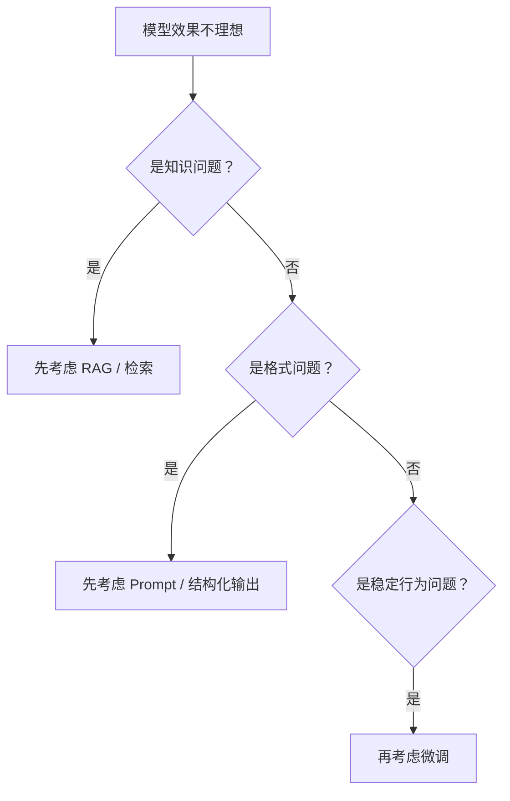
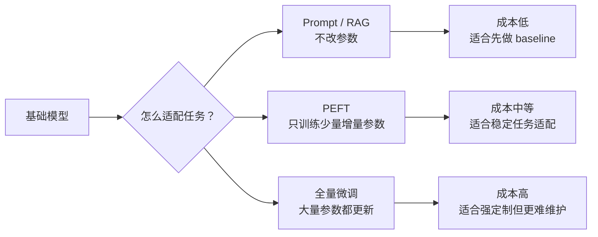

# 7.6.2 微调概述


:::tip 本节定位
很多人一提模型定制，第一反应就是：

- 去微调它

但真实工程里，更重要的问题其实是：

> **现在这个问题，到底值不值得通过微调来解决？**

这一节的核心，不是把“微调”神化成万能按钮，而是把判断逻辑讲清楚。
:::

## 学习目标

- 理解微调真正适合解决哪类问题
- 理解为什么不是所有任务都应该先微调
- 分清全量微调和参数高效微调（PEFT）的基本思路
- 建立更实用的微调决策直觉

---

## 先建立一张地图

### 先看一个真实感更强的场景

假设你在做一个课程答疑助手。上线后发现它有三类问题：

- 有些问题答错，是因为它不知道最新课程规则
- 有些问题答得对，但格式总是不稳定
- 有些问题每次都偏离你的客服语气，长期不符合品牌风格

这三类问题看起来都像“模型效果不好”，但解决方案并不一样。第一类更像知识问题，通常先考虑 RAG；第二类更像输出约束问题，通常先改 Prompt 或结构化输出；第三类才更像长期行为塑形问题，微调才开始变得有价值。

所以学微调之前，先别急着训练，先学会判断：到底是哪一类问题。

如果你已经学过预训练和 Prompt，这一节最自然的续接就是：

- 前面你已经知道模型能力怎么来，也知道不改参数时怎样更稳地调用
- 这一节开始回答：什么时候仅靠 Prompt 不够，真的需要动参数

所以微调概述真正重要的不是“会不会训练”，而是：

- 什么时候该动参数
- 动参数到底值不值

微调概述这节最适合新人的理解顺序不是“先去训练”，而是先看清决策树：



这节真正想解决的是：

- 到底什么时候才该微调
- 微调解决的是哪类问题，不解决哪类问题

## 一、微调到底在解决什么问题？

可以先把它粗略理解成：

> **让基础模型在某个更具体的任务、风格或领域上表现得更稳定。**

例如：

- 更会某种固定输出格式
- 更适应某类业务回复风格
- 更懂某个垂直领域的任务形式

这说明微调更像是在做：

- 能力塑形

而不只是：

- 知识补充

### 第一次学微调，最该先抓住什么？

最该先抓住的不是 LoRA 或全量微调这些方法名，而是这句：

> **微调更像在塑造模型行为，而不只是往模型里“塞知识”。**

这句话一旦稳住，后面很多判断会更顺：

- 为什么知识更新很多时候更适合 RAG
- 为什么格式稳定问题有时先该靠 Prompt
- 为什么行为长期不稳时才更值得考虑微调

---

## 二、为什么不是所有问题都该先微调？

很多问题其实更适合先考虑：

- Prompt
- RAG
- 工具调用

### 如果问题是“知识不够新”

更自然的第一选择往往是：

- 检索

### 如果问题是“输出格式不稳”

更自然的第一选择往往是：

- Prompt 优化
- 结构化输出

### 什么时候微调才更值得优先考虑？

当你发现问题更像：

- 模型行为长期不稳
- 风格要求固定
- 某类任务反复出现且模式稳定

这时微调就更有价值。

一句话先记：

> **先分清这是知识问题、格式问题，还是行为问题。**

### 三类问题的判断表

| 问题表现 | 更像哪类问题 | 更优先考虑什么 |
|---|---|---|
| 模型不知道公司最新退款规则 | 知识问题 | RAG / 检索 / 知识库更新 |
| 模型答案内容对，但 JSON 格式经常错 | 格式问题 | Prompt / 结构化输出 / 校验重试 |
| 模型长期不符合固定话术和任务风格 | 行为问题 | 微调 / PEFT |
| 用户问题需要查工具再回答 | 行动问题 | 工具调用 / Agent / 工作流 |

这个表很重要，因为它能帮你避免一个常见错误：只要效果不好就想微调。真实项目里，很多问题并不是靠动参数解决的。


:::tip 读图提示
这张图建议从问题根因读起：知识缺失先看 RAG，格式不稳先看 Prompt/结构化输出，工具流程问题先看 Agent/工作流，只有长期行为和风格不稳定时，微调或 PEFT 才更值得进入候选。微调不是第一反应，而是判断后的动作。
:::

---

## 三、全量微调和参数高效微调的差别

### 全量微调

直觉上就是：

- 模型大部分参数都允许更新

优点：

- 灵活

缺点：

- 显存高
- 成本高
- 更难训

### 参数高效微调（PEFT）

直觉上就是：

- 不去大改整个模型
- 只训练少量增量参数

优点：

- 更省资源
- 更容易复用

这也是为什么现在实际项目里 PEFT 越来越常见。

### 第一次看 PEFT，最值得先记什么？

最值得先记的不是具体算法细节，而是：

- 它在解决“资源和维护成本”这个现实问题

也就是说，PEFT 不是单纯更潮，而是：

- 当你不想大改整个模型时，一个更现实的适配路线

---

## 四、适配方式的成本地图



这张图可以作为第一次做方案选型时的提醒：越往右，改动越深、成本越高，也越需要稳定数据和清晰收益。

---

## 五、一个最小参数规模示意

```python
params = {
    "full_finetune": 100_000_000,
    "peft": 5_000_000
}

for name, count in params.items():
    print(name, "trainable_params =", count)
```

预期输出：

```text
full_finetune trainable_params = 100000000
peft trainable_params = 5000000
```

### 这段代码在提醒什么？

它不是在告诉你某个精确数字，而是在提醒：

> 微调方法差别的第一层现实问题，往往是“到底要改多少参数”。

这直接决定：

- 显存
- 训练速度
- 存储成本

---

## 六、什么时候微调真的很有价值？

### 当你想让模型形成稳定行为

例如：

- 特定回复风格
- 特定任务格式
- 特定领域习惯

### 当你有稳定、可持续的数据

如果你的任务数据：

- 量足够
- 质量够好
- 模式比较稳定

那微调通常更有意义。

### 什么时候不值得？

如果需求经常变化，或者知识频繁更新，
那很多时候微调并不是第一选择。

---

## 七、微调最容易被高估的地方

### 误区一：以为微调能解决所有问题

不会。
很多问题更适合用：

- 检索
- 工作流
- Prompt

### 误区二：以为微调后模型就会“背住知识库”

微调更适合塑造行为，不总适合承载快速更新的知识。

### 误区三：只要训了就一定更强

如果数据差，微调反而可能把模型训坏。

---

## 八、一个很实用的判断问题

在决定要不要微调之前，可以先问：

1. 这是知识问题，还是行为问题？
2. 这个任务形态会不会长期稳定存在？
3. 我有没有干净、稳定的数据？
4. 我是否真的有资源承担训练和维护？

如果这些问题答得清楚，微调决策通常就会稳很多。

### 第一次做项目时最稳的顺序

如果你想真的落地一个任务，建议先这样走：

1. 先用 Prompt 做 baseline
2. 再用检索或工作流做第二层 baseline
3. 只有在行为仍然长期不稳时，再考虑微调

这样你最后才更容易说明：

- 微调到底解决了什么
- 它值不值得

---

## 留下的证据

学完这一页，至少保留这张证据卡：

```text
problem_type: behavior adaptation, format, tone, or domain routine
not_for: missing facts that RAG should supply
cost_map: full fine-tune vs PEFT vs prompting
eval_baseline: pre-finetune behavior recorded
go_no_go: enough quality data and stable evaluation
```

## 小结

这一节最重要的不是把微调理解成一个默认动作，而是理解：

> **微调更适合解决“模型行为和任务适配”问题，而不是所有问题。**

一旦这个判断建立起来，后面再学 LoRA、QLoRA 和工程实践时，你就不会盲目上手。

## 这节最该带走什么

- 微调不是默认动作，而是一种代价更高的适配手段
- 先分清知识问题、格式问题、行为问题
- 只有当任务长期稳定、数据可靠、收益明确时，微调才更值得优先考虑

---

## 九、练习

1. 想一个你的真实项目，判断它的问题更像知识问题还是行为问题。
2. 用自己的话解释：为什么不是所有任务都应该优先微调？
3. 如果需求经常变，为什么微调未必是第一选择？
4. 为什么说“数据质量”往往比“方法名”更影响微调结果？
