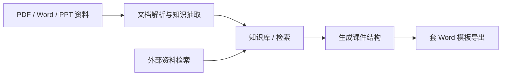
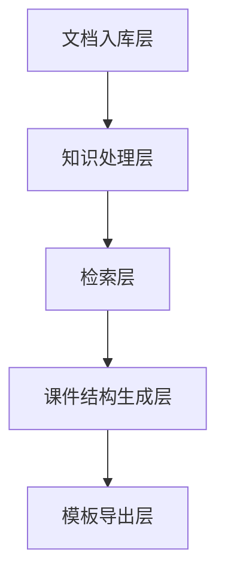

# 8.5.5 项目：知识库驱动的课件生成助手


:::tip 本节定位
这个项目比普通知识库问答更进一步。
它不是只回答问题，而是要真正产出：

- 一份符合格式要求的 Word 课件

所以它特别适合训练这些系统能力一起工作：

- 文档解析
- 知识检索
- 例题抽取
- 结构化输出
- 模板化文档生成
:::

## 学习目标

- 学会把“主题 -> 查资料 -> 抽例题 -> 生成课件”组织成完整流程
- 学会定义一个知识库驱动课件系统的最小项目边界
- 学会把内部知识库和外部资料补充分开设计
- 学会把这个项目做成一个有产品感的作品级系统

## 新人术语桥

这个项目横跨文档处理、检索、生成和导出，先把几个词分清会更稳：

| 术语 | 新人理解 | 在本项目中的作用 |
|---|---|---|
| `ingestion` | 资料入库，把文件带进系统并准备处理 | PDF / Word / PPT 资料从这里进入流水线 |
| `example extraction` | 例题抽取，从文档中识别例题、练习、定义、公式 | 课件需要例题，不只是普通段落 |
| `schema` | 稳定的数据结构，规定课件输出长什么样 | 让检索、生成和模板导出对齐 |
| `template rendering` | 模板渲染，把结构化内容填进 Word 或 PPT 模板 | 把内容生成和文档排版分开 |
| `source_refs` | 来源引用，记录每个章节或条目来自哪里 | 让最终 Word 初稿能说明内容出处 |
| `internal vs external materials` | 内部资料是可信课程资产，外部资料只是补充 | 防止外部资料覆盖课程主骨架 |

核心判断是：模型不应该直接“写一个 Word 文件”。它应该帮助生成稳定的结构化课件对象，再交给模板层可靠渲染。

---

## 先建立一张地图

这个项目最适合按“知识入库 -> 检索 -> 结构化生成 -> 模板导出”来理解：



所以这个项目真正想解决的是：

- 用户只给一个主题时，系统怎样自动去找资料、找例题、再按模板写出来

## 一、项目题目怎么收窄？

一个最稳的起点通常是：

> **做一个“知识库驱动的数学课件助手”，用户输入主题，系统自动生成一份包含知识点、例题和练习的 Word 初稿。**

为什么这个范围合适？

- 主题清楚
- 资料形态清楚
- 例题和知识点都能从文档里抽
- Word 输出目标明确

不建议一开始就做成：

- 所有学科通用
- 自动生成 PPT + Word + 讲稿 + 配音

这样很容易把项目主线冲散。

## 二、一个更适合新人的总类比

你可以把这个系统理解成：

- 一个会先翻资料、再整理提纲、最后替你起草课件的备课助理

它不是直接凭空写，而是：

1. 先查内部资料
2. 必要时再补外部资料
3. 再从资料里挑知识点和例题
4. 最后按固定格式写成课件

这个类比很重要，因为它会帮新人避免把项目想成：

- “直接让模型写一篇 Word”

## 三、最小系统闭环长什么样？

1. 文档入库
2. 解析正文、标题和例题
3. 用户输入主题
4. 系统检索内部知识块
5. 必要时补外部资料
6. 生成结构化课件对象
7. 套模板导出 Word

只要这 7 步跑顺，这个项目就已经非常像真正产品了。

## 四、先跑一个最小工作流示例

```python
knowledge_base = [
    {"topic": "折扣应用题", "content_type": "concept", "text": "折扣 = 原价 × 折扣率"},
    {"topic": "折扣应用题", "content_type": "example", "text": "商品原价 100 元，打 8 折后价格是多少？"},
    {"topic": "折扣应用题", "content_type": "exercise", "text": "一件衣服原价 80 元，打 7 折后是多少元？"},
]


def retrieve_internal(topic):
    return [item for item in knowledge_base if item["topic"] == topic]


def retrieve_external(topic):
    # 这里只做一个最小模拟
    return [{"topic": topic, "content_type": "note", "text": f"外部资料补充：{topic} 的常见教学误区。"}]


def build_courseware(topic):
    internal = retrieve_internal(topic)
    external = retrieve_external(topic)
    all_items = internal + external
    return {
        "title": topic,
        "concepts": [x["text"] for x in all_items if x["content_type"] == "concept"],
        "examples": [x["text"] for x in all_items if x["content_type"] == "example"],
        "exercises": [x["text"] for x in all_items if x["content_type"] == "exercise"],
        "notes": [x["text"] for x in all_items if x["content_type"] == "note"],
    }


print(build_courseware("折扣应用题"))
```

### 这个例子最关键的价值是什么？

它说明这个系统真正有价值的地方，不是只会：

- 查

而是能把查到的内容重新组织成：

- 课件需要的栏目结构

## 五、一个更像真实项目的系统分层图

很多新人做这类项目时，最容易把“知识库、检索、生成、导出”混在一起。

更稳的做法是先分层：



你可以简单把它理解成：

- 入库层：把资料读进来
- 处理层：把资料变成知识块
- 检索层：把相关材料找出来
- 生成层：把材料重组为课件结构
- 导出层：把结构变成 Word

## 六、这个项目最需要哪些能力？

按系统分层看，核心能力是：

### 文档解析

- PDF / DOCX / PPTX 读取
- 扫描件 OCR
- 标题层级和例题识别

对应课程：
- [8.3.8 文档解析与知识抽取](../ch03-app-dev/07-document-parsing.md)
- [8.1.3 文档处理](../ch01-rag/02-document-processing.md)
- [10.5.4 OCR 文字识别](../../ch10-computer-vision/ch05-advanced/03-ocr.md)

### 知识库与检索

- 切块
- 元数据
- 主题检索
- 例题召回

对应课程：
- [8.1.2 RAG 基础](../ch01-rag/01-rag-basics.md)
- [8.1.4 向量数据库](../ch01-rag/03-vector-databases.md)
- [8.1.5 检索策略](../ch01-rag/04-retrieval-strategies.md)

### 结构化输出与模板生成

- 先生成大纲
- 再生成知识点 / 例题 / 练习
- 再套模板导出 Word

对应课程：
- [7.5.2 Prompt 基础](../../ch07-llm-principles/ch05-prompt/01-prompt-basics.md)
- [7.5.4 结构化输出](../../ch07-llm-principles/ch05-prompt/03-structured-output.md)
- [8.3.9 模板化文档生成（Word / PPT）](../ch03-app-dev/08-template-doc-generation.md)

### 工具调用与工作流

- 内部知识库检索
- 外部资料补充
- 模板渲染
- 导出文件

对应课程：
- [8.3.4 函数调用实践](../ch03-app-dev/03-function-calling.md)
- [8.3.6 对话系统与多轮管理](../ch03-app-dev/05-dialog-system.md)
- [9.2.5 Plan-and-Execute](../../ch09-agent/ch02-reasoning/04-plan-and-execute.md)

## 七、固定格式课件最小 schema 应该长什么样？

对这个项目来说，最值得先定清楚的，不是模型名，
而是“课件长什么样”。

一个最小 schema 至少可以先定成：

```python
courseware_schema = {
    "title": "主题名称",
    "audience": "适用对象",
    "teaching_goal": ["目标1", "目标2"],
    "sections": [
        {"type": "concept", "heading": "知识点回顾", "items": []},
        {"type": "example", "heading": "例题讲解", "items": []},
        {"type": "exercise", "heading": "课堂练习", "items": []},
    ],
    "source_refs": [
        {"doc_id": "word_001", "page_or_slide": 3}
    ],
}
```

这个 schema 特别重要，因为它会把：

- 检索
- 生成
- 模板导出

三层都绑到同一个稳定对象上。

## 八、内部资料和外部资料，谁优先？

你的项目有一个非常关键的现实问题：

- 内部知识库里可能已经有成熟资料
- 外部资料只是补充，不应该反客为主

所以更适合新人的默认策略通常是：

| 场景 | 默认优先级 |
|---|---|
| 主题知识点 | 先内部资料 |
| 经典例题 | 先内部资料 |
| 最新政策/新闻/新题型 | 再补外部资料 |
| 内部资料缺口明显 | 外部资料做补充说明 |

你可以先把这条规则记成一句话：

> **内部资料决定主骨架，外部资料负责补空白。**

## 九、一个更像真实产品的最小工作流骨架

```python
def generate_courseware(topic):
    parsed_docs = load_parsed_documents()
    internal_hits = retrieve_internal(parsed_docs, topic)
    external_hits = retrieve_external(topic)
    selected = merge_and_rank(internal_hits, external_hits)
    structured = build_courseware_schema(topic, selected)
    return export_word(structured)
```

这个骨架的价值不是“代码多高级”，
而是让你先脑子里有这 5 个动作：

1. 读内部知识
2. 查外部补充
3. 合并与排序
4. 生成固定 schema
5. 导出文档


:::tip 读图提示
这张图要按生产线看：资料入库、解析成知识块、按主题和内容类型检索、生成 courseware schema、再渲染 Word。任何一层没有中间产物，后面就很难排查。
:::

## 十、这个项目最该怎么评估？

最值得先看的不是“写出来像不像”，而是：

1. 检索内容对不对
2. 例题抽得对不对
3. 结构有没有符合模板
4. 引用和来源能不能回溯

你可以先把评估拆成：

| 维度 | 更像在看什么 |
|---|---|
| 检索质量 | 主题资料和例题有没有找对 |
| 结构正确性 | 标题、知识点、例题、练习有没有放对位置 |
| 来源可追溯性 | 每一段内容能不能回溯到文档来源 |
| 模板符合度 | 最终 Word 是否符合格式规范 |

## 十一、一个新人可直接照抄的推进顺序

第一次做这个项目时，更稳的顺序通常是：

1. 先只做内部知识库
2. 先不加外部资料
3. 先生成结构化 JSON
4. 再把 JSON 套到 Word 模板里
5. 最后再补外部检索、工具编排和更复杂的 Agent 逻辑

这样会比一上来就做“全自动备课 Agent”更容易把系统做稳。

## 十二、第一次做时最容易踩的坑

第一次做这类项目，最容易踩的坑通常是：

1. 一上来就让模型自由写完整文档
2. 不区分内部资料和外部资料的优先级
3. 没有保存来源，后面没法追溯
4. 没有固定 schema，导致模板渲染层很脆
5. 生成效果不好时，不知道是检索错了还是模板错了

所以真正更稳的开发思路是：

- 先把链路拆开
- 每一层单独验证
- 最后再把它们串起来

## 十三、如果把它做成作品集，最值得展示什么？

最值得展示的通常不是：

- “我能生成 Word”

而是：

1. 原始资料长什么样
2. 解析后的知识块长什么样
3. 用户输入主题后检索到了哪些内容
4. 最终课件结构是怎么长出来的
5. Word 模板导出后的结果长什么样

这样别人会更容易看出：

- 你做的是一个知识驱动内容生成系统
- 不只是让模型写了一篇文章


## 版本路线建议

| 版本 | 目标 | 交付重点 |
|---|---|---|
| 基础版 | 跑通最小闭环 | 能输入、能处理、能输出，并保留一组示例 |
| 标准版 | 形成可展示项目 | 增加配置、日志、错误处理、README 和截图 |
| 挑战版 | 接近作品集质量 | 增加评估、对比实验、失败样本分析和下一步路线 |

建议先完成基础版，不要一开始就追求大而全。每提升一个版本，都要把“新增了什么能力、怎么验证、还有什么问题”写进 README。

## 小结

- 这个项目最核心的是“文档知识 -> 结构化课件 -> 模板导出”的完整链路
- schema 和来源策略，往往比一开始选哪家模型更重要
- 第一次做时，先把内部资料版工作流做稳，再补外部资料和 Agent 化会更现实

## 这节最该带走什么

- 这个项目最核心的不是“文档输出”，而是“文档知识 -> 结构化课件”的整条链
- 文档解析、RAG、结构化输出、模板渲染缺一块，系统都不稳
- 如果你想做这类系统，先把工作流版做稳，再考虑 Agent 化会更现实
