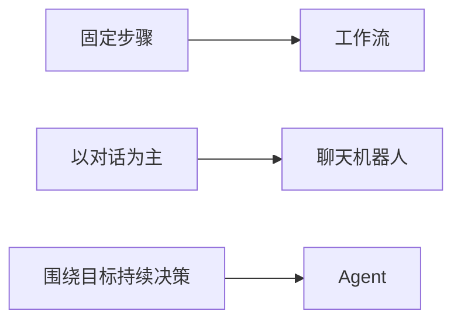
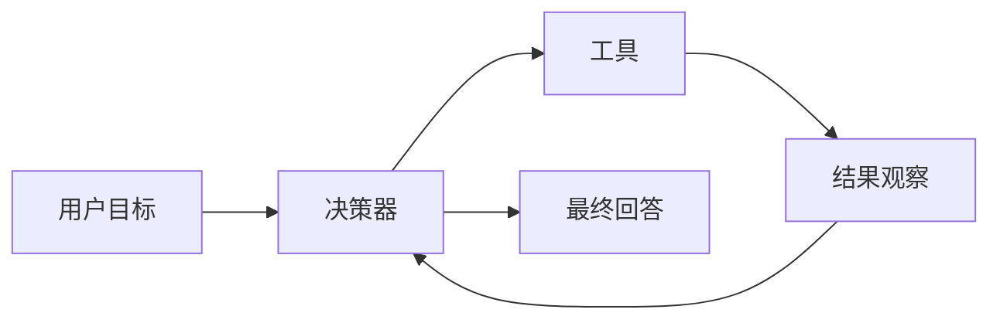
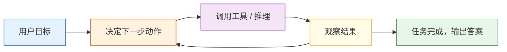

# 9.1.2 什么是 AI Agent


:::tip 本节定位
Agent 最容易被新人误会成：

- 一个更会聊天的模型

但真实一点的理解应该是：

- 一个围绕目标不断做“判断 -> 行动 -> 观察 -> 再判断”的系统

所以这节最重要的不是先神化 Agent，而是先把它和：

- 工作流
- 聊天机器人
- 单次函数调用

这几种系统边界分清楚。
:::

## 学习目标

完成本节后，你将能够：

- 说清楚工作流、聊天机器人和 Agent 的区别
- 理解 Agent 的最小组成部分
- 跑通一个带工具调用的迷你 Agent 示例
- 明白 Agent 为什么不只是“套个 prompt”

---

## 这节和前面大模型应用主线是怎么接上的

如果你刚学完第八 B 阶段，可以先把这节理解成：

- 前面你已经会做“模型 + 知识 + 工具 + 应用”的系统
- 这一节开始回答：什么时候这些系统会跨进 Agent，而不再只是固定工作流

所以这节真正重要的不是一个定义句，而是：

- 先把 Agent 和工作流、聊天系统、函数调用系统分开

### 一个更适合新人的总类比

你可以先把这三类系统想成：

- 工作流：固定地铁线路
- 聊天机器人：前台接待
- Agent：会自己决定下一步怎么做的助理

这个助理当然也会说话，
但它真正关键的地方不是“会聊天”，而是：

- 会不会为了目标组织一串动作

## 先别急着神化 Agent

很多人第一次听到 Agent，会觉得它像“能自主思考并执行任务的 AI 员工”。

这个说法不算错，但容易太飘。

更稳妥的理解是：

> **Agent = 能根据目标、状态和工具，分步完成任务的系统。**

它通常具备这几种能力：

- 接收目标
- 拆解步骤
- 调用工具
- 根据结果继续行动
- 在必要时结束任务

### 第一次学 Agent，最该先抓住什么？

最该先抓住的不是“自主”两个字，而是这句：

> **Agent 的关键不是会说，而是会围绕目标组织一串动作。**

这句话一旦稳住，后面你再看：

- 规划
- 工具
- 记忆
- 多 Agent

都会更自然地知道它们为什么会出现。

---

## 工作流、聊天机器人、Agent 有什么区别？

### 工作流（Workflow）

每一步都是提前写好的：

1. 用户提问
2. 查数据库
3. 拼提示词
4. 返回答案

这更像固定流水线。

### 聊天机器人（Chatbot）

重点是“对话”。
它未必会主动拆任务或使用外部工具。

### Agent 作为系统角色

重点是“为了完成目标，动态选择动作”。

比如一个 Agent 可能会：

1. 先判断用户要什么
2. 再决定是去查天气、查文档，还是计算
3. 拿到结果后再组织输出

### 为什么这三个概念一定要先分开？

因为很多系统看起来都像“接了个模型”，但工程形态完全不同：

- 工作流更像固定线路
- 聊天机器人更像对话界面
- Agent 更像有目标驱动的执行系统

如果一开始不把这三个边界分清，后面很容易：

- 工具一多就叫 Agent
- 有状态就以为是 Agent
- 会聊天就误当成 Agent

### 一个很适合初学者先记的系统边界图



这张图很重要，因为它会帮新人先抓住：

- Agent 不是“更聪明的聊天框”
- 而是系统控制方式变了


:::tip 读图提示
读这张图时，先不要看谁更“智能”，而要看控制权在哪里：工作流的路径由程序提前写死，聊天机器人主要负责回复，Agent 则会围绕目标反复决定下一步动作。
:::

---

## Agent 的最小组成部分

你可以先把 Agent 拆成 4 块：

| 组件 | 作用 |
|---|---|
| 目标 | 这次要完成什么 |
| 模型 / 决策器 | 下一步该做什么 |
| 工具 | 能调用哪些外部能力 |
| 状态 / 记忆 | 当前任务进行到哪了 |

### 第一次看这四块，最值得先记哪一句？

可以先记：

> **Agent = 目标 + 决策 + 工具 + 状态。**

后面 9 AI Agent 与智能体系统的很多章节，其实都只是在把这四块展开。

类比一下：

> Agent 很像一个会做事的实习生：有任务目标，有工具箱，有工作记录，还要自己决定下一步。

### 再看一个最小“候选动作”示例

```python
def choose_action(query):
    if "天气" in query:
        return "use_weather_tool"
    if "退款" in query or "证书" in query:
        return "use_docs_tool"
    if "计算" in query:
        return "use_calculator"
    return "reply_directly"


for query in ["北京天气怎么样", "退款规则是什么", "计算 7 * 8"]:
    print(query, "->", choose_action(query))
```

预期输出：

```text
北京天气怎么样 -> use_weather_tool
退款规则是什么 -> use_docs_tool
计算 7 * 8 -> use_calculator
```

这个示例很适合初学者，因为它会帮助你先抓住一个核心动作：

- Agent 不是先答
- 而是先决定下一步该做什么

### 一个很适合初学者先记的系统边界图



这张图特别重要，因为它会提醒你：

- Agent 的关键不是只输出一句话
- 而是进入“目标 -> 行动 -> 观察”的闭环


:::tip 读图提示
这张图可以按时间线看：目标进入系统后，Agent 每一轮都会留下 action、observation 和 state 更新。以后调试 Agent，看的不是一句最终回答，而是这条可复盘的轨迹。
:::

---

## 一个不依赖大模型的迷你 Agent

为了让原理更清楚，我们先不用真正的大模型，先写一个“规则版 Agent”。

```python
import ast
import operator

OPS = {
    ast.Add: operator.add,
    ast.Sub: operator.sub,
    ast.Mult: operator.mul,
    ast.Div: operator.truediv,
}


def safe_calculate(expression):
    def visit(node):
        if isinstance(node, ast.Expression):
            return visit(node.body)
        if isinstance(node, ast.Constant) and isinstance(node.value, (int, float)):
            return node.value
        if isinstance(node, ast.BinOp) and type(node.op) in OPS:
            return OPS[type(node.op)](visit(node.left), visit(node.right))
        if isinstance(node, ast.UnaryOp) and isinstance(node.op, ast.USub):
            return -visit(node.operand)
        raise ValueError("unsupported_expression")

    return visit(ast.parse(expression, mode="eval"))


def tool_weather(city):
    fake_weather = {
        "北京": "晴，22 度",
        "上海": "多云，25 度",
        "深圳": "小雨，28 度"
    }
    return fake_weather.get(city, "暂无该城市天气数据")

def tool_calculate(expression):
    return str(safe_calculate(expression))

def tool_search_docs(keyword):
    docs = {
        "退款": "课程购买后 7 天内且学习进度低于 20% 可申请退款。",
        "证书": "完成所有必修项目并通过结课测试后可获得证书。"
    }
    for k, v in docs.items():
        if k in keyword:
            return v
    return "未找到相关文档。"

def simple_agent(user_query):
    steps = []

    if "天气" in user_query:
        city = "北京" if "北京" in user_query else "上海" if "上海" in user_query else "深圳"
        steps.append(f"识别到天气查询，准备调用 weather 工具，城市={city}")
        result = tool_weather(city)
        steps.append(f"工具返回：{result}")
        final_answer = f"{city}当前天气：{result}"

    elif "退款" in user_query or "证书" in user_query:
        steps.append("识别到知识查询，准备调用 docs 工具")
        result = tool_search_docs(user_query)
        steps.append(f"工具返回：{result}")
        final_answer = result

    elif "计算" in user_query:
        expression = user_query.replace("计算", "").strip()
        steps.append(f"识别到计算任务，准备调用 calculator 工具，表达式={expression}")
        result = tool_calculate(expression)
        steps.append(f"工具返回：{result}")
        final_answer = f"计算结果是：{result}"

    else:
        steps.append("无法匹配工具，直接回复默认答案")
        final_answer = "我暂时还不知道该调用哪个工具。"

    return steps, final_answer

query = "计算 23 * 7"
steps, answer = simple_agent(query)

print("用户问题:", query)
print("执行步骤:")
for step in steps:
    print("-", step)
print("最终回答:", answer)
```

预期输出：

```text
用户问题: 计算 23 * 7
执行步骤:
- 识别到计算任务，准备调用 calculator 工具，表达式=23 * 7
- 工具返回：161
最终回答: 计算结果是：161
```

这个例子虽然简单，但已经包含了 Agent 的核心味道：

- 识别任务
- 选择工具
- 拿到结果
- 组织输出

---

## Agent 和“函数调用”是什么关系？

Agent 经常会用到函数调用（Function Calling / Tool Calling），但两者不完全等价。

### 函数调用

重点是：模型能不能产出结构化参数，正确调用工具。

### Agent 和函数调用的边界

重点是：模型或系统能不能围绕目标，动态决定：

- 何时调用工具
- 调哪个工具
- 调几次
- 调完之后下一步做什么

所以可以记成：

> 工具调用是 Agent 的常见能力，但 Agent 不只等于工具调用。

### 为什么这一步特别容易被新人混掉？

因为很多早期演示看起来都是：

- 识别意图
- 调一个工具
- 回答结果

但真正的 Agent 会更进一步关心：

- 什么时候调
- 调哪个
- 调完下一步干什么
- 是否需要继续迭代

## 为什么 Agent 比普通问答系统更难？

因为它多了“行动”这一层。

普通问答系统更像：

- 看输入
- 生成答案

Agent 更像：

- 看输入
- 规划
- 试着做事
- 观察结果
- 再决定下一步

这就带来更多挑战：

- 错误会在多步过程中累积
- 工具调用可能失败
- 成本和时延更高
- 安全风险也更大

---

## 一个更像 Agent 的循环思路

真实 Agent 系统经常长这样：



这就是为什么 Agent 特别强调：

- 规划
- 观察
- 反馈
- 迭代

### 这条循环最值得先看懂的，不是图，而是“闭环”

也就是说，Agent 的关键不是单次输出，而是：

- 看目标
- 采取动作
- 观察结果
- 再决定下一步

这正是它和普通问答系统最本质的差别之一。

### 第一次做 Agent 项目时，最稳的默认顺序

更稳的顺序通常是：

1. 先做单步工具调用
2. 先让系统会选动作
3. 再补观察结果后的下一步判断
4. 最后再引入更复杂的规划和记忆

这样会比一开始就追“完全自主 Agent”更容易做出一个真正可控的系统。

## 如果把它做成项目或笔记，最值得展示什么

最值得展示的通常不是：

- 一段“它会调用工具”的演示视频

而是：

1. 用户目标
2. Agent 选择了什么动作
3. 为什么选这个动作
4. 工具返回了什么
5. Agent 如何根据结果继续下一步

这样别人会更容易看出：

- 你理解的是行动闭环
- 不只是把模型和工具绑在一起

---

## 什么任务适合做 Agent？

### 比较适合

- 多步任务
- 需要外部工具
- 需要根据中间结果调整策略

例如：

- 研究助理
- 自动报表
- 数据分析助手
- 代码修复助手

### 不太适合

- 一步就能答完的简单 FAQ
- 完全固定流程的任务
- 对稳定性要求极高、不能容忍自由发挥的场景

很多场景里，**工作流反而比 Agent 更合适**。

---

## 初学者常见误区

### 以为“能聊天”就叫 Agent

不对。
聊天机器人不一定会自主分步行动。

### 以为 Agent 一定比工作流高级

不一定。
简单稳定的任务，工作流可能更便宜、更可靠。

### 以为加上工具调用就万事大吉

工具越多、步骤越多，调试和安全难度也会更高。

---

## 判断一个系统是不是 Agent 的检查表

很多新人会把“聊天机器人、RAG 应用、工具调用应用”都叫 Agent。更稳的做法是先用下面这张表检查。

| 问题 | 如果答案是“是” | 更像什么 |
|---|---|---|
| 步骤是否完全固定？ | 每次都按同一条流程走 | 工作流 |
| 主要目标是不是连续对话？ | 重点是理解上下文并回复 | 聊天机器人 |
| 是否只是调用一次工具？ | 用户问什么就调用一个对应函数 | 工具调用应用 |
| 是否会根据中间结果决定下一步？ | 工具结果会影响后续动作 | Agent |
| 是否有明确停止条件和执行记录？ | 能知道为什么继续、为什么结束 | 更接近可控 Agent |

可以先记住一个判断：如果系统没有“观察结果后再决定下一步”，它通常还只是工作流或工具调用应用，不必急着叫 Agent。

## 第一个 Agent 项目应该怎么做才稳

第一次做 Agent，不建议一上来就做“全自动复杂助理”。更稳的版本路线是：

| 版本 | 目标 | 验收标准 |
|---|---|---|
| v0.1 单步工具 | 能根据用户问题选择一个工具 | 打印 tool_call、参数和工具结果 |
| v0.2 多步执行 | 能完成 2～3 步任务 | 每一步都有 trace，不会无限循环 |
| v0.3 失败恢复 | 工具失败时能解释并尝试替代方案 | 有错误日志和兜底回答 |
| v0.4 人工确认 | 高风险动作执行前需要确认 | 能区分只读工具和写入工具 |
| v0.5 项目展示 | 有 README、示例、失败样本和安全边界 | 能解释 Agent 为什么这样行动 |

这条路线会帮助你把重点放在“可控行动闭环”，而不是追求看起来很炫的自主性。

## Agent 执行 Trace 模板

Agent 项目最值得展示的是执行过程。建议每次运行至少记录这些字段：

| 字段 | 示例 | 作用 |
|---|---|---|
| `goal` | 帮我制定本周学习计划 | 用户目标 |
| `step` | 1 | 第几步 |
| `thought_type` | plan / tool / observe / final | 当前阶段类型 |
| `action` | search_course_docs | 采取的动作 |
| `arguments` | `{topic: "RAG"}` | 工具参数 |
| `observation` | 找到 3 条相关章节 | 工具或环境返回 |
| `next_decision` | 继续生成计划 | 为什么继续或停止 |

一个最小 trace 可以长这样：

```text
goal: 制定 RAG 学习计划
step 1: action=search_course_docs, arguments={topic: RAG}
observation: 找到 RAG 基础、文档处理、检索策略 3 个章节
step 2: action=build_plan, arguments={days: 3}
observation: 已生成 3 天计划
final: 返回学习计划，并说明引用了哪些章节
```

如果没有 trace，Agent 出错时很难定位：到底是目标理解错、工具选错、参数错、工具返回异常，还是停止条件没写好。

## Agent 不应该做什么

Agent 的能力越强，越需要边界。初学阶段尤其要记住：不是所有事情都适合交给 Agent 自主执行。

| 不建议让 Agent 自主做的事 | 更稳的做法 |
|---|---|
| 删除文件、提交代码、发送消息、下单付款 | 必须人工确认 |
| 执行没有白名单限制的任意代码 | 限制工具权限和运行环境 |
| 无限尝试直到成功 | 设置最大步数、最大成本和超时 |
| 在证据不足时编造结论 | 明确允许说“不知道” |
| 靠记忆覆盖当前事实 | 先读取当前状态，再行动 |

这张表不是为了削弱 Agent，而是为了让 Agent 更像一个可靠系统。真正工程化的 Agent，重点不是“它能不能自己做很多事”，而是“它是否知道什么时候该停、什么时候该问人、什么时候不能做”。

---

## 留下的证据

学完这一页，至少保留这张证据卡：

```text
agent_boundary: how this differs from chatbot or fixed workflow
goal_state_action: goal, current state, next action, observation
architecture_parts: planner, tools, memory, guardrails, evaluator
failure_check: over-autonomy, vague goal, missing state, or no trace
next_action: build the smallest traceable single-agent loop
```

## 小结

这一节最重要的一句话是：

> **Agent 不是“会说话的模型”，而是“能围绕目标采取行动的系统”。**

它的价值不只是回答，而是完成任务。
后面几章我们会继续展开：推理、工具、记忆、多 Agent、部署与安全。

## 这节最该带走什么

- Agent 的关键不是对话，而是行动闭环
- 工作流、聊天系统、函数调用和 Agent 需要先分清边界
- 9 AI Agent 与智能体系统后面所有模块，其实都在展开“目标 + 决策 + 工具 + 状态”这四块

---

## 练习

1. 给 `simple_agent()` 再加一个工具，比如“查课程安排”。
2. 让 Agent 支持“先查文档，再计算”的两步任务。
3. 思考：如果工具返回错误信息，Agent 应该怎么处理才更稳妥？
