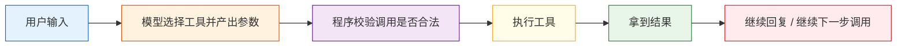

# 9.3.2 函数调用 详解

:::tip 本节定位
上一节你已经知道 Function Calling 是“模型产出结构化工具调用”。
这一节我们不再停留在“会调用”，而要进入真正重要的问题：

> **怎样把函数调用做得稳定、可控、可扩展？**

这才是它在 Agent 系统里真正的工程价值。
:::

## 学习目标

- 理解 函数调用 的完整工程链路
- 学会设计更稳的工具 结构约束
- 理解参数校验、失败处理和错误恢复
- 看懂一个多步工具调用的小型闭环
- 分清“模型做决定”和“程序做执行”各自负责什么

---

## 为什么要把 函数调用 单独深挖？

### 初级版本只解决“能不能调”

最简单的函数调用系统只要求：

- 模型选对工具
- 参数大致对

这在演示阶段通常够了。

### 真正上线后会立刻遇到更难的问题

比如：

- 工具很多，模型经常选错
- 参数经常缺字段
- 某些调用必须做权限控制
- 工具失败后怎么恢复？
- 多步调用时怎样避免无限循环？

所以真正的 Function Calling，不只是一个 JSON 结构，而是一套工程机制。

---

## 先把完整链路看清楚

### 函数调用 的标准闭环



### 哪些环节分别归谁负责？

| 环节 | 谁负责 |
|---|---|
| 识别要不要调工具 | 模型 |
| 产出调用结构 | 模型 |
| 校验参数是否合法 | 程序 |
| 执行工具 | 程序 |
| 根据结果继续下一步 | 模型 / 工作流 / Agent 调度器 |

这是一个特别关键的边界：

> **模型负责“决定”，程序负责“保证执行安全和稳定”。**


:::tip 读图提示
这张图要按“模型输出不等于程序执行”来读：模型只提出 tool call，程序必须先做 schema 校验、权限检查、参数清洗和错误归一化，最后才进入真实工具。
:::

---

## 结构约束 设计为什么会直接影响效果？

### 一个坏 结构约束 长什么样？

```python
bad_schema = {
    "name": "search",
    "description": "做一些查询",
    "parameters": {
        "q": {"type": "string"}
    }
}

print(bad_schema)
```

这个 schema 的问题在于：

- 工具名太模糊
- 描述太空
- 参数语义不清

模型拿到这种 schema，很容易糊涂。

### 一个更好的 结构约束

```python
good_schema = {
    "name": "search_course_policy",
    "description": "查询课程政策类文档，例如退款、证书、学习顺序",
    "parameters": {
        "keyword": {
            "type": "string",
            "description": "需要检索的主题关键词，例如 退款 或 证书"
        }
    },
    "required": ["keyword"]
}

print(good_schema)
```

更好的 schema 往往具备：

- 工具名明确
- 描述具体
- 参数命名有语义
- 必填项清楚

---

## 参数校验：你不能把模型当作永远可靠的调用器

### 一个典型错误

```python
tool_call = {
    "name": "search_course_policy",
    "arguments": {}
}
```

如果你直接执行：

```python
search_course_policy(**tool_call["arguments"])
```

那程序大概率会出错。

### 一个最小校验器

```python
def validate_tool_call(call):
    if "name" not in call:
        return False, "missing_name"
    if "arguments" not in call:
        return False, "missing_arguments"

    if call["name"] == "search_course_policy":
        args = call["arguments"]
        if "keyword" not in args:
            return False, "missing_keyword"
        if not isinstance(args["keyword"], str):
            return False, "keyword_must_be_string"

    return True, "ok"

print(validate_tool_call({"name": "search_course_policy", "arguments": {"keyword": "退款"}}))
print(validate_tool_call({"name": "search_course_policy", "arguments": {}}))
```

预期输出：

```text
(True, 'ok')
(False, 'missing_keyword')
```

这一步不是“锦上添花”，而是上线系统的基础防线。

---

## 一个更完整的可运行版本

### 先定义工具

```python
import ast
import operator

OPS = {
    ast.Add: operator.add,
    ast.Sub: operator.sub,
    ast.Mult: operator.mul,
    ast.Div: operator.truediv,
}


def safe_calculate(expression):
    def visit(node):
        if isinstance(node, ast.Expression):
            return visit(node.body)
        if isinstance(node, ast.Constant) and isinstance(node.value, (int, float)):
            return node.value
        if isinstance(node, ast.BinOp) and type(node.op) in OPS:
            return OPS[type(node.op)](visit(node.left), visit(node.right))
        if isinstance(node, ast.UnaryOp) and isinstance(node.op, ast.USub):
            return -visit(node.operand)
        raise ValueError("unsupported_expression")

    return visit(ast.parse(expression, mode="eval"))


def search_course_policy(keyword):
    docs = {
        "退款": "课程购买后 7 天内且学习进度低于 20% 可申请退款。",
        "证书": "完成所有必修项目并通过结课测试后可获得证书。"
    }
    return docs.get(keyword, "未找到相关政策")

def calculate(expression):
    return str(safe_calculate(expression))
```

### 定义调度器和校验

```python
def validate_tool_call(call):
    if "name" not in call or "arguments" not in call:
        return False, "invalid_call_structure"

    if call["name"] == "search_course_policy":
        args = call["arguments"]
        if "keyword" not in args or not isinstance(args["keyword"], str):
            return False, "invalid_policy_arguments"

    if call["name"] == "calculate":
        args = call["arguments"]
        if "expression" not in args or not isinstance(args["expression"], str):
            return False, "invalid_calculate_arguments"

    return True, "ok"

def dispatch(call):
    if call["name"] == "search_course_policy":
        return search_course_policy(**call["arguments"])
    if call["name"] == "calculate":
        return calculate(**call["arguments"])
    return "unknown_tool"
```

### 模拟“模型决定工具调用”

```python
def mock_model(user_query):
    if "退款" in user_query:
        return {
            "name": "search_course_policy",
            "arguments": {"keyword": "退款"}
        }
    if "证书" in user_query:
        return {
            "name": "search_course_policy",
            "arguments": {"keyword": "证书"}
        }
    if "计算" in user_query:
        return {
            "name": "calculate",
            "arguments": {"expression": user_query.replace("计算", "").strip()}
        }
    return None
```

### 串成完整闭环

```python
queries = [
    "退款政策是什么？",
    "证书怎么拿？",
    "计算 12 * (3 + 2)"
]

for q in queries:
    print("用户问题:", q)
    call = mock_model(q)
    print("模型产出:", call)

    valid, msg = validate_tool_call(call)
    print("校验结果:", valid, msg)

    if valid:
        result = dispatch(call)
        print("工具执行结果:", result)
    else:
        print("调用被拒绝")

    print("-" * 50)
```

预期输出：

```text
用户问题: 退款政策是什么？
模型产出: {'name': 'search_course_policy', 'arguments': {'keyword': '退款'}}
校验结果: True ok
工具执行结果: 课程购买后 7 天内且学习进度低于 20% 可申请退款。
--------------------------------------------------
用户问题: 证书怎么拿？
模型产出: {'name': 'search_course_policy', 'arguments': {'keyword': '证书'}}
校验结果: True ok
工具执行结果: 完成所有必修项目并通过结课测试后可获得证书。
--------------------------------------------------
用户问题: 计算 12 * (3 + 2)
模型产出: {'name': 'calculate', 'arguments': {'expression': '12 * (3 + 2)'}}
校验结果: True ok
工具执行结果: 60
--------------------------------------------------
```


这个示例已经比“单纯打印 tool_call”更接近真实系统。

---

## 多步调用时，真正难点在哪里？

### 难点不是再多调用一次，而是状态管理

比如用户问：

> “先查退款政策，再查证书领取规则。”

这时系统可能需要：

1. 调 `search_course_policy`
2. 再用另一个关键词调一次 `search_course_policy`
3. 最后合并回答

问题在于：

- 中间结果怎么保存
- 下一步什么时候停
- 出错时怎么处理

### 一个最小多步例子

```python
def multi_step_agent(query):
    steps = []

    if "退款" in query:
        call_1 = {"name": "search_course_policy", "arguments": {"keyword": "退款"}}
        steps.append(("tool_call", call_1))
        result_1 = dispatch(call_1)
        steps.append(("tool_result", result_1))

    if "证书" in query:
        call_2 = {"name": "search_course_policy", "arguments": {"keyword": "证书"}}
        steps.append(("tool_call", call_2))
        result_2 = dispatch(call_2)
        steps.append(("tool_result", result_2))

    return steps

for step in multi_step_agent("先查退款政策，再查证书领取规则"):
    print(step)
```

预期输出：

```text
('tool_call', {'name': 'search_course_policy', 'arguments': {'keyword': '退款'}})
('tool_result', '课程购买后 7 天内且学习进度低于 20% 可申请退款。')
('tool_call', {'name': 'search_course_policy', 'arguments': {'keyword': '证书'}})
('tool_result', '完成所有必修项目并通过结课测试后可获得证书。')
```

这就是为什么 Function Calling 讲到后面，迟早会和 Agent 结合起来。

---

## 失败处理和恢复为什么重要？

### 工具失败是常态，不是例外

真实系统里，工具失败非常常见：

- 参数错
- 接口超时
- 网络异常
- 数据为空

### 一个简单失败兜底

```python
def safe_dispatch(call):
    try:
        valid, msg = validate_tool_call(call)
        if not valid:
            return {"error": msg}
        return {"result": dispatch(call)}
    except Exception as e:
        return {"error": str(e)}

print(safe_dispatch({"name": "calculate", "arguments": {"expression": "2 + 3"}}))
print(safe_dispatch({"name": "calculate", "arguments": {"wrong": "2 + 3"}}))
```

预期输出：

```text
{'result': '5'}
{'error': 'invalid_calculate_arguments'}
```

一个成熟系统通常不会因为一次工具失败就直接崩掉。

---

## 函数调用 深水区真正要关注什么？

### 不是“能不能调”，而是“能不能稳稳调”

真正重要的问题包括：

- 结构约束 够不够清晰
- 参数校验够不够严格
- 工具权限有没有分层
- 多步调用如何收敛
- 错误能不能回放和定位

### 工具层是 Agent 工程的可靠性底盘

如果工具层不稳，后面这些都会跟着摇：

- 推理链
- 多步执行
- 记忆系统
- 多 Agent 协同

所以 Function Calling 虽然看起来像“结构化输出”，本质上却是 Agent 工程里的关键基础设施。

---

## 初学者最常踩的坑

### 把 结构约束 当文案写

schema 不是说明书摆设，而是调用边界本身。

### 没有校验就直接执行

这是非常危险的。

### 工具层没有日志

一旦调用错了、参数错了、执行炸了，根本不知道哪里出问题。

---

## 工具设计审查表

真正设计工具时，可以先用下面这张表审查 schema。它能帮助你减少“模型选错工具、参数写错、程序执行危险操作”的问题。

| 检查项 | 合格表现 | 常见问题 |
|---|---|---|
| 工具名 | 动词 + 对象清楚，例如 `search_course_policy` | `search`、`process` 这种名字太泛 |
| 描述 | 写清楚什么时候用、什么时候不用 | 只写“查询信息” |
| 参数 | 每个字段都有语义、类型和约束 | `q`、`data`、`input` 过于模糊 |
| 必填项 | required 字段明确 | 模型漏传关键参数 |
| 返回值 | 程序能区分成功、失败和空结果 | 只返回一段字符串，难以判断状态 |
| 权限 | 区分只读、写入、高风险工具 | 所有工具权限混在一起 |

工具 schema 写得越清楚，模型越容易做正确选择；程序校验越严格，系统越不容易被错误参数拖垮。

## 工具返回值也需要设计

很多人只设计输入参数，忽略返回值。但 Agent 后续怎么行动，很大程度取决于它能不能读懂工具结果。

一个更稳的返回结构可以长这样：

```python
def tool_result(ok, data=None, error=None, retryable=False):
    return {
        "ok": ok,
        "data": data,
        "error": error,
        "retryable": retryable,
    }

print(tool_result(True, data={"text": "课程购买后 7 天内可申请退款"}))
print(tool_result(False, error="timeout", retryable=True))
```

预期输出：

```text
{'ok': True, 'data': {'text': '课程购买后 7 天内可申请退款'}, 'error': None, 'retryable': False}
{'ok': False, 'data': None, 'error': 'timeout', 'retryable': True}
```

这种结构比单纯返回字符串更适合 Agent，因为系统可以根据 `ok`、`error` 和 `retryable` 决定下一步是继续、重试、换工具，还是停止并向用户说明。

## 多步工具调用的安全边界

多步调用最容易出现的问题不是“不会继续”，而是“停不下来”或“做了不该做的事”。所以至少要有这些边界：

| 边界 | 作用 |
|---|---|
| 最大步数 | 防止无限循环 |
| 工具白名单 | 防止调用未授权能力 |
| 参数校验 | 防止错误或危险参数进入执行层 |
| 人工确认 | 高风险写入动作必须先确认 |
| 错误分类 | 区分可重试错误和不可重试错误 |
| 追踪 记录 | 出错后能回放每一步 |

可以先用一句话记住：

> **模型可以建议动作，但程序必须控制边界。**

这也是 Function Calling 从演示走向 Agent 工程的关键分水岭。

---

## 留下的证据

学完这一页，至少保留这张证据卡：

```text
工具契约：名称、描述、输入 schema、输出 schema
权限：工具允许读取或修改的内容
调用轨迹：参数、结果、错误、重试或回退
失败检查：错误的工具、参数不当、不安全操作，或缺少观察结果
安全动作：验证、确认、沙箱、限流，或回滚
```

## 小结

这一节最重要的不是会写一个 `{"name": ..., "arguments": ...}`，而是理解：

> **函数调用 的真正价值，在于把模型的决策能力，安全地接到工程系统的执行能力上。**

当你开始关注 schema 设计、参数校验、失败恢复和多步状态时，才算真正进入了工具层工程。

---

## 练习

1. 把本节工具系统再加一个 `get_weather(city)`，并补上对应 结构约束 与校验。
2. 故意构造一个参数错误的 tool call，看看校验器是否能拦住。
3. 把 `multi_step_agent()` 扩展成“最多执行 3 步”，避免无限循环。
4. 想一想：为什么 函数调用 在 Agent 系统里比在普通聊天机器人里更关键？

<details>
<summary>参考实现与讲解</summary>

1. 可以把 `get_weather(city)` 定义为必填字符串参数，并统一返回 `{ok, data, error}` 这样的结构；真正执行前先做参数校验。
2. validator 应该拦住缺少 `city`、类型不是字符串、出现未知参数、JSON 格式错误等调用，不让它们进入 tool runner。
3. 3 步限制应该在达到上限时停止循环，并返回清楚的 trace，例如 `stopped: max_steps_reached`，而不是悄悄继续。
4. Function Calling 在 Agent 里更关键，因为工具调用可能改变外部状态、花钱、泄露数据或造成循环。schema 和 validation 是从“文本”进入“行动”之前的安全边界。

</details>
