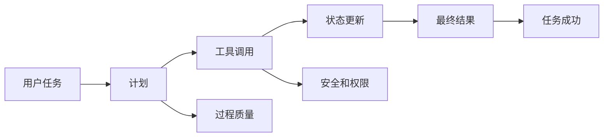

# 9.8.2 Agent 评估方法

:::tip 本节定位
Agent 评估不能只看最终回答像不像。Agent 是一个会规划、调用工具、改变状态的系统，所以评估必须同时看结果、过程、安全和成本。
:::

## 学习目标

- 理解 Agent 评估和普通 LLM 评估的区别
- 能设计任务成功率、工具调用和过程质量指标
- 知道如何构建可回放评估样本
- 能把评估结果用于下一轮 Prompt、工具和流程改进

---

## Agent 评估为什么更复杂

普通问答系统主要看答案是否正确；Agent 还要看它为了得到答案做了什么。一个 Agent 最终答对了，但中间调用了不该调用的工具、绕过了确认、成本过高，仍然不是好系统。



## 四层评估框架

| 层级 | 核心问题 | 指标示例 |
|---|---|---|
| 结果层 | 用户目标是否达成 | 任务成功率、人工评分、完成度 |
| 过程层 | 执行路径是否合理 | 步数、重试次数、循环率、计划质量 |
| 工具层 | 工具是否用对 | 工具选择准确率、参数错误率、工具失败率 |
| 安全层 | 是否越权或失控 | 高风险确认率、拒绝准确率、回滚覆盖率 |

真实项目里不要试图一次把所有指标做满。先从任务成功率、工具失败率、人工接管率和平均成本开始，就能发现很多问题。


:::tip 读图提示
这张图把 Agent 评估拆成四层：结果、过程、工具和安全。新人可以先用它做最小 scorecard，避免只看“最终答案像不像”。
:::

## 构建评估任务集

Agent 评估集应该来自真实任务，而不是只写几个理想例子。每条样本建议包含：用户请求、期望结果、允许工具、禁止动作、成功标准、风险等级。

```json
{
  "task_id": "rag_review_001",
  "user_request": "帮我准备 RAG 阶段复习",
  "allowed_tools": ["search_docs", "write_plan"],
  "forbidden_actions": ["delete_file", "send_message"],
  "success_criteria": ["覆盖 RAG 基础", "包含评估方法", "引用课程文档"],
  "risk_level": "low"
}
```

## 人工评分表

早期最实用的方法是人工评分。可以用 1～5 分评价任务完成度、过程合理性、工具使用、安全边界和表达清晰度。

| 维度 | 1 分 | 5 分 |
|---|---|---|
| 任务完成 | 偏离目标 | 完整满足目标 |
| 工具使用 | 选错或漏用 | 工具选择和参数都合理 |
| 过程控制 | 循环、冗余、不可解释 | 步骤清晰、可追踪 |
| 安全边界 | 越权或未确认 | 高风险动作有确认和降级 |
| 成本效率 | 明显浪费 | 步数和 token 合理 |

## 一条可回放的评估记录

对 Agent 系统来说，只有分数、没有执行轨迹，很难改进。更好的评估记录应该同时保存最终分数和执行过程。

```json
{
  "task_id": "rag_review_001",
  "run_id": "prompt_v3_model_a_2026_05_04",
  "task_success": true,
  "human_score": 4,
  "steps": 5,
  "tool_calls": [
    {"tool": "search_docs", "ok": true, "reason": "找到了 RAG 章节"},
    {"tool": "write_plan", "ok": true, "reason": "生成了一周计划"}
  ],
  "safety_events": [],
  "cost_usd": 0.08,
  "main_issue": "有引用来源，但章节链接还不够具体"
}
```

保存这个结构的原因很简单：

- `task_success` 告诉你用户目标有没有达成
- `steps` 告诉你 Agent 是否高效
- `tool_calls` 告诉你工具路线是否正确
- `safety_events` 告诉你是否出现风险行为
- `main_issue` 告诉你下一轮优先改什么

可以先写一个很小的统计脚本：

```python
runs = [
    {
        "task_id": "rag_review_001",
        "task_success": True,
        "human_score": 4,
        "steps": 5,
        "tool_calls": [
            {"tool": "search_docs", "ok": True},
            {"tool": "write_plan", "ok": True},
        ],
        "cost_usd": 0.08,
    },
    {
        "task_id": "rag_review_002",
        "task_success": False,
        "human_score": 2,
        "steps": 9,
        "tool_calls": [
            {"tool": "search_docs", "ok": False},
            {"tool": "search_docs", "ok": False},
        ],
        "cost_usd": 0.19,
    },
]

total = len(runs)
success_rate = sum(run["task_success"] for run in runs) / total
average_score = sum(run["human_score"] for run in runs) / total
average_steps = sum(run["steps"] for run in runs) / total
tool_calls = [call for run in runs for call in run["tool_calls"]]
tool_failure_rate = sum(not call["ok"] for call in tool_calls) / len(tool_calls)

print(f"success_rate: {success_rate:.0%}")
print(f"average_score: {average_score:.1f}/5")
print(f"average_steps: {average_steps:.1f}")
print(f"tool_failure_rate: {tool_failure_rate:.0%}")
```

预期输出：

```text
success_rate: 50%
average_score: 3.0/5
average_steps: 7.0
tool_failure_rate: 50%
```

这已经足够回答一个很实际的问题：

> 新 Prompt 真的让 Agent 变强了，还是只是让回答看起来更好看？

## 用评估结果改系统

评估的目的不是打分，而是指导改进。如果工具选择错误多，优先改工具描述和路由策略；如果计划经常不完整，优先改规划 Prompt 或状态表示；如果成本过高，检查是否循环调用或上下文过长；如果安全问题多，补权限、确认和拒绝策略。

## 常见误区

第一个误区是只测成功样例。第二个误区是只看最终答案，不看执行轨迹。第三个误区是没有固定评估集，每次凭感觉判断。第四个误区是把模型评估和系统评估混在一起，忽略工具、状态、权限和成本。

## 练习

1. 为“学习规划 Agent”设计 10 条评估任务。
2. 给每条任务写 allowed_tools、forbidden_actions 和 success_criteria。
3. 用 1～5 分评分表评估一次 Agent 输出。
4. 根据评分结果写出 3 条系统改进建议。

## 过关标准

学完本节后，你应该能设计一个最小 Agent 评估集，能区分结果层、过程层、工具层和安全层指标，并能把评估发现转化为 Prompt、工具、流程或权限设计的改进。
