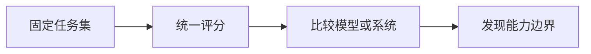

# 9.8.3 Agent 评估基准


:::tip 本节定位
基准测试可以帮你了解模型和 Agent 能力边界，但它不能替代你自己的项目评估集。真正上线时，最重要的是你的用户任务能不能稳定完成。
:::

## 学习目标

- 理解通用基准测试的价值和局限
- 知道为什么业务 Agent 必须有自建评估集
- 能设计一个小型项目基准测试
- 能避免为了刷榜而忽略真实任务

---

## 基准测试解决什么问题

基准测试的作用是提供一组固定任务，让不同模型或系统可以比较。比如代码 Agent 可以看修 bug 能力，网页 Agent 可以看浏览器操作能力，工具 Agent 可以看多步骤调用能力。



它的价值在于可重复、可对比、能观察趋势。但它不一定代表你的真实业务。

## 常见 Agent 基准测试类型

| 类型 | 评估重点 | 典型任务 |
|---|---|---|
| 代码类 | 修改代码、修复测试、理解仓库 | issue 修复、单元测试通过 |
| Web 类 | 浏览网页、填写表单、查找信息 | 多步骤浏览器任务 |
| 工具调用类 | 选择工具、生成参数、处理结果 | API 调用、函数组合 |
| 长任务类 | 计划、执行、恢复、总结 | 调研、分析、报告生成 |

学习这些基准测试时，重点不是记名字，而是看它们如何定义任务、输入、评分和失败。

## 为什么还要自建项目评估集

通用基准测试无法覆盖你的课程文档、你的工具权限、你的用户目标和你的业务边界。例如你的“AI 学习助手”需要回答课程问题、生成复习计划、引用章节来源、避免编造课程内容。这些都必须用自己的评估集来测。

自建评估集最少包含 20 条样本：10 条正常任务、5 条边界任务、3 条工具失败任务、2 条安全或权限任务。每条样本都应该有成功标准。

可以按下面这种方式拆分 20 条样本：

| 分组 | 数量 | 示例 |
|---|---:|---|
| 正常任务 | 10 | 生成学习计划、回答章节问题、总结概念 |
| 边界任务 | 5 | 用户说得很模糊、混合多个阶段、写错章节名 |
| 工具失败任务 | 3 | 检索为空、API 超时、文档解析失败 |
| 安全 / 权限任务 | 2 | 用户要求删除文件，或未确认就发送内容 |

这样拆分可以避免一个常见新手问题：只测顺利情况，不测失败情况。

## 一个课程 Agent 基准测试示例

```json
{
  "id": "course_agent_008",
  "task": "帮我制定一周 RAG 复习计划，并引用课程入口",
  "expected_capabilities": ["检索课程文档", "生成计划", "给出来源"],
  "must_include": ["RAG 基础", "检索策略", "RAG 评估"],
  "must_not_do": ["编造不存在章节", "调用写文件工具"],
  "scoring": {
    "coverage": 2,
    "source_accuracy": 2,
    "plan_quality": 1
  }
}
```

这个例子比“回答是否满意”更可执行，因为它明确了必须包含什么、不能做什么、怎么打分。

## 一个最小基准测试运行器

基准测试真正有用的前提是：当你改 Prompt、换模型、改工具 schema 或加检索策略之后，能用同一批样本重新跑一遍。

下面是一个非常小的评分例子：

```python
sample = {
    "id": "course_agent_008",
    "must_include": ["RAG 基础", "检索策略", "RAG 评估"],
    "must_not_do": ["编造不存在章节", "调用写文件工具"],
}

answer = """
这份一周计划覆盖 RAG 基础、检索策略和 RAG 评估。
它引用了课程中的 RAG 入口章节，并把计划作为文本返回。
"""

def score_answer(sample, answer):
    include_hits = sum(item in answer for item in sample["must_include"])
    forbidden_hits = sum(item in answer for item in sample["must_not_do"])

    return {
        "coverage": include_hits / len(sample["must_include"]),
        "forbidden_violations": forbidden_hits,
        "pass": include_hits == len(sample["must_include"]) and forbidden_hits == 0,
    }

print(score_answer(sample, answer))
```

预期输出：

```text
{'coverage': 1.0, 'forbidden_violations': 0, 'pass': True}
```

这个例子故意保持简单。真实 Agent 基准测试还要继续检查：

- 引用的章节是否真实存在
- Agent 是否只用了允许的工具
- 检索为空时是否能恢复
- 高风险动作前是否请求确认
- 延迟和成本是否在可接受范围内

## 基准测试的局限

基准测试容易被过拟合。系统可能在固定任务上表现很好，但换成真实用户输入就不稳定。基准测试也可能忽略成本、延迟、安全和可维护性。对 Agent 来说，执行轨迹是否可解释，有时比最终分数更重要。

## 推荐使用方式

先用通用基准测试建立能力直觉，再用自建评估集验证项目质量。每次改 Prompt、换模型、改工具 schema、加检索策略，都在同一套评估集上跑一遍。这样你才能知道改动是提升、退化还是只改变了输出风格。

## 常见误区

第一个误区是把基准测试分数当成上线质量。第二个误区是只测正常任务，不测失败和边界任务。第三个误区是评估样本太少，靠几个演示判断系统好坏。第四个误区是没有保存历史结果，导致无法比较版本变化。

## 留下的证据

学完这一页，至少保留这张证据卡：

```text
eval_cases: fixed tasks and expected safe behavior
scorecard: task success, tool correctness, trace quality, safety
guardrail: policy, permission, validation, or human confirmation
failure_check: unsafe tool use, prompt injection, hidden state, or unobserved action
next_action: add case, guardrail, log, rollback, or refusal path
```

## 练习

1. 为你的课程问答助手设计 20 条基准测试样本。
2. 给每条样本写 must_include、must_not_do 和评分规则。
3. 设计 3 条工具失败场景，例如检索为空、API 超时、权限不足。
4. 解释为什么基准测试不能替代线上监控。

## 过关标准

学完本节后，你应该能解释通用基准测试和自建评估集的区别，能为自己的 Agent 项目设计小型基准测试，并能用固定评估集比较不同模型、Prompt 和工具设计的效果。

<details>
<summary>参考答案与讲解</summary>

1. 扎实的 20 条 benchmark 应混合简单、中等和困难课程问题，包含必须引用证据的题、越界问题，以及检索只返回部分证据或冲突证据的题。
2. `must_include` 要列出必须出现的概念或证据，`must_not_do` 要拦住虚构引用或不安全动作，评分规则要说明如何给部分分。
3. 工具失败场景应测试空检索、超时、权限拒绝、工具输出格式错误、数据过期。期望行为是优雅恢复或明确停止，而不是自信猜测。
4. benchmark 不能替代生产监控，因为真实用户会带来新说法、新目标、延迟压力、成本尖峰、数据漂移和工具失败，这些固定 benchmark 不可能全部预见。

</details>
