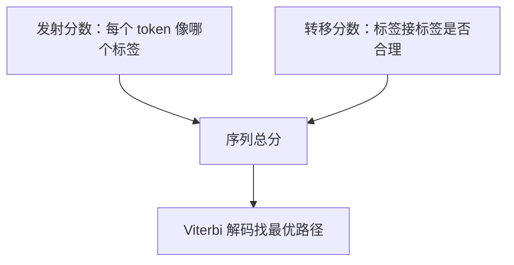

# 11.4.4 BiLSTM + CRF


:::tip 读图提示
BiLSTM 负责给每个 token 做上下文表示，CRF 负责在所有可能标签路径里挑最合理的一条。读图时重点看“单点得分”和“标签转移约束”怎样一起决定最终 BIO 序列。
:::

:::tip 本节定位
NER 不是给每个 token 独立分类那么简单。标签之间有约束，例如 `I-PER` 通常不能凭空出现在句首。BiLSTM + CRF 的价值，就是同时看上下文和标签序列是否合法。
:::

## 学习目标

- 理解 BiLSTM 在序列标注中负责什么
- 理解 CRF 为什么能建模标签转移约束
- 知道 BIO 标签体系下哪些预测是不合理的
- 能解释 BiLSTM + CRF 和普通 token 分类的差异

---

## 先看整体结构


BiLSTM 负责理解上下文，CRF 负责选择整体最合理的标签路径。两者结合后，模型不只是问“这个 token 像不像实体”，还会问“这一整串标签连起来是否合理”。

## 一、为什么普通 token 分类不够

假设使用 BIO 标签体系：`B-PER` 表示人名开头，`I-PER` 表示人名内部，`O` 表示非实体。如果模型独立预测每个 token，就可能输出这样的标签：

```text
我   爱   北京
O   I-LOC B-LOC
```

这里 `I-LOC` 出现在实体开头位置，通常是不合理的。普通分类器很难显式约束这种标签转移，而 CRF 可以学习标签之间的转移分数。

## 二、BiLSTM 负责上下文表示

LSTM 可以按顺序读取文本，BiLSTM 则同时从左到右和从右到左读取。这样每个 token 的表示都包含前后文信息。

例如“苹果”在不同句子里可能是水果，也可能是公司。BiLSTM 的作用就是让当前位置看到周围词，从而减少歧义。

## 三、CRF 负责整体解码

CRF 会同时考虑两类分数：每个位置属于某个标签的发射分数，以及标签之间的转移分数。最终预测时，它不是逐个位置贪心选择，而是寻找整条序列总分最高的标签路径。



这就是为什么 CRF 特别适合 NER、词性标注、分词这类标签之间有结构约束的任务。

## 四、一个最小直觉例子

```python
labels = ["B-PER", "I-PER", "O", "B-LOC", "I-LOC"]

# 简化版：人为定义一些不合理转移
invalid_transitions = {
    ("O", "I-PER"),
    ("O", "I-LOC"),
    ("B-PER", "I-LOC"),
    ("B-LOC", "I-PER"),
}

path = ["O", "I-LOC", "B-LOC"]

for a, b in zip(path, path[1:]):
    if (a, b) in invalid_transitions:
        print("不合理转移:", a, "->", b)
```

预期输出：

```text
不合理转移: O -> I-LOC
```

局部 token 分类器可能给出 `I-LOC`，但从整条路径看它很可疑：位置实体的内部标签通常应该接在 `B-LOC` 或 `I-LOC` 后面。

真实 CRF 不是靠手写规则，而是从训练数据中学习哪些标签转移更合理。这个例子只是帮助你建立“标签之间有关系”的直觉。

## 五、和 BERT token classification 的关系

现代 NER 经常直接用 BERT 加线性分类层，也可以在 BERT 后面接 CRF。BERT 的上下文表示能力通常强于 BiLSTM，但 CRF 对标签约束仍然有价值，尤其在数据量较小、标签格式严格、实体边界容易错的任务里。

## 留下的证据

学完这一页，至少保留这张证据卡：

```text
schema: entity types, BIO tags, or sequence-label rules
prediction: token-level labels and extracted spans
metric: entity precision/recall/F1 and boundary cases
failure_check: span boundary, nested entity, unknown word, or inconsistent annotation
Expected_output: gold-vs-predicted span table with at least one miss
```

## 常见误区

第一个误区是把 CRF 当成过时模型。它不一定是最强方案，但标签约束思想仍然重要。第二个误区是只看 token 级准确率，不看实体级 F1。NER 最终关心的是实体边界和类型是否完整正确。第三个误区是忽略 BIO 标注一致性，导致训练数据本身就有非法标签序列。

## 练习

1. 写出一句中文句子的 BIO 标签，并检查是否存在非法 `I-*` 开头。
2. 比较“逐 token 分类”和“整体序列解码”的差异。
3. 思考：为什么实体级 F1 比 token accuracy 更适合 NER？
4. 如果用 BERT 做 NER，还需不需要 CRF？列出支持和反对理由。

<details>
<summary>参考答案与讲解</summary>

1. 写中文 BIO 示例时，先确定分词/切字单位，再检查没有实体以 `I-*` 开头，并且每个 `I-*` 前面都有匹配的 `B-*` 或 `I-*`。
2. 逐 token 分类是每个位置独立打分；全局序列解码是在整句范围内选择最合理、合法的标签路径。
3. 实体级 F1 比 token accuracy 更适合 NER，因为一个边界错误就可能让抽出的实体不可用，即使大多数 token 看起来正确。
4. BERT 可以不接 CRF，但 CRF 仍可帮助约束合法转移和实体边界一致性；代价是复杂度更高，简单数据上未必需要。

</details>

## 过关标准

学完本节后，你应该能解释 BiLSTM 和 CRF 各自负责什么，能识别 BIO 标签中的非法转移，能说明为什么序列标注要考虑标签之间的依赖，并能把这个思想迁移到后续的结构化信息抽取任务。
