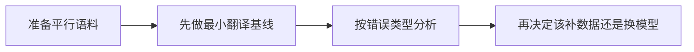

# 11.5.4 机器翻译实战【选修】


:::tip 读图提示
翻译项目不是只看一句结果顺不顺。读图时把平行语料、baseline、漏译、错译、词序问题、术语一致性和人工评估连起来看，才能真正知道系统哪里在进步。
:::

:::tip 本节定位
翻译是 Seq2Seq 最经典的任务。
它很适合用来练习一整条“输入文本 -> 输出文本”的项目闭环。

这节课不会硬上大模型训练，
而是先把最关键的项目结构做清楚：

- 数据对长什么样
- 最小翻译系统怎么跑
- 错误应该怎么看
:::

## 学习目标

- 理解一个翻译项目的最小组成
- 学会从平行语料对组织数据
- 通过可运行示例建立最小翻译基线
- 学会做简单的翻译错误分析

---

## 先建立一张地图

机器翻译实战这节最适合新人的理解顺序不是“先换更强模型”，而是先看清项目闭环：



所以这节真正想解决的是：

- 翻译项目到底该怎么推进
- 为什么错误分析会比盲目上大模型更重要

### 一个更适合新人的总类比

你可以把机器翻译项目想成：

- 两个人在做双语对照笔记

一边写源语言，另一边写目标语言。
真正困难的地方不只是“查到对应词”，而是：

- 这句话该怎么重组
- 哪些词不能逐字翻
- 哪些表达必须看上下文

这样理解后，为什么翻译任务天然适合 Seq2Seq，会直观很多。

## 一、机器翻译任务最核心的输入输出是什么？

### 输入

- 源语言句子

### 输出

- 目标语言句子

### 为什么这类任务特别适合 Seq2Seq？

因为：

- 输入和输出都不是固定长度
- 两边存在顺序和语义映射

这正是 Seq2Seq 的典型场景。

---

## 二、先看一个最小平行语料集

```python
parallel_data = [
    ("hello", "你好"),
    ("world", "世界"),
    ("i love ai", "我 爱 AI"),
    ("study hard", "努力 学习"),
]

for src, tgt in parallel_data:
    print(src, "->", tgt)
```

预期输出：

```text
hello -> 你好
world -> 世界
i love ai -> 我 爱 AI
study hard -> 努力 学习
```

把每一行都当成一个对齐训练样本。源句和目标句必须表达同一个意思，否则模型学到的就是噪声。

### 为什么平行语料是翻译项目的基础？

因为模型最终需要学习的是：

- 源语言 -> 目标语言

没有这类对齐数据，翻译任务就无从开始。

### 新人第一次做翻译项目，数据怎么选更稳？

更稳的起步通常是：

- 先做短句
- 先做主题比较窄的语料
- 先用高质量小数据建立闭环

这样会比一开始就上大而杂的语料更容易看清问题。

### 一个新人可直接照抄的数据检查表

第一次做翻译项目时，最值得先检查的是：

1. 源句和目标句是否真的一一对应
2. 句子长度是不是差太多
3. 主题是否过杂
4. 同一个词或短语是否有很多冲突翻法

因为如果这些问题一开始不看，
后面你很容易把数据问题误以为是模型问题。

---

## 三、先跑一个最小翻译基线

```python
parallel_data = [
    ("hello", "你好"),
    ("world", "世界"),
    ("i", "我"),
    ("love", "爱"),
    ("study", "学习"),
]

phrase_table = {src: tgt for src, tgt in parallel_data}


def translate(sentence):
    tokens = sentence.split()
    output = [phrase_table.get(tok, "<unk>") for tok in tokens]
    return " ".join(output)


tests = [
    "hello world",
    "i love study",
    "love ai",
]

for sent in tests:
    print(sent, "->", translate(sent))
```

预期输出：

```text
hello world -> 你好 世界
i love study -> 我 爱 学习
love ai -> 爱 <unk>
```

这里最值得看的线索是 `<unk>`：baseline 没有 `ai` 这个词的映射，所以翻不出来。这是词表覆盖问题，不是 decoder 写错。

### 这个例子为什么仍然值得做？

因为它先帮你抓住翻译项目最底层的形式：

- 数据对
- 映射规则
- 输出质量

### 它的局限也很明显

- 不会处理词序变化
- 不会处理多义词
- 遇到未知词就 `<unk>`

也正因为这些局限明显，
你更容易理解为什么后面需要更强模型。

### 为什么最小基线反而很有教学价值？

因为它会逼你真正看到：

- 词序问题
- 未知词问题
- 上下文歧义问题

这些都是后面注意力和 Transformer 要继续解决的点。

### 第一次做翻译项目，为什么不要嫌 baseline 太弱？

因为 baseline 越简单，错误来源越容易解释。

例如：

- `<unk>` 太多，说明词表覆盖不够
- 词序乱，说明模型没有真正学到序列映射
- 逐词翻译味很重，说明上下文能力不足

这会比一开始就上复杂模型更能帮助你建立项目判断力。

### 再看一个最小“翻译项目检查表”示例

```python
project_status = {
    "parallel_data_ready": True,
    "baseline_ready": True,
    "error_buckets_defined": False,
    "evaluation_examples_selected": False,
}


def next_step(status):
    if not status["parallel_data_ready"]:
        return "先把平行语料对整理干净。"
    if not status["baseline_ready"]:
        return "先做最小 baseline。"
    if not status["error_buckets_defined"]:
        return "先把错误类型分成漏译、错译、词序问题。"
    if not status["evaluation_examples_selected"]:
        return "先挑一组展示样例。"
    return "可以继续升级模型。"


print(next_step(project_status))
```

预期输出：

```text
先把错误类型分成漏译、错译、词序问题。
```

这能让项目闭环更实际：先定义怎么命名和检查错误，再考虑换模型。

这个例子很小，但它非常适合初学者，因为它会提醒你：

- 项目推进不只是“换模型”
- 还包括数据、错误分析和展示骨架

---

## 四、翻译项目该怎么做错误分析？

### 常见错误一：漏译

例如某个词直接没翻出来。

### 常见错误二：错译

例如一个词翻到了错误义项。

### 常见错误三：词序不自然

这是最小词典基线特别容易出现的问题。

### 一个极简错误检查

```python
parallel_data = [
    ("hello", "你好"),
    ("world", "世界"),
    ("i", "我"),
    ("love", "爱"),
    ("study", "学习"),
]

phrase_table = {src: tgt for src, tgt in parallel_data}


def translate(sentence):
    tokens = sentence.split()
    output = [phrase_table.get(tok, "<unk>") for tok in tokens]
    return " ".join(output)


gold = {
    "hello world": "你好 世界",
    "i love study": "我 喜欢 学习",
}

for src, expected in gold.items():
    pred = translate(src)
    print({
        "src": src,
        "pred": pred,
        "gold": expected,
        "match": pred == expected,
    })
```

预期输出：

```text
{'src': 'hello world', 'pred': '你好 世界', 'gold': '你好 世界', 'match': True}
{'src': 'i love study', 'pred': '我 爱 学习', 'gold': '我 喜欢 学习', 'match': False}
```

第二条说明了最小 baseline 的典型局限：逐词翻译可能能看懂，但表达可能不够自然，或没有达到参考译文的语义效果。

### 一个更适合新人的错误分析框架

做翻译错误分析时，可以先按这三类分：

1. 漏译
2. 错译
3. 词序或表达不自然

这样你更容易知道：

- 是数据问题
- 还是模型表达能力问题

### 一个很适合展示在作品集里的对比方式

很推荐直接并排展示：

- 原句
- baseline 输出
- 目标输出
- 错误类型标签

这样项目会显得非常清楚，不像只是“跑了个模型”。

### 如果你第一次做翻译项目，最稳的错误分桶方式

最稳的做法通常是只先分三类：

1. 漏译
2. 错译
3. 词序或表达不自然

因为对新人来说，这三类已经足够帮助你判断：

- 该补数据
- 该改表示
- 还是该换更强模型

---

## 五、从这个最小项目往后升级，可以怎么走？

### 加更多平行语料

### 引入注意力和神经 Seq2Seq

### 再进一步走向 Transformer

所以这个小项目的意义，不在于它本身够强，
而在于它让你看清：

- 翻译项目的基本骨架

### 第一次升级项目时，更建议先补什么？

通常更建议先补：

1. 数据覆盖
2. 错误分析
3. 注意力或更强模型

这样会比一开始就盲目换更大模型更稳。

### 什么时候更适合补数据，而不是换模型？

如果你发现问题主要来自：

- 词表覆盖太差
- 训练样本太少
- 某类表达几乎没见过

那通常应该先补数据，而不是先换模型。

## 如果把它做成项目，最值得展示什么

最值得展示的通常不是：

- “我用了某个模型”

而是：

1. 平行语料示例
2. baseline 输出
3. gold 输出
4. 错误类型标签
5. 你下一步准备怎么升级

这样别人会更容易看出：

- 你在做一个完整翻译项目
- 不只是跑一个翻译 demo

---

## 六、最常见误区

### 误区一：翻译就是查字典

真实翻译远比逐词替换复杂。

### 误区二：只看一两条漂亮样例

真正项目里更重要的是系统性错误分析。

### 误区三：一开始就想直接训很大模型

更稳的做法通常是先把数据和基线结构理清。

## 小结

这节最重要的是把翻译项目看成：

> **一个围绕平行语料、映射学习和错误分析展开的典型 Seq2Seq 项目。**

先把这条闭环走顺，后面升级模型时就不会只剩“换更大模型”一种思路。

---

## 这节最该带走什么

- 机器翻译项目首先是数据对和错误分析项目
- 最小词典基线虽然弱，但特别适合建立项目判断力
- 先把错误类型看清，再决定升级路线，会更像真正项目

---

## 练习

1. 自己再补 5 组词对，扩展这个小词典基线。
2. 为什么最小翻译基线特别容易出词序问题？
3. 想一想：什么错误是词典基线无论如何都很难解决的？
4. 如果你要升级这个项目，第一步会先补数据还是先换模型？为什么？
