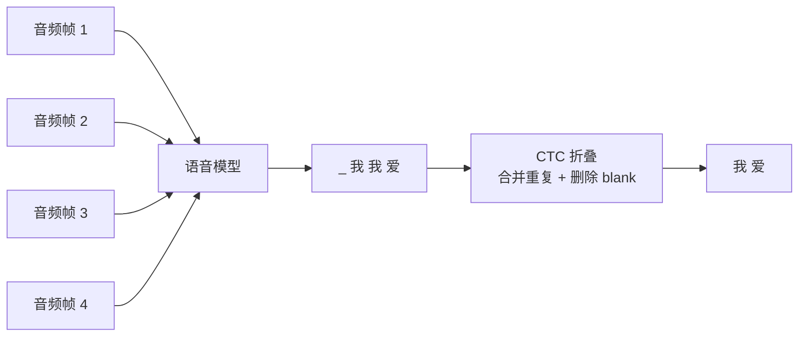

# 11.5.5 CTC 与 Deep Speech：语音识别里的序列对齐


:::tip 本节定位
这一节是 Seq2Seq 的扩展：它帮你理解语音识别为什么不能简单按“一帧音频对应一个字”训练。

最核心的一句话是：

> **CTC 解决的是输入很长、输出较短，而且两者没有精确对齐标注时，模型怎样仍然可以训练。**
:::

## 一、语音识别为什么比文本分类更麻烦？

文本分类通常是：

```text
一句话 -> 一个标签
```

机器翻译通常是：

```text
一串 token -> 另一串 token
```

但语音识别是：

```text
一长串音频帧 -> 一串文字
```

问题在于：

- 音频帧很多，文字 token 较少
- 一个字会持续多个音频帧
- 训练数据通常只告诉你整句转写，不告诉你每一帧对应哪个字

这就是序列对齐难题。

可以先把困难想象成这样：



模型看到的是很多很短的时间片，标签只给最终句子。CTC 就是在这两者之间搭桥。

## 二、CTC 的核心直觉：允许模型先输出带空白和重复的路径

CTC 引入了一个特殊符号 blank。
模型可以先输出一条更长的路径，然后通过“去重复、去 blank”得到最终文本。

例如：

```text
模型路径：_ 我 我 _ 爱 爱 _ AI _
折叠结果：我 爱 AI
```

这件事让模型不必提前知道：

- “我”到底从第几帧开始
- “爱”到底持续多少帧
- 哪些帧只是停顿或过渡

它只需要学会：所有能折叠成正确文本的路径，整体概率要变大。

## 三、Deep Speech 为什么是重要节点？

Deep Speech 代表了端到端语音识别进入深度学习时代的一条重要路线。

传统 ASR 系统往往由很多模块组成：

- 声学模型
- 发音词典
- 语言模型
- 解码器

Deep Speech 这类工作推动了更端到端的思路：

> **直接从音频特征学习到文本输出，把复杂流水线压进可训练模型里。**

对初学者来说，不需要一开始复现完整 ASR 系统。
先理解它为什么重要就够了：

- 它让语音识别更像一个统一训练问题
- CTC 让未对齐序列也能训练
- 后来的 Whisper 等模型继续把语音识别推向更通用的预训练路线

## 四、一个极简折叠示例

```python
def ctc_collapse(path, blank="_"):
    result = []
    prev = None

    for token in path:
        if token != blank and token != prev:
            result.append(token)
        prev = token

    return result

path = ["_", "我", "我", "_", "爱", "爱", "_", "AI", "_"]
print(ctc_collapse(path))
```

输出会接近：

```text
['我', '爱', 'AI']
```

这个例子不能替代 CTC 公式，但能帮你先建立直觉：

> **模型可以先给出帧级长路径，再折叠成最终短文本。**

## 五、一个可以运行的极简对齐搜索

CTC 的关键不是“只有一条正确路径”，而是很多路径都可以折叠成同一个文本。训练时，CTC 会把这些合法路径的概率合起来看。

下面这个小程序会枚举哪些短路径可以变成 `["我", "爱"]`：

```python
from itertools import product

def ctc_collapse(path, blank="_"):
    result = []
    prev = None

    for token in path:
        if token != blank and token != prev:
            result.append(token)
        prev = token

    return result

vocab = ["_", "我", "爱"]
target = ["我", "爱"]
valid_paths = []

for path in product(vocab, repeat=4):
    if ctc_collapse(path) == target:
        valid_paths.append(path)

print("合法路径数量:", len(valid_paths))
for path in valid_paths[:8]:
    print(path, "->", ctc_collapse(path))
```

预期输出开头类似这样：

```text
合法路径数量: 15
('_', '_', '我', '爱') -> ['我', '爱']
('_', '我', '_', '爱') -> ['我', '爱']
('_', '我', '我', '爱') -> ['我', '爱']
```

关键不是列表顺序，而是这个事实：很多帧级路径都可以折叠成同一个最终文本。

初学 CTC 时，最重要的是形成这个感觉：

- 模型不需要一开始就知道精确帧边界
- 重复 token 可以表示某个声音持续更久
- blank 可以表示停顿和过渡
- 所有能折叠成正确文本的路径都会被奖励

所以 CTC 不是让人类逐帧标注，而是让模型自己在许多可能对齐里分配概率。

## 六、CTC、Seq2Seq 和 Transformer ASR 的关系

| 方法 | 适合先怎么理解 |
|---|---|
| CTC | 不知道输入输出精确对齐时，用所有可能路径训练 |
| Seq2Seq Attention | Decoder 生成时动态关注输入位置 |
| Transformer ASR | 用更强的注意力结构建模长音频上下文 |
| Whisper | 大规模弱监督语音数据 + Transformer，让 ASR 更通用 |

这说明语音识别不是孤立方向，它和本章的 Seq2Seq、注意力、Transformer 都有连接。

## 七、把历史节点分配到课程章节

| 历史节点 | 解决的问题 | 对应课程章节 |
|---|---|---|
| CTC | 输入输出未对齐时怎样训练序列模型 | 5.5 本节、5.2 Seq2Seq |
| Deep Speech | 端到端深度语音识别路线 | 5.5 本节、12.3 语音与多模态 |
| Seq2Seq Attention | 输出每一步动态对齐输入位置 | 5.3 NLP 注意力机制 |
| Transformer ASR / Whisper | 大规模预训练语音识别 | 12 AIGC 与多模态扩展 |

## 八、学完这一节应该形成的直觉

语音识别最难的地方，不只是“声音转文字”，而是：

- 输入和输出长度不一样
- 没有逐帧对齐标注
- 语音中有停顿、拉长、重复和噪声

CTC 的漂亮之处在于：
它没有强行要求人工标注每一帧，而是让模型自己在所有可能对齐路径中学习。
