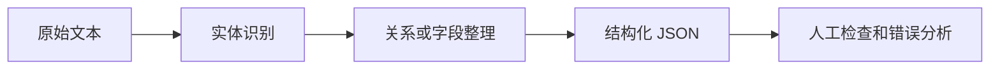

# 11.7.4 项目：信息抽取


:::tip 读图提示
信息抽取的关键是先定义 schema，再让文本稳定落到字段、实体和关系上。读图时重点看规则、NER、关系抽取、JSON 输出和人工复核如何连成可交付流程。
:::

:::tip 本节定位
信息抽取项目的目标不是让模型“读懂所有文本”，而是把文本中的关键实体、关系或字段稳定地转成结构化数据。它是传统 NLP、RAG 文档处理和 LLM 结构化输出之间的重要桥梁。
:::

## 项目目标

做一个“小型课程公告信息抽取器”：输入一段课程公告或活动通知，输出时间、地点、主题、讲师、适合人群等结构化字段。



## 最小版本

基础版可以先不训练模型，使用规则和正则完成字段抽取。例如从文本中抽取日期、时间、地点等格式较明显的信息。

```python
import re

text = "本周六 19:30 在腾讯会议举行面向 AI 应用初学者的 RAG 入门直播，主讲人是张老师。"

speaker_match = re.search(r"[\u4e00-\u9fff]老师", text)

result = {
    "time": re.findall(r"\d{1,2}:\d{2}", text)[0],
    "platform": "腾讯会议" if "腾讯会议" in text else None,
    "topic": "RAG 入门" if "RAG 入门" in text else None,
    "speaker": speaker_match.group(0) if speaker_match else None,
    "audience": "AI 应用初学者" if "AI 应用初学者" in text else None,
}

print(result)
```

预期输出：

```text
{'time': '19:30', 'platform': '腾讯会议', 'topic': 'RAG 入门', 'speaker': '张老师', 'audience': 'AI 应用初学者'}
```

这个版本虽然简单，但能帮助你理解信息抽取的核心：从非结构化文本中提取可用字段。

### 加一个字段级评估器

不要停在一个成功样例。项目要展示的是：多个输入里，每个字段是否都稳定。

```python
import re

examples = [
    {
        "text": "本周六 19:30 在腾讯会议举行 RAG 入门直播，主讲人是张老师。",
        "gold": {"time": "19:30", "platform": "腾讯会议", "topic": "RAG 入门", "speaker": "张老师"},
    },
    {
        "text": "周日 10:00 在 Zoom 举行评估指标讲解，主讲人是李老师。",
        "gold": {"time": "10:00", "platform": "Zoom", "topic": "评估指标", "speaker": "李老师"},
    },
]


def extract(text):
    time_match = re.search(r"\d{1,2}:\d{2}", text)
    speaker_match = re.search(r"[\u4e00-\u9fff]老师", text)
    platform = next((name for name in ["腾讯会议", "Zoom"] if name in text), "")
    topic = "RAG 入门" if "RAG" in text else ("评估指标" if "评估指标" in text else "")
    return {
        "time": time_match.group(0) if time_match else "",
        "platform": platform,
        "topic": topic,
        "speaker": speaker_match.group(0) if speaker_match else "",
    }


correct = 0
total = 0
for item in examples:
    predicted = extract(item["text"])
    print({"text": item["text"], "predicted": predicted})
    for field, gold_value in item["gold"].items():
        correct += int(predicted[field] == gold_value)
        total += 1

print("field_accuracy =", round(correct / total, 4))
```

预期输出：

```text
{'text': '本周六 19:30 在腾讯会议举行 RAG 入门直播，主讲人是张老师。', 'predicted': {'time': '19:30', 'platform': '腾讯会议', 'topic': 'RAG 入门', 'speaker': '张老师'}}
{'text': '周日 10:00 在 Zoom 举行评估指标讲解，主讲人是李老师。', 'predicted': {'time': '10:00', 'platform': 'Zoom', 'topic': '评估指标', 'speaker': '李老师'}}
field_accuracy = 1.0
```

这个评估器很小，但它训练的是最重要的习惯：信息抽取要按字段评估，而不是只看最终 JSON 像不像。

## 标准版本

标准版可以引入 NER 或 LLM 结构化输出。你可以用现成 NER 模型识别人名、机构、地点，再用规则或 Prompt 把结果组织成 JSON。重点不是追求完美，而是建立“抽取结果可检查”的流程。

建议输出格式如下：

```json
{
  "event_name": "RAG 入门直播",
  "time": "周六 19:30",
  "location": "腾讯会议",
  "speaker": "张老师",
  "audience": "AI 应用初学者",
  "confidence": "medium"
}
```

## 挑战版本

挑战版可以加入批量抽取和人工校验。比如输入 20 条课程公告，系统批量生成 JSON，然后人工标记哪些字段正确、哪些字段缺失、哪些字段抽错。最后统计字段级准确率。

| 字段 | 正确率 | 常见错误 |
|---|---|---|
| time | 90% | 相对时间没有标准化 |
| location | 85% | 线上平台和地点混淆 |
| speaker | 80% | 职称和姓名边界不清 |
| topic | 75% | 主题过长或遗漏关键词 |

## 和 RAG / Agent 的连接

信息抽取可以用于 RAG 的文档元数据构建。例如从课程文档中抽取阶段、章节、关键概念、适合人群，然后作为检索过滤条件。它也可以作为 Agent 的工具：当 Agent 需要整理会议、合同、工单或课程资料时，先抽取结构化字段，再做后续决策。

## 项目交付物

README 中建议包含：项目目标、输入样例、输出 JSON schema、抽取方法、字段解释、评估方式、失败样本和下一步计划。作品集展示时，最好放一组“原文 -> JSON -> 人工修正”的对照表。

## 留下的证据

学完这一页，至少保留这张证据卡：

```text
task_output: label, entity fields, summary, answer, retrieval result, or semantic graph
artifacts: raw text, processed text, predictions, metrics, and failure cases
metric: accuracy/F1, precision/recall, retrieval hit rate, faithfulness, or schema validity
failure_check: unclear labels, over-cleaning, boundary errors, hallucination, or unsupported answer
Expected_output: reproducible text pipeline folder with metrics and examples
```

## 常见误区

第一个误区是只展示成功样例，不做字段级评估。第二个误区是 JSON schema 不稳定，导致后续程序无法使用。第三个误区是忽略边界问题，例如“张老师将在北京大学分享”里，北京大学可能是地点，也可能是机构。第四个误区是把 LLM 输出直接入库，不做校验。


## 版本路线建议

| 版本 | 目标 | 交付重点 |
|---|---|---|
| 基础版 | 跑通最小闭环 | 能输入、能处理、能输出，并保留一组示例 |
| 标准版 | 形成可展示项目 | 增加配置、日志、错误处理、README 和截图 |
| 挑战版 | 接近作品集质量 | 增加评估、对比实验、失败样本分析和下一步路线 |

建议先完成基础版，不要一开始就追求大而全。每提升一个版本，都要把“新增了什么能力、怎么验证、还有什么问题”写进 README。

## 练习

1. 设计一个课程公告抽取 JSON schema。
2. 用 5 条样例公告测试规则抽取，记录每个字段是否正确。
3. 找 3 个抽取失败案例，分析是实体边界错、字段缺失还是 schema 设计不清。
4. 思考：这些结构化字段如何帮助后续 RAG 检索？

<details>
<summary>参考答案与讲解</summary>

1. 课程公告 schema 可以包含 `course`、`date`、`deadline`、`task`、`location_or_url`、`target_audience`、`required_action`。
2. 评估每个样本时按字段看：正确、缺失、边界错、类型错，或原文不支持。
3. 分析 3 个失败案例时，把实体边界错、缺字段和 schema 设计不清分开；每类修法不同。
4. 结构化字段能帮助 RAG 做过滤、路由、metadata search、引用分组，以及更安全的下游 Agent 动作。

</details>

## 过关标准

完成项目后，你应该能说明信息抽取和文本分类、NER 的区别，能设计稳定的输出 schema，能用字段级指标评估抽取质量，并能解释它如何服务 RAG 或 Agent 系统。
