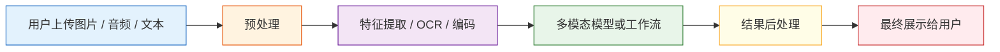

# 12.1.4 多模态应用开发


:::tip 读图提示
多模态应用不是“模型能看图”就结束。读图时重点看输入质量、OCR/VLM 分工、检索或工具调用、用户反馈、失败兜底和隐私合规如何组成真实产品链路。
:::

## 学习目标

完成本节后，你将能够：

- 识别常见多模态应用的产品形态
- 理解多模态应用的基本工程链路
- 跑通一个“图像信息 + 文本问题”的玩具应用
- 知道多模态系统上线时要重点关注哪些工程问题

---

## 一、多模态应用到底长什么样？

### 不是“为了炫酷而加图片”，而是输入真的更完整

很多任务如果只给文字，信息其实是不完整的。

比如：

- 截图报错分析
- 发票识别与问答
- 商品图搜索
- 图片审核
- 文档拍照解析

这些都天然适合多模态。

### 常见产品形态

| 形态 | 用户输入 | 系统输出 |
|---|---|---|
| 截图助手 | 截图 + 问题 | 错误解释 / 操作建议 |
| 图文客服 | 商品图 + 用户咨询 | 商品说明 / 售后建议 |
| 文档理解 | 发票 / 合同图片 + 问题 | 关键信息抽取 / 答案 |
| 教学助手 | 题目图片 + 学生提问 | 解析与提示 |

---

## 二、多模态应用的基本工程链路

### 一条很常见的处理流水线



### 为什么很多多模态应用不是“一个模型全包”？

因为真实系统常常会混合多个模块：

- OCR
- 图像分类
- VLM
- 规则判断
- 数据库查询

所以多模态应用经常不是“纯模型产品”，而是“多模块协作产品”。

---

## 三、一个可运行的玩具版截图助手

为了保证代码直接能跑，我们用结构化的图像信息来模拟视觉模块输出。

```python
image_info = {
    "type": "screenshot",
    "has_text": True,
    "ocr_text": "Error 401 Unauthorized",
    "dominant_area": "login_page"
}

def multimodal_assistant(image_info, user_question):
    user_question = user_question.lower()

    if image_info["type"] == "screenshot" and image_info["has_text"]:
        if "401" in image_info["ocr_text"] or "unauthorized" in image_info["ocr_text"].lower():
            if "怎么解决" in user_question or "what should i do" in user_question:
                return "这更像鉴权失败问题，优先检查 API Key、登录状态或权限配置。"
            return "截图中的核心错误是：401 Unauthorized。"

    return "当前无法从这张图和问题中提取足够信息。"

print(multimodal_assistant(image_info, "这是什么错误？"))
print(multimodal_assistant(image_info, "怎么解决？"))
```

预期输出：

```text
截图中的核心错误是：401 Unauthorized。
这更像鉴权失败问题，优先检查 API Key、登录状态或权限配置。
```


这个小例子已经是一个真实产品模式：先读取视觉/OCR 状态，再根据用户问题的角度回答。

这个例子虽然是玩具版，但已经体现了多模态应用的真实味道：

- 图像提供视觉上下文
- OCR 提供文字内容
- 用户问题决定回答角度

---

## 四、多模态应用为什么经常要配 OCR？

### 因为很多“看图问题”，其实同时也是“读图问题”

例如：

- 报错截图
- 合同拍照
- 发票图片
- 表单截图

这些场景里，如果不做 OCR，模型会丢掉很多关键文字信息。

### OCR 和 VLM 的分工

你可以先这样理解：

- OCR：把图里的字读出来
- VLM：把图像内容和问题一起理解

很多工程里，两者一起用比单独依赖某一个更稳。

---

## 五、一个图文商品助手的小例子

下面这个例子模拟“图片特征 + 文本需求”一起做判断。

```python
product_image_feature = {
    "color": "white",
    "style": "sport",
    "category": "shoes"
}

def match_product(image_feature, user_text):
    user_text = user_text.lower()

    if image_feature["category"] == "shoes":
        if "跑步" in user_text or "run" in user_text:
            return "这张图更像运动鞋，适合推荐跑步相关商品。"
        if "通勤" in user_text or "office" in user_text:
            return "这双鞋偏运动风，通勤场景可能不是最佳匹配。"

    return "需要更多图文信息才能进一步判断。"

print(match_product(product_image_feature, "我想找一双适合跑步的鞋"))
print(match_product(product_image_feature, "上班通勤穿合适吗"))
```

预期输出：

```text
这张图更像运动鞋，适合推荐跑步相关商品。
这双鞋偏运动风，通勤场景可能不是最佳匹配。
```


这类图文协同，在电商、推荐、客服里都很常见。

---

## 六、真实系统里最常见的工程问题

### 输入质量问题

例如：

- 图片模糊
- 截图不完整
- OCR 识别错字
- 图像分辨率太低

### 延迟与成本问题

多模态模型通常比纯文本更重。
所以要特别关注：

- 推理延迟
- 并发能力
- 每次请求成本

### 隐私与数据合规

很多图像里可能包含：

- 人脸
- 身份证
- 公司内部截图
- 合同内容

所以多模态应用往往比纯文本应用更容易碰到隐私要求。

---

## 七、一个很实用的产品设计习惯

### 别让模型独自承担所有责任

成熟系统经常会加这些机制：

- 低置信度提示
- 人工复核入口
- 来源展示
- 无法识别时主动要求补图

### 一个简单的失败兜底思路

```python
def safe_multimodal_reply(image_info, user_question):
    if not image_info.get("has_text") and "错误" in user_question:
        return "这张图里没有识别到足够文字，请上传更清晰的完整截图。"
    return multimodal_assistant(image_info, user_question)

print(safe_multimodal_reply({"type": "screenshot", "has_text": False}, "这是什么错误"))
```

预期输出：

```text
这张图里没有识别到足够文字，请上传更清晰的完整截图。
```


很多时候，一个好的兜底提示，比勉强给出错误答案更有价值。

---

## 八、什么时候值得做多模态应用？

### 很值得的信号

如果你的用户问题经常依赖这些信息：

- 图片内容
- 版面结构
- 屏幕状态
- 视觉上下文

那多模态就非常值得。

### 不一定值得的信号

如果你的任务本质上只是：

- FAQ 文本问答
- 文本搜索
- 文本总结

那先把纯文本链路做好，通常更划算。

---

## 九、初学者常见误区

### 以为多模态应用一定要直接上最复杂模型

很多时候：

- OCR + 文本模型
- 图片分类器 + 规则系统

就已经能解决不少问题。

### 以为能看图就代表系统“懂场景”

多模态模型能提取信息，不代表天然懂业务规则。

### 忽略失败场景设计

模糊图、低光照、截断截图，都是线上高频情况。

---

## 留下的证据

学完这一页，至少保留这张证据卡：

```text
源资产：带版本/来源说明的图像、截图、PDF、音频、视频或文本输入
结构化记录：可见文本、对象、区域、时间戳、转写文本或不确定性
融合结果：答案、检索记录、路由决策或多模态特征比较
失败检查：缺少来源、OCR 错误、对齐错误、不确定性或论断无依据
期望产出：可供后续引用或复查的结构化记录
```

## 小结

这一节最重要的认识是：

> 多模态应用不是“把图片喂给模型”这么简单，而是把视觉输入、文本问题、工程流程和失败兜底一起组织成可用系统。

真正好用的多模态产品，往往赢在系统设计，而不只是模型本身。

---

## 练习

1. 给玩具版截图助手再加一种错误类型，比如 `404 Not Found`。
2. 给商品助手再增加一个图片属性，比如 `material`，并扩展匹配逻辑。
3. 想一想：如果用户上传的是模糊截图，系统应如何提示用户补充信息？

<details>
<summary>操作参考与检查点</summary>

1. 一个有用的 `404 Not Found` 分支应先识别缺失的是路由还是资源，再建议检查 URL 路径、服务端路由注册、部署 rewrite 规则，以及后端是否正在运行。
2. 只有当视觉证据足够支持时才加入 `material` 属性。例如 `cotton`、`leather`、`metal` 对商品匹配有帮助，但如果图片分辨率低或风格化严重，助手应把材质标记为不确定。
3. 提示语应要求补充一两个具体缺失信号，而不是只说“图片不清楚”。例如：“请上传更清晰的截图，并包含完整报错和浏览器地址栏。”这样用户知道怎么恢复。

</details>
