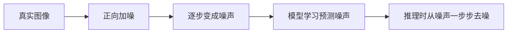

# 12.2.2 扩散模型原理


:::tip 本节定位
生成模型有很多路线：

- GAN 想一次性生成
- VAE 想学潜空间分布

扩散模型则换了一个非常特别的思路：

> **先把真实样本一步步弄脏，再学会把它一步步洗干净。**

这条思路后来成为图像生成里非常重要的一条主线。
:::

## 学习目标

- 理解为什么图像生成是高难问题
- 理解扩散模型里“加噪”和“去噪”这两个方向
- 看懂一个最小正向加噪示例
- 理解模型训练时真正学的是什么
- 建立对扩散模型整体流程的稳定直觉

## 历史背景：扩散模型是怎么变成主线的？

扩散模型不是一夜之间变成主流的。对新人来说，最值得知道的是这两个节点：

| 年份 | 论文 | 关键作者 | 它最重要地解决了什么 |
|---|---|---|---|
| 2020 | *Denoising Diffusion Probabilistic Models (DDPM)* | Ho 等 | 把扩散模型做成高质量、稳定的生成路线 |
| 2022 | *High-Resolution Image Synthesis with Latent Diffusion Models* | Rombach 等 | 把扩散从像素空间搬到潜空间，大幅降低成本，成为 Stable Diffusion 主线 |

对新人来说，最值得先记的是：

> **扩散模型之所以重要，不只是“图更好看”，而是它提供了一条比很多 GAN 路线更稳定、可控的生成主线。**

而 Latent Diffusion 则进一步解决了：

- 图像空间太大、直接扩散成本太高

所以今天你看到的很多文生图系统，本质上都站在这条历史线上。

---

## 先建立一张地图

如果你已经接受了“图像生成不是分类”的前提，这一节最自然的续接就是：

- 前面你知道系统开始从“理解输入”走向“构造输出”
- 这一节开始回答：扩散模型为什么会成为图像生成里特别重要的一条主线

所以这节真正重要的不是一堆公式，而是：

- 先把“加噪 -> 学去噪 -> 从噪声采样”这条生成链路立起来

扩散模型这节最适合新人的理解顺序不是“先背公式”，而是先看清：



所以这节真正想解决的是：

- 为什么扩散模型要先“弄脏”数据
- 训练时模型到底在学什么
- 为什么推理时要从噪声开始

## 一、为什么图像生成这么难？

### 先看分类和生成的差别

做分类时，你是在问：

- 这张图是不是猫？

做生成时，你是在问：

- 生成一张像猫的图。

这两个任务看起来只差一点，但难度完全不在一个量级。

### 真正难在哪？

因为图像空间太大了。
随便生成一堆像素，绝大多数都会看起来像噪声，而不是“合理图片”。

所以生成模型真正要学的是：

> **怎样从几乎无限的像素组合里，落到那些“像真实图像”的区域。**

扩散模型的厉害之处就在于，它没有试图一步到位，而是把问题拆成了很多个更小的去噪步骤。

### 第一次学扩散模型，最该先抓住什么？

最该先抓住的不是公式，而是这句：

> **扩散模型不是直接学“怎么画图”，而是在学“怎样一步步把噪声变回结构”。**

这句话一旦稳住，后面：

- 正向过程
- 反向过程
- 噪声预测
- 采样

都会更自然地落到同一条主线上。

---

## 二、扩散模型最核心的直觉

### 正向过程：把图像一步步加噪

如果你有一张真实图像，只要不断往里面加噪：

- 一开始还能看出结构
- 后来越来越模糊
- 最后几乎变成纯噪声

这个过程非常容易定义。

### 反向过程：学会一步步去噪

难的部分在反向：

- 给你一张带噪图
- 你要猜怎样把噪声去掉一点

如果这个动作做很多步，最后就有机会从噪声里恢复出有结构的图像。

### 一个很好记的类比

可以把它想成：

- 正向：把一张干净照片不断抹上墨
- 反向：学会怎样一点点把墨去掉

真正难的不是抹脏，而是洗回去。

### 为什么这种拆法对生成任务特别有价值？

因为它把原本非常难的一步生成问题，拆成了很多更小的局部问题：

- 当前这一步该去掉多少噪声
- 现在这张图还保留了多少结构

这也是扩散模型后来会显得“更稳但更慢”的根源之一。

---

## 三、一个最小可运行的正向加噪示例

先不用图片，先看一维向量，方便把“逐步加噪”的过程看清。

```python
import numpy as np

np.random.seed(42)

x0 = np.array([1.0, 0.5, -0.5, -1.0], dtype=np.float32)
print("x0 =", x0)

x = x0.copy()
for step in range(1, 6):
    noise = np.random.randn(*x.shape).astype(np.float32) * 0.2
    x = 0.8 * x + noise
    print(f"step {step}: {np.round(x, 3)}")
```

预期输出：

```text
x0 = [ 1.   0.5 -0.5 -1. ]
step 1: [ 0.899  0.372 -0.27  -0.495]
step 2: [ 0.673  0.251  0.099 -0.243]
step 3: [ 0.444  0.309 -0.013 -0.287]
step 4: [ 0.404 -0.135 -0.355 -0.342]
step 5: [ 0.12  -0.045 -0.466 -0.556]
```

运行后从上到下看每一行。数值不是立刻变成随机噪声，而是旧信号被逐步削弱，同时新噪声不断混入，这就是正向扩散最直观的样子。


:::tip 把每一行当成过程读
不要把输出看成六组互不相关的数组。每一行都是上一轮信号再次混入可控噪声后的状态，所以趋势比单个数字更重要。
:::

### 这段代码到底在教什么？

它在教你两个非常关键的事实：

1. 每一步都保留一部分原始结构
2. 每一步都混入一部分新的噪声

随着步数越来越多，结构会越来越不清晰。

这就是正向扩散的直觉版本。

---

## 四、为什么正向过程容易，反向过程难？

### 因为正向过程是你自己定义的

你完全知道：

- 这一步加了多少噪声
- 原信号衰减了多少

所以正向过程几乎是“人为可控”的。

### 反向过程为什么难？

因为当你只看到一个带噪样本时，你并不知道：

- 哪部分是原来的结构
- 哪部分是后面混进去的噪声

这就像你拿到一张被涂脏的纸，但不知道原来图案长什么样。

所以模型真正要学的是：

> **如何从带噪状态里预测噪声成分。**

---

## 五、训练时模型到底在学什么？

### 一个非常关键的点

扩散模型训练时，通常不是直接让模型“学画图”，而是让它学：

> 给定带噪样本，预测里面的噪声。

### 为什么这很聪明？

因为训练时噪声是你自己加进去的，所以监督信号天然就有：

- 原样本你知道
- 噪声你也知道

因此问题就变成了一个比较明确的监督学习任务。

### 这一点为什么是理解扩散模型的关键转折？

因为很多新人第一次学扩散模型时，会误以为：

- 模型是在直接学“整张图的正确样子”

但更准确的理解是：

- 训练时它更像在学一个条件去噪器

这个视角一旦稳住，后面再看 Stable Diffusion、条件生成、图像编辑就会顺很多。

### 一个最小“学习目标”示意

```python
import numpy as np

x_clean = np.array([1.0, -0.5, 0.8], dtype=np.float32)
noise = np.array([0.2, -0.1, 0.3], dtype=np.float32)
x_noisy = 0.9 * x_clean + noise

print("clean =", x_clean)
print("noise =", noise)
print("noisy =", x_noisy)
```

预期输出：

```text
clean = [ 1.  -0.5  0.8]
noise = [ 0.2 -0.1  0.3]
noisy = [ 1.1  -0.55  1.02]
```


训练时 `clean` 和 `noise` 都是已知的，因为带噪样本就是你自己构造出来的。所以扩散训练可以被组织成一个“从带噪样本预测已添加噪声”的监督学习任务。

如果模型学会了从 `x_noisy` 预测 `noise`，
它就能在推理时一步步把噪声剥离掉。

---

## 六、采样时为什么要从纯噪声开始？

### 因为推理时没有原图可用

生成时并没有 `x0`，只有噪声。

所以系统通常从：

- 一团随机噪声

开始，然后反复做：

1. 预测当前噪声
2. 去掉一点噪声
3. 得到更干净一点的状态

### 一步步去噪和一步生成的差别

GAN 更像：

- 一步直接生成

扩散模型更像：

- 逐步雕刻

这也是为什么扩散模型常常给人一种“更稳但更慢”的感觉。

---

## 七、为什么这种路线后来很强？

### 训练通常更稳

相比很多 GAN 训练里的对抗不稳定，扩散模型的训练往往更稳定一些。

### 条件化能力很自然

一旦你能在去噪过程中加入条件信息，就可以做：

- 文生图
- 图像编辑
- 局部修复

这也是它后来迅速变强的重要原因。

### 初学者第一次学扩散模型时最该先记什么

最值得先记住的是：

1. 正向过程很容易定义
2. 训练时模型主要在学“预测噪声”
3. 推理时系统是在一步步把噪声擦掉

### 为什么它会直接连到后面的 Stable Diffusion 主线？

因为后面很多具体系统虽然结构更复杂，但底层直觉并没有变：

- 还是有噪声过程
- 还是有去噪网络
- 还是在做条件化生成

所以这一节真正重要的是把“扩散式生成”的骨架立住。

---

## 八、扩散模型的代价是什么？

### 采样慢

因为不是一步生成，而是很多步去噪。

### 计算重

尤其是在高分辨率图像上，成本会比较高。

### 所以后来大家都在做什么？

主要就是两件事：

- 提高采样效率
- 降低扩散操作的空间成本

这也正好引出下一节：

> Stable Diffusion 为什么要把扩散放进 latent space。

---

## 留下的证据

学完这一页，至少保留这张证据卡：

```text
提示词记录：提示词、负面要求、参考、seed/model，以及版本号
候选输出：生成或模拟的结果及选择原因
技术备注：扩散步、潜变量、cross-attention、LoRA 或应用模式
失败检查：提示漂移、风格不匹配、产物、版权、肖像或复核失败
期望产出：选定图片/版本记录加被拒候选说明
```

## 小结

这一节最重要的不是背公式，而是抓住这条主线：

> **扩散模型不是直接学会“画图”，而是学会“怎么把带噪样本一步步去噪回有结构的样子”。**

只要这个直觉稳了，后面看 Stable Diffusion 的结构就会自然很多。

## 这节最该带走什么

- 扩散模型不是一次性生成，而是逐步去噪
- 它的训练目标比很多人想象中更像监督学习
- 这也是它后来能在图像生成里成为主线的重要原因

---

## 练习

1. 改一下本节示例里的衰减系数 `0.8`，观察结构消失速度变化。
2. 用自己的话解释：为什么说扩散模型训练更像“学去噪”，而不是“直接学画图”？
3. 想一想：为什么扩散模型通常会比一步生成的方法更慢？
4. 如果你要向别人解释扩散模型，怎么用“先弄脏再洗干净”的类比去讲？

<details>
<summary>参考实现与讲解</summary>

1. 衰减系数越大，结构保留越久；系数越小，结构消失越快。这个实验能帮助你看到：去噪模型必须理解每个噪声级别还剩多少信号。
2. 训练时，模型通常看到“带噪样本 + 噪声/时间条件”，学习预测噪声或还原方向。因此它学的是一连串修复步骤，而不是一次性从零画出完整图片。
3. 扩散模型通常更慢，因为生成是迭代过程。模型需要经过多步去噪不断更新样本，而 one-shot 方法尝试一次前向计算直接产生结果。
4. 可以这样解释：训练先让系统看到图片被可控噪声弄脏后的样子，再学习如何逐步清理。生成时从近似噪声开始，反复应用学到的清理规则，直到出现连贯图像。

</details>
