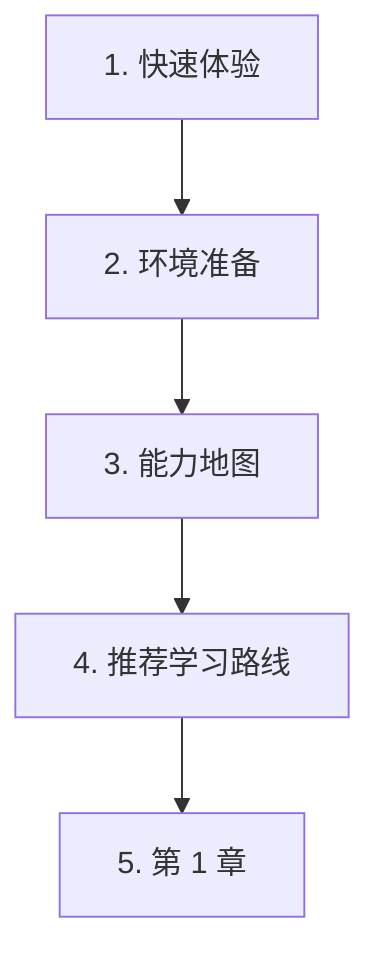

# 课程页面使用说明

这页只回答一个实际问题：**我下一步应该打开哪一页？**

如果你是新手，不要一开始就读完整个入门区。先跑一个小例子，准备最少工具，再用学习地图判断方向。

## 第一遍按这个顺序打开

| 步骤 | 页面 | 你要做什么 |
| --- | --- | --- |
| 1 | [30 分钟 AI 快速体验](/intro/quick-experience) | 先跑一个最小 AI 示例，不急着背术语。 |
| 2 | [环境准备](/intro/environment-setup) | 准备 Python、VS Code、Git 和项目文件夹，进阶工具以后再装。 |
| 3 | [AI 全栈能力地图](/intro/ai-fullstack-map) | 先看图，记住大层次即可。 |
| 4 | [推荐学习路线](/intro/learning-path) | 没有强理由时，先走默认路线。 |
| 5 | [第 1 章：开发者工具](/ch01-tools) | 开始搭一个可复现的学习工作台。 |

## 课程结构用人话说

| 部分 | 它是什么 | 怎么用 |
| --- | --- | --- |
| 入门页 | 快速体验、环境、地图、路线、术语 | 第一遍只读前几页，其余当参考资料。 |
| 阶段首页 | 说明这一阶段为什么重要、要做出什么 | 进入新阶段前读。 |
| `0.0 学习指南与任务表` | 合并学习顺序、必做任务和通关标准 | 学本阶段时一直开着对照。 |
| 编号课程页 | 讲概念、代码、输出和常见错误 | 按顺序学；有基础时也可查漏补缺。 |
| 工作坊或阶段项目 | 把本阶段内容做成可运行成果 | 放在本阶段主要理论之后做，不要一上来就做。 |
| 可选参考 | FAQ、排障、作品集、职业路线、进阶路径 | 卡住、规划项目或准备作品集时再打开。 |

## 推荐学习节奏

多数页面按这个循环学：

1. 先看图或流程。
2. 跑最小代码。
3. 对照预期输出。
4. 记录一条证据：命令、结果、错误或截图。
5. 回到项目任务继续推进。

这样课程不会变成纯阅读。目标不是“我看过这一页”，而是“我能跑出结果、解释结果，并留下证据”。

## 第一遍可以略读什么

徽章、职业路线、作品集标准、长周期计划、选修路线，第一遍都可以快速扫过。它们有用，但不是起跑线。

等你需要决定学习节奏、准备作品集、排查卡点或选择方向时，再回来读。

## 如果你迷路了

先问一个分层问题：

> 我现在卡在工具、代码、数据、模型行为、LLM 应用逻辑、Agent 动作，还是部署？

再打开对应页面：

| 卡点 | 优先打开 |
| --- | --- |
| 命令、目录、Git、Python 环境 | 第 1 章和环境准备 |
| Python 语法或脚本结构 | 第 2 章学习指南 |
| 数据文件、表格、图表 | 第 3 章学习指南 |
| 模型概念、指标、评估 | 第 4-6 章 |
| Prompt、RAG、LLM 应用行为 | 第 7-8 章 |
| Agent 步骤、工具、记忆、权限 | 第 9 章 |
| 图像、视频、多模态输出 | 第 12 章 |

拿不准时，就回到当前阶段的 `0.0 学习指南与任务表`，完成最小任务，再继续前进。
