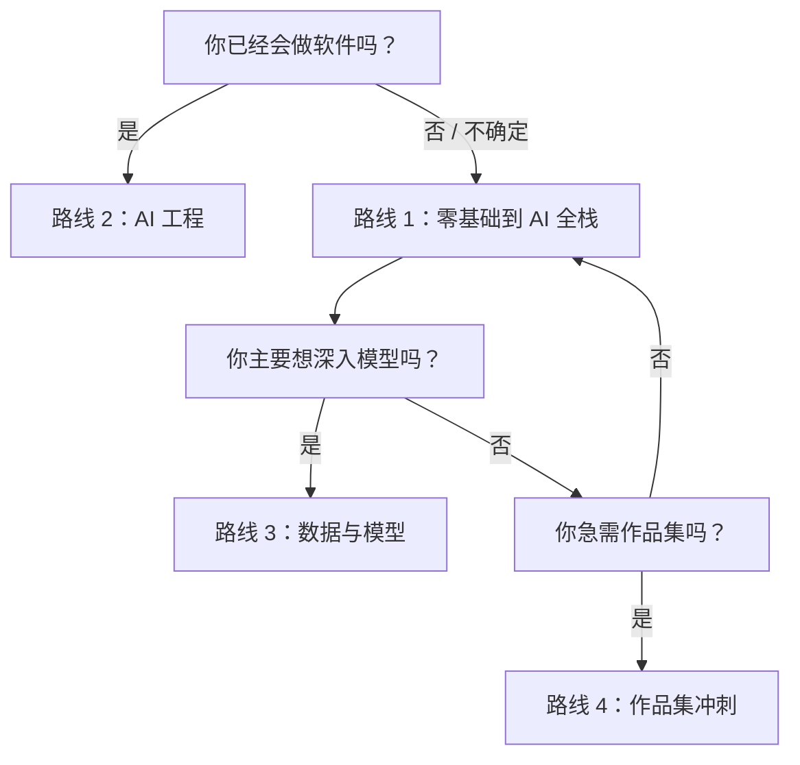

# 四条主学习路线

如果你不知道选哪条，就选 **路线 1**。它是默认路线，对大多数学习者最稳。

## 路线卡

| 路线 | 适合谁 | 第一遍重点读什么 | 第一个可见产出 |
| --- | --- | --- | --- |
| 1. 零基础到 AI 全栈 | 新手，或想完整走一遍的人 | 第 1-3 章，然后第 7-9 章 | 学习助手或课程问答 Demo |
| 2. AI 工程路线 | 已经会做软件的人 | Python 项目结构、API、RAG、Agent、部署 | 可部署 LLM 应用或自动化工具 |
| 3. 数据与模型理解路线 | 想做数据、ML、模型评估或研究辅助的人 | 数据、数学、ML、DL、评估 | 带指标和失败样本的实验报告 |
| 4. 作品集冲刺路线 | 求职、转型或快速证明能力的人 | 项目页、README、评估、Demo | 3-5 个小项目 + 1 个主项目 |

## 快速选择

不要每天切换路线。先完成一个阶段，看项目证据，再调整。

## 任意路线的最低标准

不管选哪条路线，每个阶段都应该留下：

| 证据 | 含义 |
| --- | --- |
| 运行命令 | 别人能复现 |
| 示例输入输出 | 结果看得见 |
| 失败样本 | 你知道系统在哪里会坏 |
| 评估或检查 | 项目不是碰巧成功的 Demo |
| 下一步 | 你知道如何改进 |

路线只是学习顺序。项目证据才是真正的进步证明。
