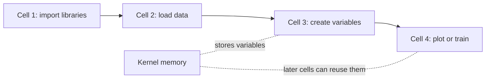

## What This Section Covers

This section introduces the interactive environment most commonly used for data analysis and AI experiments. You will learn why Notebook is great for exploration, experimentation, and presentation, why `.py` files are better for production project code, and how to create Cells, run code, write Markdown, and make plots.

## Learning Objectives

- Understand what Jupyter Notebook is and what it is used for
- Install and start Jupyter Notebook
- Master Cell types and basic operations
- Get familiar with the most commonly used shortcuts
- Learn how to use magic commands
- Understand the difference between Notebook and `.py` files

---

## What Is Jupyter Notebook?

**Jupyter Notebook is an interactive programming environment** — you can write a piece of code, run it immediately, see the result, and then write the next piece. Code, output, charts, and text explanations are all mixed together in one file.

### What Does It Look Like?

Imagine a notebook where each page (called a **Cell**) can be:
- A piece of runnable code
- A piece of Markdown text (titles, explanations, formulas)
- The output after running code (numbers, tables, charts)

They are arranged in order to form a "runnable document."

### What Scenarios Is Jupyter Best For?

| Scenario | Use Jupyter | Use .py files |
|------|:---------:|:----------:|
| Exploratory Data Analysis (EDA) | ✅ Best | ❌ |
| Plotting and visualization | ✅ Charts appear directly below | ❌ Requires a pop-up window |
| Learning and experimentation | ✅ Run step by step and learn as you go | ❌ |
| Presenting results (to your boss) | ✅ Code + charts + text in one place | ❌ |
| Production project code | ❌ | ✅ Easier to maintain |
| Debugging complex programs | ❌ | ✅ |
| Team collaboration | ❌ More merge conflicts | ✅ |

In one sentence: **Use Jupyter for learning and experiments, and use .py files for production code.** We will use Jupyter a lot in the early stages of this course.

---

## Installation and Launch

### Install

Make sure you are in the correct conda environment:

```bash
conda activate ai-course

# Install Jupyter Notebook
pip install jupyter

# (Optional) Install JupyterLab — an enhanced version of Jupyter with a more modern interface
pip install jupyterlab
```

### Launch

```bash
# Start Jupyter Notebook (classic version)
jupyter notebook

# Or start JupyterLab (recommended)
jupyter lab
```

After running this, the terminal will output something like:

```
[I 10:00:00 NotebookApp] Serving notebooks from local directory: /Users/zhangsan
[I 10:00:00 NotebookApp] http://localhost:8888/?token=abc123...
```

The browser will open automatically, and you will see the Jupyter interface.

:::tip[Using Jupyter in VS Code]
If you have installed the Jupyter extension for VS Code, you can create and run `.ipynb` files directly in VS Code without launching the browser version. Just create a new `.ipynb` file. Both approaches can be used later in the course.
:::
### Create a New Notebook

In the Jupyter interface:
1. Click **New → Python 3** in the top-right corner (classic version)
2. Or click the **+** icon on the left and choose **Python 3 Notebook** (JupyterLab)

A new blank Notebook is now created.

---

## Cell Basics

A Notebook is made up of one **Cell** after another. Each Cell has two types:

### Code Cell

Used to write and run Python code:

```python
# Cell 1: define variables
name = "AI Full-Stack Learning"
year = 2026
```

Press `Shift + Enter` to run it.

```python
# Cell 2: use the variables defined above
print(f"Welcome to the {name} course! It is now {year}.")
```

Output:

```
Welcome to the AI Full-Stack Learning tutorial! It is now 2026.
```

**Important feature:** Cells share variables. The `name` you define in Cell 1 can be used directly in Cell 2.

### Markdown Cell

Used for text explanations, headings, lists, formulas, and more. To switch:
- Select the Cell and press `M` to switch to Markdown
- Press `Y` to switch back to Code

You can write this in a Markdown Cell:

```markdown
## Step 1: Load the data

We use the **Iris dataset** for exploratory analysis.

- 150 samples
- 4 features
- 3 classes

Mathematical formula: $y = wx + b$
```

After running, it will be rendered as nicely formatted text.

### Example: A Typical Data Analysis Notebook Structure

| Part | Cell type | What it contains |
|---|---|---|
| Title and goal | Markdown | Exploratory analysis of the Iris dataset |
| Import libraries | Code | `numpy`, `pandas`, `matplotlib` |
| Load data | Code | `load_iris()`, build `df`, preview with `df.head()` |
| Data overview | Code + output | `df.describe()` and a statistics table |
| Visualization | Code + output | Scatter plot with labels and title |
| Conclusion | Markdown | Which features separate the species best |

Code, charts, and text explanations are all in one file. That is the charm of Jupyter.

---

## Kernel State: The Hidden Source of Notebook Bugs

A Notebook looks like a document, but it behaves more like a small running program. The **kernel** is the Python process behind the Notebook. It remembers variables you created earlier, even if the Cell that created them is now above, below, or already deleted.



This is powerful, but it creates a common beginner trap: the Notebook may work because you ran Cells in a special order, not because the file is complete from top to bottom.

### The reliable Notebook rule

Before you trust a Notebook, share it, or turn it into a tutorial, run this check:

1. Save the file.
2. Choose **Restart Kernel and Run All Cells**.
3. If anything fails, fix the Notebook until it can run from the first Cell to the last Cell without manual intervention.

Put imports, configuration, and data-loading code near the top. Put experiments and charts after that. Treat this as the Notebook version of "does the project still build?"

---

## Shortcuts

Jupyter has two modes:

- **Command mode** (the Cell border is blue): press `Esc` to enter, used for managing Cells
- **Edit mode** (the Cell border is green): press `Enter` to enter, used for editing content

### Command Mode Shortcuts (use after pressing Esc)

| Shortcut | Action |
|:---:|------|
| `Shift + Enter` | Run the current Cell and move to the next one (the most commonly used shortcut) |
| `Ctrl + Enter` | Run the current Cell without moving on |
| `A` | Insert a new Cell above |
| `B` | Insert a new Cell below |
| `DD` (press D twice) | Delete the current Cell |
| `M` | Change the current Cell to Markdown |
| `Y` | Change the current Cell to Code |
| `Z` | Undo Cell deletion |
| `↑` / `↓` | Move between Cells |

### Edit Mode Shortcuts (use after pressing Enter)

| Shortcut | Action |
|:---:|------|
| `Shift + Enter` | Run and move to the next one |
| `Tab` | Code completion |
| `Shift + Tab` | Show function documentation |
| `Ctrl + /` | Comment / uncomment |
| `Ctrl + Z` | Undo |

### Hands-On: Practice the Shortcuts

Create a new Notebook, then:

1. In the first Cell, type `print("Cell 1")` and press `Shift + Enter` to run it
2. Press `B` to create a new Cell below
3. Type `print("Cell 2")` and press `Ctrl + Enter` to run it (note that the cursor will not move)
4. Press `Esc` to return to command mode
5. Press `A` to insert a Cell above
6. Press `M` to switch to Markdown, type `# My Title`, and press `Shift + Enter` to render it
7. Select a Cell you do not need and press `DD` to delete it

Practice a few times, and muscle memory will come quickly.

---

## Magic Commands

Jupyter provides special commands that start with `%` or `!`, called "magic commands." They can do things that ordinary Python code cannot.

### `!` Commands: Run Terminal Commands in a Cell

```python
# Install a package (no need to switch to the terminal)
!pip install seaborn

# Check the current directory
!ls

# Check the Python version
!python --version

# Download a file
!wget https://example.com/data.csv
```

### `%timeit`: Measure Code Execution Time

```python
import numpy as np

# Measure the execution time of one line of code
%timeit np.random.rand(1000, 1000)
# Output: 5.23 ms ± 128 µs per loop
```

```python
%%timeit
# Measure the execution time of the entire Cell (note the two % signs)
data = np.random.rand(1000, 1000)
result = np.dot(data, data.T)
# Output: 15.6 ms ± 1.2 ms per loop
```

### `%matplotlib inline`: Display Charts Inside the Notebook

```python
%matplotlib inline
import matplotlib.pyplot as plt
import numpy as np

x = np.linspace(0, 10, 100)
plt.plot(x, np.sin(x))
plt.title("Sine Function")
plt.show()
# The chart is displayed directly below the Cell
```

:::note[In newer versions of Jupyter, `%matplotlib inline` is usually the default behavior and can be omitted. But keeping it there is also fine.]
:::
### `%who`: View the Variables Currently Defined

```python
name = "Zhang San"
age = 25
scores = [90, 85, 92]

%who
# Output: age   name   scores

%whos
# Output detailed information about variables (type, value)
```

### Quick Reference for Common Magic Commands

| Command | Purpose |
|------|------|
| `!command` | Run a terminal command |
| `%timeit` | Measure the execution time of one line of code |
| `%%timeit` | Measure the execution time of the entire Cell |
| `%matplotlib inline` | Display charts inline |
| `%who` / `%whos` | View current variables |
| `%reset` | Clear all variables (start over) |
| `%pwd` | Show the current directory |
| `%history` | Show input history |

---

## Notebook vs .py Files

### When Should You Use Notebook?

- Data analysis, EDA
- Learning new libraries and doing experiments
- Plotting and visualization
- Presenting to others (such as Kaggle Notebooks)
- Writing tutorials

### When Should You Use .py Files?

- Production project code (model definitions, training scripts, API services)
- Modules that need to be imported by other files
- Scripts that need to be run with command-line arguments
- Code used for team collaboration

### A Typical AI Project Uses Both Together

| Area | Typical files | Purpose |
|---|---|---|
| Exploration | `notebooks/01_eda.ipynb`, `02_experiment.ipynb` | Try ideas and inspect data |
| Source code | `src/model.py`, `train.py`, `evaluate.py`, `utils.py` | Keep reusable project code |
| Data and models | `data/`, `models/` | Store inputs and generated artifacts |
| Reproduction | `requirements.txt`, `README.md` | Explain how to install and rerun |

First do experiments in a Notebook, then organize the code into `.py` files after the plan is finalized — this is the standard workflow of an AI engineer.

### Calling `.py` Code Inside a Notebook

```python
# Import your own modules in a Notebook
import sys
sys.path.append('../src')  # Add the src directory to the path

from model import SimpleCNN
from utils import accuracy

model = SimpleCNN()
print(f"Number of model parameters: {sum(p.numel() for p in model.parameters())}")
```

---

## Hands-On Practice

Create a Notebook and complete the following exercises:

**Cell 1 (Markdown):**
```markdown
# My First Jupyter Notebook
Today's date: 2026 X month X day
```

**Cell 2 (Code):**
```python
# Basic calculations
import math
print(f"Pi: {math.pi:.10f}")
print(f"Euler's number: {math.e:.10f}")
print(f"10! = {math.factorial(10)}")
```

**Cell 3 (Code):**
```python
# List operations
fruits = ["apple", "banana", "orange", "grape", "watermelon"]
for i, fruit in enumerate(fruits, 1):
    print(f"Fruit {i}: {fruit}")
```

**Cell 4 (Code):**
```python
# Simple visualization
%matplotlib inline
import matplotlib.pyplot as plt
import numpy as np

x = np.linspace(0, 2 * np.pi, 100)
fig, axes = plt.subplots(1, 2, figsize=(12, 4))

axes[0].plot(x, np.sin(x), color='blue')
axes[0].set_title('sin(x)')

axes[1].plot(x, np.cos(x), color='red')
axes[1].set_title('cos(x)')

plt.tight_layout()
plt.show()
```

**Cell 5 (Code):**
```python
# Measure performance
%timeit sum(range(100000))
%timeit np.sum(np.arange(100000))
# Compare the speed difference between Python's built-in sum and NumPy sum
```

**Cell 6 (Markdown):**
````markdown
## Evidence to Keep

Keep this page's proof of learning as a small evidence card:

```text
environment: Python/Node/editor/notebook version and selected interpreter/kernel
verification: one command or notebook cell proving the setup works
project_folder: where dependencies, scripts, and notebooks live
failure_check: wrong interpreter, missing package, stale kernel, or editor path mismatch
Expected_output: setup screenshot or terminal output plus one fallback note
```

## Summary
- Learned how to create and run Cells
- Learned how to plot inside a Notebook
- Found that NumPy is much faster than native Python (this is why you will learn NumPy in data analysis and visualization!)
````

---

## 1 Developer Tools Basic Self-Check

Congratulations on completing the entire Developer Tools Basics section! Let’s review what you have learned:

- [ ] **Terminal:** Can use the command line to navigate, manipulate files, and use pipes and redirection
- [ ] **Git:** Can create repositories, commit code, push to GitHub, and use branches
- [ ] **Python environment:** Can use Miniconda to create and manage virtual environments
- [ ] **VS Code:** Can write code, debug, and use shortcuts in VS Code
- [ ] **Jupyter:** Can create Notebooks, run code, plot charts, and write documentation

<details>
<summary>Check reasoning and explanation</summary>

1. The Notebook kernel should match the course Python environment, not a random system Python.
2. Cell 2 should print values for pi, Euler's number, and `10!`.
3. Cell 4 should render two plots, one for `sin(x)` and one for `cos(x)`.
4. The `%timeit` result does not need a fixed ratio. The point is to observe that performance can be measured inside the Notebook.
5. Use "Restart Kernel and Run All" as the final check. If the Notebook fails, it depends on hidden state and needs to be reordered or fixed.
6. The final self-check is complete only when terminal, Git, environment, editor, and Notebook each have one visible evidence item.

</details>

:::tip[Checked everything?]
You now have a professional AI development environment. These tools will stay with you throughout your learning journey. Next, let’s officially start learning Python programming!
:::
