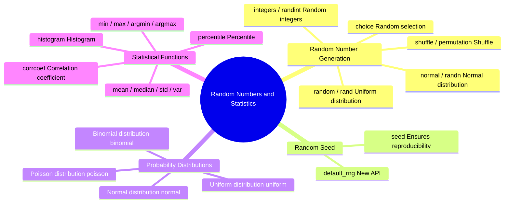
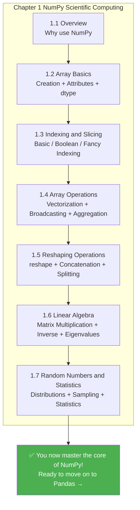

# 3.2.7 Random Numbers and Statistics


## Learning Objectives

- Master the common functions in the `numpy.random` module
- Understand common probability distributions (uniform, normal, binomial)
- Understand the role of the random seed
- Learn to use NumPy for basic statistical operations

---

## Why Do We Need Random Numbers?

In data science and AI, random numbers are everywhere:

| Scenario | Why random numbers are needed |
|------|----------------|
| Dataset splitting | Randomly split the training set and test set |
| Model initialization | Neural network weights need random initialization |
| Data augmentation | Randomly crop, rotate, and flip images |
| Monte Carlo simulation | Use random sampling to estimate complex problems |
| A/B testing | Randomly assign users to the control group and the experiment group |

---

## numpy.random Basics

### New API (Recommended)

NumPy recommends using the newer `Generator` API:

```python
import numpy as np

# Create a random number generator
rng = np.random.default_rng(seed=42)

# Uniform random numbers in [0, 1)
print(rng.random(5))
# [0.773... 0.438... 0.858... 0.697... 0.094...]

# Random integers in a specified range
print(rng.integers(1, 100, size=5))
# [67 82 42 91 23] (example values)

# Normal random numbers
print(rng.standard_normal(5))
# [-0.15... 0.74... -0.27... ...]
```

### Old API (Still Commonly Used)

You will still see the old API in many tutorials and code examples, so you need to recognize it too:

```python
# Old-style usage (still valid)
np.random.seed(42)  # Set the global seed

# Uniform random numbers in [0, 1)
print(np.random.rand(3))

# Standard normal distribution
print(np.random.randn(3))

# Random integers
print(np.random.randint(1, 100, size=5))
```

:::tip[New vs. Old]
- **New** `default_rng()`: more flexible, supports independent random states, and is recommended for new code
- **Old** `np.random.xxx()`: uses global state, simple and direct, and very common in older code

You should recognize both styles. This tutorial covers both.
:::
---

## Random Seed: Making "Random" Reproducible

In scientific research and debugging, we often need "reproducible randomness" — getting the same results every time we run the code.

```python
# No seed: different results every time
print(np.random.rand(3))  # Different each time

# Set a seed: same results every time
np.random.seed(42)
print(np.random.rand(3))  # [0.374... 0.950... 0.731...]

np.random.seed(42)        # Reset the same seed
print(np.random.rand(3))  # [0.374... 0.950... 0.731...]  Exactly the same!
```

```python
# Seed setting with the new API
rng = np.random.default_rng(seed=42)
print(rng.random(3))

rng2 = np.random.default_rng(seed=42)  # Same seed
print(rng2.random(3))                    # Same result
```

:::note[What a Seed Does]
A random seed is like a "recipe for random numbers" — the same seed always produces the same sequence of random numbers. Be sure to set a seed in the following situations:

- **During learning/tutorials**: to make results easier to verify
- **In scientific experiments**: to ensure results are reproducible
- **When debugging code**: to remove interference from randomness
- **When training machine learning models**: to ensure fair comparison experiments
:::
---

## Evidence to Keep

Keep this page's proof of learning as a small evidence card:

```text
array_state: shape, dtype, axis, and sample values before the operation
operation: indexing, slicing, broadcasting, reshape, linear algebra, or random/stat function
output: resulting array shape, values, or statistic
failure_check: axis confusion, view/copy trap, broadcast mismatch, or wrong shape
Expected_output: printed shapes and values that make the array operation inspectable
```

## Common Probability Distributions

### Uniform Distribution

Each value has the same probability of appearing:

```python
rng = np.random.default_rng(42)

# Uniform distribution between [0, 1)
uniform_01 = rng.random(10000)
print(f"Mean: {uniform_01.mean():.4f}")  # ≈ 0.5
print(f"Min: {uniform_01.min():.4f}")   # ≈ 0
print(f"Max: {uniform_01.max():.4f}")   # ≈ 1

# Uniform distribution between [low, high)
uniform_custom = rng.uniform(low=10, high=50, size=1000)
print(f"Mean: {uniform_custom.mean():.1f}")  # ≈ 30
```

### Normal Distribution (Gaussian Distribution)

This is one of the most important distributions — it appears everywhere in nature and data:

```python
rng = np.random.default_rng(42)

# Standard normal distribution: mean = 0, standard deviation = 1
standard = rng.standard_normal(10000)
print(f"Mean: {standard.mean():.4f}")  # ≈ 0
print(f"Standard deviation: {standard.std():.4f}")  # ≈ 1

# Normal distribution with a specified mean and standard deviation
# For example: the height of adult men in China is about 170 cm, with a standard deviation of about 6 cm
heights = rng.normal(loc=170, scale=6, size=10000)
print(f"Average height: {heights.mean():.1f} cm")
print(f"Standard deviation: {heights.std():.1f} cm")
print(f"Shortest: {heights.min():.1f} cm")
print(f"Tallest: {heights.max():.1f} cm")
```

### Binomial Distribution

The number of successes in `n` independent trials (for example, flipping a coin):

```python
rng = np.random.default_rng(42)

# Simulate flipping a coin 10 times (probability of heads = 0.5), repeated 10000 times
results = rng.binomial(n=10, p=0.5, size=10000)
print(f"Average number of heads: {results.mean():.2f}")  # ≈ 5
print(f"Minimum: {results.min()}")
print(f"Maximum: {results.max()}")
```

### Other Common Distributions

```python
rng = np.random.default_rng(42)

# Poisson distribution (number of events)
# For example: 5 customers arrive per hour on average
visitors = rng.poisson(lam=5, size=1000)
print(f"Poisson distribution - Mean: {visitors.mean():.2f}")

# Exponential distribution (time between events)
wait_times = rng.exponential(scale=2.0, size=1000)
print(f"Exponential distribution - Mean: {wait_times.mean():.2f}")

# choice: randomly select from an array
names = np.array(["Alice", "Bob", "Charlie", "Diana", "Eve"])
chosen = rng.choice(names, size=3, replace=False)  # Sampling without replacement
print(f"Random selection: {chosen}")
```

---

## Random Operations

### Random Shuffling

```python
rng = np.random.default_rng(42)

arr = np.arange(10)    # [0 1 2 3 4 5 6 7 8 9]

# Shuffle in place
rng.shuffle(arr)
print(arr)              # [8 1 5 0 7 2 9 4 3 6] (random order)

# Shuffle and return a new array (do not modify the original)
arr2 = np.arange(10)
shuffled = rng.permutation(arr2)
print(arr2)       # [0 1 2 3 4 5 6 7 8 9]  original array unchanged
print(shuffled)   # New shuffled array
```

### Random Sampling

```python
rng = np.random.default_rng(42)

data = np.arange(100)

# Sampling with replacement (duplicates possible)
sample1 = rng.choice(data, size=10, replace=True)
print(f"With replacement: {sample1}")

# Sampling without replacement (no duplicates)
sample2 = rng.choice(data, size=10, replace=False)
print(f"Without replacement: {sample2}")

# Weighted random sampling
items = np.array(["Common", "Uncommon", "Rare", "Legendary"])
weights = np.array([0.6, 0.25, 0.1, 0.05])  # probabilities
drops = rng.choice(items, size=20, p=weights)
unique, counts = np.unique(drops, return_counts=True)
for item, count in zip(unique, counts):
    print(f"  {item}: {count} times")
```

---

## Statistical Operations

NumPy provides a rich set of statistical functions:

### Descriptive Statistics

```python
rng = np.random.default_rng(seed=42)
data = rng.normal(loc=75, scale=10, size=100)  # Scores of 100 students

print("=== Descriptive Statistics ===")
print(f"Mean (mean):     {np.mean(data):.2f}")
print(f"Median (median): {np.median(data):.2f}")
print(f"Standard deviation (std):    {np.std(data):.2f}")
print(f"Variance (var):      {np.var(data):.2f}")
print(f"Minimum (min):    {np.min(data):.2f}")
print(f"Maximum (max):    {np.max(data):.2f}")
print(f"Range (ptp):      {np.ptp(data):.2f}")   # max - min
```

### Percentiles

```python
rng = np.random.default_rng(seed=42)
data = rng.normal(loc=75, scale=10, size=1000)

# Percentiles
print(f"25th percentile: {np.percentile(data, 25):.2f}")
print(f"50th percentile: {np.percentile(data, 50):.2f}")  # = median
print(f"75th percentile: {np.percentile(data, 75):.2f}")
print(f"90th percentile: {np.percentile(data, 90):.2f}")

# Interquartile range (IQR)
q1 = np.percentile(data, 25)
q3 = np.percentile(data, 75)
iqr = q3 - q1
print(f"Interquartile range (IQR): {iqr:.2f}")
```

### Correlation Coefficient

```python
rng = np.random.default_rng(seed=42)

# Height and weight are usually positively correlated
height = rng.normal(170, 8, 100)
weight = height * 0.6 - 30 + rng.normal(0, 5, 100)  # Approximate linear relationship + noise

# Compute the correlation coefficient matrix
corr_matrix = np.corrcoef(height, weight)
print(f"Correlation coefficient: {corr_matrix[0, 1]:.4f}")  # ≈ 0.7~0.9 (positive correlation)

# Interpretation:
# 1.0  = perfect positive correlation
# 0.0  = no correlation
# -1.0 = perfect negative correlation
```

### Histogram Statistics

```python
rng = np.random.default_rng(seed=42)
scores = rng.normal(75, 10, 200)

# Count how many scores fall into each range
bins = [0, 60, 70, 80, 90, 100]
counts, bin_edges = np.histogram(scores, bins=bins)
labels = ["Failing", "Passing", "Average", "Good", "Excellent"]

print("=== Score Distribution ===")
for label, count, left, right in zip(labels, counts, bin_edges[:-1], bin_edges[1:]):
    bar = "█" * count
    print(f"  {label} [{left:.0f}-{right:.0f}): {count:3d} {bar}")
```

---

## Hands-On: Simulating Monte Carlo

The Monte Carlo method is a classic way to use random numbers to estimate complex problems. Below, we use it to estimate π:

```python
import numpy as np

def estimate_pi(n_points):
    """
    Estimate π by randomly scattering points inside a square
    The proportion of points that fall inside the quarter circle is approximately π/4
    """
    rng = np.random.default_rng(42)

    # Randomly scatter points in the square [0, 1] × [0, 1]
    x = rng.random(n_points)
    y = rng.random(n_points)

    # Compute the distance to the origin
    distance = np.sqrt(x**2 + y**2)

    # Number of points inside the quarter circle (distance <= 1)
    inside = np.sum(distance <= 1)

    # π ≈ 4 × (number of points inside the circle / total number of points)
    pi_estimate = 4 * inside / n_points
    return pi_estimate

# Estimation accuracy with different numbers of points
for n in [100, 1000, 10000, 100000, 1000000]:
    pi_est = estimate_pi(n)
    error = abs(pi_est - np.pi)
    print(f"  {n:>10,} points → π ≈ {pi_est:.6f}  Error: {error:.6f}")
```

Output:

```
       100 points → π ≈ 3.120000  Error: 0.021593
     1,000 points → π ≈ 3.156000  Error: 0.014407
    10,000 points → π ≈ 3.153200  Error: 0.011607
   100,000 points → π ≈ 3.140480  Error: 0.001113
 1,000,000 points → π ≈ 3.142484  Error: 0.000891
```

The more points you use, the more accurate the estimate becomes! That is the charm of the Monte Carlo method.

---

## Summary



---

## Hands-On Exercises

### Exercise 1: Simulate Rolling Dice

```python
rng = np.random.default_rng(42)

# Simulate rolling 2 dice 10000 times
# 1. Generate a 10000×2 array of random integers (each row is one roll of two dice)
# 2. Compute the sum of the two dice for each roll
# 3. Count how many times each sum (2~12) appears
# 4. Find the most frequent sum (should be 7)
```

### Exercise 2: Simulate Stock Prices

```python
rng = np.random.default_rng(42)

# Simulate price changes for one stock over 250 trading days
# Initial price: 100
# Daily returns follow a normal distribution: mean 0.05%, standard deviation 2%
initial_price = 100
n_days = 250

# 1. Generate 250 daily returns
# daily_returns = rng.normal(loc=?, scale=?, size=?)

# 2. Compute the price for each day (hint: use np.cumprod)
# prices = initial_price * np.cumprod(1 + daily_returns)

# 3. Compute the final price, highest price, and lowest price
# 4. Compute the annualized return
```

### Exercise 3: Score Analysis

```python
rng = np.random.default_rng(seed=42)

# Generate scores for 200 students
math_scores = rng.normal(75, 12, 200).clip(0, 100)    # Math
english_scores = rng.normal(78, 10, 200).clip(0, 100)  # English

# 1. Compute the mean, standard deviation, and median for each subject
# 2. Compute the correlation coefficient between the two subjects
# 3. Count how many students failed math but passed English
# 4. Use histogram to analyze the score distribution for both subjects
# 5. Compute the average score of the Top 10 students by total score
```

---


<details>
<summary>Reference implementation and walkthrough</summary>

- For dice simulation, create a `(10000, 2)` array, sum along `axis=1`, and count sums with `np.bincount`. The most frequent sum should usually be `7` because it has the most combinations.
- For stock simulation, generate daily returns, then compute prices with `100 * np.cumprod(1 + returns)`. Report the final return, maximum drawdown if asked, and a chart so the path is visible.
- For student scores, use `mean`, `std`, `corrcoef`, boolean filters, histograms, and top-k sorting. Always describe the random seed so someone else can reproduce the same sample.

</details>


## Chapter Summary: A Complete View of NumPy Knowledge

Congratulations on finishing all the NumPy content! Let's review what you learned in this chapter:



> **✅ Self-check:** Can you use NumPy to create a 100×3 random matrix, compute the mean and standard deviation of each column, and find the column index of the maximum value in each row?

```python
import numpy as np

rng = np.random.default_rng(42)
matrix = rng.normal(loc=50, scale=15, size=(100, 3))

# Column means
print("Column means:", np.mean(matrix, axis=0))

# Column standard deviations
print("Column standard deviations:", np.std(matrix, axis=0))

# Column index of the maximum value in each row
print("Column indices of row maxima:", np.argmax(matrix, axis=1))
```

If all of this feels easy — congratulations, you are ready to step into the world of Pandas!
