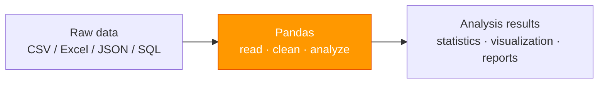
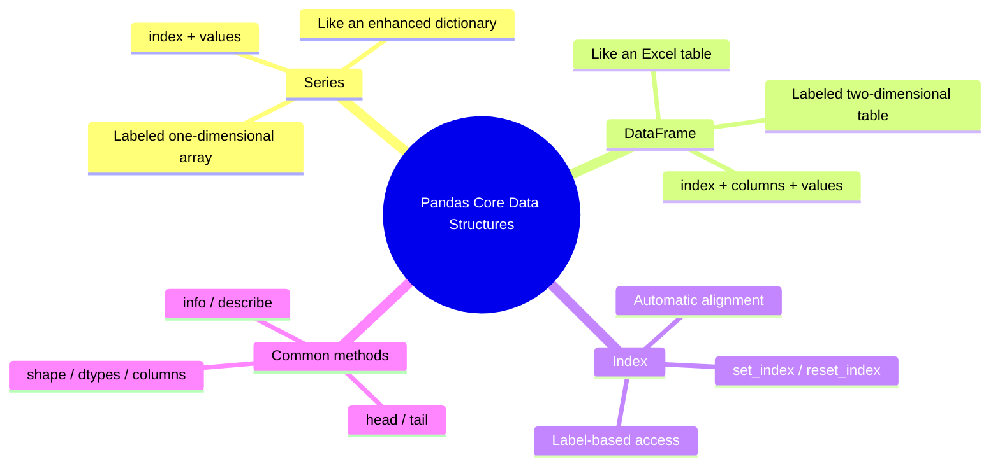

:::tip[Section overview]
When many beginners first learn `Pandas`, they feel that:

- There are too many APIs
- A DataFrame looks like a table, but also like a code object

The most reliable way to understand it is actually:

> **First think of it as a “labeled table system,” then gradually learn its operations.**

In other words, the most important thing in this section is not memorizing every attribute, but first knowing:

- What `Series` looks like
- What `DataFrame` looks like
- Why `Index` keeps showing up
:::
## Learning objectives

- Understand the role of Pandas in data analysis
- Master Series creation and basic operations
- Master DataFrame creation and basic attributes
- Understand the Index mechanism

---

## First build a map

When learning `Pandas` for the first time, the safest order is not to “memorize all methods right away,” but to first see clearly:


So what this section really wants to solve is:

- Why `Pandas` is not just “Excel in Python”
- Why `Series / DataFrame / Index` become the foundation of the whole chapter

---

## What is Pandas?

If NumPy is the **engine** of Python data science, then Pandas is the **steering wheel and dashboard**—it lets you control and inspect data conveniently.



Core capabilities of Pandas:

| Capability | Description |
|------|------|
| Data I/O | Read CSV, Excel, JSON, SQL in one line |
| Data cleaning | Handle missing values, duplicates, and outliers |
| Data filtering | Filter and query data flexibly like SQL |
| Grouped statistics | `groupby` is dozens of times faster than pure Python loops |
| Data merging | Merge multiple tables like SQL JOIN |

### A better beginner-friendly analogy

You can think of `Pandas` as:

- A smart spreadsheet that remembers row and column labels

A regular `list` is more like:

- A pile of raw data with no column names

`NumPy` is more like:

- A matrix engine built for high-speed numerical computing

`Pandas` is more like:

- The place where you really start working with “fields, row records, and table structures”

Remember the warm-up exercise in Chapter 1? 75 lines of pure Python code did the job, while Pandas did it in just 5 lines. Now let’s formally learn it.

```python
import pandas as pd
import numpy as np

print(pd.__version__)  # e.g. 2.2.0
```

:::tip[Import convention]
Just like NumPy uses `np`, Pandas is commonly abbreviated as `pd`.
:::
---

## Series: a one-dimensional array with labels

**Series** is the most basic Pandas data structure—you can think of it as a **NumPy array with labels**.

### When you first see a Series, what should you focus on?

The most important thing to grasp first is this sentence:

> **Series = one column of data + one set of labels.**

Once this idea is solid, later on when you see:

- Access by label
- Access by position
- Operations on an entire column

it will all feel much smoother.

### Creating a Series

```python
import pandas as pd

# Create from a list (auto-generated 0, 1, 2... index)
s1 = pd.Series([85, 92, 78, 95, 88])
print(s1)
# 0    85
# 1    92
# 2    78
# 3    95
# 4    88
# dtype: int64

# Specify the index
s2 = pd.Series(
    [85, 92, 78, 95, 88],
    index=["Chinese", "Math", "English", "Physics", "Chemistry"]
)
print(s2)
# Chinese      85
# Math         92
# English      78
# Physics      95
# Chemistry    88
# dtype: int64

# Create from a dictionary (keys automatically become the index)
scores = {"Chinese": 85, "Math": 92, "English": 78, "Physics": 95}
s3 = pd.Series(scores)
print(s3)
```

### Structure of a Series

```
Index        Values
──────────   ──────────
Chinese      85
Math         92
English      78
Physics      95
Chemistry    88
```

Each Series consists of two parts:
- **Index**: labels used to locate data
- **Values**: the actual data, with the underlying storage being a NumPy array

### A beginner-friendly comparison table to remember first

| What you see now | What you can think of it as |
|---|---|
| `Series` | A labeled column of data |
| `Index` | The “row name” of this column |
| `Values` | The actual data itself |

This table is great for beginners because it turns abstract terms back into a few more concrete roles.

```python
s = pd.Series([85, 92, 78], index=["Chinese", "Math", "English"])

print(s.index)    # Index(['Chinese', 'Math', 'English'], dtype='object')
print(s.values)   # [85 92 78]  ← This is a NumPy array!
print(s.dtype)    # int64
print(s.shape)    # (3,)
print(len(s))     # 3
```

### Accessing a Series

```python
s = pd.Series([85, 92, 78, 95], index=["Chinese", "Math", "English", "Physics"])

# Access by label
print(s["Math"])      # 92

# Access by position
print(s.iloc[1])      # 92

# Slicing
print(s["Chinese":"English"])  # Label slicing (includes the end!)
# Chinese    85
# Math       92
# English    78

# Boolean indexing
print(s[s >= 90])
# Math       92
# Physics    95
```

:::caution[Label slicing vs positional slicing]
- **Label slicing** `s["Chinese":"English"]`: **includes** the end
- **Positional slicing** `s.iloc[0:2]`: **does not include** the end (same as Python lists)

This is an easy place for beginners to get confused.
:::
### Operations on a Series

```python
s = pd.Series([85, 92, 78, 95], index=["Chinese", "Math", "English", "Physics"])

# Vectorized operations (same idea as NumPy)
print(s + 5)         # Add 5 points to each subject
print(s * 1.1)       # Multiply each subject by 1.1
print(s.mean())      # 87.5  Average score
print(s.max())       # 95    Highest score
print(s.describe())  # Generate descriptive statistics in one line
```

---

## DataFrame: a labeled two-dimensional table

**DataFrame** is the core of Pandas—you can think of it as an **Excel table**, or as a **dictionary of multiple Series**.

### When you first see a DataFrame, what should you remember first?

The most important thing to remember is:

> **DataFrame = multiple Series combined into one table using the same row index.**

You can first think of it as:

- A real data table with column names and row numbers

rather than a bunch of arrays stuck together.

### Creating a DataFrame

```python
# Method 1: Create from a dictionary (most common)
data = {
    "Name": ["Zhang San", "Li Si", "Wang Wu", "Zhao Liu", "Qian Qi"],
    "Age": [22, 25, 23, 28, 21],
    "City": ["Beijing", "Shanghai", "Guangzhou", "Shenzhen", "Hangzhou"],
    "Salary": [15000, 22000, 18000, 25000, 16000]
}
df = pd.DataFrame(data)
print(df)
#         Name  Age       City  Salary
# 0  Zhang San   22    Beijing   15000
# 1      Li Si   25   Shanghai   22000
# 2    Wang Wu   23  Guangzhou   18000
# 3   Zhao Liu   28   Shenzhen   25000
# 4    Qian Qi   21   Hangzhou   16000
```

```python
# Method 2: Create from a list of lists
data = [
    ["Zhang San", 22, "Beijing"],
    ["Li Si", 25, "Shanghai"],
    ["Wang Wu", 23, "Guangzhou"]
]
df = pd.DataFrame(data, columns=["Name", "Age", "City"])

# Method 3: Create from a NumPy array
rng = np.random.default_rng(seed=42)
arr = rng.integers(60, 100, size=(5, 3))
df = pd.DataFrame(arr, columns=["Chinese", "Math", "English"])

# Method 4: Create from a dictionary of Series
df = pd.DataFrame({
    "Math": pd.Series([90, 85, 78], index=["Zhang San", "Li Si", "Wang Wu"]),
    "English": pd.Series([88, 92, 75], index=["Zhang San", "Li Si", "Wang Wu"])
})
```

### Structure of a DataFrame

```
        Columns
        ↓
Index →  Name  Age  City    Salary
(Index)
  0     Zhang San  22   Beijing  15000
  1     Li Si      25   Shanghai  22000
  2     Wang Wu    23   Guangzhou 18000
  3     Zhao Liu   28   Shenzhen  25000
  4     Qian Qi    21   Hangzhou  16000
```

DataFrame = **row index (Index)** + **column names (Columns)** + **data (Values)**

### Basic attributes

```python
data = {
    "Name": ["Zhang San", "Li Si", "Wang Wu", "Zhao Liu", "Qian Qi"],
    "Age": [22, 25, 23, 28, 21],
    "City": ["Beijing", "Shanghai", "Guangzhou", "Shenzhen", "Hangzhou"],
    "Salary": [15000, 22000, 18000, 25000, 16000]
}
df = pd.DataFrame(data)

print(df.shape)      # (5, 4)  → 5 rows, 4 columns
print(df.columns)    # Index(['Name', 'Age', 'City', 'Salary'], dtype='object')
print(df.index)      # RangeIndex(start=0, stop=5, step=1)
print(df.dtypes)
# Name      object    ← string
# Age        int64
# City      object
# Salary     int64
print(df.size)       # 20  → 5 × 4 = 20 elements
print(len(df))       # 5   → number of rows
```

### Quickly inspect data

```python
# First 3 rows
print(df.head(3))

# Last 2 rows
print(df.tail(2))

# Basic information
print(df.info())
# <class 'pandas.core.frame.DataFrame'>
# RangeIndex: 5 entries, 0 to 4
# Data columns (total 4 columns):
#  #   Column  Non-Null Count  Dtype
# ---  ------  --------------  -----
#  0   Name      5 non-null      object
#  1   Age       5 non-null      int64
#  2   City      5 non-null      object
#  3   Salary    5 non-null      int64

# Summary statistics for numeric columns
print(df.describe())
#              Age           Salary
# count   5.000000      5.000000
# mean   23.800000  19200.000000
# std     2.774887   4147.288271
# min    21.000000  15000.000000
# 25%    22.000000  16000.000000
# 50%    23.000000  18000.000000
# 75%    25.000000  22000.000000
# max    28.000000  25000.000000
```

:::tip[`info()` and `describe()` are your friends]
When you get a new dataset, the first thing to do is run `df.info()` and `df.describe()`—they can help you understand the overall picture of the data in just a few seconds.
:::
### A beginner-friendly sequence for a new table

A safer workflow is usually:

1. Check `df.head()`
2. Check `df.info()`
3. Check `df.describe()`
4. Then start filtering and cleaning

This is much less likely to make you lose your way than jumping straight into complex operations.

### Accessing columns

```python
# Access a single column → returns a Series
print(df["Name"])
# 0    Zhang San
# 1        Li Si
# ...

# You can also use dot notation (when the column name has no spaces and does not conflict with methods)
print(df.Age)

# Access multiple columns → returns a DataFrame
print(df[["Name", "Salary"]])
#         Name  Salary
# 0  Zhang San   15000
# 1      Li Si   22000
# ...
```

### Why is “learning to read columns first” so important?

Because most Pandas work later on does three things:

- Select columns
- Modify columns
- Perform statistics and combinations based on columns

So when learning Pandas for the first time, instead of rushing to memorize lots of advanced methods,
it’s better to first make sure you understand “How do I find this column, what type is it, and what can I do with it?”

### Adding and deleting columns

```python
# Add a new column
df["After-Tax Salary"] = df["Salary"] * 0.85
print(df[["Name", "Salary", "After-Tax Salary"]])

# Add a column based on a condition
df["Salary Level"] = np.where(df["Salary"] >= 20000, "High", "Medium")
print(df[["Name", "Salary", "Salary Level"]])

# Delete a column
df = df.drop(columns=["After-Tax Salary"])  # returns a new DataFrame
# or
# df.drop(columns=["After-Tax Salary"], inplace=True)  # modify in place
```

---

## Why Index matters

Index is the key feature that distinguishes Pandas from NumPy.

### Setting the index

```python
df = pd.DataFrame({
    "Name": ["Zhang San", "Li Si", "Wang Wu"],
    "Age": [22, 25, 23],
    "Salary": [15000, 22000, 18000]
})

# Set the "Name" column as the index
df_indexed = df.set_index("Name")
print(df_indexed)
#             Age  Salary
# Name
# Zhang San    22   15000
# Li Si        25   22000
# Wang Wu      23   18000

# Access by index
print(df_indexed.loc["Li Si"])
# Age        25
# Salary    22000

# Reset the index
df_reset = df_indexed.reset_index()
print(df_reset)  # same as before
```

### Index alignment

Pandas operations automatically **align by index**—this is a very powerful feature:

```python
s1 = pd.Series({"Chinese": 85, "Math": 92, "English": 78})
s2 = pd.Series({"Math": 88, "English": 82, "Physics": 90})

# Automatically align by index when adding
result = s1 + s2
print(result)
# English    160.0
# Math       180.0
# Physics      NaN   ← s1 does not have Physics, so the result is NaN
# Chinese      NaN   ← s2 does not have Chinese, so the result is NaN
```

---

## Series vs DataFrame comparison

| Feature | Series | DataFrame |
|------|--------|-----------|
| Dimension | 1D | 2D |
| Analogy | One column in Excel | An entire Excel table |
| Creation | `pd.Series([1,2,3])` | `pd.DataFrame({"a":[1,2]})` |
| Accessing a column | — | `df["column_name"]` returns a Series |
| Index | One Index | Row index + column index |

---

## Evidence to Keep

Keep this page's proof of learning as a small evidence card:

```text
dataframe_state: columns, dtypes, row count, missing values, and sample rows
operation: read/write, select/filter, clean, transform, groupby, merge, or time-series step
output: resulting table, saved file, aggregation, join result, or time index view
failure_check: dtype mismatch, missing data, duplicated keys, chained assignment, or wrong time frequency
Expected_output: before/after table sample with the transformation reason
```

## Summary



---

## Hands-on exercises

### Exercise 1: Create a Series

```python
# Create a Series representing daily step counts for one week
# Use "Monday" to "Sunday" as the index
# 1. Print the average step count
# 2. Find the day with the most steps
# 3. Find the days with more than 8000 steps
```

### Exercise 2: Create a DataFrame

```python
# Create a feature progress DataFrame containing:
# Feature, Owner, Planned Hours, Actual Hours, Status columns, at least 5 items
# 1. Add a "Delta Hours" column
# 2. Add an "Over Budget" column
# 3. Add a "Risk" column (Blocked -> High, Review -> Medium, Done -> Low, otherwise Watch)
# 4. Use describe() to view statistics for the numeric columns
```

### Exercise 3: Index operations

```python
# Use the DataFrame from Exercise 2
# 1. Set "Feature" as the index
# 2. Find one feature's full progress record by name
# 3. Reset the index
```


<details>
<summary>Reference implementation and walkthrough</summary>

- For the weekly step-count Series, use weekday names as the index, then compute the mean, max day with `idxmax`, and filtered high-step days with a boolean condition.
- For the feature progress DataFrame, add `Delta Hours` and `Over Budget`, then create `Risk` with a function, `map`, or `pd.cut` depending on your rule. `describe()` is useful evidence, but it is not the full analysis.
- Index practice should show both `set_index` and `reset_index`. A good answer explains when label lookup with `.loc` is clearer than positional lookup with `.iloc`.

</details>
