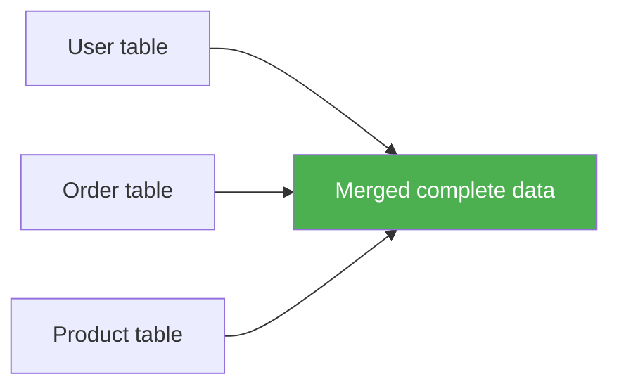
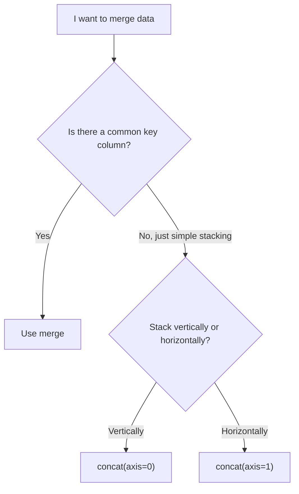

# 3.3.8 Data Merging

:::tip[Section Focus]
When many beginners first learn data merging, this is the easiest place to get confused:

- `merge`
- `concat`
- `join`

You may have seen all of these names before, but when a problem appears, you still may not know which one to use first.

So the most important thing in this section is not memorizing the names, but building this judgment first:

> **Am I “aligning by a common key,” or am I “stitching tables together vertically or horizontally”?**
:::
## Learning Objectives

- Master `merge` (SQL-style joins)
- Understand `join` (index-based joins)
- Master `concat` (concatenation)
- Understand how to choose between different merging strategies

---

## First Build a Map

Data merging is easier to understand by asking whether there is a “common key”:


So what this section really wants to solve is:

- When should you think of `merge` first?
- When is it just a simple concatenation?

## Why Do We Need Data Merging?

Real-world data is often spread across multiple tables. For example, an e-commerce system may have:
- **User table**: user ID, name, registration time
- **Order table**: order ID, user ID, product, amount
- **Product table**: product ID, name, category, price

To analyze “what products each user bought,” you need to **merge** these tables together.



### A Better Beginner-Friendly Analogy

You can think of data merging as:

- Matching clues from different tables to the same person or the same record

In other words:

- `merge` is more like aligning two records by ID number
- `concat` is more like stacking two tables together vertically or horizontally

This analogy is important because it helps you separate these two ideas first:

- “alignment”
- and “concatenation”

These are not the same thing.

---

## merge: SQL-Style Join

`merge` is the most powerful merging method, similar to SQL JOIN.

### Prepare Sample Data

```python
import pandas as pd

# User table
users = pd.DataFrame({
    "User ID": [1, 2, 3, 4],
    "Name": ["John", "Mary", "Alice", "Bob"],
    "City": ["Beijing", "Shanghai", "Guangzhou", "Shenzhen"]
})

# Order table
orders = pd.DataFrame({
    "Order ID": [101, 102, 103, 104, 105],
    "User ID": [1, 2, 1, 3, 5],       # Note: user 5 is not in the user table
    "Product": ["Phone", "Computer", "Headphones", "Tablet", "Keyboard"],
    "Amount": [5999, 8999, 299, 3999, 199]
})
```

### Inner Join

Keep only the rows that exist on both sides:

```python
result = pd.merge(users, orders, on="User ID", how="inner")
print(result)
#    User ID   Name       City  Order ID     Product  Amount
# 0        1   John    Beijing       101       Phone    5999
# 1        1   John    Beijing       103  Headphones     299
# 2        2   Mary   Shanghai       102    Computer    8999
# 3        3  Alice  Guangzhou       104      Tablet    3999
# User 4 (Bob) has no orders → does not appear
# User 5 is not in the user table → does not appear
```

### Left Join

Keep all rows from the left table:

```python
result = pd.merge(users, orders, on="User ID", how="left")
print(result)
#    User ID   Name       City  Order ID     Product   Amount
# 0        1   John    Beijing     101.0       Phone   5999.0
# 1        1   John    Beijing     103.0  Headphones    299.0
# 2        2   Mary   Shanghai     102.0    Computer   8999.0
# 3        3  Alice  Guangzhou     104.0      Tablet   3999.0
# 4        4    Bob   Shenzhen       NaN         NaN      NaN   ← Bob has no orders, so NaN is used
```

### Right Join

Keep all rows from the right table:

```python
result = pd.merge(users, orders, on="User ID", how="right")
print(result)
# User 5 appears (name and city are NaN)
```

### Outer Join

Keep all rows from both sides:

```python
result = pd.merge(users, orders, on="User ID", how="outer")
print(result)
# All users and all orders appear, and missing values are filled with NaN
```

### Comparison of the Four Join Types

```
User table: {1,2,3,4}    Order table: {1,2,3,5}

inner:  {1,2,3}       rows that exist on both sides
left:   {1,2,3,4}     all rows from the left + matches from the right
right:  {1,2,3,5}     all rows from the right + matches from the left
outer:  {1,2,3,4,5}   keep everything
```

### A Beginner-Friendly Selection Table

| Your goal | Safer first choice |
|---|---|
| Keep only records that match on both sides | `inner merge` |
| Use the left table as the base and bring in right-table info | `left merge` |
| Keep both sides and fill missing values with NaN | `outer merge` |
| Just stack several tables vertically | `concat(axis=0)` |
| Just place several columns side by side | `concat(axis=1)` |

This table is great for beginners because it reduces “many join types” back down to a few common business goals.

### Merging with Different Column Names

```python
# If the join key names are different in the two tables
df1 = pd.DataFrame({"user_id": [1, 2], "name": ["A", "B"]})
df2 = pd.DataFrame({"uid": [1, 2], "score": [90, 85]})

result = pd.merge(df1, df2, left_on="user_id", right_on="uid")
print(result)
```

### Multi-Column Join

```python
# Match on multiple columns
result = pd.merge(df1, df2, on=["col1", "col2"])
```

---

## concat: Concatenation

`concat` is used to concatenate multiple DataFrames vertically or horizontally (no common key required):

### What Should You Remember First When Learning `concat`?

The most important thing to remember first is:

> **`concat` is not about “aligning keys,” but about “stitching tables together.”**

So if what you are thinking about is:

- Whether user IDs match

then the method you should usually think of first is:

- `merge`

### Vertical Concatenation (Stacking Top to Bottom)

```python
# Sales data for January and February
jan = pd.DataFrame({
    "Product": ["Apple", "Milk"],
    "Sales": [100, 80],
    "Month": ["January", "January"]
})

feb = pd.DataFrame({
    "Product": ["Apple", "Bread"],
    "Sales": [120, 90],
    "Month": ["February", "February"]
})

# Stack vertically
all_sales = pd.concat([jan, feb], ignore_index=True)
print(all_sales)
#    Product  Sales      Month
# 0    Apple    100    January
# 1     Milk     80    January
# 2    Apple    120   February
# 3    Bread     90   February
```

:::tip[ignore_index=True]
`ignore_index=True` regenerates the index as 0, 1, 2... If you do not add it, you may get duplicate indexes.
:::
### Horizontal Concatenation

```python
info = pd.DataFrame({"Name": ["John", "Mary"], "Age": [22, 25]})
scores = pd.DataFrame({"Math": [90, 85], "English": [88, 92]})

# Concatenate side by side
combined = pd.concat([info, scores], axis=1)
print(combined)
#    Name  Age  Math  English
# 0  John   22    90       88
# 1  Mary   25    85       92
```

---

## merge vs concat vs join

| Method | Use Case | Analogy |
|------|---------|------|
| `merge` | Join two tables by a common column | SQL JOIN |
| `concat` | Simple vertical/horizontal stacking | Gluing together |
| `join` | Join by index | A special kind of merge |



## A Data-Merging Checklist Beginners Can Copy Directly

When solving multi-table problems for the first time, the safest checklist is usually:

1. Do I have a common key?
2. Are the key types and value ranges consistent?
3. Why did the number of rows change after merging?
4. Is this more like “alignment” or more like “concatenation”?

As long as you think through these 4 questions first, many `merge / concat` problems will no longer feel like black magic.

---

## Practice: Multi-Table Merge Analysis

```python
import pandas as pd

# Create three tables
# Task table
tasks = pd.DataFrame({
    "Task ID": [1, 2, 3, 4, 5],
    "Feature": ["Login API", "RAG demo", "Chart view", "Deploy script", "Eval report"],
    "Module": ["Backend", "AI", "Frontend", "Ops", "AI"]
})

# Work-log table (some tasks may have multiple work records)
work_logs = pd.DataFrame({
    "Task ID": [1, 1, 2, 2, 3, 3, 4, 4, 5, 5],
    "Stage": ["Design", "Build", "Design", "Build", "Design", "Build", "Build", "Verify", "Design", "Verify"],
    "Hours": [2.0, 5.0, 3.0, 6.5, 1.5, 4.0, 3.5, 1.0, 2.5, 2.0]
})

# Module owner table
modules = pd.DataFrame({
    "Module": ["Backend", "AI", "Frontend", "Ops"],
    "Owner": ["Mina", "Kai", "Riley", "Noah"],
    "Sprint Goal": ["Stable API", "Grounded answer", "Readable UI", "Repeatable release"]
})

# Merge 1: tasks + work logs
task_logs = pd.merge(tasks, work_logs, on="Task ID")
print(task_logs.head())

# Merge 2: add module ownership
full = pd.merge(task_logs, modules, on="Module")
print(full.head())

# Analysis: average work hours by module
print(full.groupby(["Module", "Owner"])["Hours"].mean())

# Analysis: total work hours by task
total_hours = full.groupby(["Task ID", "Feature"])["Hours"].sum().reset_index()
total_hours["Rank"] = total_hours["Hours"].rank(ascending=False, method="dense")
print(total_hours.sort_values("Rank"))
```

---

## Evidence to Keep

Keep this page's proof of learning as a small evidence card:

```text
dataframe_state: columns, dtypes, row count, missing values, and sample rows
operation: read/write, select/filter, clean, transform, groupby, merge, or time-series step
output: resulting table, saved file, aggregation, join result, or time index view
failure_check: dtype mismatch, missing data, duplicated keys, chained assignment, or wrong time frequency
Expected_output: before/after table sample with the transformation reason
```

## Summary

| Operation | Function | Key Parameters |
|------|------|---------|
| SQL-style join | `pd.merge()` | `on`, `how` (`inner`/`left`/`right`/`outer`) |
| Vertical concatenation | `pd.concat(axis=0)` | `ignore_index=True` |
| Horizontal concatenation | `pd.concat(axis=1)` | |
| Index-based join | `df.join()` | `how` |

## What You Should Take Away from This Section

- `merge` aligns by a common key, while `concat` stitches tables together
- First ask “Is there a common key?” — that usually tells you which method to use first
- In multi-table analysis, many problems are not caused by later statistics, but by failing to align the data correctly at the start

---

## Hands-On Practice

### Exercise 1: Basic merge

```python
# There are two tables: an employee table and a department table
# 1. Merge them with an inner join
# 2. Use a left join to find employees without a department
# 3. Use an outer join to find departments without employees
```

### Exercise 2: Multi-Table Merge Analysis

```python
# Create: product table, order table, customer table
# 1. Merge the three tables into one complete table
# 2. Analyze which product categories each customer bought
# 3. Find the top 3 customers with the highest purchase amount
```

### Exercise 3: concat Concatenation

```python
# There are sales data for 4 quarters (4 separate DataFrames)
# 1. Stack them vertically into full-year data
# 2. Add a "quarter" column to indicate the data source
# 3. Analyze the sales trend across the four quarters
```


<details>
<summary>Reference implementation and walkthrough</summary>

- Use `inner` join when you only want matched keys, `left` join when the left table is the source of truth, and `outer` join when you need to inspect mismatches from both sides.
- Before merging, check duplicate keys and decide the relationship: one-to-one, one-to-many, or many-to-many. Use `validate=` when possible so Pandas catches unexpected duplication.
- After every merge, compare row counts, inspect nulls in joined columns, and sample unmatched keys. A merge is not finished until those checks are written down.

</details>
