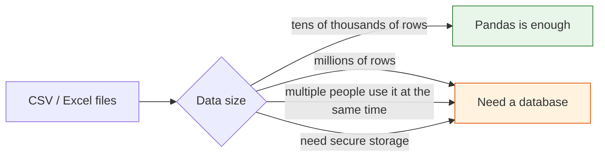
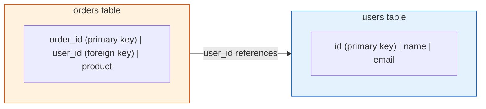
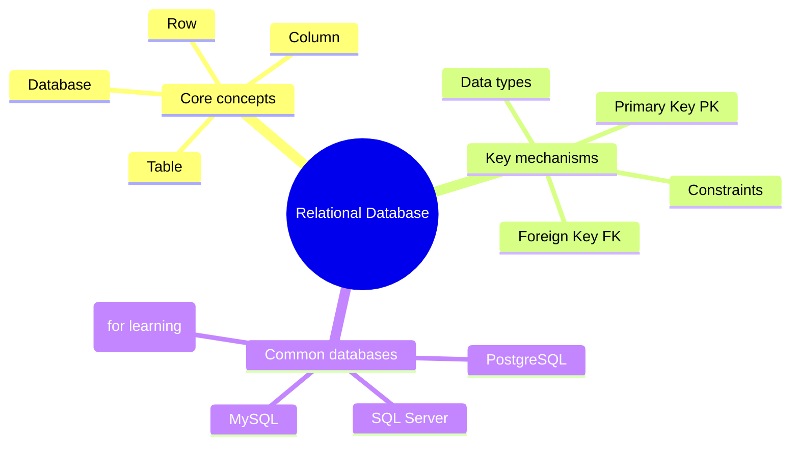

# 3.5.2 Basics of Relational Databases


:::note[Elective Chapter]
This chapter is optional. If you only want to do data analysis and modeling, you can skip it for now. But if you plan to build AI applications in the future (such as RAG systems or AI Agents), database knowledge is essential.
:::
## Learning Objectives

- Understand what a database is and why we need it
- Master the core concepts of relational databases
- Understand the meaning of tables, rows, columns, primary keys, and foreign keys
- Learn about common database management systems

---

## Why do AI engineers need to learn databases?

You may be thinking: "I already know how to use Pandas to read CSV files, so why do I still need to learn databases?"



| Scenario | CSV files | Database |
|------|---------|--------|
| Data size | Okay for tens of thousands of rows, slows to a crawl at millions | Easily handles hundreds of millions of rows |
| Collaboration | Hard to know who changed what, easy to conflict | Supports concurrent read/write with access control |
| Data security | If the file is deleted, it is gone | Has backups, transactions, and crash recovery |
| Query speed | Must scan everything each time | Has indexes, millisecond-level queries |
| Data relationships | Manually merge multiple files | Use one SQL JOIN to get it done |

**Real-world examples:**

- Building a RAG system → user Q&A records need to be stored in a database
- Building an AI Agent → the memory system needs persistent storage
- Building a recommendation system → user behavior data lives in the database
- Doing data analysis → 99% of enterprise data is stored in databases

---

## What is a relational database?

### A comparison with Excel

If you have used Excel before, you already understand 80% of the concepts of relational databases:

| Excel concept | Database concept | Explanation |
|-----------|-----------|------|
| One Excel file | One **database** | A container that stores all data |
| One Sheet | One **table** | Stores one type of data |
| One row | One **record** (Row / Record) | One specific data entity |
| One column | One **field** (Column / Field) | One attribute of the data |
| Column header | **Column name** | The attribute name |
| Cell data type | **Data type** | Integer, text, date, and so on |

### Understand it with an example

Suppose you run an online store and need to manage **users** and **orders**:

**Users table (users):**

| id | name | email | age | city |
|----|------|-------|-----|------|
| 1 | Zhang San | zhang@mail.com | 28 | Beijing |
| 2 | Li Si | li@mail.com | 35 | Shanghai |
| 3 | Wang Wu | wang@mail.com | 22 | Guangzhou |

**Orders table (orders):**

| order_id | user_id | product | amount | order_date |
|----------|---------|---------|--------|------------|
| 101 | 1 | iPhone 16 | 7999 | 2024-11-01 |
| 102 | 1 | AirPods | 999 | 2024-11-05 |
| 103 | 2 | MacBook | 14999 | 2024-11-10 |

These two tables are connected through `user_id`—this is where the name **relational** database comes from: tables have **relationships** with each other.

---

## Core concepts

### Primary Key

A primary key is the **unique identifier** for each record, like an ID card number: it cannot be repeated and cannot be empty.

```
In the users table: id is the primary key → each user has a unique id
In the orders table: order_id is the primary key → each order has a unique order_id
```

:::tip[Why do we need a primary key?]
Imagine there is no primary key: if two users are both named "Zhang San", how would you tell them apart? The primary key solves this problem—even if the names are the same, the ids must be different.
:::
### Foreign Key

A foreign key is a field that **references the primary key of another table** and is used to build relationships between tables.



The `user_id` in the orders table is the foreign key—it points to the `id` in the users table and indicates "which user this order belongs to."

### Common data types

| Type | Explanation | Example |
|------|------|------|
| `INTEGER` | Integer | 1, 42, -100 |
| `REAL` / `FLOAT` | Floating-point number | 3.14, 99.9 |
| `TEXT` / `VARCHAR` | Text string | "Zhang San", "hello" |
| `DATE` | Date | 2024-11-01 |
| `DATETIME` | Date and time | 2024-11-01 14:30:00 |
| `BOOLEAN` | Boolean value | TRUE / FALSE |
| `BLOB` | Binary data | Images, files (less commonly used) |

### Constraints

Constraints are **rules** for data that help ensure data quality:

| Constraint | Purpose | Example |
|------|------|------|
| `PRIMARY KEY` | Primary key, unique and not null | `id` |
| `NOT NULL` | Cannot be empty | `name NOT NULL` |
| `UNIQUE` | Value cannot be duplicated | `email UNIQUE` |
| `DEFAULT` | Default value | `city DEFAULT 'Unknown'` |
| `FOREIGN KEY` | Foreign key, references another table | `user_id REFERENCES users(id)` |

---

## Evidence to Keep

Keep this page's proof of learning as a small evidence card:

```text
schema: table names, keys, relationships, and sample rows
query: SQL or Python database code used
output: result rows, row count, or saved extract
failure_check: wrong join key, unsafe query, missing transaction, or schema mismatch
Expected_output: query plus result table and one data-quality note
```

## Common database management systems

| Database | Features | Use cases |
|--------|------|---------|
| **SQLite** | Zero configuration, stored in a single file | Learning, small apps, mobile apps |
| **MySQL** | The most popular open-source database | Web applications, small to medium projects |
| **PostgreSQL** | The most powerful open-source database | Large projects, AI applications (supports vector search) |
| **SQL Server** | Made by Microsoft | Enterprise Windows environments |

:::tip[This chapter uses SQLite]
SQLite does not require installing any server, and Python comes with the `sqlite3` module, making it ideal for learning. All SQL syntax is also applicable in other databases.
:::
### The safest default order when learning databases for the first time

A more stable order is usually:

1. First get familiar with “tables, primary keys, and foreign keys”
2. Then learn SQL queries
3. Then connect Python to the database
4. Finally, learn database design

This is less confusing than trying to memorize a lot of SQL details right from the start.

---

## Hands-on: Create your first database

```python
import sqlite3

# 1. Connect to the database (it will be created automatically if it does not exist)
conn = sqlite3.connect("my_shop.db")
cursor = conn.cursor()

# 2. Create the users table
cursor.execute("""
    CREATE TABLE IF NOT EXISTS users (
        id INTEGER PRIMARY KEY AUTOINCREMENT,
        name TEXT NOT NULL,
        email TEXT UNIQUE,
        age INTEGER,
        city TEXT DEFAULT 'Unknown'
    )
""")

# 3. Insert data
cursor.execute("INSERT INTO users (name, email, age, city) VALUES ('Zhang San', 'zhang@mail.com', 28, 'Beijing')")
cursor.execute("INSERT INTO users (name, email, age, city) VALUES ('Li Si', 'li@mail.com', 35, 'Shanghai')")
cursor.execute("INSERT INTO users (name, email, age, city) VALUES ('Wang Wu', 'wang@mail.com', 22, 'Guangzhou')")

# 4. Commit changes
conn.commit()

# 5. Query data
cursor.execute("SELECT * FROM users")
rows = cursor.fetchall()
for row in rows:
    print(row)
# (1, 'Zhang San', 'zhang@mail.com', 28, 'Beijing')
# (2, 'Li Si', 'li@mail.com', 35, 'Shanghai')
# (3, 'Wang Wu', 'wang@mail.com', 22, 'Guangzhou')

# 6. Close the connection
conn.close()
```

Congratulations! You just created a database, created a table, and inserted 3 rows of data.

### What is the most important thing to learn from this small example first?

The most important thing is not every SQL keyword,
but that the smallest database workflow is actually very straightforward:

1. Connect to the database
2. Create a table
3. Insert data
4. Query the results

Once this flow makes sense, learning SQL and Python database connections later will feel much less abstract.

---

## Summary



| Concept | One-sentence understanding |
|------|----------|
| Database | A "folder" that stores all tables |
| Table | An "Excel worksheet" for one kind of data |
| Primary key | The "ID card number" of each record |
| Foreign key | The "link" connecting two tables |
| Constraint | A "rule" that ensures data quality |

## What should you take away from this lesson?

- The most important thing about relational databases is not "storing many tables," but that tables can establish relationships through keys
- Primary keys uniquely identify records, and foreign keys connect tables
- Once this foundation is clear, SQL and multi-table analysis will make much more sense

---

## Hands-on practice

### Exercise 1: Design table structures

```
Design two tables for a library management system:
- books table: title, author, publication year, price, category
- borrows table: borrowing records (who borrowed which book, borrow date, return date)

Think about:
1. What is the primary key of each table?
2. Which foreign keys does the borrows table need?
3. Which fields should have NOT NULL constraints?
```

### Exercise 2: Practice with SQLite

```python
# Use sqlite3 to create the books table and borrows table designed above
# Insert 5 books and 3 borrowing records
# Query all data and print it
```


<details>
<summary>Reference implementation and walkthrough</summary>

- A simple library database usually needs a `books` table with `book_id` as primary key and a borrowing table with its own `borrow_id` plus foreign keys to the book and borrower.
- Use `NOT NULL` for required fields such as title, author, borrower, and borrow date. Optional fields, such as return date, can be nullable because they are not known at checkout time.
- After creating tables, insert two or three rows and run a join query. Schema design is only convincing when a realistic question can be answered from it.

</details>
