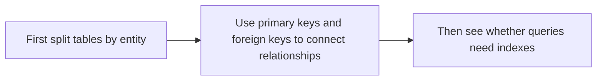
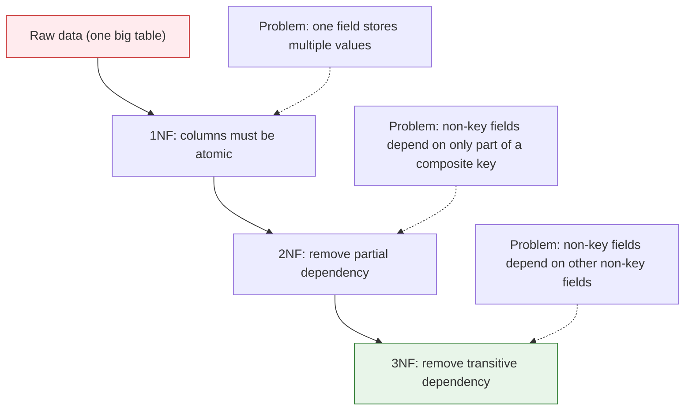
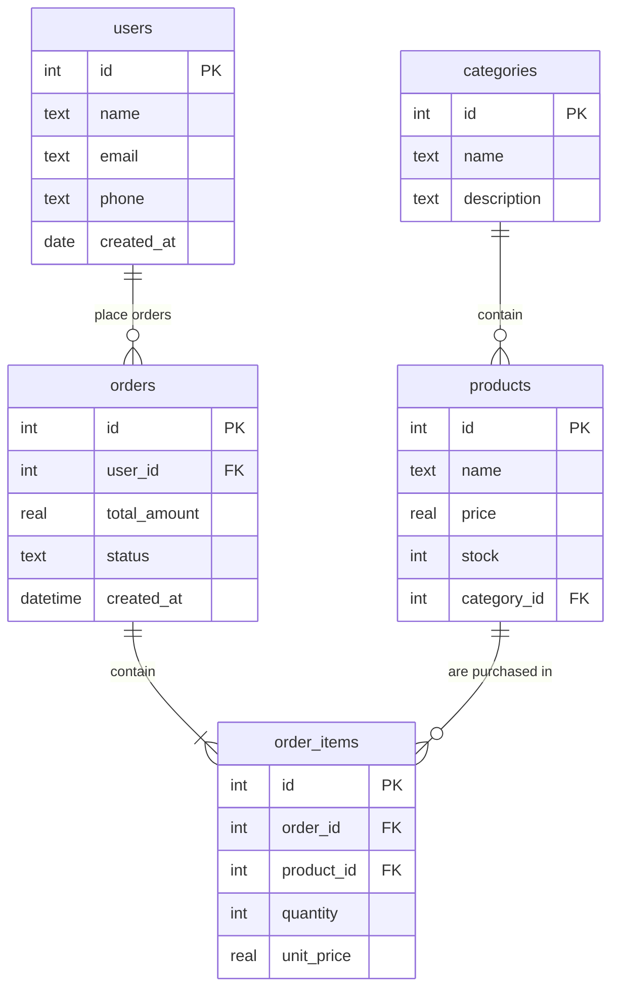
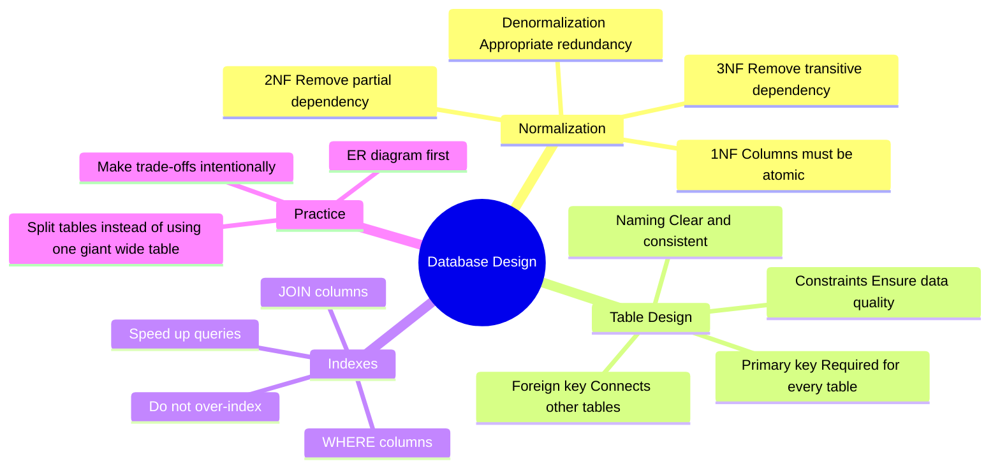

# 3.5.5 Database Design


:::tip[Section Focus]
When many beginners first learn database design, they often focus entirely on:

- normalization names
- formal definitions

But a more solid understanding is:

> **At its core, database design is about reducing duplication, reducing conflicts, and avoiding maintenance problems later.**

So the most important thing in this section is not memorizing terms, but first understanding “what goes wrong when the design is bad.”
:::
## Learning Objectives

- Understand why good database design matters
- Master the core ideas behind database normalization
- Learn how to design table structures and relationships
- Understand the role of indexes and when to use them

---

## First, Build a Map

Database design is easier to understand as “split tables first, then connect tables, then add indexes”:



So what this section really aims to solve is:

- Why tables should not be lumped together casually
- Why design problems eventually become data quality and query efficiency problems

## Why Is Design Important?

A bad database design can lead to:

| Problem | Result |
|------|------|
| Data redundancy | The same information is stored N times, wasting space and requiring N changes for one update |
| Update anomalies | You update one copy but forget another, causing inconsistent data |
| Insert anomalies | You want to add one piece of information, but you are forced to invent related data that does not exist |
| Delete anomalies | Deleting one record accidentally removes other useful information |

### A Better Analogy for Beginners

You can think of database design like this:

- Design the warehouse shelves first, then start putting things on them

If the shelves are messy from the start:

- The same kind of item gets placed everywhere
- One item appears in many copies
- It becomes hard to find things later

Maintenance costs will keep rising.

---

## Database Normalization

Normalization is a set of database design rules that helps you avoid the problems above. You only need to remember the core ideas of the first three normal forms.

### First Normal Form (1NF): Columns Must Be Atomic

**Rule:** Each field should store only one value, not a list or multiple comma-separated values.

```
❌ Violates 1NF:
| name | phones                    |
|------|---------------------------|
| Zhang San | 138xxxx, 139xxxx, 186xxxx |   ← One field stores multiple values

✅ Follows 1NF:
| name | phone    |
|------|----------|
| Zhang San | 138xxxx  |
| Zhang San | 139xxxx  |
| Zhang San | 186xxxx  |
```

### Second Normal Form (2NF): Remove Partial Dependency

**Rule:** On the basis of 1NF, non-key fields must depend on the whole primary key, not just part of it.

```
❌ Violates 2NF (composite primary key = order_id + product_id):
| order_id | product_id | customer_name | product_name   | quantity |
|----------|------------|---------------|----------------|----------|
| O1001    | P01        | Alex Chen     | Wireless Mouse | 2        |

customer_name depends only on order_id, and product_name depends only on product_id → partial dependency

✅ Follows 2NF (split into focused tables):
customers:   customer_id, customer_name
orders:      order_id, customer_id
products:    product_id, product_name
order_items: order_id, product_id, quantity
```

### Third Normal Form (3NF): Remove Transitive Dependency

**Rule:** On the basis of 2NF, non-key fields must not depend on another non-key field.

```
❌ Violates 3NF:
| employee_id | name | dept_id | dept_name | dept_manager |
|-------------|------|---------|-----------|--------------|

dept_name and dept_manager depend on dept_id, not directly on employee_id
→ transitive dependency: employee_id → dept_id → dept_name

✅ Follows 3NF (split tables):
employees:   employee_id, name, dept_id
departments: dept_id, dept_name, dept_manager
```

### Normalization Summary



:::tip[You do not have to rigidly stick to normalization in practice]
Normalization is a theoretical guide. In real-world design, we sometimes **intentionally violate** normalization, using a bit of redundancy to improve query performance. For example, in a user table, you might store both `city_id` and `city_name` to avoid needing a JOIN on every query.
:::
### A Quick Normalization Cheat Sheet for Beginners

| Normal Form | The most useful intuition to remember first |
|---|---|
| 1NF | Do not put multiple values in one cell |
| 2NF | Non-key fields should not depend on only part of a composite primary key |
| 3NF | Non-key fields should not depend on other non-key fields |

This table is especially helpful for beginners because it turns abstract normalization ideas into a few practical sentences.

---

## Practice: Designing an E-commerce Database

### Requirement Analysis

A simple e-commerce system needs to manage:
- user information
- product information
- product categories
- orders and order details

### ER Diagram (Entity-Relationship Diagram)



### Key Design Decisions

**Why split an order into two tables: `orders` + `order_items`?**

```
❌ One table:
| order_id | user_id | product1 | qty1 | product2 | qty2 | ...
This makes the number of columns unstable and violates 1NF

❌ Repeated order information:
| order_id | user_id | total | product  | quantity |
| 1        | Zhang San | 8998  | iPhone   | 1        |
| 1        | Zhang San | 8998  | AirPods  | 1        |
order_id, user_id, and total are repeated, violating 2NF

✅ Split into two tables:
orders:      order_id, user_id, total_amount, status
order_items: item_id, order_id, product_id, quantity, unit_price
```

### Implementing with SQLite

```python
import sqlite3

conn = sqlite3.connect(":memory:")
cursor = conn.cursor()

# Create tables
cursor.executescript("""
    CREATE TABLE categories (
        id INTEGER PRIMARY KEY AUTOINCREMENT,
        name TEXT NOT NULL UNIQUE
    );

    CREATE TABLE products (
        id INTEGER PRIMARY KEY AUTOINCREMENT,
        name TEXT NOT NULL,
        price REAL NOT NULL CHECK(price > 0),
        stock INTEGER DEFAULT 0,
        category_id INTEGER,
        FOREIGN KEY (category_id) REFERENCES categories(id)
    );

    CREATE TABLE users (
        id INTEGER PRIMARY KEY AUTOINCREMENT,
        name TEXT NOT NULL,
        email TEXT UNIQUE,
        created_at TEXT DEFAULT CURRENT_TIMESTAMP
    );

    CREATE TABLE orders (
        id INTEGER PRIMARY KEY AUTOINCREMENT,
        user_id INTEGER NOT NULL,
        total_amount REAL DEFAULT 0,
        status TEXT DEFAULT 'pending',
        created_at TEXT DEFAULT CURRENT_TIMESTAMP,
        FOREIGN KEY (user_id) REFERENCES users(id)
    );

    CREATE TABLE order_items (
        id INTEGER PRIMARY KEY AUTOINCREMENT,
        order_id INTEGER NOT NULL,
        product_id INTEGER NOT NULL,
        quantity INTEGER NOT NULL CHECK(quantity > 0),
        unit_price REAL NOT NULL,
        FOREIGN KEY (order_id) REFERENCES orders(id),
        FOREIGN KEY (product_id) REFERENCES products(id)
    );
""")

# Insert sample data
cursor.executescript("""
    INSERT INTO categories (name) VALUES ('Phone'), ('Accessories'), ('Computer');

    INSERT INTO products (name, price, stock, category_id) VALUES
        ('iPhone 16', 7999, 100, 1),
        ('AirPods Pro', 1899, 200, 2),
        ('MacBook Pro', 14999, 50, 3),
        ('Phone Case', 39, 500, 2);

    INSERT INTO users (name, email) VALUES
        ('Zhang San', 'zhang@mail.com'),
        ('Li Si', 'li@mail.com');

    INSERT INTO orders (user_id, total_amount, status) VALUES
        (1, 9898, 'completed'),
        (2, 14999, 'shipped');

    INSERT INTO order_items (order_id, product_id, quantity, unit_price) VALUES
        (1, 1, 1, 7999),
        (1, 2, 1, 1899),
        (2, 3, 1, 14999);
""")

conn.commit()
```

### Practical Query Examples

```python
import pandas as pd

# Query each user's order details
df = pd.read_sql_query("""
    SELECT
        u.name AS user,
        o.id AS order_id,
        p.name AS product,
        oi.quantity AS quantity,
        oi.unit_price AS unit_price,
        oi.quantity * oi.unit_price AS subtotal,
        o.status AS status
    FROM order_items oi
    JOIN orders o ON oi.order_id = o.id
    JOIN users u ON o.user_id = u.id
    JOIN products p ON oi.product_id = p.id
""", conn)
print(df)

# Query sales amount for each category
df_category = pd.read_sql_query("""
    SELECT
        c.name AS category,
        COUNT(oi.id) AS sales_count,
        SUM(oi.quantity * oi.unit_price) AS total_sales
    FROM categories c
    LEFT JOIN products p ON c.id = p.category_id
    LEFT JOIN order_items oi ON p.id = oi.product_id
    GROUP BY c.id, c.name
    ORDER BY total_sales DESC
""", conn)
print(df_category)
```

---

## Index

### What Is an Index?

An index is like a book’s table of contents — without it, you have to flip through the whole book to find a word; with it, you can jump straight to the right page.

| Scenario | Without index | With index |
|------|--------|--------|
| Query one row from 1 million rows | Scan all 1 million rows | Locate directly, in milliseconds |
| Search principle | Compare row by row (full table scan) | B-Tree search (logarithmic) |

### Creating and Using Indexes

```sql
-- Create an index on the email column (speeds up queries by email)
CREATE INDEX idx_users_email ON users(email);

-- Create an index on the order_date column
CREATE INDEX idx_orders_date ON orders(created_at);

-- Composite index (multiple columns)
CREATE INDEX idx_items_order_product ON order_items(order_id, product_id);

-- View table indexes
-- SQLite: PRAGMA index_list('users');
-- MySQL:  SHOW INDEX FROM users;
```

### When Should You Add an Index?

| Add an index | No need to add an index |
|-----------|-------------|
| Columns commonly used in WHERE conditions | Columns rarely used for queries |
| Columns used in JOIN conditions | Small tables (a few hundred rows) |
| Columns used in ORDER BY | Frequently updated columns (indexes must also be updated) |
| Columns that must be unique | Columns with a very high duplication rate (such as gender) |

:::tip[The Cost of Indexes]
Indexes are not free — each index uses extra storage space, and insert/update/delete operations must keep the index updated. So do not add indexes to every column; only add them where they help solve a real query bottleneck.
:::
### A Beginner-Friendly Index Decision Table

| Scenario | What to think about first |
|---|---|
| A column is often used in WHERE filtering | Consider an index |
| A column is often used in JOINs | Consider an index |
| The table is very small | Do not rush to add an index |
| A column changes very frequently | Be more cautious with indexes |

This table is helpful for beginners because it turns “when should I create an index?” into a few concrete decisions.

---

## Database Design Checklist

Use this checklist every time you design a database:

```
☐ Does every table have a primary key?
☐ Are field names clear and consistently styled? (snake_case is recommended)
☐ Are data types chosen reasonably? (use INTEGER for integers, REAL for money)
☐ Are required fields marked NOT NULL?
☐ Are unique fields marked UNIQUE? (such as email)
☐ Are relationships between tables established with foreign keys?
☐ Does the design satisfy Third Normal Form? (or is denormalization intentional?)
☐ Are frequently queried columns indexed?
☐ Are there reasonable default values? (such as status DEFAULT 'active')
☐ Is there a created_at timestamp to record creation time?
```

## Evidence to Keep

Keep this page's proof of learning as a small evidence card:

```text
schema: table names, keys, relationships, and sample rows
query: SQL or Python database code used
output: result rows, row count, or saved extract
failure_check: wrong join key, unsafe query, missing transaction, or schema mismatch
Expected_output: query plus result table and one data-quality note
```

## What You Should Take Away from This Section

- The most important part of database design is not “how pretty the tables look,” but whether they are easy to maintain and free from conflicts later
- Normalization helps reduce redundancy and anomalies; it is not just theory to memorize
- More indexes are not always better; indexes should serve real query scenarios

---

## Summary



| Principle | Explanation |
|------|------|
| Draw the ER diagram first | Understand entities and relationships before creating tables |
| Follow normalization | Reduce redundancy and anomalies |
| Denormalize appropriately | Trade some redundancy for performance |
| Use indexes wisely | Speed up critical queries |
| Design first, code later | Changing the database structure is much harder than changing code |

---

## Hands-on Exercises

### Exercise 1: Identify Normalization Problems

```
What is wrong with the following table design? Which normal form is violated? How would you fix it?

Table: order_line_snapshot
| order_id | customer_name | customer_phone       | product_id | product_name   | supplier | quantity |
|----------|---------------|----------------------|------------|----------------|----------|----------|
| O1001    | Alex Chen     | 555-0101, 555-0199   | P01        | Wireless Mouse | GearCo   | 2        |
| O1001    | Alex Chen     | 555-0101, 555-0199   | P02        | Keyboard       | KeyLabs  | 1        |
| O1002    | Mia Wong      | 555-0188             | P01        | Wireless Mouse | GearCo   | 1        |
```

### Exercise 2: Design a Customer Support Ticket System

```
Design a database for a simple customer support system that needs to support:
- customer and support agent accounts
- creating support tickets (title, description, status, priority)
- ticket messages from customers and agents
- ticket categories and tags (one ticket can have multiple tags)

Requirements:
1. Draw an ER diagram (you can use paper or Mermaid)
2. Write the CREATE TABLE statements
3. Consider which indexes should be added
```

### Exercise 3: Implement and Query

```python
# Implement the design from Exercise 2 using SQLite
# Insert sample data
# Complete the following queries:
# 1. Query all open tickets assigned to a specific agent
# 2. Query all messages for a specific ticket (including sender names)
# 3. Query the number of tickets under each status or category
# 4. Query all tickets with the "refund" tag
```


<details>
<summary>Reference implementation and walkthrough</summary>

- For the normalization exercise, separate customers, customer phone numbers, orders, products, suppliers, and order items. A comma-separated phone field violates 1NF, while customer and product facts repeated inside order lines create partial dependencies and update errors.
- For a support-ticket schema, typical tables are users, tickets, ticket_messages, categories, tags, and a `ticket_tags` join table. Foreign keys should describe customer ownership, agent assignment, and ticket-message relationships clearly.
- Add indexes where lookups and joins happen often, such as `assignee_id`, `customer_id`, `ticket_id`, `status`, `category_id`, and tag names. Do not add indexes blindly; each one should support a query you expect to run.

</details>
