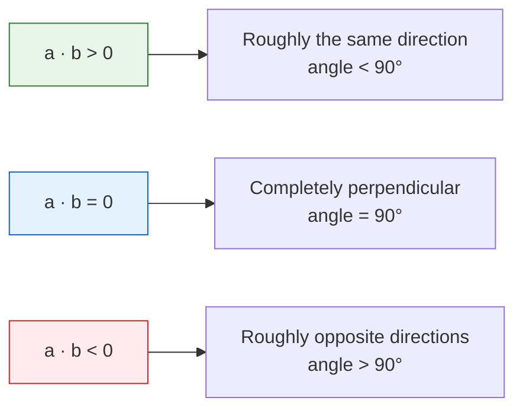
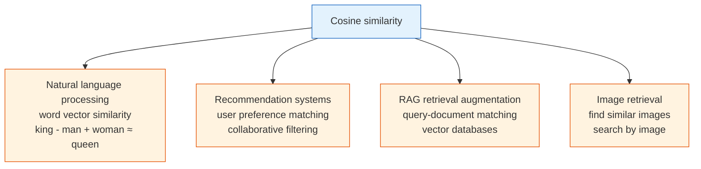

:::tip[Learning approach]
You do not need to “prove theorems” in this chapter. You only need to **understand the intuition and know how to implement it in code**. Each concept comes with visualization and NumPy code. It is okay if you do not fully understand the formulas—just understand the diagrams and code.
:::
## Learning Objectives

- Intuitively understand what a vector is (direction + magnitude)
- Master vector addition and scalar multiplication
- Understand the meaning of dot product
- Master cosine similarity — the most commonly used similarity measure in AI
- Implement all vector operations with NumPy

## First, set a very important learning expectation

Although this section includes code, **the code is not there to replace understanding**.
It is more like doing two things:

- Helping you turn abstract objects into something visible
- Helping you check whether your intuition is correct

If you finish this section and still cannot solve problems fluently right away, that is completely normal.
A more important standard is:

- Can you write a “real-world object” as a vector?
- Can you clearly explain what dot product and cosine similarity are comparing?
- Can you connect them to AI scenarios such as recommendation, retrieval, and RAG?

---

## First, build a map

The most important thing in this section is not memorizing terms, but first grasping the main thread:


You can understand this lesson as:

- The first half answers “how to write an object as a vector”
- The second half answers “how to compare whether two vectors are similar”

## Terms to Keep Handy

| Term | What it means | Why beginners often need it |
|---|---|---|
| `scalar` | A single number, such as `2` or `0.5` | Scalar multiplication means “use one number to scale the whole vector.” |
| `dimension` | The number of components in a vector | `[90, 85, 92]` has 3 dimensions because it has 3 numbers. |
| `shape` | NumPy’s description of array structure | `(3,)`, `(1, 3)`, and `(3, 1)` all hold 3 numbers but behave differently in multiplication. |
| `norm` | Vector length | `np.linalg.norm(a)` tells you how long or strong a vector is. |
| `NLP` | Natural Language Processing | Text vectors and word vectors are important examples of vectors in AI. |
| `vector database` | A database optimized for storing and searching vectors | It powers retrieval in many RAG and semantic search systems. |

Read this table as a safety net, not as vocabulary to memorize. When a later code example uses one of these words, return here and reconnect it to the current operation.

## What Is a Vector?

### Intuitive Understanding

**A vector = an ordered set of numbers.**

### A more beginner-friendly analogy

If this is your first time learning vectors, and “direction + magnitude” still feels a bit abstract, you can think of it as:

- An information card for an object

For example, a model evaluation run:

- Accuracy 0.86
- Latency 120 ms
- Memory 3.8 GB

Arrange these items in a fixed order,
and you get an information card that a computer can process:

- `[0.86, 120, 3.8]`

So the most basic meaning of a vector is not a “geometric shape,” but:

> **A stable way to write an object as a sequence of numbers.**

That is all. In AI, vectors are everywhere:

| AI scenario | Vector representation | Dimension |
|---------|---------|------|
| One model run | [accuracy, latency_ms, memory_gb] = [0.86, 120, 3.8] | 3D |
| The color of a pixel | [R, G, B] = [255, 128, 0] | 3D |
| The meaning of a word (word vector) | [0.2, -0.5, 0.8, ...] | Usually 100–300D |
| An image (flattened) | [pixel1, pixel2, ..., pixeln] | Tens of thousands to millions of dimensions |

```course-map
  root((Vectors in AI))
    Data representation
      Each row of data is a vector
      Images are pixel vectors
      Text is word vectors
    Similarity computation
      Recommendation systems
      Search engines
      Face recognition
    Model parameters
      Neural network weights
      Gradients are also vectors
```

### Geometric Intuition

In 2D space, a vector can be drawn as a **line segment with an arrow** — it has both **direction** and **magnitude** (length).

```python
import numpy as np
import matplotlib.pyplot as plt

plt.rcParams['font.sans-serif'] = ['Arial Unicode MS']
plt.rcParams['axes.unicode_minus'] = False

# Define two 2D vectors
a = np.array([3, 2])
b = np.array([1, 4])

# Plot vectors
fig, ax = plt.subplots(figsize=(6, 6))
ax.quiver(0, 0, a[0], a[1], angles='xy', scale_units='xy', scale=1,
          color='steelblue', linewidth=2, label=f'a = {a}')
ax.quiver(0, 0, b[0], b[1], angles='xy', scale_units='xy', scale=1,
          color='coral', linewidth=2, label=f'b = {b}')

ax.set_xlim(-1, 6)
ax.set_ylim(-1, 6)
ax.set_aspect('equal')
ax.grid(True, alpha=0.3)
ax.axhline(y=0, color='k', linewidth=0.5)
ax.axvline(x=0, color='k', linewidth=0.5)
ax.legend(fontsize=12)
ax.set_title('Geometric representation of 2D vectors')
plt.show()
```

**Interpretation**: vector a = [3, 2] starts at the origin, moves 3 steps to the right and 2 steps up.

:::note[How should you understand high-dimensional vectors?]
Vectors in AI are often hundreds or thousands of dimensions, so they cannot be drawn. But the mathematical operations are exactly the same — a vector is just **a sequence of numbers**, and all the rules apply to any dimension.
:::
### From a Real Data Record to a Vector

A point where beginners often get stuck is this: they know “a vector is a sequence of numbers,” but they do not know how that connects to real data.

```python
import numpy as np

model_run = {
    "accuracy": 0.86,
    "latency_ms": 120,
    "memory_gb": 3.8,
}

model_vector = np.array([
    model_run["accuracy"],
    model_run["latency_ms"],
    model_run["memory_gb"],
])

print("Model run vector:", model_vector)
print("Vector shape:", model_vector.shape)  # (3,)
```

The essence here is:

- In the real world, there are “meaningful fields”
- In the computer, they must become a “fixed-order numeric array”

Once you write an object as a vector, you can start doing mathematical operations.

```python
weights = np.array([0.7, -0.002, -0.03])
score = model_vector @ weights
print("Deployment score:", round(score, 3))  # 0.248
```

This already connects to a main thread in machine learning:

- Data is a vector
- Rules are also vectors
- If you take the dot product of the two, you get a score

---

## Basic Vector Operations

### Vector Addition

Adding two vectors = **adding the numbers at corresponding positions**.

```python
a = np.array([3, 2])
b = np.array([1, 4])

# Vector addition
c = a + b
print(f"a + b = {c}")  # [4, 6]
```

Geometric meaning: place b at the end of a, and the result points to the final endpoint.

```python
fig, ax = plt.subplots(figsize=(7, 7))

# Plot a
ax.quiver(0, 0, a[0], a[1], angles='xy', scale_units='xy', scale=1,
          color='steelblue', linewidth=2, label=f'a = {a}')
# Plot b (starting from the end of a)
ax.quiver(a[0], a[1], b[0], b[1], angles='xy', scale_units='xy', scale=1,
          color='coral', linewidth=2, label=f'b = {b}')
# Plot a + b
ax.quiver(0, 0, c[0], c[1], angles='xy', scale_units='xy', scale=1,
          color='green', linewidth=2.5, label=f'a + b = {c}')

ax.set_xlim(-1, 7)
ax.set_ylim(-1, 8)
ax.set_aspect('equal')
ax.grid(True, alpha=0.3)
ax.legend(fontsize=11)
ax.set_title('Vector addition: head-to-tail')
plt.show()
```

### Scalar Multiplication

Multiplying a vector by a number = **multiplying each component by that number**.

```python
a = np.array([3, 2])

# Scalar multiplication
print(f"2 * a = {2 * a}")     # [6, 4]  —— same direction, twice the length
print(f"0.5 * a = {0.5 * a}") # [1.5, 1.0]  —— same direction, half the length
print(f"-1 * a = {-1 * a}")   # [-3, -2]  —— reversed direction
```

```python
fig, ax = plt.subplots(figsize=(8, 6))

vectors = [
    (a, 'steelblue', f'a = {a}'),
    (2 * a, 'green', f'2a = {2*a}'),
    (0.5 * a, 'orange', f'0.5a = {0.5*a}'),
    (-1 * a, 'red', f'-a = {-1*a}'),
]

for vec, color, label in vectors:
    ax.quiver(0, 0, vec[0], vec[1], angles='xy', scale_units='xy', scale=1,
              color=color, linewidth=2, label=label)

ax.set_xlim(-5, 8)
ax.set_ylim(-4, 6)
ax.set_aspect('equal')
ax.grid(True, alpha=0.3)
ax.axhline(y=0, color='k', linewidth=0.5)
ax.axvline(x=0, color='k', linewidth=0.5)
ax.legend(fontsize=11)
ax.set_title('Scalar multiplication: scaling and flipping')
plt.show()
```

### Vector Length (Magnitude / Norm)


The **length** of a vector (also called **magnitude** or **norm**) is calculated using the Pythagorean theorem:

For vector a = [a1, a2], length = square root of (a1 squared + a2 squared)

```python
a = np.array([3, 4])

# Method 1: manual calculation
length_manual = np.sqrt(a[0]**2 + a[1]**2)
print(f"Manual length: {length_manual}")  # 5.0

# Method 2: NumPy built-in function (recommended)
length = np.linalg.norm(a)
print(f"NumPy length: {length}")  # 5.0
```

:::tip[The 3-4-5 triangle]
The length of vector [3, 4] is exactly 5 — the classic Pythagorean triple. In data science, we will often use `np.linalg.norm()` to compute vector length.
:::
### Unit Vector

A vector with length 1 is called a **unit vector**. If you divide any vector by its length, you get a unit vector in the same direction:

```python
a = np.array([3, 4])

# Normalize
unit_a = a / np.linalg.norm(a)
print(f"Unit vector: {unit_a}")                  # [0.6, 0.8]
print(f"Unit vector length: {np.linalg.norm(unit_a)}")  # 1.0
```

**Why is this important?** In AI, we often need to compare the **direction** of two vectors rather than their size. After normalization, only the directional information remains.

### A Shape Sense You Must Build as a Beginner

When many people first learn vectors, they can understand the concept, but get confused by `shape` as soon as they write code.

```python
import numpy as np

a = np.array([1, 2, 3])          # 1D vector
row = a.reshape(1, 3)            # row vector
col = a.reshape(3, 1)            # column vector

print("a.shape   =", a.shape)    # (3,)
print("row.shape =", row.shape)  # (1, 3)
print("col.shape =", col.shape)  # (3, 1)
```

They all look like “three numbers,” but in matrix multiplication they mean different things:

- `(3,)` is a normal 1D NumPy array
- `(1, 3)` explicitly means “1 row, 3 columns”
- `(3, 1)` explicitly means “3 rows, 1 column”

When you later learn matrices and neural networks, this `shape` sense is more important than memorizing formulas.

---

## Dot Product — The Most Important Vector Operation

### What Is the Dot Product?

The **dot product** of two vectors = **multiply corresponding positions and then sum**.

```python
a = np.array([1, 2, 3])
b = np.array([4, 5, 6])

# Method 1: manual calculation
dot_manual = a[0]*b[0] + a[1]*b[1] + a[2]*b[2]
print(f"Manual: {dot_manual}")  # 1*4 + 2*5 + 3*6 = 32

# Method 2: NumPy (recommended)
dot_np = np.dot(a, b)
print(f"NumPy: {dot_np}")  # 32

# Method 3: @ operator (Python 3.5+)
dot_at = a @ b
print(f"@ operator: {dot_at}")  # 32
```

### Geometric Meaning of the Dot Product

The dot product reflects the **directional relationship** between two vectors:



```python
# Same direction
a = np.array([1, 0])
b = np.array([1, 1])
print(f"Same direction: a · b = {np.dot(a, b)}")  # 1 (positive)

# Perpendicular
a = np.array([1, 0])
b = np.array([0, 1])
print(f"Perpendicular: a · b = {np.dot(a, b)}")  # 0

# Opposite direction
a = np.array([1, 0])
b = np.array([-1, 0])
print(f"Opposite direction: a · b = {np.dot(a, b)}")  # -1 (negative)
```

### Why Can the Dot Product Be Understood as “Alignment”?

The dot product can also be understood from another very important angle:

> **The more one vector projects onto the direction of another vector, the larger the dot product usually is.**

Its formula is:

`a · b = |a| × |b| × cos(theta)`

You do not need to derive it first. Just remember three things for now:

1. The more two vectors point in the same direction, the closer `cos(theta)` is to 1
2. The more two vectors are perpendicular, the closer `cos(theta)` is to 0
3. The more two vectors point in opposite directions, the closer `cos(theta)` is to -1

So the dot product contains both:

- Length information
- Direction information

### Understanding the Dot Product with Visualization

```python
fig, axes = plt.subplots(1, 3, figsize=(15, 4))

cases = [
    ([2, 1], [1, 2], 'Same direction (dot product > 0)'),
    ([2, 0], [0, 2], 'Perpendicular (dot product = 0)'),
    ([2, 1], [-1, -2], 'Opposite direction (dot product < 0)'),
]

for ax, (a, b, title) in zip(axes, cases):
    a, b = np.array(a), np.array(b)
    dot = np.dot(a, b)

    ax.quiver(0, 0, a[0], a[1], angles='xy', scale_units='xy', scale=1,
              color='steelblue', width=0.02, label='a')
    ax.quiver(0, 0, b[0], b[1], angles='xy', scale_units='xy', scale=1,
              color='coral', width=0.02, label='b')

    ax.set_xlim(-3, 4)
    ax.set_ylim(-3, 4)
    ax.set_aspect('equal')
    ax.grid(True, alpha=0.3)
    ax.axhline(y=0, color='k', linewidth=0.5)
    ax.axvline(x=0, color='k', linewidth=0.5)
    ax.set_title(f'{title}\na·b = {dot}')
    ax.legend()

plt.tight_layout()
plt.show()
```

---

## Cosine Similarity — The Most Common Similarity Measure in AI

### From Dot Product to Cosine Similarity

The size of the dot product depends not only on direction, but also on vector length. If we only care about **how similar the directions are**, we need to remove the effect of length:

**Cosine similarity = dot product / (length of vector A × length of vector B)**

```python
def cosine_similarity(a, b):
    """Compute the cosine similarity between two vectors"""
    dot_product = np.dot(a, b)
    norm_a = np.linalg.norm(a)
    norm_b = np.linalg.norm(b)
    if norm_a == 0 or norm_b == 0:
        raise ValueError("Cosine similarity is undefined for zero vectors.")
    return dot_product / (norm_a * norm_b)
```

The zero-vector check matters because a vector with length `0` has no direction. Cosine similarity compares direction, so dividing by a zero length would produce a misleading result or a runtime warning.

The range of cosine similarity is:

| Value | Meaning |
|----|------|
| 1 | Exactly the same direction |
| 0 | Completely unrelated (perpendicular) |
| -1 | Exactly opposite directions |

### Example: Runtime Profile Similarity

Suppose three model-serving profiles record five normalized signals:

```python
# Profiles for [accuracy, throughput, low_latency, low_memory, stability] (1-5)
baseline = np.array([4, 3, 2, 2, 4])
quantized = np.array([4, 3, 3, 3, 4])
oversized = np.array([5, 1, 1, 1, 3])

# Compute pairwise similarity
print(f"Baseline vs quantized: {cosine_similarity(baseline, quantized):.4f}")
print(f"Baseline vs oversized: {cosine_similarity(baseline, oversized):.4f}")
print(f"Quantized vs oversized:{cosine_similarity(quantized, oversized):.4f}")
```

Output:
```
Baseline vs quantized: 0.9857
Baseline vs oversized: 0.9159
Quantized vs oversized:0.8775
```

**Interpretation**: the quantized model is closer to the baseline than the oversized model is to the quantized model. This is the same idea behind vector search and recommendations: compare directions first, then inspect the closest candidates with domain judgment.

### Applications of Cosine Similarity in AI



:::tip[You will use cosine similarity again and again]
- **NLP (11 Natural Language Processing)**: compute how similar two word vectors are, for example, the cosine similarity between "cat" and "dog" is high
- **RAG (8 LLM Application Development and RAG)**: use a vector database to retrieve the most relevant document chunks
- **Recommendation systems**: find users with the most similar preferences

So cosine similarity is a tool you will encounter repeatedly throughout your AI learning journey.
:::
### Visualization: Vectors with Different Cosine Similarities

```python
fig, axes = plt.subplots(1, 4, figsize=(16, 4))

# Vector pairs with different similarities
pairs = [
    ([1, 0], [1, 0.1], '≈ 1.0 (almost identical)'),
    ([1, 0], [0.7, 0.7], '≈ 0.7 (fairly similar)'),
    ([1, 0], [0, 1], '= 0 (unrelated)'),
    ([1, 0], [-0.9, -0.3], '≈ -0.95 (opposite)'),
]

for ax, (a, b, desc) in zip(axes, pairs):
    a, b = np.array(a), np.array(b)
    sim = cosine_similarity(a, b)

    ax.quiver(0, 0, a[0], a[1], angles='xy', scale_units='xy', scale=1,
              color='steelblue', width=0.02)
    ax.quiver(0, 0, b[0], b[1], angles='xy', scale_units='xy', scale=1,
              color='coral', width=0.02)

    ax.set_xlim(-1.5, 1.5)
    ax.set_ylim(-1, 1.5)
    ax.set_aspect('equal')
    ax.grid(True, alpha=0.3)
    ax.set_title(f'cos = {sim:.2f}\n{desc}', fontsize=10)

plt.tight_layout()
plt.show()
```

### A Minimal Retrieval Example: Find the Most Similar Item Among 3 Candidates

Although the following example uses hand-crafted small vectors, the idea is the same as vector retrieval, RAG, and semantic search.

```python
import numpy as np

def cosine_similarity(a, b):
    return np.dot(a, b) / (np.linalg.norm(a) * np.linalg.norm(b))

query = np.array([0.9, 0.1, 0.8, 0.2])

docs = {
    "Document A: Machine Learning Basics": np.array([0.8, 0.2, 0.75, 0.1]),
    "Document B: Travel Guide":     np.array([0.1, 0.9, 0.2, 0.8]),
    "Document C: Deep Learning Basics": np.array([0.85, 0.15, 0.7, 0.25]),
}

scores = []
for name, vec in docs.items():
    sim = cosine_similarity(query, vec)
    scores.append((name, sim))

scores.sort(key=lambda x: x[1], reverse=True)

for name, sim in scores:
    print(f"{name}: {sim:.4f}")
```

Expected output:

```text
Document C: Deep Learning Basics: 0.9964
Document A: Machine Learning Basics: 0.9922
Document B: Travel Guide: 0.3333
```

You will find that the document with the highest similarity is usually the one whose semantic direction is closest to the query.

---

## NumPy Vector Operations Summary

Let’s organize all the operations learned in this section with NumPy:

```python
import numpy as np

# ========== Create vectors ==========
a = np.array([1, 2, 3])
b = np.array([4, 5, 6])

# ========== Basic operations ==========
print("Addition:", a + b)           # [5, 7, 9]
print("Subtraction:", a - b)        # [-3, -3, -3]
print("Scalar multiplication:", 3 * a)           # [3, 6, 9]
print("Elementwise multiplication:", a * b)       # [4, 10, 18]

# ========== Dot product ==========
print("Dot product:", np.dot(a, b))    # 32
print("Dot product:", a @ b)           # 32 (equivalent)

# ========== Length (norm) ==========
print("Length:", np.linalg.norm(a))   # 3.742

# ========== Normalization ==========
unit_a = a / np.linalg.norm(a)
print("Unit vector:", unit_a)

# ========== Cosine similarity ==========
cos_sim = np.dot(a, b) / (np.linalg.norm(a) * np.linalg.norm(b))
print("Cosine similarity:", cos_sim)   # 0.9746

# scikit-learn also provides a built-in function
# from sklearn.metrics.pairwise import cosine_similarity
```

---

## After learning this, what should you bring to the next section?

After finishing vectors, the most valuable questions to carry forward are:

1. If one object can be written as a vector, how do we write many objects at once?
2. If two vectors can be compared for similarity, how do we transform a whole batch of vectors at once?
3. Why do neural networks not process just one vector at a time, but instead always process a batch?

These three questions will naturally lead you to:

- [4.1.3 Matrices: Batch Transformations of Data](/ch04-ai-math/ch01-linear-algebra/02-matrices/)

:::note[Connection to later sections]
- **Next section**: Matrices — batch transformations for a set of vectors
- **5 Introduction to Machine Learning to Practice**: in linear regression, each sample is a feature vector, and the model is finding a weight vector
- **11 Natural Language Processing (elective track)**: word vectors, sentence vectors, and cosine similarity appear repeatedly
- **8 LLM Application Development and RAG**: the core of vector databases is similarity retrieval over high-dimensional vectors
:::
---

## Evidence to Keep

Keep this page's proof of learning as a small evidence card:

```text
math_object: vector, matrix, eigenvalue, basis, or vector space concept
numeric_example: small numbers or NumPy snippet used to compute it
visual_or_output: shape, transformed point, similarity score, eigen direction, or projection
ai_link: where this appears in embeddings, batches, PCA, neural layers, or attention
Expected_output: calculation plus one sentence connecting it to an AI operation
```

## Summary

| Concept | Intuitive understanding | NumPy implementation |
|------|---------|-----------|
| Vector | An ordered set of numbers | `np.array([1, 2, 3])` |
| Vector addition | Add corresponding positions | `a + b` |
| Scalar multiplication | Scale the vector | `k * a` |
| Vector length | Distance from the origin to the endpoint | `np.linalg.norm(a)` |
| Dot product | Measures the directional relationship between two vectors | `np.dot(a, b)` or `a @ b` |
| Cosine similarity | Similarity that looks only at direction, not length | `dot / (norm_a * norm_b)` |

## What should you take away from this section?

- A vector is first of all a way to represent an object, not just an arrow
- The dot product is best understood first as “alignment”
- Cosine similarity is best understood first as “how close the directions are”
- This is why many retrieval, recommendation, and matching systems in AI cannot do without vectors

## Hands-on Exercises

### Exercise 1: Vector Operations

Given vectors a = [2, 3, -1] and b = [1, -2, 4], use NumPy to compute:
1. a + b
2. 3a - 2b
3. The length of a
4. The dot product of a and b
5. The cosine similarity of a and b

### Exercise 2: Find the Most Similar Runtime Profile

Given three model-serving profiles:

```python
profiles = {
    "baseline": np.array([4, 3, 2, 2, 4]),
    "quantized": np.array([4, 3, 3, 3, 4]),
    "oversized": np.array([5, 1, 1, 1, 3]),
}
```

Task: compute the cosine similarity between every pair of profiles, and find the closest pair and the most different pair.

### Exercise 3: Visualize Vector Addition

Use Matplotlib to draw the process of the following vector addition (with arrows):
- a = [2, 3], b = [-1, 2], and draw a, b, and a+b

Hint: refer to the code in Section 2.1.


<details>
<summary>Reference implementation and walkthrough</summary>

- For `a=[2,3,-1]` and `b=[1,-2,4]`, `a+b=[3,1,3]`, `3a-2b=[4,13,-11]`, `||a||=sqrt(14)≈3.742`, `a·b=-8`, and cosine similarity is about `-0.8018`.
- For the runtime profile vectors, the closest pair should be baseline and quantized. If you change the latency or memory dimensions, the nearest profile can change; that is the point of turning a product trade-off into numbers.
- The vector-addition plot should place `a`, then `b` from the tip of `a`, and show `a+b=[1,5]` as the final arrow from the origin. The geometry should match the numbers.

</details>
