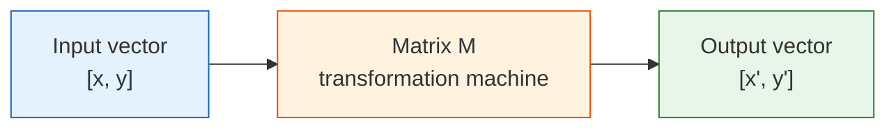
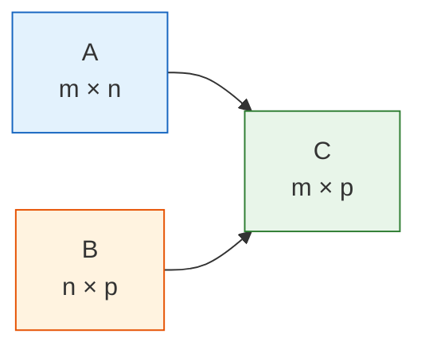
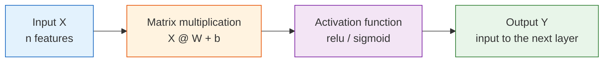

## Learning Objectives

- Build an intuitive understanding of what a matrix is (a table / a batch of operations)
- Master the meaning and calculation of matrix multiplication
- Understand the intuition behind transpose and inverse matrices
- Understand why every layer in a neural network is matrix multiplication
- Implement matrix operations with NumPy

## First, an important learning expectation

This section is not about finishing matrix theory. Instead, it is about stabilizing the three most common ideas you will see in AI:

- A matrix can hold a batch of data
- A matrix can also represent a batch transformation
- Matrix multiplication appears again and again in later models

---

## First, build a map

If you only think of matrices as “number tables,” this topic can quickly become abstract. A more beginner-friendly view is:


So the most important thing in this section is not memorizing the matrix definition, but understanding:

- Why a batch of data naturally becomes a matrix
- Why matrix multiplication can process a batch of samples at once
- Why you keep seeing `X @ W` all over deep learning code

## Terms and Code Assumptions to Keep Handy

| Term | What it means | Why it matters here |
|---|---|---|
| `batch` | A group of samples processed together | A matrix often stores one batch: rows are samples, columns are features. |
| `feature` | One measurable input column, such as area or age | Matrix columns usually correspond to features. |
| `shape` | NumPy’s array size description | Matrix multiplication works only when the inner dimensions match. |
| `bias` / `b` | A learnable offset added after multiplication | `X @ W + b` lets a model shift the output, not only rotate or scale it. |
| `ReLU` | Rectified Linear Unit activation | It changes negative values to `0` and keeps positive values, adding nonlinearity. |
| `determinant` | A number describing whether a square matrix collapses space | If it is `0`, the matrix has no inverse. |
| `singular matrix` | A matrix with no inverse | It loses information during transformation, so the original input cannot be recovered. |

Unless a snippet explicitly says otherwise, assume it needs `import numpy as np`. Plotting examples also need `import matplotlib.pyplot as plt`.

## What is a matrix?

### Two ways to understand it

**Idea 1: A matrix is just a table**

### A better analogy for beginners

If a vector is like “an information card for an object,”
then a matrix can first be understood as:

- A neat stack of information cards

That is why in machine learning:

- One sample is a vector
- A batch of samples naturally becomes a matrix

You are already familiar with this — a Pandas DataFrame is essentially a matrix.

```python
import numpy as np

# Scores for 3 students across 4 subjects
scores = np.array([
    [85, 92, 78, 90],   # Student 1
    [72, 88, 95, 85],   # Student 2
    [90, 76, 88, 92],   # Student 3
])
print(f"Shape: {scores.shape}")  # (3, 4) → 3 rows, 4 columns
```

**Idea 2: A matrix is a “transformation machine”**

Give a matrix a vector, and it outputs a new vector — just like a function: input → transform → output.



This is the core idea of linear algebra: **a matrix = a transformation**.

### Basic matrix properties

```python
M = np.array([
    [1, 2, 3],
    [4, 5, 6],
])

print(f"Shape: {M.shape}")              # (2, 3) → 2 rows, 3 columns
print(f"Number of rows: {M.shape[0]}")   # 2
print(f"Number of columns: {M.shape[1]}")# 3
print(f"Total elements: {M.size}")       # 6
print(f"Data type: {M.dtype}")           # int64
print(f"Row 0: {M[0]}")                  # [1 2 3]
print(f"Row 1, Column 2: {M[1, 2]}")     # 6
```

### From “one sample” to “a batch of samples”

If you already learned vectors, you can think of a matrix as:

> **Many vectors stacked together in a consistent format.**

```python
import numpy as np

# [area, house age, distance to subway]
house_1 = np.array([88, 5, 1.2])
house_2 = np.array([120, 8, 0.5])
house_3 = np.array([75, 2, 1.8])

X = np.array([
    house_1,
    house_2,
    house_3,
])

print(X)
print("Shape:", X.shape)  # (3, 3)
```

This means:

- Each row is a sample
- Each column is a feature

This is the most common way data is organized in machine learning and deep learning.

---

## Basic matrix operations

### Matrix addition and scalar multiplication

Just like vectors — **add/multiply corresponding positions**:

```python
A = np.array([[1, 2], [3, 4]])
B = np.array([[5, 6], [7, 8]])

print("Addition:\n", A + B)     # [[6, 8], [10, 12]]
print("Scalar multiplication:\n", 3 * A)     # [[3, 6], [9, 12]]
```

### Matrix multiplication — the most important operation

Matrix multiplication is **completely different** from normal number multiplication! The rule is:

**Each element of the result = dot product of one row from the left matrix and one column from the right matrix**

```python
A = np.array([[1, 2],
              [3, 4]])   # 2×2

B = np.array([[5, 6],
              [7, 8]])   # 2×2

# Matrix multiplication
C = A @ B    # recommended
# C = np.dot(A, B)  # equivalent

print("A @ B =")
print(C)
# [[19, 22],     ← 1*5+2*7=19, 1*6+2*8=22
#  [43, 50]]     ← 3*5+4*7=43, 3*6+4*8=50
```

**Manual check**:
- C[0,0] = 1×5 + 2×7 = 5 + 14 = 19
- C[0,1] = 1×6 + 2×8 = 6 + 16 = 22
- C[1,0] = 3×5 + 4×7 = 15 + 28 = 43
- C[1,1] = 3×6 + 4×8 = 18 + 32 = 50

### Size rules for matrix multiplication




**Key rule: the number of columns in the left matrix must equal the number of rows in the right matrix**, and the result shape is `(rows of the left matrix, columns of the right matrix)`.

```python
A = np.array([[1, 2, 3],
              [4, 5, 6]])   # 2×3

B = np.array([[1, 2],
              [3, 4],
              [5, 6]])       # 3×2

C = A @ B                    # 2×2 ✓ (3 == 3)
print(f"A({A.shape}) @ B({B.shape}) = C({C.shape})")
print(C)
# [[22, 28],
#  [49, 64]]
```

:::caution[Matrix multiplication is not commutative]
`A @ B` and `B @ A` are usually **not equal**! Their shapes may even be different. This is unlike number multiplication (3×5 = 5×3), so beginners should pay special attention.
:::
```python
A = np.array([[1, 2], [3, 4]])
B = np.array([[5, 6], [7, 8]])

print("A @ B =\n", A @ B)
print("B @ A =\n", B @ A)
print("A@B == B@A?", np.array_equal(A @ B, B @ A))  # False
```

### Hand-calculate one “sample matrix × weight matrix”

This is one of the most important steps for beginners to fully understand, because it directly connects to neural networks later.

```python
X = np.array([
    [1, 2],
    [3, 4],
    [5, 6],
])  # 3×2

W = np.array([
    [0.1, 1.0],
    [0.2, 0.5],
])  # 2×2

Z = X @ W
print(Z.round(2))
```

Expected output:

```text
[[0.5 2. ]
 [1.1 5. ]
 [1.7 8. ]]
```

You can understand it row by row:

- Output of row 1 = transformation of sample 1 `[1, 2]` with the weight matrix
- Output of row 2 = transformation of sample 2 `[3, 4]` with the weight matrix
- Output of row 3 = transformation of sample 3 `[5, 6]` with the weight matrix

The power of matrix multiplication is:

> **It does not compute only one sample — it computes a whole batch at once.**

### The 4-step shape check beginners need most

When your matrix multiplication keeps failing, do not panic. Check these four things first:

1. What is the shape of the left matrix?
2. What is the shape of the right matrix?
3. Does the number of columns on the left equal the number of rows on the right?
4. What output shape do you expect?

```python
print("X.shape =", X.shape)
print("W.shape =", W.shape)
print("Z.shape =", (X @ W).shape)
```

---

## Matrices as “transformations” — intuitive visualization

### Rotation transform

Matrices can perform **rotation, scaling, shearing**, and other transformations on vectors. Below, we use a matrix to rotate a set of 2D points.

```python
import matplotlib.pyplot as plt
plt.rcParams['font.sans-serif'] = ['Arial Unicode MS']
plt.rcParams['axes.unicode_minus'] = False

# Define 4 vertices of a square + return to the starting point
square = np.array([
    [0, 0],
    [1, 0],
    [1, 1],
    [0, 1],
    [0, 0],  # back to the start, convenient for drawing a closed shape
]).T  # transpose to 2×5 for matrix multiplication

# 45° rotation matrix
theta = np.radians(45)  # degrees to radians
R = np.array([
    [np.cos(theta), -np.sin(theta)],
    [np.sin(theta),  np.cos(theta)]
])
print(f"Rotation matrix:\n{R.round(3)}")

# Apply rotation
rotated = R @ square  # matrix multiplication!

fig, axes = plt.subplots(1, 2, figsize=(12, 5))

# Before transformation
axes[0].plot(square[0], square[1], 'b-o', linewidth=2, markersize=8)
axes[0].fill(square[0], square[1], alpha=0.2, color='steelblue')
axes[0].set_xlim(-1.5, 1.5)
axes[0].set_ylim(-0.5, 1.8)
axes[0].set_aspect('equal')
axes[0].grid(True, alpha=0.3)
axes[0].set_title('Before transformation (original square)')

# After transformation
axes[1].plot(square[0], square[1], 'b--', alpha=0.3, linewidth=1)
axes[1].plot(rotated[0], rotated[1], 'r-o', linewidth=2, markersize=8)
axes[1].fill(rotated[0], rotated[1], alpha=0.2, color='coral')
axes[1].set_xlim(-1.5, 1.5)
axes[1].set_ylim(-0.5, 1.8)
axes[1].set_aspect('equal')
axes[1].grid(True, alpha=0.3)
axes[1].set_title('After transformation (rotated 45°)')

plt.suptitle('Matrix transformation = rotation', fontsize=14)
plt.tight_layout()
plt.show()
```

**Key insight**: multiplying a 2×2 matrix by a 2D vector completes a spatial transformation. This idea generalizes to any dimension.

### Different transformation effects

```python
fig, axes = plt.subplots(1, 4, figsize=(18, 4))

# Original shape
triangle = np.array([
    [0, 0], [1, 0], [0.5, 1], [0, 0]
]).T

transforms = [
    (np.eye(2), 'Original (identity matrix)'),
    (np.array([[2, 0], [0, 2]]), '2× scaling'),
    (np.array([[1, 0.5], [0, 1]]), 'Horizontal shear'),
    (np.array([[-1, 0], [0, 1]]), 'Horizontal flip'),
]

for ax, (M, title) in zip(axes, transforms):
    transformed = M @ triangle
    ax.plot(triangle[0], triangle[1], 'b--', alpha=0.3)
    ax.fill(triangle[0], triangle[1], alpha=0.1, color='blue')
    ax.plot(transformed[0], transformed[1], 'r-o', linewidth=2, markersize=6)
    ax.fill(transformed[0], transformed[1], alpha=0.2, color='coral')
    ax.set_xlim(-2.5, 2.5)
    ax.set_ylim(-0.5, 2.5)
    ax.set_aspect('equal')
    ax.grid(True, alpha=0.3)
    ax.set_title(title)

plt.tight_layout()
plt.show()
```

---

## Transpose and inverse matrices

### Transpose

**Transpose = swap rows and columns**. The original i-th row becomes the i-th column.

```python
A = np.array([
    [1, 2, 3],
    [4, 5, 6],
])
print(f"Shape of A: {A.shape}")      # (2, 3)
print(f"Transpose of A:\n{A.T}")
print(f"Shape after transpose: {A.T.shape}")   # (3, 2)
```

Output:
```
Transpose of A:
[[1 4]
 [2 5]
 [3 6]]
```

**When do we use transpose?**
- Data processing: converting “rows are samples, columns are features” into “rows are features, columns are samples”
- Matrix operations: some formulas require transpose to make matrix dimensions match

### Special matrices

```python
# Identity matrix (all 1s on the diagonal)
I = np.eye(3)
print("Identity matrix:\n", I)
# [[1. 0. 0.]
#  [0. 1. 0.]
#  [0. 0. 1.]]

# Property of the identity matrix: A @ I = I @ A = A
A = np.array([[1, 2], [3, 4]])
print("A @ I == A?", np.allclose(A @ np.eye(2), A))  # True
```

:::tip[The identity matrix is like the number 1]
In number operations, any number multiplied by 1 stays the same. In matrix operations, any matrix multiplied by the identity matrix also stays the same.
:::
### Inverse matrix

If matrix A is a “transformation,” then its inverse matrix A⁻¹ is the **“reverse transformation”** — it undoes A’s operation.

```python
A = np.array([[2, 1],
              [1, 1]])

# Compute inverse matrix
A_inv = np.linalg.inv(A)
print("Inverse of A:\n", A_inv)

# Verify: A @ A_inv = identity matrix
print("A @ A_inv =\n", (A @ A_inv).round(10))
# [[1. 0.]
#  [0. 1.]]  → identity matrix!
```

**Intuition**: If A rotates a vector by 45°, then A⁻¹ rotates it back. If A scales a vector by 2, then A⁻¹ scales it down by 2.

```python
# Visualization: transform → inverse transform = back to the original point
v = np.array([1, 2])

transformed = A @ v           # transform with A
recovered = A_inv @ transformed  # recover with A_inv

print(f"Original: {v}")
print(f"Transformed: {transformed}")
print(f"Recovered: {recovered}")   # same as original!
```

:::caution[Not all matrices have an inverse]
If the determinant of a matrix is 0, it has no inverse.
```python
# This matrix has no inverse
singular = np.array([[1, 2], [2, 4]])
try:
    np.linalg.inv(singular)
except np.linalg.LinAlgError as e:
    print(f"Error: {e}")  # Singular matrix
```
Intuition: such a matrix flattens 2D space into a line, information is lost, and it cannot be recovered.
:::
---

## Matrices and neural networks

### The essence of neural networks

This is the most important insight in the whole lesson: **each layer of a neural network is essentially a matrix multiplication + an activation function.**



### From the single-neuron formula to the matrix formula

If you only look at a single sample, one neural network layer is actually:

`output = input vector · weight vector + bias`

```python
import numpy as np

x = np.array([1.0, 0.5, -0.3])
w = np.array([0.2, -0.4, 0.6])
b = 0.1

y = x @ w + b
print(round(y, 4))
```

Expected output:

```text
-0.08
```

If we do not compute just 1 sample, but a whole batch at once, it naturally becomes:

`Z = X @ W + b`

Here:

- `X` is the sample matrix
- `W` is the weight matrix
- `b` is the bias
- `Z` is the linear output

### Simulating one neural network layer with code

```python
# Simulate the forward pass of one neural network layer

# Input: 3 samples, each with 4 features
X = np.array([
    [1.0, 0.5, -0.3, 0.8],
    [0.2, -0.1, 0.7, 0.3],
    [0.9, 0.4, 0.1, -0.5],
])
print(f"Input X: {X.shape}")  # (3, 4)

# Weight matrix: map 4 features to 2 outputs
rng = np.random.default_rng(seed=42)
W = rng.normal(size=(4, 2)) * 0.5
print(f"Weight W: {W.shape}")  # (4, 2)

# Bias
b = np.zeros(2)

# Forward pass: matrix multiplication + bias
Z = X @ W + b               # (3, 4) @ (4, 2) = (3, 2)
print(f"Linear output Z: {Z.shape}")

# Activation function (ReLU: negative values become 0, positive values stay the same)
def relu(x):
    return np.maximum(0, x)

output = relu(Z)
print(f"Output after activation: {output.shape}")  # (3, 2)
print(f"\nFinal output:\n{output.round(3)}")
```

Expected output with `seed=42`:

```text
Input X: (3, 4)
Weight W: (4, 2)
Linear output Z: (3, 2)
Output after activation: (3, 2)

Final output:
[[0.684 0.   ]
 [0.    0.   ]
 [0.158 0.   ]]
```

**Explanation**:
- 3 samples (3 rows), each with 4 features (4 columns)
- The weight matrix W is 4×2, mapping 4D features to 2D
- Matrix multiplication processes all samples at once — this is the power of **batch computation**
- The bias `b` has shape `(2,)`. NumPy automatically adds it to every row of `Z`; this is called broadcasting.

### Multi-layer network = chained matrix multiplications

```python
# Simulate a 3-layer neural network
rng = np.random.default_rng(seed=42)

X = rng.normal(size=(5, 10))  # 5 samples, 10 features

# Layer 1: 10 → 8
W1 = rng.normal(size=(10, 8)) * 0.3
h1 = relu(X @ W1)
print(f"Layer 1 output: {h1.shape}")  # (5, 8)

# Layer 2: 8 → 4
W2 = rng.normal(size=(8, 4)) * 0.3
h2 = relu(h1 @ W2)
print(f"Layer 2 output: {h2.shape}")  # (5, 4)

# Layer 3 (output layer): 4 → 2
W3 = rng.normal(size=(4, 2)) * 0.3
output = h2 @ W3  # output layers usually do not use ReLU
print(f"Final output:   {output.shape}")  # (5, 2)
```

### The 3 matrix mistakes beginners make most easily

1. Mistaking element-wise multiplication `A * B` for matrix multiplication
   Real matrix multiplication uses `A @ B`.

2. Starting to multiply without checking shapes first
   If the `shape` is wrong, you will definitely get an error later.

3. Not understanding what “each row represents”
   Just remember: “each row often represents one sample,” and things become much easier.

:::note[Why not use only matrix multiplication?]
Without an activation function (`relu`), multiple matrix multiplications can be combined into one:
- `(X @ W1) @ W2 = X @ (W1 @ W2)`
- There would be no difference between a multi-layer network and a single-layer one!

The activation function introduces **nonlinearity**, allowing the network to learn complex patterns. That is why each layer needs “matrix multiplication + activation function.”
:::
---

## Practical use case: solving linear equations

One classic application of matrices is solving systems of linear equations.

```
2x + y = 5
x + 3y = 7
```

Write it in matrix form: A @ x = b

```python
# Coefficient matrix
A = np.array([[2, 1],
              [1, 3]])
# Constants on the right-hand side
b = np.array([5, 7])

# Solve the equations
x = np.linalg.solve(A, b)
print(f"Solution: x = {x[0]:.2f}, y = {x[1]:.2f}")
# Solution: x = 1.60, y = 1.80

# Verify
print(f"Check: A @ x = {A @ x}")  # [5. 7.] ✓
```

---

## NumPy matrix operations summary

```python
import numpy as np

# ========== Create matrices ==========
A = np.array([[1, 2], [3, 4]])
B = np.array([[5, 6], [7, 8]])
I = np.eye(2)                          # identity matrix
Z = np.zeros((3, 4))                   # all-zero matrix
rng = np.random.default_rng(seed=42)
R = rng.normal(size=(3, 4))            # random matrix

# ========== Basic operations ==========
print("Addition:\n", A + B)
print("Scalar multiplication:\n", 2 * A)
print("Element-wise multiplication:\n", A * B)            # Note: this is not matrix multiplication!

# ========== Matrix multiplication ==========
print("Matrix multiplication:\n", A @ B)            # recommended
print("Matrix multiplication:\n", np.dot(A, B))     # equivalent
print("Matrix multiplication:\n", np.matmul(A, B))  # equivalent

# ========== Transpose ==========
print("Transpose:\n", A.T)

# ========== Inverse matrix ==========
print("Inverse matrix:\n", np.linalg.inv(A))

# ========== Determinant ==========
print("Determinant:", np.linalg.det(A))      # -2.0

# ========== Solve equations ==========
b = np.array([1, 2])
x = np.linalg.solve(A, b)
print("Equation solution:", x)
```

---

## After learning this, what should you bring to the next section?

After reading about matrices, the most valuable questions to bring forward are:

1. How do matrices change most vectors?
2. Are there special directions that still keep their original direction after transformation?
3. Why do these “special directions” lead directly to PCA and dimensionality reduction?

These questions will naturally lead you to:

- [4.1.4 Eigenvalues and Eigenvectors](/ch04-ai-math/ch01-linear-algebra/03-eigenvalues/)

:::note[Connecting to later topics]
- **Next section**: Eigenvalues and eigenvectors — special vectors that “do not change direction” under matrix transformation
- **Neural networks**: each layer is matrix multiplication + activation function
- **Image processing**: the underlying operation of convolution is also matrix computation
:::
---

## Evidence to Keep

Keep this page's proof of learning as a small evidence card:

```text
math_object: vector, matrix, eigenvalue, basis, or vector space concept
numeric_example: small numbers or NumPy snippet used to compute it
visual_or_output: shape, transformed point, similarity score, eigen direction, or projection
ai_link: where this appears in embeddings, batches, PCA, neural layers, or attention
Expected_output: calculation plus one sentence connecting it to an AI operation
```

## Summary

| Concept | Intuitive understanding | NumPy implementation |
|------|---------|-----------|
| Matrix | A table / a transformation | `np.array([[1,2],[3,4]])` |
| Matrix multiplication | Combination of row-column dot products | `A @ B` |
| Transpose | Swap rows and columns | `A.T` |
| Identity matrix | A transformation that “does nothing” | `np.eye(n)` |
| Inverse matrix | Undo a transformation | `np.linalg.inv(A)` |
| Solving equations | Ax = b → x = ? | `np.linalg.solve(A, b)` |

## What should you take away from this section?

- A matrix can both store “a batch of data” and represent “one transformation”
- The best first understanding of matrix multiplication is “batch dot product”
- That is why you keep seeing `X @ W` everywhere in later AI code

## Hands-on practice

### Exercise 1: Manually verify matrix multiplication

Given:
```python
A = np.array([[1, 0, 2],
              [0, 3, 1]])    # 2×3

B = np.array([[2, 1],
              [0, 4],
              [3, 2]])        # 3×2
```

1. Manually compute the result of A @ B
2. Then verify it with NumPy

### Exercise 2: Rotation transform

Use a rotation matrix to rotate a triangle by 90° and draw a comparison chart before and after the transformation.

Hint: the 90° rotation matrix is `[[0, -1], [1, 0]]`

### Exercise 3: Simulate a two-layer neural network

Create a two-layer network with 100 input samples (each with 5 features), where the first layer outputs 3 values and the second layer outputs 1 value. Print the input and output shapes of each layer.


<details>
<summary>Reference implementation and walkthrough</summary>

- For the given matrices, manual multiplication gives `A @ B = [[8, 5], [3, 14]]`; NumPy should match exactly.
- A 90-degree rotation matrix `[[0,-1],[1,0]]` maps `(x,y)` to `(-y,x)`. The triangle should keep its size and shape while rotating counterclockwise.
- For the two-layer network, shapes should flow like `(100,5) @ (5,3) -> (100,3)` and then `(100,3) @ (3,1) -> (100,1)`. Shape evidence is the answer’s best safety check.

</details>
