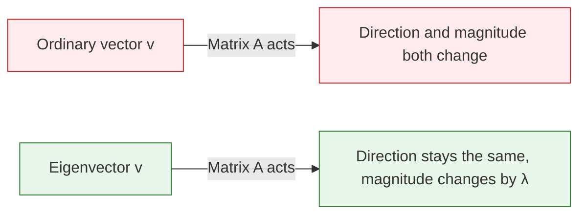
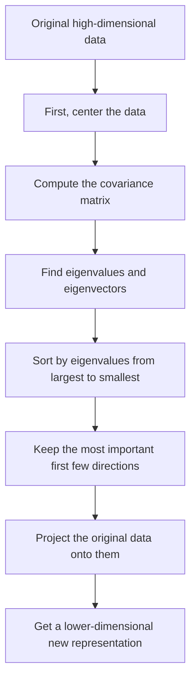
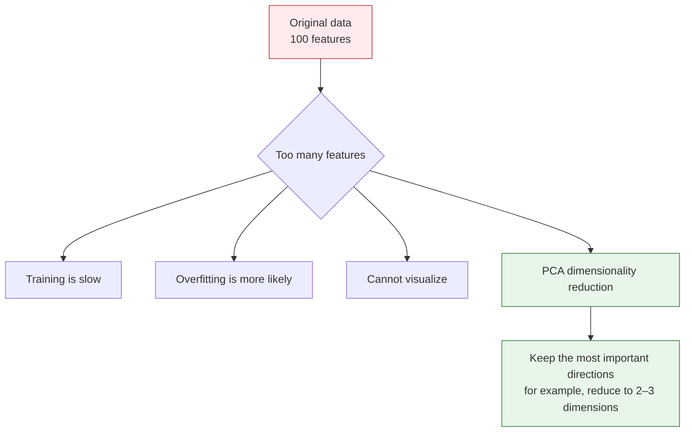
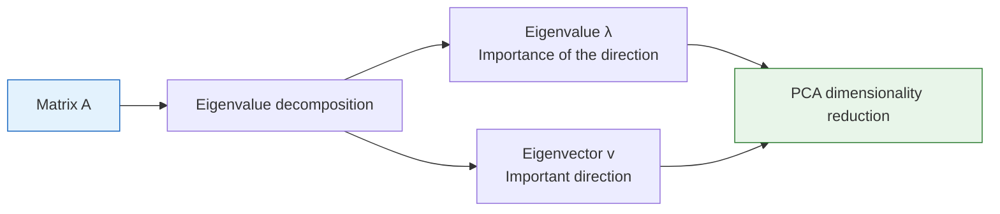

:::tip[Don't be intimidated by the names]
"Eigenvalue" and "eigenvector" sound very mathematical, but the intuition is actually simple: **under a matrix transformation, some special vectors only get stretched or shrunk, and their direction does not change**. These are eigenvectors, and the stretching factor is the eigenvalue.
:::
## Learning goals

- Intuitively understand what eigenvalues and eigenvectors mean
- Use visualizations to see the "special directions" in matrix transformations
- Understand why PCA dimensionality reduction works
- Compute eigenvalues and eigenvectors with NumPy

## First, set an important learning expectation

This section can easily make beginners nervous as soon as they see the title.
But what you really need to learn first here is not every derivation from a full linear algebra course, but:

- Why there are special vectors whose direction stays the same while their length changes
- Why these special directions are directly related to PCA, dimensionality reduction, and information preservation
- Why AI keeps running into them again and again

So your first goal in this section is not to memorize symbols,
but to truly build an intuition for these "special directions."

---

## First, build a map

This section can easily make beginners think, "The name sounds hard; it must be very advanced." In fact, you only need to remember this line:


So the real problem this lesson solves is not "memorize the definition," but:

- How to find the most important direction among many changes
- Why PCA can compress data while losing little information

## Terms That Make This Section Less Scary

| Term | Plain-English meaning | Why it matters |
|---|---|---|
| `λ` / `lambda` | The stretch factor for an eigenvector | If `λ = 3`, that direction becomes 3 times longer after transformation. |
| `np.linalg.eig` | NumPy function for eigenvalues and eigenvectors | It returns two objects: eigenvalues first, eigenvectors second. |
| `eigenvectors[:, i]` | The i-th eigenvector | NumPy stores eigenvectors by column, not by row. This is easy to miss. |
| covariance matrix | A matrix describing how features vary together | PCA finds important directions from this matrix. |
| `eigvalsh` | Eigenvalue function for symmetric/Hermitian matrices | Covariance matrices are symmetric, so this function is faster and more stable for eigenvalues only. |
| PCA | Principal Component Analysis | A dimensionality reduction method that keeps directions with the most variance. |

When reading the formulas, keep one sentence in mind: eigenvectors are directions, eigenvalues are how strong those directions are.

## Intuition

### "Special directions" in matrix transformations

In the previous section, we learned: matrix × vector = new vector (both direction and magnitude may change).

But some vectors are special — after a matrix acts on them, their **direction does not change**, only their length changes.



In mathematical terms: **A × v = λ × v**
- v is the eigenvector (the vector whose direction does not change)
- λ (lambda) is the eigenvalue (the stretching factor)

### A more beginner-friendly analogy

You can think of a matrix transformation as a gust of wind blowing across many arrows:

- Most arrows get pushed off course
- But a few arrows happen to point exactly along the wind

After those arrows are blown:

- Their direction does not change
- They only become longer or shorter

These special arrows that "never get pushed off course,"
are eigenvectors.

### Visualization: which vectors keep their direction?

```python
import numpy as np
import matplotlib.pyplot as plt

plt.rcParams['font.sans-serif'] = ['Arial Unicode MS']
plt.rcParams['axes.unicode_minus'] = False

# Define a matrix
A = np.array([[2, 1],
              [1, 2]])

# Compute eigenvalues and eigenvectors
eigenvalues, eigenvectors = np.linalg.eig(A)
print(f"Eigenvalues: {eigenvalues}")         # [3. 1.]
print(f"Eigenvectors:\n{eigenvectors}")

# Visualization: transform vectors in many directions and see which directions stay the same
fig, axes = plt.subplots(1, 2, figsize=(14, 6))

# Generate a set of uniformly distributed unit vectors
angles = np.linspace(0, 2*np.pi, 50, endpoint=False)
unit_vectors = np.array([np.cos(angles), np.sin(angles)])  # 2×50

# Transformed vectors
transformed = A @ unit_vectors  # 2×50

# Plot before and after transformation
for ax, vectors, title in [(axes[0], unit_vectors, 'Before transformation (unit circle)'),
                             (axes[1], transformed, 'After transformation (ellipse)')]:
    # Plot all vectors (gray)
    for i in range(vectors.shape[1]):
        ax.plot([0, vectors[0, i]], [0, vectors[1, i]], 'gray', alpha=0.3)

    # Highlight eigenvector directions
    for j in range(2):
        ev = eigenvectors[:, j]
        if ax == axes[0]:
            scale = 1
        else:
            scale = eigenvalues[j]
        color = ['red', 'blue'][j]
        ax.quiver(0, 0, ev[0]*scale, ev[1]*scale, angles='xy', scale_units='xy',
                  scale=1, color=color, width=0.01,
                  label=f'Eigenvector {j+1} (λ={eigenvalues[j]:.0f})')

    ax.set_xlim(-4, 4)
    ax.set_ylim(-4, 4)
    ax.set_aspect('equal')
    ax.grid(True, alpha=0.3)
    ax.legend(fontsize=10)
    ax.set_title(title, fontsize=13)

plt.suptitle(f'Eigenvectors of matrix A = [[2,1],[1,2]]', fontsize=14)
plt.tight_layout()
plt.show()
```

**Interpretation**:
- The red and blue arrows are the directions of the eigenvectors
- After transformation, the unit circle becomes an ellipse
- But the **direction** of the eigenvectors stays the same; only their lengths change (they become 3 times and 1 time longer, respectively)
- The long axis and short axis of the ellipse happen to be the directions of the eigenvectors

### Why is this figure especially important for beginners?

Because it makes "eigenvalue / eigenvector" stop being abstract terms for the first time.

You can see with your own eyes:

- Most directions change
- Only a few directions are special
- These directions happen to be the ones worth preserving or paying attention to in the data

In other words, the key thing in this section is not learning to calculate first, but first learning to understand this sense of "special directions."

---

## Compute eigenvalues and eigenvectors with NumPy

### Basic usage

```python
A = np.array([[4, 2],
              [1, 3]])

# One line does it all
eigenvalues, eigenvectors = np.linalg.eig(A)

print("Eigenvalues:", eigenvalues)      # [5. 2.]
print("Eigenvectors:\n", eigenvectors)
# Each column is an eigenvector
# 1st eigenvector (corresponding to λ=5): eigenvectors[:, 0]
# 2nd eigenvector (corresponding to λ=2): eigenvectors[:, 1]
```

Expected output:

```text
Eigenvalues: [5. 2.]
Eigenvectors:
 [[ 0.89442719 -0.70710678]
 [ 0.4472136   0.70710678]]
```

The sign of an eigenvector may flip in different environments, for example `[0.707, -0.707]` instead of `[-0.707, 0.707]`. That is still the same direction line, so it is not an error.

### Verify: A × v = λ × v

```python
for i in range(len(eigenvalues)):
    v = eigenvectors[:, i]      # i-th eigenvector
    lam = eigenvalues[i]        # i-th eigenvalue

    left = A @ v                # matrix times vector
    right = lam * v             # eigenvalue times vector

    print(f"\nEigenvalue λ={lam:.1f}, eigenvector v={v.round(3)}")
    print(f"  A @ v  = {left.round(6)}")
    print(f"  λ * v  = {right.round(6)}")
    print(f"  Equal? {np.allclose(left, right)}")  # True
```

This verification is more important than the raw numbers. If `A @ v` and `λ * v` are almost equal, the pair really satisfies the eigenvector definition.

### Special properties of symmetric matrices

In AI, we often encounter **symmetric matrices** (such as covariance matrices). Symmetric matrices have a nice property: **their eigenvectors are perpendicular to each other**.

```python
# Covariance matrix (a typical example of a symmetric matrix)
rng = np.random.default_rng(seed=42)
data = rng.normal(size=(100, 2))
data[:, 1] = data[:, 0] * 0.8 + rng.normal(size=100) * 0.3  # create correlation

cov_matrix = np.cov(data.T)
print(f"Covariance matrix (symmetric):\n{cov_matrix.round(3)}")

eigenvalues, eigenvectors = np.linalg.eig(cov_matrix)
print(f"\nEigenvalues: {eigenvalues.round(3)}")

# Verify that the eigenvectors are perpendicular (dot product ≈ 0)
dot = np.dot(eigenvectors[:, 0], eigenvectors[:, 1])
print(f"Dot product of the two eigenvectors: {dot:.10f}")  # ≈ 0 (perpendicular)
```

---

## PCA dimensionality reduction — the most important application of eigenvalues

### First, remember the PCA workflow

For beginners, it is best to remember PCA as a process rather than as an abstract definition:



### Why do we need dimensionality reduction?



### The intuition behind PCA

The core idea of PCA (Principal Component Analysis):

1. The amount of "variation" in data is different along different directions
2. The direction with the **largest eigenvalue** = the direction where the data varies the most = the direction that contains the most information
3. Keep only the first few most important directions and discard the less important ones → dimensionality reduction

### A more beginner-friendly way to say it

You can think of PCA like this:

- The data originally stands on many coordinate axes
- But the most informative changes are usually concentrated in only a few directions

So what PCA does is a lot like this:

- First, it reorients the coordinate axes
- Then, it keeps only the axes with the most information

This is easier to understand than starting with "eigendecomposition of the covariance matrix."

```python
# Generate 2D data with a clear main direction
rng = np.random.default_rng(seed=42)
n = 200
x = rng.normal(size=n)
y = 0.6 * x + rng.normal(size=n) * 0.3  # y is related to x
data = np.column_stack([x, y])

# Compute covariance matrix
cov = np.cov(data.T)
eigenvalues, eigenvectors = np.linalg.eig(cov)

# Sort by eigenvalues from largest to smallest
idx = eigenvalues.argsort()[::-1]
eigenvalues = eigenvalues[idx]
eigenvectors = eigenvectors[:, idx]

print(f"Eigenvalues: {eigenvalues.round(3)}")
print(f"Variance ratio: {(eigenvalues / eigenvalues.sum() * 100).round(1)}%")
```

Expected output with `seed=42`:

```text
Eigenvalues: [1.06  0.068]
Variance ratio: [94.  6.]%
```

This means the first principal direction keeps about 94% of the variation in this toy dataset, so reducing from 2D to 1D loses relatively little information.

### Visualization: directions found by PCA

```python
fig, axes = plt.subplots(1, 2, figsize=(14, 6))

# Left: original data + principal component directions
ax = axes[0]
ax.scatter(data[:, 0], data[:, 1], alpha=0.4, s=20, color='gray')

mean = data.mean(axis=0)
colors = ['red', 'blue']
labels = ['1st principal component (most information)', '2nd principal component (less information)']

for i in range(2):
    direction = eigenvectors[:, i] * eigenvalues[i] * 2
    ax.annotate('', xy=mean + direction, xytext=mean,
                arrowprops=dict(arrowstyle='->', color=colors[i], lw=3))
    ax.annotate(labels[i], xy=mean + direction, fontsize=10, color=colors[i])

ax.set_aspect('equal')
ax.grid(True, alpha=0.3)
ax.set_title('Original 2D data + PCA directions')
ax.set_xlabel('Feature 1')
ax.set_ylabel('Feature 2')

# Right: project onto the 1st principal component (reduce to 1D)
projected = data @ eigenvectors[:, 0]  # project onto the 1st principal component
ax = axes[1]
ax.scatter(projected, np.zeros_like(projected), alpha=0.4, s=20, color='red')
ax.set_title(f'Reduced to 1D (kept {eigenvalues[0]/eigenvalues.sum()*100:.0f}% of the information)')
ax.set_xlabel('1st principal component')
ax.set_yticks([])

plt.tight_layout()
plt.show()
```

**Interpretation**:
- The red arrow is the 1st principal component — the direction where the data varies the most
- The blue arrow is the 2nd principal component — the direction with smaller variation
- If we keep only the 1st principal component (reduce from 2D to 1D), we still preserve most of the information

### Use scikit-learn for PCA

In real projects, we usually use PCA from scikit-learn directly:

```bash
python -m pip install --upgrade scikit-learn
```

```python
from sklearn.decomposition import PCA
from sklearn.datasets import load_iris

# Load the classic Iris dataset (4 features)
iris = load_iris()
X = iris.data       # (150, 4)
y = iris.target      # 3 flower species

print(f"Original dimension: {X.shape}")  # (150, 4)

# Reduce to 2 dimensions with PCA
pca = PCA(n_components=2)
X_2d = pca.fit_transform(X)
print(f"After dimensionality reduction: {X_2d.shape}")  # (150, 2)

# Variance ratio of each principal component
print(f"Variance ratio: {pca.explained_variance_ratio_.round(3)}")
# [0.925, 0.053] → the first 2 principal components retain about 97.8% of the information!

# Visualization
plt.figure(figsize=(8, 6))
for i, name in enumerate(iris.target_names):
    mask = y == i
    plt.scatter(X_2d[mask, 0], X_2d[mask, 1], label=name, s=40, alpha=0.7)

plt.xlabel(f'PC1 ({pca.explained_variance_ratio_[0]*100:.1f}%)')
plt.ylabel(f'PC2 ({pca.explained_variance_ratio_[1]*100:.1f}%)')
plt.title('PCA dimensionality reduction on the Iris dataset (4D → 2D)')
plt.legend()
plt.grid(True, alpha=0.3)
plt.show()
```

**Result**: After reducing 4D data to 2D, the three flower species are still clearly separated! This shows that PCA effectively preserves the most important information.

---

## Other meanings of eigenvalues

### What the size of an eigenvalue means

| Eigenvalue | Meaning |
|--------|------|
| Large eigenvalue | The data varies a lot in this direction; the information content is high |
| Small eigenvalue | The data varies little in this direction; it can be discarded |
| Eigenvalue of 0 | The data does not vary at all in this direction (a redundant dimension) |
| Negative eigenvalue | The matrix "reverses" in this direction (flips the direction) |

### Explained variance ratio

The most important indicator in PCA — the ratio of the first k eigenvalues to the total eigenvalues:

```python
# Simulate a high-dimensional dataset
rng = np.random.default_rng(seed=42)
n_features = 20
X = rng.normal(size=(200, n_features))
# Give the first few features strong signal
X[:, :3] = X[:, :3] * 5

# Compute eigenvalues of the covariance matrix
cov = np.cov(X.T)
eigenvalues = np.linalg.eigvalsh(cov)  # eigvalsh is for symmetric matrices, faster
eigenvalues = eigenvalues[::-1]        # sort from largest to smallest

# Variance ratio
variance_ratio = eigenvalues / eigenvalues.sum()
cumulative_ratio = np.cumsum(variance_ratio)

# Draw a Scree Plot
fig, axes = plt.subplots(1, 2, figsize=(14, 5))

axes[0].bar(range(1, 21), variance_ratio * 100, color='steelblue')
axes[0].set_xlabel('Principal component index')
axes[0].set_ylabel('Variance ratio (%)')
axes[0].set_title('Variance ratio of each principal component')

axes[1].plot(range(1, 21), cumulative_ratio * 100, 'o-', color='coral')
axes[1].axhline(y=95, color='gray', linestyle='--', label='95% threshold')
axes[1].set_xlabel('Number of principal components')
axes[1].set_ylabel('Cumulative variance ratio (%)')
axes[1].set_title('Cumulative variance ratio (how many principal components to keep?)')
axes[1].legend()

plt.tight_layout()
plt.show()
```

**Interpretation**: With a "scree plot," you can decide how many principal components to keep — usually by choosing the point where the cumulative variance reaches 95%.

---

## What should you take with you to the next section?

After reading this section, the most valuable things to carry forward are these questions:

1. If we already know how to find "important directions," then more abstractly, what does the dimension of a space mean?
2. When do a set of vectors count as "redundant"?
3. Why will SVD become a general tool in many later AI methods?

These three questions will naturally lead you to:

- [4.1.5 Vector Spaces and Linear Transformations](/ch04-ai-math/ch01-linear-algebra/04-vector-spaces/)



:::note[Connections to later topics]
- **5 Machine Learning: from basics to practice**: PCA dimensionality reduction is a common data preprocessing step
- **11 Natural Language Processing (elective direction)**: SVD decomposition (a generalization of eigendecomposition) is used for dimensionality reduction and topic models
- **6 Deep Learning and Transformer Basics**: Understanding the eigenvalues of weight matrices helps explain the stability of network training
:::
---

## Evidence to Keep

Keep this page's proof of learning as a small evidence card:

```text
math_object: vector, matrix, eigenvalue, basis, or vector space concept
numeric_example: small numbers or NumPy snippet used to compute it
visual_or_output: shape, transformed point, similarity score, eigen direction, or projection
ai_link: where this appears in embeddings, batches, PCA, neural layers, or attention
Expected_output: calculation plus one sentence connecting it to an AI operation
```

## Summary

| Concept | Intuitive understanding | NumPy implementation |
|------|---------|-----------|
| Eigenvector | A vector whose direction stays the same under a matrix transformation | `np.linalg.eig(A)[1]` |
| Eigenvalue | The stretching factor applied to an eigenvector | `np.linalg.eig(A)[0]` |
| PCA | Find the directions where the data varies the most, then reduce dimensions | `sklearn.decomposition.PCA` |
| Variance ratio | How much information each principal component preserves | `pca.explained_variance_ratio_` |

## Hands-on exercises

### Exercise 1: Compute eigenvalues

Use NumPy to compute the eigenvalues and eigenvectors of the following matrix, and verify A × v = λ × v:

```python
A = np.array([[3, 1],
              [0, 2]])
```

### Exercise 2: Visualize eigenvectors

For the matrix `A = [[1, 2], [0, 3]]`, draw:
- A set of uniformly distributed unit vectors (a circle)
- The result after the matrix transformation (an ellipse)
- Mark the directions of the eigenvectors

### Exercise 3: PCA practice

Use scikit-learn's `load_digits()` handwritten digit dataset (64 dimensions), reduce it to 2 dimensions with PCA, and visualize it to see whether different digits can be separated.

If you have not installed scikit-learn yet, run:

```bash
python -m pip install --upgrade scikit-learn
```

```python
from sklearn.datasets import load_digits
from sklearn.decomposition import PCA

digits = load_digits()
X = digits.data      # (1797, 64)
y = digits.target     # 0~9

# Your code: PCA dimensionality reduction + visualization
```


<details>
<summary>Operation guide and checkpoints</summary>

- For `A=[[3,1],[0,2]]`, eigenvalues are `3` and `2`. One valid eigenvector for `3` is `[1,0]`; one valid eigenvector for `2` is proportional to `[-1,1]`.
- Verification means checking `A @ v` and `lambda * v` are numerically the same, allowing for floating-point rounding and arbitrary eigenvector scale.
- In PCA on digits, a 2D plot should show partial clustering by digit but not perfect separation. The explanation should say PCA keeps high-variance directions, not class labels.

</details>
