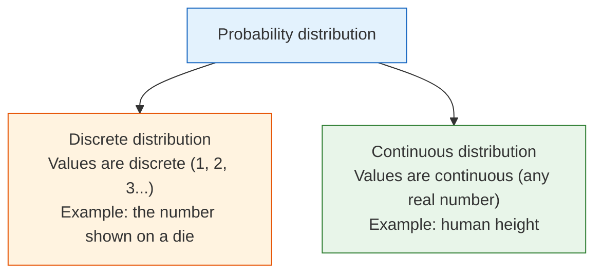
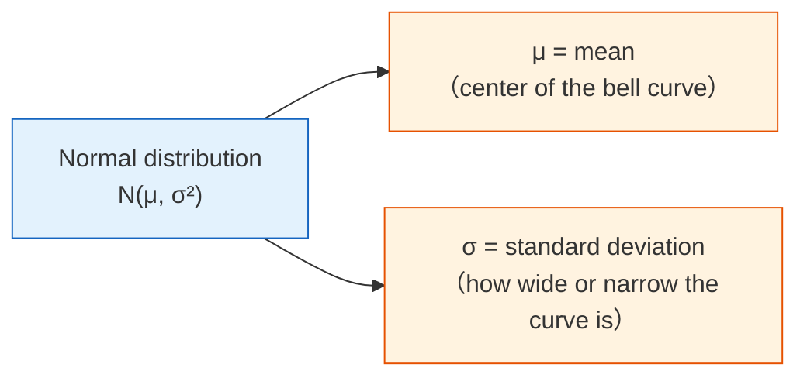

## Learning Objectives

- Understand what a probability distribution is
- Master common discrete distributions (Bernoulli, binomial, Poisson)
- Master common continuous distributions (uniform, normal/Gaussian)
- Build an intuitive understanding of the Central Limit Theorem — why the normal distribution appears everywhere
- Use Python to generate and visualize different distributions

## Terms to Decode Before Plotting

This lesson introduces several distribution words that look compact but carry a lot of meaning:

| Term | Full name / meaning | Beginner-friendly interpretation |
|---|---|---|
| `random variable` | A variable whose value is uncertain | The thing we observe, such as clicks, height, dice result, or number of customers |
| `PMF` | Probability Mass Function | For discrete values, how much probability is assigned to each value |
| `PDF` | Probability Density Function | For continuous values, where probability density is high or low |
| `CDF` | Cumulative Distribution Function | Probability that the value is less than or equal to a threshold |
| `μ` / `mu` | Mean | The center or average location of a distribution |
| `σ` / `sigma` | Standard deviation | How spread out the distribution is |
| `λ` / `lambda_` | Rate or average count | In Poisson, the average number of events in a fixed interval |
| `SciPy stats` | Statistical functions in SciPy | A Python toolbox for probability distributions, PMF, PDF, and CDF |

If you run this file locally, install the three libraries used by the examples:

```bash
python3 -m pip install numpy matplotlib scipy
```

The examples use `lambda_` instead of `lambda` because `lambda` is a Python keyword for anonymous functions.

## First, a very important learning expectation

This section is not meant to turn every distribution into an "exam cheat sheet."
Instead, it is meant to help you build one especially important intuition:

- Probability basics focus on a single event
- Probability distributions focus on what the whole random phenomenon looks like

---

## First, build a map

If the previous section was about "the probability of a single event," then this section is about:

> **What does an entire random phenomenon look like?**


The key point of this lesson is not to memorize every distribution, but to first know:

- When a certain distribution appears
- What it roughly looks like
- Why you keep running into it in AI

## What is a probability distribution?

**A probability distribution = all possible values of a random variable and the probability of each value.**

### A more beginner-friendly analogy

If probability is like "whether something will happen this time,"
then a distribution is more like:

- A long-term, statistically estimated "map of possibilities"



```python
import numpy as np
import matplotlib.pyplot as plt
from scipy import stats

plt.rcParams['font.sans-serif'] = ['Arial Unicode MS']
plt.rcParams['axes.unicode_minus'] = False
```

`stats` is the distribution module from SciPy. In this lesson, it saves us from manually writing formulas for binomial, Poisson, and normal distributions, so we can focus on intuition.

---

## Discrete distributions

### Bernoulli distribution — only two outcomes

You **perform one experiment only**, and the result is either "success" (1) or "failure" (0).

```python
# Bernoulli distribution: flipping a coin once
# p = probability of success
p = 0.6  # unfair coin, 60% chance of heads

# Simulate 10000 times
rng = np.random.default_rng(seed=42)
samples = rng.binomial(1, p, 10000)
print(f"Proportion of heads: {samples.mean():.3f}")  # ≈ 0.6

fig, ax = plt.subplots(figsize=(6, 4))
values, counts = np.unique(samples, return_counts=True)
ax.bar(['Tails (0)', 'Heads (1)'], counts / len(samples),
       color=['coral', 'steelblue'], edgecolor='white')
ax.set_ylabel('Probability')
ax.set_title(f'Bernoulli Distribution (p={p})')
ax.set_ylim(0, 1)
plt.show()
```

Expected output with `seed=42`:

```text
Proportion of heads: 0.605
```

**Application in AI**: labels for binary classification tasks follow a Bernoulli distribution (0 or 1).

### Binomial distribution — the sum of multiple Bernoulli trials

The **total number of successes after n Bernoulli trials** follows a binomial distribution.

```python
# Binomial distribution: flipping a coin 20 times, counting heads
n = 20   # number of trials
p = 0.5  # probability of success each time

# Theoretical distribution
x = np.arange(0, n + 1)
pmf = stats.binom.pmf(x, n, p)

# Simulation
rng = np.random.default_rng(seed=42)
samples = rng.binomial(n, p, 10000)
print(f"Expected heads n*p: {n*p:.1f}")
print(f"Most likely number of heads: {x[pmf.argmax()]}")
print(f"Simulated mean: {samples.mean():.3f}")

fig, axes = plt.subplots(1, 2, figsize=(14, 5))

# Theory
axes[0].bar(x, pmf, color='steelblue', edgecolor='white')
axes[0].set_xlabel('Number of heads')
axes[0].set_ylabel('Probability')
axes[0].set_title(f'Binomial Distribution B(n={n}, p={p}) (theoretical)')

# Simulation
axes[1].hist(samples, bins=range(n+2), density=True, color='coral', edgecolor='white', alpha=0.7)
axes[1].set_xlabel('Number of heads')
axes[1].set_ylabel('Frequency')
axes[1].set_title(f'Binomial Distribution B(n={n}, p={p}) (10,000 simulations)')

plt.tight_layout()
plt.show()
```

Expected output with `seed=42`:

```text
Expected heads n*p: 10.0
Most likely number of heads: 10
Simulated mean: 9.984
```

**Key parameters**:
- Mean = n × p (if you flip a fair coin 20 times, the expected number of heads is 10)
- Variance = n × p × (1-p)

### Poisson distribution — counting "rare events"

This is the **number of times a rare event occurs in a fixed amount of time or space**.

```python
# Poisson distribution: a milk tea shop gets an average of 5 customers per hour
lambda_ = 5  # average value (λ)

x = np.arange(0, 20)
pmf = stats.poisson.pmf(x, lambda_)

fig, ax = plt.subplots(figsize=(8, 5))
ax.bar(x, pmf, color='mediumseagreen', edgecolor='white')
ax.set_xlabel('Number of customers per hour')
ax.set_ylabel('Probability')
ax.set_title(f'Poisson Distribution Poisson(λ={lambda_})')
ax.set_xticks(x)
plt.show()

print(f"Probability of 0 customers: {stats.poisson.pmf(0, lambda_):.4f}")
print(f"Probability of 5 customers: {stats.poisson.pmf(5, lambda_):.4f}")
print(f"Probability of 10+ customers: {1 - stats.poisson.cdf(9, lambda_):.4f}")
```

Expected output:

```text
Probability of 0 customers: 0.0067
Probability of 5 customers: 0.1755
Probability of 10+ customers: 0.0318
```

**Application in AI**: the number of rare words in a text, website traffic volume, anomaly detection.

---

## Continuous distributions

### Uniform distribution — completely random

Every value has exactly the same probability of occurring.

```python
# Uniform distribution U(0, 1)
rng = np.random.default_rng(seed=42)
samples = rng.uniform(0, 1, 10000)
print(f"Uniform sample mean: {samples.mean():.3f}")
print(f"Uniform sample min/max: {samples.min():.3f}/{samples.max():.3f}")

fig, ax = plt.subplots(figsize=(8, 4))
ax.hist(samples, bins=50, density=True, color='steelblue', edgecolor='white', alpha=0.7)
ax.axhline(y=1, color='red', linestyle='--', label='Theoretical density = 1')
ax.set_xlabel('Value')
ax.set_ylabel('Probability density')
ax.set_title('Uniform Distribution U(0, 1)')
ax.legend()
plt.show()
```

Expected output with `seed=42`:

```text
Uniform sample mean: 0.497
Uniform sample min/max: 0.000/1.000
```

**Application in AI**: random weight initialization, random sampling, random transformations in data augmentation.

### Normal distribution (Gaussian distribution) — the most important distribution

Normal distribution is often called a **Gaussian distribution**. `stats.norm.pdf(x, mu, sigma)` returns the height of the bell curve at `x`. For continuous distributions, the height itself is not a probability; the probability is the area under the curve across an interval.



```python
fig, axes = plt.subplots(1, 2, figsize=(14, 5))

# Different means
x = np.linspace(-8, 12, 1000)
for mu in [-2, 0, 3, 5]:
    axes[0].plot(x, stats.norm.pdf(x, mu, 1), linewidth=2, label=f'μ={mu}, σ=1')
axes[0].set_title('Different means μ (different center positions)')
axes[0].legend()
axes[0].set_xlabel('x')
axes[0].set_ylabel('Probability density')

# Different standard deviations
for sigma in [0.5, 1, 2, 4]:
    axes[1].plot(x, stats.norm.pdf(x, 0, sigma), linewidth=2, label=f'μ=0, σ={sigma}')
axes[1].set_title('Different standard deviations σ (different widths)')
axes[1].legend()
axes[1].set_xlabel('x')
axes[1].set_ylabel('Probability density')

plt.tight_layout()
plt.show()
```

### The 68-95-99.7 rule

The normal distribution has a very useful rule:

```python
mu, sigma = 0, 1

print("68-95-99.7 rule:")
for k, pct in [(1, '68.3%'), (2, '95.4%'), (3, '99.7%')]:
    area = stats.norm.cdf(mu + k*sigma) - stats.norm.cdf(mu - k*sigma)
    print(f"  Within μ ± {k}σ: {area:.1%} of the data (theoretical {pct})")
```

Expected output:

```text
68-95-99.7 rule:
  Within μ ± 1σ: 68.3% of the data (theoretical 68.3%)
  Within μ ± 2σ: 95.4% of the data (theoretical 95.4%)
  Within μ ± 3σ: 99.7% of the data (theoretical 99.7%)
```

```python
# Visualize 68-95-99.7
fig, ax = plt.subplots(figsize=(10, 5))
x = np.linspace(-4, 4, 1000)
y = stats.norm.pdf(x)

ax.plot(x, y, 'k-', linewidth=2)

# Fill regions
colors = ['steelblue', 'cornflowerblue', 'lightblue']
labels = ['68.3% (±1σ)', '95.4% (±2σ)', '99.7% (±3σ)']
for k, color, label in zip([3, 2, 1], colors[::-1], labels[::-1]):
    mask = (x >= -k) & (x <= k)
    ax.fill_between(x[mask], y[mask], alpha=0.5, color=color, label=label)

ax.set_xlabel('Standard deviations')
ax.set_ylabel('Probability density')
ax.set_title('The 68-95-99.7 Rule of the Normal Distribution')
ax.legend(loc='upper right')
plt.show()
```

### Applications of the normal distribution in AI

| Use case | Description |
|---------|------|
| Weight initialization | Neural network weights are often initialized with a normal distribution (such as He initialization and Xavier initialization) |
| Data standardization | Convert data to a "standard normal" distribution with mean 0 and standard deviation 1 |
| Noise modeling | Sensor noise and measurement error are often assumed to follow a normal distribution |
| Generative models | VAE and diffusion models sample from a normal distribution to generate new data |
| Anomaly detection | Data points more than 3σ away from the mean may be outliers |

---

## The Central Limit Theorem — the most important theorem

### Core idea

**No matter what the original data distribution is, the average of a large number of independent samples tends toward a normal distribution.**

This is why the normal distribution appears everywhere in nature and data science — many phenomena are essentially the combined effect of many independent factors.

### Verify it with code

```python
fig, axes = plt.subplots(2, 3, figsize=(16, 10))

# Three completely different original distributions
rng = np.random.default_rng(seed=42)
distributions = [
    ('Uniform distribution', lambda n: rng.uniform(0, 1, n)),
    ('Exponential distribution', lambda n: rng.exponential(1, n)),
    ('Binomial distribution', lambda n: rng.binomial(10, 0.3, n)),
]

for col, (name, dist_func) in enumerate(distributions):
    # Top: original distribution
    samples = dist_func(10000)
    axes[0, col].hist(samples, bins=50, density=True, color='coral',
                       edgecolor='white', alpha=0.7)
    axes[0, col].set_title(f'Original distribution: {name}')
    axes[0, col].set_ylabel('Probability density')

    # Bottom: take the average of 30 samples, repeat 10000 times
    n_samples = 30
    means = np.array([dist_func(n_samples).mean() for _ in range(10000)])

    axes[1, col].hist(means, bins=50, density=True, color='steelblue',
                       edgecolor='white', alpha=0.7)

    # Overlay a normal distribution curve
    x = np.linspace(means.min(), means.max(), 100)
    axes[1, col].plot(x, stats.norm.pdf(x, means.mean(), means.std()),
                       'r-', linewidth=2, label='Normal fit')
    axes[1, col].set_title(f'Distribution of sample means (n={n_samples})')
    axes[1, col].set_ylabel('Probability density')
    axes[1, col].legend()
    print(f"{name}: mean of sample means={means.mean():.3f}, std={means.std():.3f}")

plt.suptitle('Central Limit Theorem: No matter what the original distribution is, sample means tend toward a normal distribution',
             fontsize=14, y=1.01)
plt.tight_layout()
plt.show()
```

Expected output with `seed=42`:

```text
Uniform distribution: mean of sample means=0.500, std=0.053
Exponential distribution: mean of sample means=0.999, std=0.182
Binomial distribution: mean of sample means=3.005, std=0.262
```

**Interpretation**: No matter whether the original data is uniform, skewed, or discrete, as long as you take the average of enough samples, the distribution will become normal.

### The effect of sample size

```python
fig, axes = plt.subplots(1, 4, figsize=(18, 4))

# Use the exponential distribution (highly skewed) for the experiment
rng = np.random.default_rng(seed=42)
for ax, n in zip(axes, [1, 5, 30, 100]):
    means = [rng.exponential(1, n).mean() for _ in range(10000)]
    ax.hist(means, bins=50, density=True, color='steelblue', edgecolor='white', alpha=0.7)

    x = np.linspace(min(means), max(means), 100)
    ax.plot(x, stats.norm.pdf(x, np.mean(means), np.std(means)), 'r-', linewidth=2)
    ax.set_title(f'n = {n}')
    ax.set_xlabel('Sample mean')

plt.suptitle('The larger the sample size, the closer the mean distribution is to normal', fontsize=13)
plt.tight_layout()
plt.show()
```

:::tip[Rule of thumb]
Usually when n ≥ 30, the Central Limit Theorem works quite well. That is why many statistical methods require a "sample size of at least 30."
:::
---

## Distribution overview table

| Distribution | Type | Parameters | Typical scenario | NumPy generation |
|------|------|------|---------|-----------|
| Bernoulli | Discrete | p (success probability) | Binary classification labels | `rng.binomial(1, p)` |
| Binomial | Discrete | n, p | Number of successes in n trials | `rng.binomial(n, p)` |
| Poisson | Discrete | λ (average rate) | Rare event counting | `rng.poisson(lam)` |
| Uniform | Continuous | a, b (range) | Random initialization | `rng.uniform(a, b)` |
| Normal | Continuous | μ, σ (mean, standard deviation) | Noise, weight initialization | `rng.normal(mu, sigma)` |
| Exponential | Continuous | λ (rate) | Time between events | `rng.exponential(1/lam)` |

---

## After learning this, what question should you take to the next section?

After looking at distributions, the most valuable questions to carry forward are:

1. If I already know what a certain distribution looks like, how do I infer its parameters from observed data?
2. What does "the model that best explains the data" actually mean?
3. When I see a difference in an A/B test, how can I tell whether it is a real difference or just random fluctuation?

These questions will naturally lead you to:

- [4.2.4 Basics of Statistical Inference](./03-statistical-inference.md)

:::note[Connecting ahead]
- **Next section**: Statistical inference — inferring distribution parameters from data
- **5 Introduction to Machine Learning and Practice**: Logistic regression uses the sigmoid function to output the Bernoulli distribution parameter p
- **6 Fundamentals of Deep Learning and Transformers**: Neural network weights are initialized with a normal distribution (He/Xavier initialization)
- **7 Principles of Large Models, Prompting, and Fine-Tuning**: VAE models assume latent variables follow a normal distribution
:::
---

## Evidence to Keep

Keep this page's proof of learning as a small evidence card:

```text
random_process: event, distribution, sample, likelihood, entropy, or Bayes update
simulation_or_formula: code or formula used to make uncertainty visible
output: probability, sample statistic, interval, entropy, or updated belief
failure_check: base-rate confusion, p-value misuse, sample bias, or mixing probability with certainty
Expected_output: numeric result plus interpretation in plain language
```

## Summary

| Concept | Intuition |
|------|------|
| Probability distribution | The "map of possibilities" for a random variable |
| Discrete distribution | Takes a finite set of values, each with a definite probability |
| Continuous distribution | Takes any value, described with a probability density function |
| PMF | Probability assigned to each discrete value |
| PDF | Density curve for continuous values; probabilities are areas under the curve |
| CDF | Accumulated probability up to a value |
| Normal distribution | The most important distribution — a bell curve determined by μ and σ |
| Central Limit Theorem | Sample means tend toward a normal distribution, regardless of the original distribution |

## What you should take away from this section

- The most important intuition about probability distributions is "what does the whole random phenomenon look like"
- Bernoulli, binomial, and Poisson are for discrete counting problems
- The normal distribution and the Central Limit Theorem will appear repeatedly later in AI

## Hands-on Practice

### Exercise 1: Plot all distributions

In a 2×3 subplot grid, plot Bernoulli, binomial, Poisson, uniform, normal, and exponential distributions.

Reference implementation:

```python
rng = np.random.default_rng(seed=42)
fig, axes = plt.subplots(2, 3, figsize=(15, 8))
axes = axes.ravel()

axes[0].bar([0, 1], [0.4, 0.6], color=["coral", "steelblue"])
axes[0].set_title("Bernoulli(p=0.6)")

x = np.arange(0, 21)
axes[1].bar(x, stats.binom.pmf(x, 20, 0.5), color="steelblue")
axes[1].set_title("Binomial(n=20, p=0.5)")

x = np.arange(0, 16)
axes[2].bar(x, stats.poisson.pmf(x, 5), color="mediumseagreen")
axes[2].set_title("Poisson(lambda=5)")

samples = rng.uniform(0, 1, 10000)
axes[3].hist(samples, bins=40, density=True, color="steelblue", alpha=0.7)
axes[3].set_title("Uniform(0, 1)")

x = np.linspace(-4, 4, 300)
axes[4].plot(x, stats.norm.pdf(x), color="black")
axes[4].set_title("Normal(0, 1)")

samples = rng.exponential(1, 10000)
axes[5].hist(samples, bins=40, density=True, color="orange", alpha=0.7)
axes[5].set_title("Exponential(scale=1)")

plt.tight_layout()
plt.show()
```

### Exercise 2: Verify 68-95-99.7

Generate 100000 height data points from N(170, 5) (mean 170 cm, standard deviation 5 cm), and verify what proportion of people have heights between 160 and 180 cm (±2σ).

Reference implementation:

```python
rng = np.random.default_rng(seed=42)
heights = rng.normal(170, 5, 100000)
within = ((heights >= 160) & (heights <= 180)).mean()
print(f"Height within 160-180 cm: {within:.1%}")
```

Expected output:

```text
Height within 160-180 cm: 95.4%
```

### Exercise 3: Central Limit Theorem experiment

Use dice (uniform distribution from 1 to 6) to perform a Central Limit Theorem experiment: roll the dice 1 time, 10 times, 50 times, and 200 times, compute the average each time, repeat each group 10000 times, and plot the distribution of the averages.

Reference implementation:

```python
rng = np.random.default_rng(seed=42)
for n_rolls in [1, 10, 50, 200]:
    means = rng.integers(1, 7, size=(10000, n_rolls)).mean(axis=1)
    print(f"Dice n={n_rolls}: mean={means.mean():.3f}, std={means.std():.3f}")
```

Expected output:

```text
Dice n=1: mean=3.475, std=1.704
Dice n=10: mean=3.503, std=0.541
Dice n=50: mean=3.499, std=0.241
Dice n=200: mean=3.500, std=0.120
```

The mean stays close to 3.5, while the standard deviation of the averages becomes smaller. That is the Central Limit Theorem becoming visible in code.


<details>
<summary>Operation guide and checkpoints</summary>

- The six-panel distribution plot should make the difference between discrete counts and continuous measurements visible. Bars are natural for Bernoulli, binomial, and Poisson; curves or histograms fit continuous distributions.
- For heights from `N(170,5)`, the interval 160 to 180 cm is within two standard deviations, so the simulated proportion should be close to `95%`.
- When the sample mean experiment uses larger sample sizes, its distribution should become narrower and more normal-looking. That is the practical face of the Central Limit Theorem.

</details>
