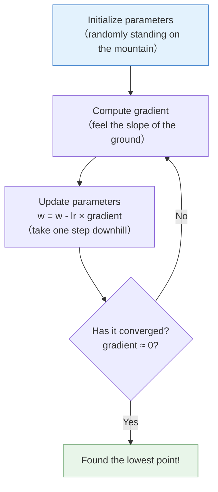
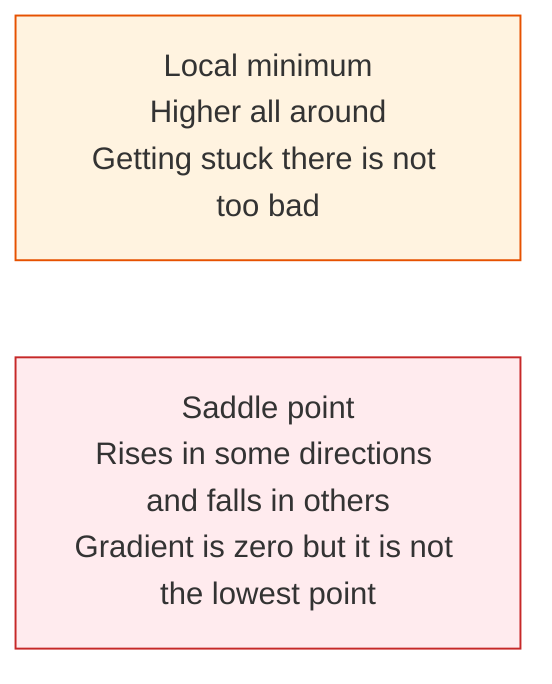

# 4.3.4 Gradient Descent: The Most Core Optimization Algorithm in AI


:::tip[This section is the climax of the entire math phase]
Gradient descent is the **foundation of training all deep learning models**. Once you understand it, you understand how AI models "learn".
:::
## Learning Objectives

- Build an intuitive understanding of gradient descent — "walking down a hill blindfolded"
- Understand the impact of learning rate (too large / too small)
- **Implement from scratch** gradient descent to fit a straight line
- Learn the differences between BGD, SGD, and Mini-batch SGD
- Understand local minima and saddle points

## First, a very important learning expectation

This section is not about making you fully master every optimization detail right away,
but about helping you truly understand:

- Why a model does not "learn it all at once"
- Instead, it improves gradually through repeated small updates

---

## First, build a map

The previous two sections solved the question of "how to know how a function changes"; from this section on, we begin to solve:

> **Now that we know how it changes, how do we actually move the parameters step by step to a better position?**


If you understand this section clearly, then later when you see optimizers, learning rates, and training processes, you won't be left with just "memorizing the API."

## Intuition: Walking Down a Hill Blindfolded

Imagine you are standing on a mountain, blindfolded, and you want to reach the lowest point in the valley. What would you do?

1. **Feel the ground with your feet**: which direction is steepest? (= compute the gradient)
2. **Take one step in the steepest downhill direction** (= update parameters along the negative gradient direction)
3. **Repeat** until it feels flat all around (= the gradient is close to zero, meaning you have reached the minimum)

### Why is this analogy especially important for beginners?

Because it helps you accept one thing first:

- Model training does not happen in one shot
- It improves little by little in a loss landscape where you cannot see the whole map



---

## Start by Understanding Through Code

### The simplest example: finding the minimum of f(x) = x²

```python
import numpy as np
import matplotlib.pyplot as plt

plt.rcParams['font.sans-serif'] = ['Arial Unicode MS']
plt.rcParams['axes.unicode_minus'] = False

# Target function
def f(x):
    return x ** 2

# Derivative
def df(x):
    return 2 * x

# Gradient descent
x = 4.0          # Initial position
lr = 0.3          # Learning rate
history = [x]     # Record the trajectory

for step in range(20):
    grad = df(x)              # Compute gradient
    x = x - lr * grad         # Update parameters
    history.append(x)
    if step < 8:
        print(f"Step {step+1}: x = {x:.4f}, f(x) = {f(x):.6f}, gradient = {grad:.4f}")

print(f"\nFinal: x = {x:.6f}, f(x) = {f(x):.10f}")
```

### Visualize the descent process

```python
x_plot = np.linspace(-5, 5, 200)

plt.figure(figsize=(10, 6))
plt.plot(x_plot, f(x_plot), 'steelblue', linewidth=2, label='f(x) = x²')

# Draw the position of each step
for i in range(len(history) - 1):
    plt.plot(history[i], f(history[i]), 'ro', markersize=8, alpha=0.5)
    plt.annotate('', xy=(history[i+1], f(history[i+1])),
                 xytext=(history[i], f(history[i])),
                 arrowprops=dict(arrowstyle='->', color='red', lw=1.5))

plt.plot(history[0], f(history[0]), 'ro', markersize=12, label=f'Start x={history[0]}')
plt.plot(history[-1], f(history[-1]), 'g*', markersize=15, label=f'End x={history[-1]:.2f}')

plt.xlabel('x')
plt.ylabel('f(x)')
plt.title('Gradient descent process: starting from x=4 and gradually reaching the minimum')
plt.legend()
plt.grid(True, alpha=0.3)
plt.show()
```

---

## Learning Rate — The Most Important Hyperparameter

### Learning rate too large vs too small

### A more beginner-friendly analogy

The learning rate is very much like how big each step is when you walk downhill:

- Steps too small: you go down very slowly
- Steps too large: you may jump over the valley floor and oscillate back and forth

```python
fig, axes = plt.subplots(1, 3, figsize=(18, 5))
x_plot = np.linspace(-5, 5, 200)

for ax, lr, title in zip(axes, [0.01, 0.3, 0.95],
                          ['Too small (lr=0.01)', 'Just right (lr=0.3)', 'Too large (lr=0.95)']):
    x = 4.0
    history = [x]
    for _ in range(30):
        x = x - lr * df(x)
        history.append(x)

    ax.plot(x_plot, f(x_plot), 'steelblue', linewidth=2)

    for i in range(min(len(history)-1, 20)):
        ax.plot(history[i], f(history[i]), 'ro', markersize=5, alpha=0.6)
        if i < len(history)-1:
            ax.plot([history[i], history[i+1]],
                    [f(history[i]), f(history[i+1])], 'r-', alpha=0.3)

    ax.set_title(f'{title}\nAfter 30 steps x={history[-1]:.4f}')
    ax.set_xlabel('x')
    ax.set_ylabel('f(x)')
    ax.set_ylim(-1, 30)
    ax.grid(True, alpha=0.3)

plt.suptitle('The effect of learning rate on gradient descent', fontsize=14)
plt.tight_layout()
plt.show()
```

| Learning rate | Behavior | Problem |
|--------|------|------|
| Too small (0.01) | Takes very tiny steps | Converges extremely slowly, may need tens of thousands of steps |
| Suitable (0.1~0.5) | Descends steadily | Ideal case |
| Too large (0.95+) | Oscillates back and forth | May never converge |
| Too large (>1.0) | Moves farther and farther away | Diverges (loss explodes) |

:::caution[When the learning rate exceeds 1.0]
For f(x)=x², if lr > 1, the absolute value of x will keep getting larger with each step — the model "blows up" while learning.
```python
x = 4.0
for i in range(5):
    x = x - 1.1 * (2*x)
    print(f"Step {i+1}: x={x:.2f}, f(x)={x**2:.2f}")
# x keeps getting larger!
```
:::
---

## Hands-on: Implement Gradient Descent from Scratch to Fit a Line

### Problem setup

Use gradient descent to fit y = wx + b and find the best w and b.

```python
# Generate data: y = 2x + 3 + noise
rng = np.random.default_rng(seed=42)
n = 100
X = rng.uniform(-5, 5, n)
y_true = 2 * X + 3 + rng.normal(size=n) * 1.5

plt.figure(figsize=(8, 5))
plt.scatter(X, y_true, alpha=0.5, s=30, color='steelblue')
plt.xlabel('x')
plt.ylabel('y')
plt.title('Data points (true relationship: y = 2x + 3 + noise)')
plt.grid(True, alpha=0.3)
plt.show()
```

### Loss function

**Mean Squared Error (MSE)**:

MSE = (1/n) × Σ (predicted value - true value)²

```python
def predict(X, w, b):
    """Prediction function: y = wx + b"""
    return w * X + b

def mse_loss(X, y, w, b):
    """Mean squared error loss"""
    y_pred = predict(X, w, b)
    return np.mean((y_pred - y) ** 2)

def compute_gradients(X, y, w, b):
    """Compute gradients of the loss with respect to w and b"""
    y_pred = predict(X, w, b)
    n = len(y)
    dw = (2/n) * np.sum((y_pred - y) * X)
    db = (2/n) * np.sum(y_pred - y)
    return dw, db
```

### Gradient descent training

```python
# Initialize parameters
w = 0.0
b = 0.0
lr = 0.01
epochs = 200

# Record the training process
loss_history = []
w_history = []
b_history = []

for epoch in range(epochs):
    # 1. Compute loss
    loss = mse_loss(X, y_true, w, b)
    loss_history.append(loss)
    w_history.append(w)
    b_history.append(b)

    # 2. Compute gradients
    dw, db = compute_gradients(X, y_true, w, b)

    # 3. Update parameters
    w = w - lr * dw
    b = b - lr * db

    # Print progress
    if epoch % 40 == 0:
        print(f"Epoch {epoch:4d}: loss={loss:.4f}, w={w:.4f}, b={b:.4f}")

print(f"\nFinal result: w={w:.4f}, b={b:.4f}")
print(f"True parameters: w=2.0000, b=3.0000")
```

### Visualize the training process

```python
fig, axes = plt.subplots(1, 3, figsize=(18, 5))

# 1. Loss curve
axes[0].plot(loss_history, color='coral', linewidth=2)
axes[0].set_xlabel('Epoch')
axes[0].set_ylabel('MSE Loss')
axes[0].set_title('Training loss curve')
axes[0].grid(True, alpha=0.3)

# 2. Parameter convergence
axes[1].plot(w_history, label='w', color='steelblue', linewidth=2)
axes[1].plot(b_history, label='b', color='coral', linewidth=2)
axes[1].axhline(y=2.0, color='steelblue', linestyle='--', alpha=0.5, label='True w')
axes[1].axhline(y=3.0, color='coral', linestyle='--', alpha=0.5, label='True b')
axes[1].set_xlabel('Epoch')
axes[1].set_ylabel('Parameter value')
axes[1].set_title('Parameter convergence')
axes[1].legend()
axes[1].grid(True, alpha=0.3)

# 3. Fitting result
x_line = np.linspace(-5, 5, 100)
axes[2].scatter(X, y_true, alpha=0.4, s=20, color='gray')
axes[2].plot(x_line, 2*x_line + 3, 'g--', linewidth=2, label='True: y=2x+3')
axes[2].plot(x_line, w*x_line + b, 'r-', linewidth=2, label=f'Fit: y={w:.2f}x+{b:.2f}')
axes[2].set_xlabel('x')
axes[2].set_ylabel('y')
axes[2].set_title('Fitting result')
axes[2].legend()
axes[2].grid(True, alpha=0.3)

plt.tight_layout()
plt.show()
```

---

## Three Variants of Gradient Descent

### Batch Gradient Descent (BGD)

Use **all data** to compute the gradient at each step (the implementation above is BGD).

```python
# BGD: use all n samples to compute the gradient
dw = (2/n) * np.sum((y_pred - y) * X)  # use all data
```

### Stochastic Gradient Descent (SGD)

Use **only one sample** to compute the gradient at each step.

```python
# SGD: use only 1 sample each time
rng = np.random.default_rng(seed=42)
i = rng.integers(0, n)
dw = 2 * (w * X[i] + b - y_true[i]) * X[i]
```

### Mini-batch Gradient Descent (Mini-batch SGD)

Use a small batch of data at each step (for example, 32 samples) — **the most commonly used**.

```python
# Mini-batch SGD
rng = np.random.default_rng(seed=42)
batch_size = 32
indices = rng.choice(n, batch_size, replace=False)
X_batch = X[indices]
y_batch = y_true[indices]
dw = (2/batch_size) * np.sum((w * X_batch + b - y_batch) * X_batch)
```

### Comparison

| Method | Data used per step | Gradient estimate | Speed | Practical use |
|------|------------|---------|------|---------|
| BGD | All data | Exact | Slow (when data is large) | Small datasets |
| SGD | 1 sample | Noisy | Fast but oscillatory | Theoretical analysis |
| Mini-batch | 32~512 samples | Fairly accurate and fast | Best balance | **Most commonly used** |

```python
# Compare convergence curves of the three methods
fig, ax = plt.subplots(figsize=(10, 5))
rng = np.random.default_rng(seed=42)

for method, batch_size, color in [('BGD', n, 'steelblue'),
                                    ('Mini-batch(32)', 32, 'coral'),
                                    ('SGD', 1, 'gray')]:
    w, b = 0.0, 0.0
    lr = 0.01
    losses = []

    for epoch in range(200):
        if batch_size == n:
            idx = np.arange(n)
        else:
            idx = rng.choice(n, batch_size, replace=False)

        X_b, y_b = X[idx], y_true[idx]
        y_pred = w * X_b + b

        dw = (2/len(idx)) * np.sum((y_pred - y_b) * X_b)
        db = (2/len(idx)) * np.sum(y_pred - y_b)

        w -= lr * dw
        b -= lr * db

        losses.append(mse_loss(X, y_true, w, b))

    ax.plot(losses, label=method, color=color, linewidth=2,
            alpha=0.7 if method != 'SGD' else 0.4)

ax.set_xlabel('Epoch')
ax.set_ylabel('MSE Loss')
ax.set_title('Convergence comparison of the three gradient descent methods')
ax.legend()
ax.grid(True, alpha=0.3)
plt.show()
```

---

## Local Minima and Saddle Points

### Challenges of non-convex functions

```python
# A function with multiple extrema
def tricky_f(x):
    return x**4 - 4*x**2 + 0.5*x

def tricky_df(x):
    return 4*x**3 - 8*x + 0.5

x_plot = np.linspace(-2.5, 2.5, 200)

plt.figure(figsize=(10, 5))
plt.plot(x_plot, tricky_f(x_plot), 'steelblue', linewidth=2)

# Start from different initial points
for x0, color in [(-2.0, 'red'), (0.5, 'green'), (2.0, 'orange')]:
    x = x0
    history = [x]
    for _ in range(100):
        x = x - 0.01 * tricky_df(x)
        history.append(x)

    for h in history[::5]:
        plt.plot(h, tricky_f(h), 'o', color=color, markersize=4, alpha=0.5)
    plt.plot(history[0], tricky_f(history[0]), 's', color=color, markersize=10,
             label=f'Start x={x0} → End x={history[-1]:.2f}')

plt.xlabel('x')
plt.ylabel('f(x)')
plt.title('Different starting points may find different extrema')
plt.legend()
plt.grid(True, alpha=0.3)
plt.show()
```

**Interpretation**: Different starting points may "walk downhill" to different valleys (local minima). In deep learning, the good news is that local minima in high-dimensional spaces are usually good enough.

### Saddle points



In high-dimensional spaces, saddle points are more common than local minima. Modern optimizers such as Adam can help jump over saddle points through momentum mechanisms.

---

## After learning this, what questions should you bring to the next section?

After looking at gradient descent, the most valuable questions to bring to the next section are:

1. If a network has many layers, how does the gradient flow back layer by layer?
2. Why can `loss.backward()` compute the gradients of all parameters at once?
3. How exactly does the chain rule work in a complex network?

These questions will naturally lead you to:

- [4.3.5 Preview of the chain rule and backpropagation](./04-chain-rule-backprop.md)

:::note[Connecting to what comes next]
- **Next section**: Chain rule — how to efficiently compute the gradient of each parameter in a complex network
- **Stop 5**: Training linear regression and logistic regression both use gradient descent
- **Stop 6**: `optimizer.step()` in PyTorch performs one gradient descent step
- **Advanced optimizers**: Adam and AdamW are improved versions of gradient descent (adaptive learning rate + momentum)
:::
---

## Evidence to Keep

Keep this page's proof of learning as a small evidence card:

```text
function: objective, loss, derivative, gradient, or chain-rule expression
calculation: numeric derivative, gradient step, or backprop trace
output: slope, gradient vector, updated parameter, or loss change
failure_check: sign error, learning rate too large, local slope misunderstanding, or broken chain
Expected_output: calculation trace showing how a parameter changes
```

## Summary

| Concept | Intuition |
|------|------|
| Gradient descent | Move step by step along the negative gradient direction toward the minimum |
| Learning rate | How far you move each step (too large causes oscillation, too small is too slow) |
| BGD | Compute gradients using all data (accurate but slow) |
| Mini-batch SGD | Use a small batch of data (most commonly used) |
| Local minimum | A point that is not globally optimal but has zero gradient |

## What you should take away from this section

- The most important intuition of gradient descent is "update step by step in the direction that decreases the loss"
- The learning rate determines "how far each step moves"
- Training a model is, in essence, a repeated process of "look at the gradient -> take a step -> look again"

## Hands-on Exercises

### Exercise 1: Tune the learning rate

Modify the code in Section 4.3, train with lr=0.001, 0.01, 0.1, and 0.5 respectively, and plot four loss curves for comparison.

### Exercise 2: Fit a quadratic function from scratch

Use gradient descent to fit y = ax² + bx + c and find the best a, b, and c. Data:
```python
X = np.linspace(-3, 3, 100)
rng = np.random.default_rng(seed=42)
y = 0.5 * X**2 - 2 * X + 1 + rng.normal(size=100) * 0.5
```

### Exercise 3: Visualize 2D gradient descent

For f(x, y) = x² + 2y², start from (4, 3) and run gradient descent, then draw the descent path on a contour plot.


<details>
<summary>Reference implementation and walkthrough</summary>

- With learning rates `0.001`, `0.01`, `0.1`, and `0.5`, expect very slow improvement at `0.001`, steadier improvement around `0.01` or `0.1`, and possible oscillation or divergence at `0.5` depending on scaling.
- For the quadratic fit, the learned parameters should move close to the data-generating values `a≈0.5`, `b≈-2`, and `c≈1`, with noise preventing perfect equality.
- For `f(x,y)=x^2+2y^2`, the update moves faster along the y direction because its gradient component is `4y`. The path should curve toward the origin.

</details>
