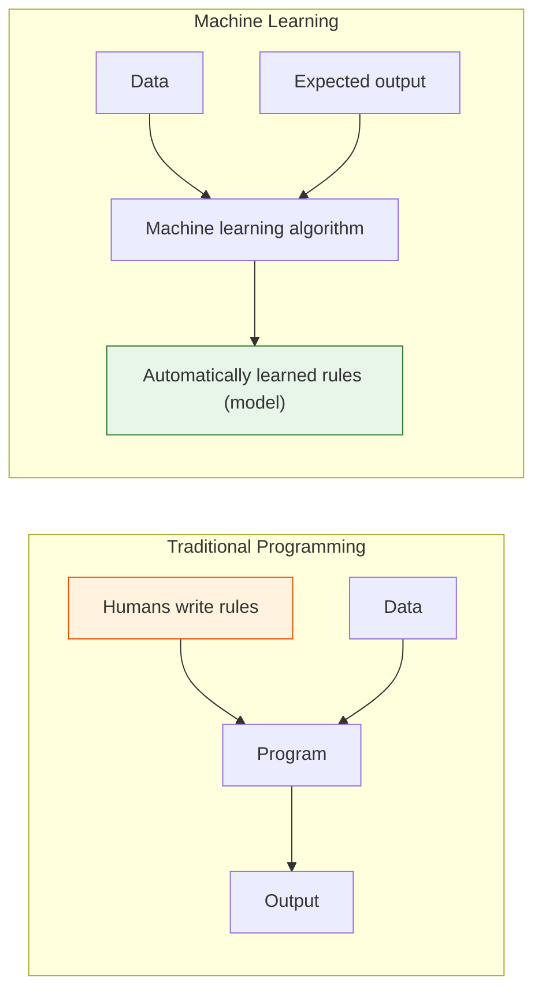
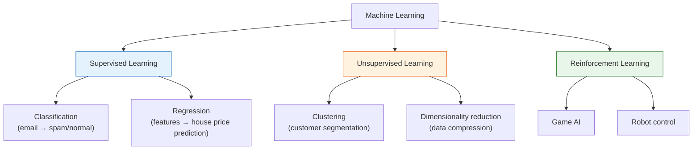
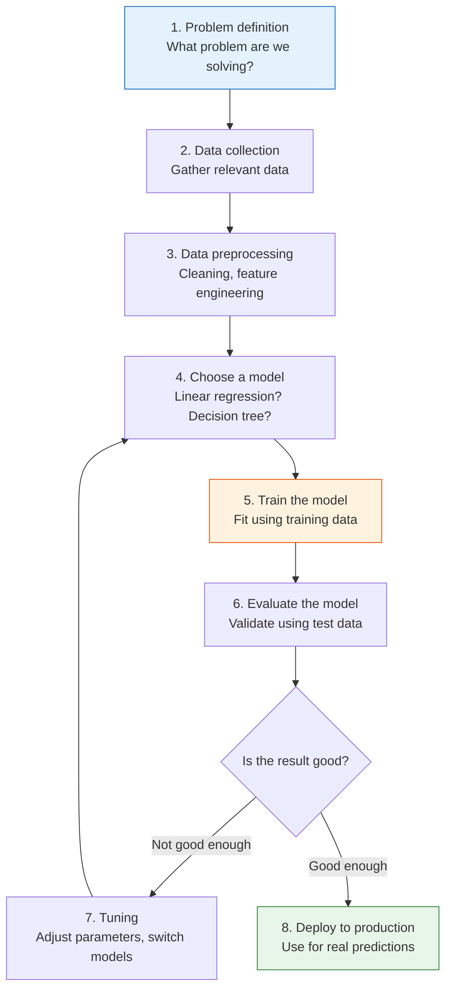
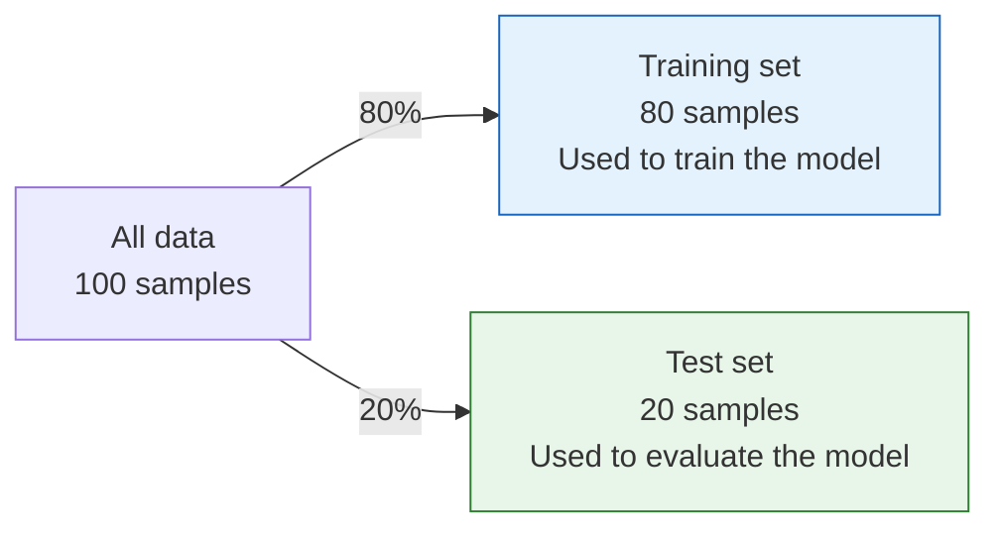
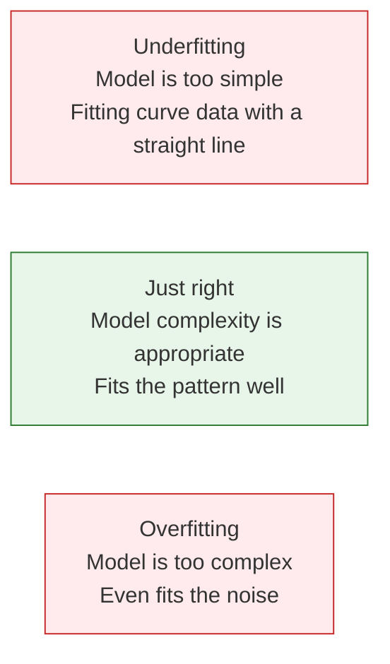

# 5.1.2 What Is Machine Learning


## Where This Section Fits

This is your first stop as you officially enter machine learning. The key is not memorizing definitions, but understanding the difference between machine learning and traditional programming, and building a framework for deciding “problem type → data format → learning method.” This will lay the foundation for supervised learning, unsupervised learning, and model evaluation later on.

:::tip[Welcome to the Machine Learning Stage]
In the first three stages, you learned Python, data analysis, and math fundamentals. Now, you’re finally going to let the computer **learn things by itself**. This is one of the most exciting stages in the entire AI journey.
:::
## Learning Objectives

- Understand what machine learning is and how it differs from traditional programming
- Master the three major categories of machine learning (supervised learning, unsupervised learning, reinforcement learning)
- Understand the complete machine learning workflow
- Build the right ML thinking framework

---

## First, Build a Map

The most important task in this article is not memorizing the definition, but first building a decision framework:


If you understand this diagram, many chapters later in Stage 5 will suddenly start making sense.


Use this comic as a quick entry checklist: if rules can be written clearly, normal programming may be enough; if the rule is hidden in many examples, machine learning becomes useful. Then decide whether you have labels, whether the output is a category or a number, and whether the evaluation metric can prove the model is useful.

---

## What Exactly Is Machine Learning?

### One-Sentence Definition

**Machine learning = letting a computer automatically discover patterns from data instead of having humans hand-code rules.**

### Traditional Programming vs. Machine Learning



| | Traditional Programming | Machine Learning |
|---|---------|---------|
| Input | Rules + data | Data + expected output |
| Output | Result | Rules (model) |
| Suitable for | Clear rules (such as calculating taxes) | Rules that are hard to describe (such as recognizing cats) |
| How it is built | Humans write if-else logic | Algorithms learn automatically from data |

### Why Do We Need Machine Learning?

For some tasks, humans **cannot clearly describe the rules**:

```python
# Traditional programming: determine whether an email is spam
def is_spam_traditional(email):
    if "free" in email:
        return True
    if "winner" in email:
        return True
    if "click to claim" in email:
        return True
    # ... how many more rules are there? You can never finish writing them!
    return False

# Machine learning: give the model 100,000 labeled emails and let it learn by itself
# model.fit(emails, labels)
# model.predict(new_email)  → make an automatic decision
```

Machine learning is suitable for scenarios such as:
- Complex or unknown rules (image recognition, speech recognition)
- Rules that change over time (recommendation systems, fraud detection)
- Very large datasets that humans cannot analyze manually
- Situations where personalized results are needed

### When Learning Machine Learning for the First Time, What Should You Focus on Most?

The first thing to grasp is not “how many kinds of models there are,” but this sentence:

> **Machine learning replaces hand-written rules with data.**

Once you understand that, many questions become easier to judge:

- When traditional programming is suitable
- When to let a model learn
- Why data quality directly determines the upper limit of a model’s performance

### Terms Beginners Should Decode Early

| Term | What it is | Why it matters in this chapter |
|---|---|---|
| `ML` | Short for Machine Learning | You will see it in diagrams, filenames, and project notes |
| `model` | The learned rule or function | It is the thing produced by training and reused for prediction |
| `algorithm` | The learning method | A decision tree, logistic regression, or K-Means is an algorithm before training |
| `training` | The process of learning from data | In code, this usually happens when you call `fit` |
| `inference` | Using a trained model on new data | In sklearn, this usually appears as `predict` or `predict_proba` |
| `baseline` | The simplest first result to beat | It tells you whether later improvements are real or just noise |
| `metric` | The measurement rule for success | Accuracy, F1, MAE, and RMSE answer different evaluation questions |

For beginners, the most important distinction is `algorithm` vs. `model`: the algorithm is the learning recipe, while the model is the trained result after the recipe has seen data.

---

## The Three Major Categories of Machine Learning



### Supervised Learning — With a "Correct Answer"

**Core idea**: Give the model lots of input-output pairs and let it learn the mapping relationship.

| Type | Output | Example |
|------|------|------|
| **Classification** | Discrete categories | Email → spam/normal, image → cat/dog |
| **Regression** | Continuous values | Area → house price, features → temperature |

```python
# Data format for supervised learning
# X (features/input)      y (label/output)
# [area, rooms, floor]    → house price
# [120,  3,    15]        → 3.5 million
# [80,   2,    8]         → 2.2 million
# [200,  4,    20]        → 5.8 million
```

**Key point**: Training data must have **labels** (correct answers). The model’s goal is to learn to predict y from X.

### How Can You Quickly Tell Whether a Problem Is Supervised Learning?

Ask yourself directly:

- Do I have paired data in the form of “input → correct output”?

If yes, it is usually supervised learning.
Then ask:

- Is the output a category or a continuous value?

That will naturally split it into:

- Classification
- Regression

### Unsupervised Learning — No "Correct Answer"

**Core idea**: There are only input data, no labels. The model discovers the structure and patterns in the data by itself.

| Type | What it does | Example |
|------|--------|------|
| **Clustering** | Groups similar data together | Customer segmentation, news categorization |
| **Dimensionality reduction** | Reduces the number of features | PCA (learned in Stage 4) |
| **Anomaly detection** | Finds abnormal data | Credit card fraud detection |

```python
# Data for unsupervised learning: no labels
# X (features)
# [spending amount, purchase frequency, recent purchase]
# [500,             10,               3 days ago]
# [50,              2,                30 days ago]
# [1000,            20,               1 day ago]
# → The model automatically splits them into groups like "high-value customers" and "low-frequency customers"
```

### The Most Easily Misunderstood Part of Unsupervised Learning

Many beginners think unsupervised learning means “the machine can find the true answer by itself.”
A more accurate way to say it is:

- The model helps you discover a possible structure
- But whether that structure has business value still depends on your interpretation

So in unsupervised learning, “explaining the result” is often just as important as “getting the result.”

### Reinforcement Learning — Learning Through Trial and Error

**Core idea**: An agent takes actions in an environment and adjusts its strategy based on rewards and penalties.

| Element | Explanation |
|------|------|
| Agent | The AI making decisions |
| Environment | The world the agent lives in |
| State | Information about the current environment |
| Action | A choice the agent can make |
| Reward | Feedback received after an action |

```python
# Intuition for reinforcement learning: training a puppy
# State: the environment the puppy sees
# Action: sit / stand / shake hands
# Reward: does it correctly → give a treat (+1), does it incorrectly → no treat (0)
# After repeated trial and error, the puppy learns the right behavior
```

:::note[Focus of This Course]
At this stage, we mainly learn **supervised learning** and **unsupervised learning**. Reinforcement learning will appear later in the agent systems section.
:::
### Comparison of the Three Learning Types

| | Supervised Learning | Unsupervised Learning | Reinforcement Learning |
|---|---------|----------|---------|
| Labeled data? | Yes | No | Reward signal |
| Goal | Predict labels | Discover structure | Maximize reward |
| Typical algorithms | Linear regression, decision trees | K-Means, PCA | Q-Learning, PPO |
| AI applications | Image classification, translation | Customer segmentation, recommendation | Game AI, robots |

---

## The Machine Learning Workflow

### Complete Workflow



### Read the Workflow as Plain English First

This workflow can be translated into a simpler sentence for beginners:

> **First define the problem, then prepare the data, build a version that works, check the results, and finally improve it step by step.**

This sentence is actually the underlying logic of the entire main line in Stage 5.

### Training Set vs. Test Set

This is one of the most important concepts in ML: **you cannot evaluate a model using the training data.**

```python
import numpy as np

# Simulated dataset
rng = np.random.default_rng(seed=42)
n = 100
X = rng.normal(size=(n, 3))
y = rng.integers(0, 2, n)

# Usually 80% training, 20% testing
from sklearn.model_selection import train_test_split

X_train, X_test, y_train, y_test = train_test_split(
    X, y, test_size=0.2, random_state=42
)

print(f"Training set: {X_train.shape[0]} samples")
print(f"Test set: {X_test.shape[0]} samples")
```

Expected output:

```text
Training set: 80 samples
Test set: 20 samples
```



:::caution[Why Separate Them?]
If you train and evaluate on the same data, the model may get a perfect score by "memorizing" the data—but perform poorly on new data. This is called **overfitting**. It is like memorizing the answers before an exam and then failing when given a different set of questions.
:::


When reading this diagram, first look at the three boundaries: the training set is used for learning, the validation set is used to choose a solution, and the test set is only used for final verification. If any preprocessing step sees test-set information too early—for example, standardizing on the full dataset first or selecting features using the full dataset—the model score may look artificially high.

### A Common Beginner Mistake: Confusing "Learning" with "Memorizing"

One especially important boundary in machine learning is:

- Doing well on the training set does not mean the model has truly learned the pattern
- It may just have memorized the training data

So from this section onward, you should build a habit:

- When you see a high score, first ask whether it is a training-set score or a test-set score

### A Minimal Complete Example

Before reading the code, look at the whole loop first:


This diagram is the smallest useful ML project shape: define the problem, prepare `X` and `y`, train a model, evaluate it with a metric, then decide what to improve. The code below is intentionally tiny so you can connect each line to one step in the picture instead of getting lost in framework details.

```python
from sklearn.datasets import load_iris
from sklearn.model_selection import train_test_split
from sklearn.tree import DecisionTreeClassifier
from sklearn.metrics import accuracy_score

# 1. Load data
iris = load_iris()
X, y = iris.data, iris.target
print(f"Dataset: {X.shape[0]} samples, {X.shape[1]} features, {len(set(y))} classes")

# 2. Split into training and test sets
X_train, X_test, y_train, y_test = train_test_split(X, y, test_size=0.2, random_state=42)

# 3. Choose a model and train it
model = DecisionTreeClassifier(random_state=42)
model.fit(X_train, y_train)  # Train!

# 4. Predict and evaluate
y_pred = model.predict(X_test)
accuracy = accuracy_score(y_test, y_pred)
print(f"Test set accuracy: {accuracy:.1%}")
```

Expected output:

```text
Dataset: 150 samples, 4 features, 3 classes
Test set accuracy: 100.0%
```

**You can complete a full ML project with just a few lines of code!** The next chapters will gradually dive into each part.

If this code fails with `ModuleNotFoundError: No module named 'sklearn'`, install the chapter dependency first:

```bash
python -m pip install --upgrade scikit-learn
```

Here, `scikit-learn` is the package name you install, while `sklearn` is the module name you import in Python code.

Read the code with this mapping in mind:

| Code keyword | What it means | Why it matters |
|---|---|---|
| `load_iris()` | Loads a built-in toy dataset | It gives us a safe first dataset without downloading files |
| `X` | Feature matrix, the input columns | The model learns patterns from these values |
| `y` | Target vector, the correct answers | Supervised learning needs labels to learn |
| `train_test_split` | Splits data into learning and checking parts | It prevents us from judging the model on examples it already saw |
| `fit` | Trains the model | This is where the algorithm becomes a trained model |
| `predict` | Uses the trained model on new inputs | This is the inference step used in real applications |
| `accuracy_score` | Calculates the percentage of correct predictions | It turns model behavior into a measurable result |
| `random_state` | Fixes the random split or model randomness | It makes the example reproducible when learners run it again |

---

## Key Terms Quick Reference

| Term | English | Meaning |
|------|------|------|
| Sample | Sample | One data point |
| Feature | Feature | A property describing the sample (each input column) |
| Label | Label / Target | The sample’s “answer” (the value to predict) |
| Training set | Training Set | Data used to train the model |
| Test set | Test Set | Data used to evaluate the model |
| Overfitting | Overfitting | The model “memorizes” the training data and generalizes poorly |
| Underfitting | Underfitting | The model is too simple and cannot even learn the training data well |
| Generalization | Generalization | The ability of a model to perform well on new data |
| Hyperparameter | Hyperparameter | A parameter set by humans, such as learning rate or tree depth |
| Data leakage | Data leakage | Test or future information accidentally enters training, making the score look better than it really is |
| Validation set | Validation Set | Data used to choose models or hyperparameters before the final test |

### Overfitting vs. Underfitting



```python
import matplotlib.pyplot as plt

rng = np.random.default_rng(seed=42)
x = np.linspace(0, 1, 20)
y = np.sin(2 * np.pi * x) + rng.normal(size=20) * 0.3

fig, axes = plt.subplots(1, 3, figsize=(15, 4))
x_smooth = np.linspace(0, 1, 200)

# Underfitting: 1st-degree polynomial (straight line)
coeffs = np.polyfit(x, y, 1)
axes[0].scatter(x, y, color='steelblue', s=40)
axes[0].plot(x_smooth, np.polyval(coeffs, x_smooth), 'r-', linewidth=2)
axes[0].set_title('Underfitting (straight line)\nToo simple to capture the pattern')

# Just right: 3rd-degree polynomial
coeffs = np.polyfit(x, y, 3)
axes[1].scatter(x, y, color='steelblue', s=40)
axes[1].plot(x_smooth, np.polyval(coeffs, x_smooth), 'r-', linewidth=2)
axes[1].set_title('Just right (3rd-degree polynomial)\nFits the pattern well')

# Overfitting: 18th-degree polynomial
coeffs = np.polyfit(x, y, 18)
axes[2].scatter(x, y, color='steelblue', s=40)
y_overfit = np.polyval(coeffs, x_smooth)
y_overfit = np.clip(y_overfit, -3, 3)
axes[2].plot(x_smooth, y_overfit, 'r-', linewidth=2)
axes[2].set_title('Overfitting (18th-degree polynomial)\nEven fits the noise')
axes[2].set_ylim(-3, 3)

for ax in axes:
    ax.grid(True, alpha=0.3)

plt.tight_layout()
plt.show()
```

---

## Evidence to Keep

Keep this page's proof of learning as a small evidence card:

```text
ml_problem: supervised, unsupervised, evaluation, or feature-engineering task
baseline: simplest sklearn/modeling loop and fixed train/test split
output: prediction, metric, chart, or model decision note
failure_check: data leakage, unclear target, weak baseline, or metric mismatch
Expected_output: minimal ML loop with metric and one failure observation
```

## Summary

| Key point | Explanation |
|------|------|
| Machine learning | Letting computers learn patterns from data |
| Supervised learning | Has labels and learns prediction (classification/regression) |
| Unsupervised learning | No labels and discovers structure (clustering/dimensionality reduction) |
| Reinforcement learning | Learns strategies through trial and error (reward-driven) |
| Core workflow | Data → preprocessing → training → evaluation → deployment |
| Training/test split | Must be separated to prevent overfitting |

## What Should You Take Away from This Section?

If you only take away one sentence, I hope you remember this:

> **The real starting point of the machine learning stage is not learning a specific model, but first learning how to match the problem, the data, and the evaluation method.**

So the most important gains from this section should be:

- Be able to distinguish supervised learning from unsupervised learning
- Be able to distinguish classification from regression
- Know why training and test sets must be separated
- Know that all the algorithms later in Stage 5 are actually part of this map

:::note[Connect to What Comes Next]
- **Next section**: Introduction to the Scikit-learn framework — the standard tool for ML practice
- **Chapter 2**: Learn specific algorithms (linear regression, logistic regression, decision trees, etc.)
- **Chapter 4**: Deep dive into model evaluation — how to scientifically judge whether a model is good
:::
---

## Hands-On Exercises

### Exercise 1: Classification vs. Regression

Determine whether each task is classification or regression:
1. Predict tomorrow’s temperature
2. Determine whether a photo contains a face
3. Predict tomorrow’s closing price of a stock
4. Classify news into sports/technology/entertainment/finance
5. Predict whether a user will churn

### Exercise 2: Your First ML Model

Use scikit-learn’s `load_wine()` dataset to train a decision tree classifier and output the test-set accuracy.

```python
from sklearn.datasets import load_wine
from sklearn.model_selection import train_test_split
from sklearn.tree import DecisionTreeClassifier

wine = load_wine()
X_train, X_test, y_train, y_test = train_test_split(
    wine.data, wine.target, test_size=0.2, random_state=42, stratify=wine.target
)

model = DecisionTreeClassifier(random_state=42)
model.fit(X_train, y_train)
accuracy = model.score(X_test, y_test)
print(f"Test accuracy: {accuracy:.3f}")
```

Expected output on a current sklearn version:

```text
Test accuracy: 0.944
```

Your exact result may change slightly if the sklearn version or split settings change. What matters here is the workflow: load data, split data, train on the training set, and evaluate on the test set.

### Exercise 3: Observe Overfitting

Modify the overfitting example in section 4.3, use polynomials of different degrees (1, 3, 5, 10, 18) to fit the data, plot 5 subplots, and observe how complexity affects the fitting result.

<details>
<summary>Reference implementation and walkthrough</summary>

1. Temperature and stock closing price are regression tasks because the target is numeric. Face detection, news category, and churn are classification tasks because the target is a discrete class.
2. The wine example should follow the core supervised workflow: load features and labels, split before training, fit only on `X_train, y_train`, then score on `X_test, y_test`. A result near `0.944` is plausible for this split, but the exact value is less important than avoiding test-set leakage.
3. Degree 1 usually underfits, degrees 3 or 5 often capture the main pattern, and degrees 10 or 18 can chase noise. Judge complexity with held-out error as well as the plot, because a curve that hugs training points may generalize poorly.

</details>
