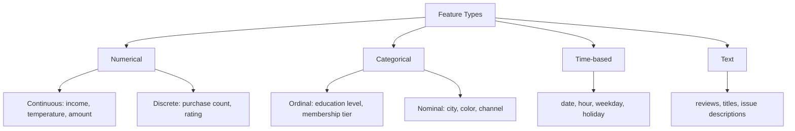

:::tip[Section Overview]
Feature engineering is one of the highest-ROI steps in a machine learning project, but it does not start with “creating new columns” right away. The real first step is understanding the data: what each column means, whether the distribution is unusual, whether it relates to the target, and whether it leaks future information.
:::
## Learning Objectives

- Understand common feature types such as numerical, categorical, time-based, and text features
- Use distribution plots and statistical summaries to find anomalies, skewness, and missing values
- Analyze the relationship between features and the target variable
- Identify redundant features and target leakage risks at an early stage

---

## First, Build a Map


The more solid this step is, the less likely you are to blindly try models later. Poor model performance is often not because the algorithm is not advanced enough, but because the data meaning, outliers, target leakage, or train-test distribution differences were not understood clearly.

## Feature Types



Different types determine the processing method that comes next. Numerical features may need scaling or binning, categorical features may need encoding, time-based features often need cyclic features extracted from them, and text features may need vectorization or embeddings.

## Quickly Identifying Feature Types

```python
import pandas as pd
import seaborn as sns

df = sns.load_dataset("titanic")
print(df.head())
print(df.dtypes)

num_cols = df.select_dtypes(include="number").columns.tolist()
cat_cols = df.select_dtypes(include=["object", "category", "bool"]).columns.tolist()

print("Numerical features:", num_cols)
print("Categorical features:", cat_cols)
```

Automatic identification is only a starting point, not the final judgment. For example, postal codes, user IDs, and product IDs may look like numbers, but in business terms they are categorical or identifier fields and should not be used directly as continuous numerical values.

## Distribution Analysis

Distribution analysis should answer three questions: Is the numerical range reasonable? Is there obvious skewness? Are there extreme values?

```python
import matplotlib.pyplot as plt

num_cols = ["age", "fare", "sibsp", "parch"]
fig, axes = plt.subplots(2, 2, figsize=(12, 8))

for ax, col in zip(axes.ravel(), num_cols):
    df[col].hist(bins=30, ax=ax, color="steelblue", edgecolor="white", alpha=0.8)
    ax.axvline(df[col].mean(), color="red", linestyle="--", label="mean")
    ax.axvline(df[col].median(), color="green", linestyle="--", label="median")
    ax.set_title(col)
    ax.legend()

plt.tight_layout()
plt.show()
```

If the mean and median are far apart, that usually means the distribution is skewed. Skewness does not always need to be fixed, but you should know it exists. For example, income, spending amount, and visit counts are often long-tailed distributions.

## Categorical Feature Analysis

For categorical features, focus on the number of unique values, long-tail categories, and whether there is a risk of unseen categories.

```python
for col in ["sex", "embarked", "class"]:
    print(col)
    print(df[col].value_counts(dropna=False))
```

If a categorical feature has thousands of unique values, direct one-hot encoding may cause the feature dimension to explode. If new categories appear in test data or production that were not seen in training, you should prepare handling strategies in advance, such as `handle_unknown="ignore"`.

## Relationship with the Target Variable

Feature exploration should not stop at a single column; you also need to look at the relationship between the feature and the target variable.

```python
pd.crosstab(df["sex"], df["survived"], normalize="index")
```

For numerical features, you can compare distributions by target group. For categorical features, you can look at the target mean across categories. But be careful: correlation is not causation. If you see a strong relationship between a feature and the target, that only means it may be useful for prediction; it does not mean it caused the outcome.

## Correlation and Redundancy

```python
corr = df[["survived", "age", "fare", "sibsp", "parch", "pclass"]].corr()
sns.heatmap(corr, annot=True, cmap="coolwarm", center=0)
plt.show()
```

Highly correlated features may introduce redundancy. For linear models, redundant features may affect coefficient interpretation. For tree models, the impact is usually smaller, but they can still add noise and training cost.

## Target Leakage Check

Target leakage is one of the most dangerous problems in feature engineering. It means using information during training that would not be available at prediction time. For example, when predicting whether a user will churn, using the “number of customer service follow-ups after churn”; when predicting loan default, using the “collection status after delinquency.”

When checking for target leakage, ask three questions: Does this feature already exist at prediction time? Is it a downstream result of the target outcome? Is the relationship with the target too perfect to be trustworthy? If the answer is uncertain, it is better to remove it from the baseline first and then compare through experiments.


This diagram is worth reviewing before every modeling task: fields that occur after the prediction time, fields derived from the target outcome, fields that are almost perfectly correlated with the target, and fields that only exist in offline data should all be treated as high-risk features first. The more outrageous the score, the more you should suspect leakage first.

## The Most Practical Feature Exploration Checklist for Beginners

Before you really start modeling, at a minimum, answer these questions: Which columns are numerical, categorical, time-based, or text? Which columns have many missing values? Which numerical features are clearly skewed? Which categorical features have too many unique values? Which features are highly correlated with each other? Which features may leak the target? Are the train and test distributions obviously different?

## Evidence to Keep

Keep this page's proof of learning as a small evidence card:

```text
feature_state: raw columns, types, missing values, scale, and target relationship
transformation: preprocessing, construction, selection, or pipeline step
output: transformed feature table, pipeline object, score change, or selected features
failure_check: leakage, inconsistent train/test transform, high-cardinality trap, or meaningless feature
Expected_output: feature pipeline evidence with before/after and metric impact
```

## Exercises

1. Use the Titanic dataset to identify all numerical and categorical features, and manually correct any columns that automatic identification gets wrong.
2. Plot the distributions of `age` and `fare`, and determine whether they are skewed.
3. Find the 3 features most strongly related to `survived`, and explain whether any leakage may exist.
4. Choose one of your own tabular datasets and write a “feature exploration record.”

<details>
<summary>Solution approach and explanation</summary>

1. Automatic type detection is only a first pass. Columns such as passenger class, ticket code, or cabin may be numeric-looking or text-looking but still need semantic judgment.
2. `fare` is commonly right-skewed, and `age` often has missing values and uneven distribution. Skew suggests trying log transforms, bins, or robust scaling later.
3. Strong relationship is not automatically safe. A feature is suspicious if it is created after the outcome, directly encodes the label, or would not be available at prediction time.
4. A good exploration record should include column meaning, type, missing rate, distribution shape, target relationship, leakage risk, and one next action for preprocessing or construction.

</details>

## Pass Criteria

After finishing this section, you should be able to take a tabular dataset and perform systematic exploration first, instead of training a model immediately. You should be able to explain how each type of feature should be handled, identify obvious anomalies, redundancy, and leakage risks, and write these observations into the project README.
