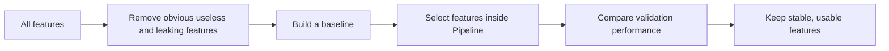

:::tip[This Section's Focus]
Feature selection is not about removing as many features as possible. It is about balancing performance, stability, interpretability, and cost. The real goal is to keep features that are useful for the task, available in production, and free of leakage.
:::
## Learning Objectives

- Understand why more features are not always better
- Master the three basic approaches: filter methods, wrapper methods, and embedded methods
- Use validation and cross-validation to determine whether feature selection actually helps
- Understand the relationship between feature selection, business interpretability, and production cost


Read this picture before the code: feature selection is not "delete columns until the table is small." A practical workflow is to remove obvious risks first, build a baseline, put the selector inside a `Pipeline`, and keep only features that are useful, available, and explainable.

---

## Why Feature Selection Is Needed

Too many features bring several problems: more noise, slower training, greater risk of overfitting, higher interpretation cost, and more complex production dependencies. In real-world business settings, one feature may mean an additional data source, an API, a permission, or a piece of maintenance logic.



### Keyword Decoder Before You Touch the Code

| Term | Beginner-friendly meaning | Why it matters here |
|---|---|---|
| ID | Identifier, such as `user_id` or `order_id` | It can let the model memorize rows instead of learning generalizable patterns |
| Target leakage | A feature contains information that would only be known after the answer happens | It makes validation scores unrealistically high |
| Baseline | The first simple model used as a comparison point | Without it, you cannot know whether feature selection helped |
| AUC | Area Under the ROC Curve; a ranking metric for classification | Useful for comparing feature sets when the model outputs probabilities |
| Filter method | Select features using statistical scores before the final model | Fast and good for first screening |
| RFE | Recursive Feature Elimination; repeatedly removes less useful features | Closer to model performance, but slower |
| Embedded method | A model selects features while training | Useful when the model exposes coefficients or feature importance |
| `fit` | Learn rules from training data | Must not learn from validation or test data |
| `transform` | Apply learned rules to data | Keeps validation/test processing consistent |
| `Pipeline` | A chained workflow of preprocessing, feature selection, and model training | Prevents leakage during cross-validation |

## Reusable Setup for This Section

The examples below use the same dataset, so you can run the section from top to bottom. We use the breast cancer dataset because it has many numeric features, a binary target, and works well for showing feature selection.

```python
import pandas as pd
from sklearn.datasets import load_breast_cancer
from sklearn.linear_model import LogisticRegression
from sklearn.metrics import roc_auc_score
from sklearn.model_selection import StratifiedKFold, cross_val_score, train_test_split
from sklearn.pipeline import Pipeline
from sklearn.preprocessing import StandardScaler

cancer = load_breast_cancer(as_frame=True)
X = cancer.data
y = cancer.target

X_train, X_val, y_train, y_val = train_test_split(
    X, y, test_size=0.25, random_state=42, stratify=y
)

cv = StratifiedKFold(n_splits=5, shuffle=True, random_state=42)

print("Dataset shape:", X.shape)
print("Target names:", cancer.target_names.tolist())
print("First 5 columns:", X.columns[:5].tolist())
```

Expected output excerpt:

```text
Dataset shape: (569, 30)
Target names: ['malignant', 'benign']
First 5 columns: ['mean radius', 'mean texture', 'mean perimeter', 'mean area', 'mean smoothness']
```

## First, Remove Features That Should Not Enter the Model

The first step is not an advanced algorithm, but manual inspection. Usually, you should prioritize removing:

- Unique IDs, such as `user_id`, `order_id`, or `transaction_id`
- Fields that only appear after the target outcome
- Fields with extremely high missing rates and no business meaning
- Fields that cannot be reliably obtained in both training and production
- Clearly duplicated fields

The breast cancer dataset is clean and does not contain ID or leakage fields, but real business datasets often do. A beginner-safe habit is to create an explicit "do not use" list before modeling.

```python
# Example pattern for real projects.
# This dataset does not contain these columns; the code is shown as a reusable habit.
risky_columns = ["user_id", "order_id", "target_leak"]
available_risky_columns = [col for col in risky_columns if col in X_train.columns]

X_train_safe = X_train.drop(columns=available_risky_columns)
X_val_safe = X_val.drop(columns=available_risky_columns)

print("Removed risky columns:", available_risky_columns)
print("Remaining feature count:", X_train_safe.shape[1])
```

An ID is not always useless, but beginners should be careful. Many IDs can cause the model to memorize training samples instead of learning generalizable patterns.

## Build a Baseline Before Selecting Features

Before removing or selecting anything, build a model using all safe features. This gives you a reference point.

```python
baseline_model = Pipeline([
    ("scaler", StandardScaler()),
    ("clf", LogisticRegression(max_iter=5000, random_state=42)),
])

baseline_model.fit(X_train_safe, y_train)
baseline_auc = roc_auc_score(
    y_val, baseline_model.predict_proba(X_val_safe)[:, 1]
)

print(f"Baseline validation AUC: {baseline_auc:.4f}")
```

If later feature selection produces a similar AUC with fewer features, it may still be valuable because the model becomes simpler, faster, and easier to explain.

## Filter Methods: First Look at the Statistical Relationship of Each Feature

Filter methods do not depend on a specific final model. They first screen features using statistical metrics. For example, numerical features can use ANOVA F-tests, categorical features can use chi-square tests, and high-dimensional sparse features can use variance filtering.

```python
from sklearn.feature_selection import SelectKBest, f_classif

filter_model = Pipeline([
    ("selector", SelectKBest(score_func=f_classif, k=10)),
    ("scaler", StandardScaler()),
    ("clf", LogisticRegression(max_iter=5000, random_state=42)),
])

filter_model.fit(X_train_safe, y_train)
filter_auc = roc_auc_score(
    y_val, filter_model.predict_proba(X_val_safe)[:, 1]
)

selected_filter_cols = X_train_safe.columns[
    filter_model.named_steps["selector"].get_support()
].tolist()

print(f"Filter method validation AUC: {filter_auc:.4f}")
print("Selected features:", selected_filter_cols)
```

If you want to evaluate feature selection fairly, do not fit it on the full dataset first. Put it inside the cross-validation workflow or the `Pipeline`, so each fold selects features only from its own training split.

Filter methods are fast and suitable for initial screening. Their downside is that they can easily miss interactions between features. A feature may look weak alone but become useful when combined with another feature.

## Wrapper Methods: Repeatedly Test with Model Performance

Wrapper methods use model training performance as the selection criterion. A common example is RFE, or Recursive Feature Elimination. RFE trains a model, removes the least useful features, and repeats until the desired number of features remains.

```python
from sklearn.feature_selection import RFE

rfe_model = Pipeline([
    ("scaler", StandardScaler()),
    ("selector", RFE(
        estimator=LogisticRegression(max_iter=5000, solver="liblinear", random_state=42),
        n_features_to_select=10,
    )),
    ("clf", LogisticRegression(max_iter=5000, random_state=42)),
])

rfe_model.fit(X_train_safe, y_train)
rfe_auc = roc_auc_score(
    y_val, rfe_model.predict_proba(X_val_safe)[:, 1]
)

selected_rfe_cols = X_train_safe.columns[
    rfe_model.named_steps["selector"].get_support()
].tolist()

print(f"RFE validation AUC: {rfe_auc:.4f}")
print("Selected features:", selected_rfe_cols)
```

Wrapper methods are suitable when the number of features is not too large and you are willing to spend more computation to get results that are closer to actual model performance.

## Embedded Methods: Let the Model Determine Importance

Embedded methods perform selection during model training. Linear models with L1 regularization, Random Forest, GBDT, XGBoost, and LightGBM can all be used for this idea.

```python
from sklearn.feature_selection import SelectFromModel

l1_model = Pipeline([
    ("scaler", StandardScaler()),
    ("selector", SelectFromModel(
        LogisticRegression(
            solver="liblinear",
            l1_ratio=1,
            C=0.1,
            max_iter=5000,
            random_state=42,
        )
    )),
    ("clf", LogisticRegression(max_iter=5000, random_state=42)),
])

l1_model.fit(X_train_safe, y_train)
l1_auc = roc_auc_score(
    y_val, l1_model.predict_proba(X_val_safe)[:, 1]
)

selected_l1_cols = X_train_safe.columns[
    l1_model.named_steps["selector"].get_support()
].tolist()

print(f"L1 embedded selection validation AUC: {l1_auc:.4f}")
print(f"Selected feature count: {len(selected_l1_cols)}")
print("Selected features:", selected_l1_cols)
```

`l1_ratio=1` means pure L1 regularization in current sklearn versions. `C` controls regularization strength. Smaller `C` means stronger regularization, so the L1 model is more likely to shrink some coefficients to zero and remove those features.

Feature importance is not absolute truth. Different models, random seeds, and data splits can all affect the ranking. It is best to judge using validation performance together with business understanding.

## Use Cross-Validation to Confirm Whether Things Really Improved

The easiest mistake in feature selection is to only look at whether the selected features "seem reasonable," without verifying whether the model is actually more stable. The correct approach is to compare the baseline model with the models after feature selection.

```python
experiments = {
    "all_features": baseline_model,
    "filter_top_10": filter_model,
    "rfe_top_10": rfe_model,
    "l1_embedded": l1_model,
}

rows = []
for name, pipe in experiments.items():
    scores = cross_val_score(pipe, X_train_safe, y_train, cv=cv, scoring="roc_auc")
    rows.append({
        "experiment": name,
        "mean_auc": scores.mean(),
        "std_auc": scores.std(),
    })

results = pd.DataFrame(rows).sort_values("mean_auc", ascending=False)
print(results)
```

If fewer features produce similar performance but faster training, clearer interpretation, and fewer production dependencies, that may be the better solution.

## How to Decide What to Keep

In real projects, feature selection is not judged only by score. You also need to consider whether it is stable, explainable, deployable, compliant, and cost-effective. A feature that improves AUC by 0.001 but requires integrating an expensive external data source may not be worth deploying.

| Question | Keep the feature if... |
|---|---|
| Performance | It improves the main metric or keeps the score stable with fewer features |
| Stability | It is selected consistently across folds or time periods |
| Availability | It exists when the model needs to make a prediction |
| Interpretability | You can explain why it should help |
| Cost | Its data source is worth maintaining |

## A Beginner-Friendly Decision Rule

For your first project, use this conservative rule:

1. Remove obvious risky columns manually
2. Keep the full-feature baseline
3. Try one simple selection method, such as `SelectKBest`
4. Compare with cross-validation, not just one split
5. Keep the smaller feature set only if performance is similar or better and the features make sense

## Evidence to Keep

Keep this page's proof of learning as a small evidence card:

```text
feature_state: raw columns, types, missing values, scale, and target relationship
transformation: preprocessing, construction, selection, or pipeline step
output: transformed feature table, pipeline object, score change, or selected features
failure_check: leakage, inconsistent train/test transform, high-cardinality trap, or meaningless feature
Expected_output: feature pipeline evidence with before/after and metric impact
```

## Common Mistakes

The first mistake is performing feature selection on the full dataset and then splitting into training and test sets, which causes leakage. The second is blindly trusting feature importance rankings. The third is pursuing the smallest possible feature set and causing underfitting. The fourth is ignoring production availability: fields usable during training are not necessarily available in real time in production.

## Exercises

1. On a classification dataset, use `SelectKBest` to select the top 10 features and compare them with the baseline.
2. Use RFE to select 8, 10, and 15 features. Compare AUC and selected feature names.
3. Use L1 logistic regression with `C=0.01`, `C=0.1`, and `C=1.0`. Observe how the selected feature count changes.
4. Manually list 3 features that may exist during training but may not always be available in production.
5. Explain why feature selection must be placed inside the cross-validation workflow.

<details>
<summary>Solution approach and explanation</summary>

1. `SelectKBest` is useful only if the selected-feature model matches or improves the baseline on validation data. A smaller feature set with worse generalization is not automatically better.
2. RFE results should be compared by score and by feature stability. If selected names swing wildly between 8, 10, and 15 features, the ranking may be fragile.
3. Smaller `C` means stronger L1 regularization, so fewer coefficients should remain nonzero. Larger `C` usually keeps more features.
4. Risky production features include fields filled after the outcome, manual review labels, future purchase totals, or logs that arrive after prediction time.
5. Feature selection outside cross-validation leaks validation information. Each fold must select features using only that fold's training data.

</details>

## Mastery Criteria

After studying this section, you should be able to explain the differences among filter, wrapper, and embedded feature selection methods; use validation and cross-validation to judge whether selection is effective; identify data leakage risks; and decide whether to keep a feature from the perspectives of performance, interpretability, cost, and production availability.
