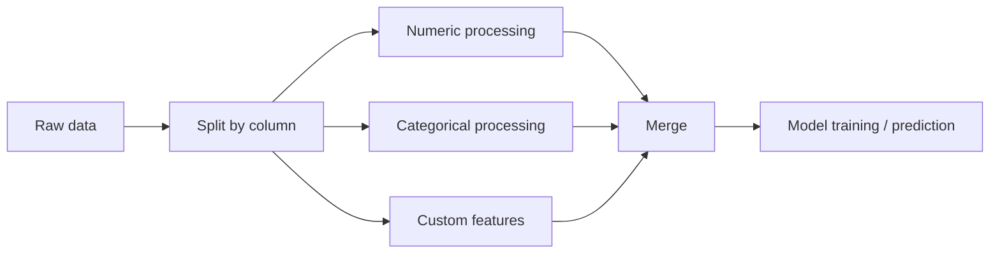
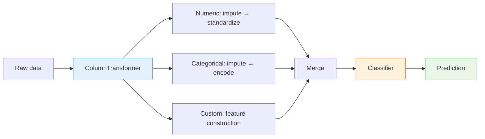

:::tip[Section overview]
In real projects, numeric features and categorical features often need **different preprocessing**. This section teaches you how to use `ColumnTransformer` + `Pipeline` to build a **complete feature engineering pipeline**, so one object can handle everything.
:::
## Learning objectives

- Master ColumnTransformer for handling mixed data types
- Learn how to create custom Transformers
- Build a complete feature engineering pipeline

---

## First, build a map

Many beginners can do each step separately, but once they get to a real project, things get messy. Pipeline solves this problem:

> **How can we turn “data processing -> feature engineering -> model training” into a stable, reproducible, leak-free workflow?**



### A better overall analogy for beginners

You can think of a Pipeline as:

- Putting scattered manual steps into an automatic assembly line

Without a Pipeline, you may end up doing this:

- Manually filling missing values
- Manually encoding categories
- Manually scaling features
- Manually feeding the result into the model

This is like:

- Writing the process on paper every time, which makes it very easy to miss a step

The value of a Pipeline is:

- It fixes the workflow so training and prediction always follow the same rules

## Why real projects must use Pipeline

- Avoid inconsistent preprocessing between training and test sets
- Avoid data leakage
- Make cross-validation and hyperparameter tuning easier
- Reuse the whole workflow on new data

### When are you most likely to make mistakes?

The most common mistake is:

- Preprocessing the training set manually one way
- Preprocessing the test set manually in a different way

As a result, the model does not see the same kind of data at all.
The most important role of Pipeline is to prevent this kind of “the workflow drifted, but you didn’t notice” problem.

## ColumnTransformer — process columns separately

```python
import pandas as pd
import numpy as np
import seaborn as sns
from sklearn.compose import ColumnTransformer
from sklearn.preprocessing import StandardScaler, OneHotEncoder
from sklearn.impute import SimpleImputer
from sklearn.pipeline import Pipeline

df = sns.load_dataset('titanic').dropna(subset=['embarked'])

# Define features
num_features = ['age', 'fare']
cat_features = ['sex', 'embarked', 'class']

# Numeric preprocessing pipeline
num_pipeline = Pipeline([
    ('imputer', SimpleImputer(strategy='median')),
    ('scaler', StandardScaler()),
])

# Categorical preprocessing pipeline
cat_pipeline = Pipeline([
    ('imputer', SimpleImputer(strategy='most_frequent')),
    ('encoder', OneHotEncoder(drop='first', sparse_output=False)),
])

# Combine
preprocessor = ColumnTransformer([
    ('num', num_pipeline, num_features),
    ('cat', cat_pipeline, cat_features),
])

X = df[num_features + cat_features]
y = df['survived']
X_transformed = preprocessor.fit_transform(X)
print(f"Raw: {X.shape} → After processing: {X_transformed.shape}")
```

### What is the most important thing to notice in this example?

The most important thing to notice is:

- Different columns should follow different processing paths

That means:

- Numeric columns should not be processed with categorical encoding methods
- Categorical columns should not be directly standardized

When many beginners first work with tabular data, the problem is often not the model choice,
but that the column processing strategy is mixed up from the start.

---

## Complete Pipeline: preprocessing + model

```python
from sklearn.ensemble import RandomForestClassifier
from sklearn.model_selection import cross_val_score

# Preprocessing + model in one step
full_pipeline = Pipeline([
    ('preprocessor', preprocessor),
    ('classifier', RandomForestClassifier(n_estimators=100, random_state=42)),
])

scores = cross_val_score(full_pipeline, X, y, cv=5, scoring='accuracy')
print(f"5-fold CV accuracy: {scores.mean():.4f} ± {scores.std():.4f}")
```

### Why do Pipeline and cross-validation work so well together?

Because the essence of cross-validation is:

- Each fold is retrained from scratch

If your preprocessing is written inside a Pipeline,
then for each fold it will automatically:

- Fit only on the training fold
- Apply the same rules to the validation fold

This is exactly the key to preventing data leakage.


This diagram breaks a real tabular-data project into three paths: numeric columns are imputed first and then scaled, categorical columns are imputed first and then encoded, and custom features must also be included in the same Pipeline. Finally, the whole process is handed over to cross-validation or GridSearch, so training, validation, and prediction all follow the same reproducible workflow.

---

## Custom Transformer

```python
from sklearn.base import BaseEstimator, TransformerMixin

class FamilySizeTransformer(BaseEstimator, TransformerMixin):
    """Construct family size features from sibsp and parch"""
    def fit(self, X, y=None):
        return self

    def transform(self, X):
        X = X.copy()
        X['family_size'] = X['sibsp'] + X['parch'] + 1
        X['is_alone'] = (X['family_size'] == 1).astype(int)
        return X[['family_size', 'is_alone']]

# Use it
custom_features = ['sibsp', 'parch']
full_preprocessor = ColumnTransformer([
    ('num', num_pipeline, num_features),
    ('cat', cat_pipeline, cat_features),
    ('custom', FamilySizeTransformer(), custom_features),
])

pipe = Pipeline([
    ('preprocessor', full_preprocessor),
    ('classifier', RandomForestClassifier(n_estimators=100, random_state=42)),
])

scores = cross_val_score(pipe, df[num_features + cat_features + custom_features], y, cv=5)
print(f"With custom features: {scores.mean():.4f} ± {scores.std():.4f}")
```

### When is a custom Transformer most useful?

It is most useful when:

- You already know that a feature construction method is valuable
- And it needs to be reliably reused during both training and prediction

For example:

- Family size
- Whether someone is alone
- Area per room

In these cases, writing it as a Transformer is much more stable than copying code around in different places.

---

## Pipeline + GridSearch

```python
from sklearn.model_selection import GridSearchCV

param_grid = {
    'classifier__n_estimators': [50, 100, 200],
    'classifier__max_depth': [5, 10, None],
}

grid = GridSearchCV(pipe, param_grid, cv=5, scoring='accuracy', n_jobs=-1)
grid.fit(df[num_features + cat_features + custom_features], y)

print(f"Best parameters: {grid.best_params_}")
print(f"Best CV score: {grid.best_score_:.4f}")
```

---

## The minimum pipeline beginners should master first

If you are just starting with ML projects, at least learn to write the following chain smoothly:

1. Missing-value imputation
2. Numeric scaling
3. Categorical encoding
4. Model training
5. Cross-validation

Once you can write this chain fluently, adding more complex features and tuning hyperparameters will become much easier.



## A workflow checklist beginners can copy directly

When you build a tabular-data project for the first time, the safest checklist is usually:

1. Is missing-value handling included in the Pipeline?
2. Are numeric columns and categorical columns clearly separated?
3. Is cross-validation running on the complete Pipeline?
4. Are custom features flowing through training and prediction together?

If you get all 4 of these right,
your project is already much more stable than many versions that “run, but cannot be reproduced.”

---

## Evidence to Keep

Keep this page's proof of learning as a small evidence card:

```text
feature_state: raw columns, types, missing values, scale, and target relationship
transformation: preprocessing, construction, selection, or pipeline step
output: transformed feature table, pipeline object, score change, or selected features
failure_check: leakage, inconsistent train/test transform, high-cardinality trap, or meaningless feature
Expected_output: feature pipeline evidence with before/after and metric impact
```

## Summary

| Component | Description |
|------|------|
| `Pipeline` | Chains multiple steps together |
| `ColumnTransformer` | Applies different processing to different columns |
| Custom Transformer | Inherits from `BaseEstimator` + `TransformerMixin` |
| Pipeline + GridSearch | Tunes preprocessing and model together |

## Hands-on exercises

### Exercise 1: Complete Titanic Pipeline

Build a complete Pipeline (including numeric processing, categorical encoding, and custom features), and compare the performance of Random Forest and Logistic Regression.

### Exercise 2: Pipeline hyperparameter tuning

Use GridSearchCV on the Pipeline from Exercise 1 to tune both preprocessing parameters (such as PCA n_components) and model parameters at the same time.

<details>
<summary>Solution approach and explanation</summary>

1. A complete Titanic Pipeline should include imputation, numeric scaling where needed, categorical encoding, custom features, and the estimator. The same object should handle both training and prediction.
2. RandomForest may need less scaling and can capture nonlinear splits; LogisticRegression usually benefits more from scaling and cleaner encoding. Compare them with the same validation protocol.
3. GridSearchCV should tune preprocessing and model parameters together because choices interact. For example, dimensionality reduction or feature selection can change which model settings work best.
4. The final deliverable should include the fitted pipeline, CV scores, chosen parameters, and one leakage check showing that preprocessing happens inside the pipeline.

</details>
