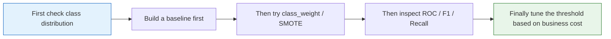

:::tip[Project Positioning]
Customer churn prediction is one of the **most classic business ML applications**. This project focuses on practicing: handling imbalanced data, understanding business metrics, and extracting business insights from model results.
:::
## Project Overview

| Information | Description |
|------|------|
| Task type | Binary classification (churn / retain) |
| Core challenge | Imbalanced data (far fewer churn customers than retained customers) |
| Evaluation metrics | F1, AUC, recall |
| Skills involved | Imbalance handling, Pipeline, business analysis |

## Key Terms Before You Read the Code

- **Recall** asks: among customers who really churned, how many did we catch? It matters when missing a churn customer is expensive.
- **Precision** asks: among customers we flagged as high-risk, how many truly churned? It matters when retention actions are costly.
- **F1** is the harmonic mean of precision and recall. It is useful when you need one balanced number, but it hides the business trade-off.
- **ROC (Receiver Operating Characteristic)** shows how recall changes as the false-positive rate changes across thresholds.
- **AUC (Area Under the Curve)** summarizes the ROC curve into one number. A higher AUC means the model ranks churn customers ahead of retained customers more reliably.
- **SMOTE (Synthetic Minority Over-sampling Technique)** creates synthetic minority-class samples. It can help imbalanced data, but it must be applied only inside the training split or cross-validation fold.
- **`class_weight`** tells the model to penalize minority-class mistakes more heavily without creating synthetic samples.
- **Threshold** is the probability cutoff for predicting churn. Moving it lower usually increases recall but also increases false alarms.

## First, let’s set an important learning expectation

This problem is very easy for beginners to fall into “model comparison” right away:

- Logistic Regression
- Random Forest
- SMOTE
- AUC

But for the first round, what is actually more worth practicing is not who gets the highest score, but:

> **How do you truly connect business cost, metric selection, threshold decisions, and model results when facing an imbalanced classification problem?**

As long as this line is clear first, this exercise will feel like a real project instead of “just another classification problem.”

---

## First, build a map

The most valuable part of this problem is not “build a binary classifier,” but facing these for the first time:

- Imbalanced data
- Threshold selection
- Different business costs



So what this problem really trains is “how to make classification decisions,” not simply “how to run a classification model.”

## What you really need to practice in this problem

The core of this project is not “make the classifier run,” but to practice:

1. Why you cannot rely on accuracy alone for imbalanced data
2. How to balance recall, precision, and business cost
3. How to translate model results into business insights

## What should be explained first in this problem

When doing this problem for the first time, what should be explained first is not the model names, but:

- What proportion of customers churn
- Why accuracy alone is not enough
- If the business is more afraid of missing churn customers, which metric should be prioritized

Once these three things are clear, the later model choices and threshold decisions will make sense.

## A more beginner-friendly analogy

You can think of this problem as:

- Creating a “high-risk list” before customers actually leave

The value of this list is not:

- Judging every single person perfectly

But:

- Whether you can miss as few truly churn-prone customers as possible while keeping false alarms at an acceptable cost

That is why, from the very beginning, this problem cannot just focus on accuracy.

## Recommended progression

1. First build a baseline without handling imbalance
2. Then try class weights
3. Then try methods like SMOTE
4. Finally compare ROC, AUC, F1, and business interpretation

This way, you can tell where the “improvement” really comes from.

## The safest default sequence for your first attempt

If this is your first time doing customer churn prediction, it is recommended to follow this order:

1. Clarify the business goal first
2. Check the class distribution first
3. Build the raw baseline first
4. Then try `class_weight`
5. Finally try SMOTE
6. Then decide whether the threshold should lean more toward recall or precision

This will help you understand whether each improvement comes from:

- The model
- Sampling
- Or the threshold strategy

## Step 1: Simulate data

```python
import pandas as pd
import numpy as np
from sklearn.datasets import make_classification

# Generate imbalanced customer data
X, y = make_classification(
    n_samples=5000, n_features=15, n_informative=8,
    n_redundant=3, weights=[0.85, 0.15],  # 85% retained, 15% churn
    random_state=42
)

feature_names = ['Monthly Spending', 'Call Duration', 'Data Usage', 'Customer Service Calls', 'Contract Length',
                 'Billing Disputes', 'Plan Tier', 'Household Size', 'Tenure', 'Complaints Last Month',
                 'Data Overages', 'International Roaming', 'Number of Value-added Services', 'Account Balance', 'Device Changes']

df = pd.DataFrame(X, columns=feature_names)
df['Churn'] = y

print(f"Data shape: {df.shape}")
print(f"Churn rate: {df['Churn'].mean():.1%}")
print(f"Churn customers: {df['Churn'].sum()}, Retained customers: {(1-df['Churn']).sum():.0f}")
```

---

## Step 2: Handle imbalanced data


Read this map as the threshold decision path: class imbalance changes which metric and cutoff you should trust.

```python
from sklearn.model_selection import train_test_split
from sklearn.ensemble import RandomForestClassifier
from sklearn.metrics import classification_report, roc_auc_score
import matplotlib.pyplot as plt

X = df.drop('Churn', axis=1)
y = df['Churn']
X_train, X_test, y_train, y_test = train_test_split(X, y, test_size=0.2, random_state=42, stratify=y)

# Method 1: class weights
rf_weighted = RandomForestClassifier(n_estimators=100, class_weight='balanced', random_state=42)
rf_weighted.fit(X_train, y_train)
y_pred = rf_weighted.predict(X_test)

print("Random Forest with class weights:")
print(classification_report(y_test, y_pred, target_names=['Retained', 'Churn']))
print(f"AUC: {roc_auc_score(y_test, rf_weighted.predict_proba(X_test)[:,1]):.4f}")
```

Example output from this fixed random seed:

```text
Data shape: (5000, 16)
Churn rate: 15.3%
Churn customers: 765, Retained customers: 4235

Random Forest with class weights:
              precision    recall  f1-score   support

    Retained       0.95      1.00      0.97       847
       Churn       0.97      0.73      0.83       153

    accuracy                           0.95      1000
   macro avg       0.96      0.86      0.90      1000
weighted avg       0.96      0.95      0.95      1000

AUC: 0.9681
```

Read this output with the diagram above: accuracy is high, but the key business question is the `Churn` row. A recall of `0.73` means the model still misses some customers who truly churn. If missed churn is expensive, the next experiment is not simply “try a bigger model”; it may be a threshold review, a different class-weight setting, or a SMOTE pipeline comparison.

### Step 2.1 Why you should not jump straight to SMOTE

A more stable order is usually:

1. Build the raw baseline first
2. Then try `class_weight`
3. Finally try `SMOTE`

Because only then can you tell the difference between:

- Improvement from the model itself
- Improvement from the sampling strategy
- Improvement from threshold adjustment

### SMOTE oversampling

```python
# python -m pip install --upgrade imbalanced-learn
try:
    from imblearn.over_sampling import SMOTE
    from imblearn.pipeline import Pipeline as ImbPipeline

    smote_pipe = ImbPipeline([
        ('smote', SMOTE(random_state=42)),
        ('classifier', RandomForestClassifier(n_estimators=100, random_state=42)),
    ])
    smote_pipe.fit(X_train, y_train)
    y_pred_smote = smote_pipe.predict(X_test)

    print("\nSMOTE + Random Forest:")
    print(classification_report(y_test, y_pred_smote, target_names=['Retained', 'Churn']))
except ImportError:
    print("Please install imbalanced-learn: python -m pip install --upgrade imbalanced-learn")
```

---

## Step 3: Feature importance and business insights

```python
# Feature importance
importance = rf_weighted.feature_importances_
sorted_idx = np.argsort(importance)

plt.figure(figsize=(8, 8))
plt.barh(range(len(sorted_idx)), importance[sorted_idx], color='coral')
plt.yticks(range(len(sorted_idx)), np.array(feature_names)[sorted_idx])
plt.xlabel('Feature Importance')
plt.title('Customer Churn Prediction — Feature Importance')
plt.grid(axis='x', alpha=0.3)
plt.tight_layout()
plt.show()

# Business suggestions
print("\nBusiness insights:")
top3 = np.array(feature_names)[np.argsort(importance)[-3:]]
for i, feat in enumerate(reversed(top3), 1):
    print(f"  {i}. {feat} is most important for churn prediction")
```

---

## Step 4: ROC comparison

```python
from sklearn.linear_model import LogisticRegression
from sklearn.metrics import roc_curve, roc_auc_score
from sklearn.preprocessing import StandardScaler
from sklearn.pipeline import make_pipeline

models = {
    'Logistic Regression': make_pipeline(StandardScaler(), LogisticRegression(class_weight='balanced', max_iter=1000)),
    'Random Forest': RandomForestClassifier(n_estimators=100, class_weight='balanced', random_state=42),
}

plt.figure(figsize=(8, 6))
for name, model in models.items():
    model.fit(X_train, y_train)
    proba = model.predict_proba(X_test)[:, 1]
    fpr, tpr, _ = roc_curve(y_test, proba)
    auc = roc_auc_score(y_test, proba)
    plt.plot(fpr, tpr, linewidth=2, label=f'{name} (AUC={auc:.4f})')

plt.plot([0, 1], [0, 1], 'k--', alpha=0.5)
plt.xlabel('FPR')
plt.ylabel('TPR')
plt.title('Customer Churn Prediction ROC Comparison')
plt.legend()
plt.grid(True, alpha=0.3)
plt.show()
```

### Step 4.1 What is most worth adding here

If you want this project to feel more like a real business project, the most valuable additions are:

- A confusion matrix
- A threshold vs. Precision / Recall / F1 curve
- An explanation of “if recall is the priority, where would I move the threshold”

Because in many real retention projects, the key is not who scores higher under the default threshold of 0.5, but:

- Catching as many high-risk customers as possible while keeping false alarm cost acceptable

---

## What you should include in the final project deliverable

- A class distribution chart
- A confusion matrix
- An ROC curve
- An explanation of “if the goal is to recall as many churn customers as possible, how would I tune the threshold”

## A more realistic project review order

You can write the project review in this order:

1. Data distribution and business goal
2. Baseline model results
3. Changes after handling imbalance
4. Metric trade-offs and threshold adjustment
5. Feature importance and business recommendations
6. How to monitor it after deployment

## If you keep improving this project, what is most worth adding

The following are usually worth prioritizing:

1. Threshold tuning page
2. Misclassified customer case analysis
3. Metric-switching explanations under different business goals

This will turn the project from “a classification task” into “a work that feels more like a real business decision system.”

## What is most worth showing in a portfolio

- Class distribution and task goal
- Comparison between baseline and improved versions
- ROC or PR curve
- A threshold explanation chart
- A set of actionable customer retention recommendations

---

## Project checklist

- [ ] Analyze the degree of class imbalance
- [ ] Try at least 2 imbalance-handling methods (class weights, SMOTE)
- [ ] Evaluate with F1 and AUC (not accuracy alone)
- [ ] Analyze feature importance and provide business recommendations
- [ ] Compare multiple models with ROC curves

<details>
<summary>Project reference and review notes</summary>

1. Start by reporting the positive-class ratio. If churn is rare, accuracy can look good while the model misses most churn customers.
2. Compare class weights and SMOTE under the same validation protocol. If oversampling is used, it must happen inside the training workflow to avoid leakage.
3. F1 and AUC are useful, but the threshold decision should be tied to business cost: missed churn versus false alarm outreach.
4. Feature importance is a starting point for business hypotheses, not causal proof. Explain what action each important feature suggests.
5. A strong deliverable includes class distribution, baseline comparison, ROC or PR curve, threshold explanation, confusion matrix, and retention recommendations.

</details>

## Version roadmap suggestion

| Version | Goal | Delivery focus |
|---|---|---|
| Basic version | Complete the minimum working loop | Can input, process, and output, with a sample set retained |
| Standard version | Build a project ready to showcase | Add configuration, logging, error handling, README, and screenshots |
| Challenge version | Approach portfolio quality | Add evaluation, comparison experiments, failed-case analysis, and next-step roadmap |

It is recommended to finish the basic version first; do not chase a large and all-inclusive solution from the beginning. Each time you upgrade a version, make sure to write in the README what new capability was added, how it was validated, and what problems still remain.

## Evidence to Keep

Keep this page's proof of learning as a small evidence card:

```text
project_goal: prediction, segmentation, Kaggle, or end-to-end ML portfolio target
pipeline: data split, preprocessing, model, evaluation, and report artifacts
result: metric table, chart, predictions, failure samples, and README note
failure_check: non-reproducible run, leakage, overfitting, weak baseline, or missing deployment boundary
Expected_output: ML project folder with pipeline, metrics, and failure review
```
