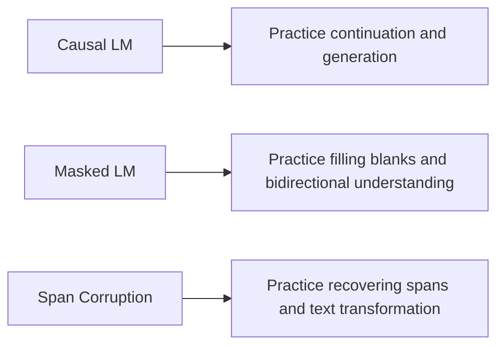

# 7.4.3 Pretraining Methods

:::tip[Section Overview]
Pretraining methods are essentially answering one very fundamental question:

> **During training, what task is the model actually asked to do?**

If you train on the same text but with different objectives,
the abilities the model learns will be very different.

That is why:

- BERT moves toward understanding tasks
- GPT moves toward generation tasks
- T5 moves toward unified text-to-text

What this lesson does is break these objectives apart clearly.
:::
## Learning Objectives

- Understand what abilities different pretraining objectives teach the model
- Distinguish the core differences among Causal LM, Masked LM, and Span Corruption
- Use a runnable example to see how the same text can be turned into different training samples
- Build intuition for why “task objective” and “downstream ability” are so strongly related

---

## First, Build a Map

Pretraining methods are easier to understand if we think in terms of “what the model practices every day”:



So what this lesson is really trying to answer is:

- Why does the ability profile differ even though all of them are pretraining?
- Why does how we construct training labels directly affect what the model becomes good at later?

---

## Why Does the Pretraining Objective Decide the Model’s Path?

### Because the model will preferentially learn what it is repeatedly asked to do in training

If training keeps asking the model to:

- predict the next token from the previous text

then it will naturally become better at:

- continuation
- generation

If training keeps asking the model to:

- recover masked tokens from left and right context

then it will more easily learn:

- bidirectional understanding
- semantic completion

So the pretraining objective is not just a surface-level task;
it is the steering wheel for the model’s abilities.

### An analogy: Training tasks shape system behavior

Think of the objective as the test harness that keeps exercising the model.

- If the harness always hides tokens, the model practices reconstruction
- If the harness always asks for continuation, the model practices next-token prediction
- If the harness always gives an input and expected output, the model practices input-to-output mapping

Models are the same.

### A more beginner-friendly overall analogy

You can think of the pretraining objective as:

- deciding what kind of questions the model practices every day

If it practices:

- continuation questions

it will naturally become more like a generative model.
If it practices:

- fill-in-the-blank questions

it will more easily become an understanding-oriented model.
If it practices:

- recovery questions with an entire missing span

it will more easily learn the mapping from input to output.

---

## The Three Most Important Pretraining Routes

### Causal Language Modeling: Predict the Future from the Past

This is the classic objective in the GPT family.

The form is simple:

- input the previous tokens
- predict the next token

Its advantage is:

- the training objective is naturally aligned with generation

In other words, during training the model cannot see the future,
and during inference the model also cannot see the future,
so there is no mismatch.

### Masked Language Modeling: Fill in the Blanks from Context

This is the classic objective in the BERT family.

The method is:

- mask out some tokens in the input
- let the model recover them from left and right context

This objective is very suitable for bidirectional modeling,
so it is especially good at:

- understanding
- representation learning
- classification and extraction tasks

But it is not as naturally suited to free-form generation as Causal LM.

### Span Corruption / Denoising: Not Masking One Word, but an Entire Span

T5 / BART-style models often use a more general denoising objective:

- instead of masking a single token
- mask an entire span
- then let the model reconstruct that content

This is closer to:

- summarization
- paraphrasing
- translation
- text-to-text transformation

---

## First, Construct Three Training Samples from the Same Text

The goal of this code is very direct:

- take the same sentence
- generate Causal LM, Masked LM, and Span Corruption training samples respectively

This lets you see very clearly:

- what “different objectives” actually means

```python
tokens = "transformer models learn patterns from large text corpora".split()


def build_causal_example(tokens):
    inputs = tokens[:-1]
    labels = tokens[1:]
    return inputs, labels


def build_masked_example(tokens, mask_positions):
    masked = tokens[:]
    labels = {}
    for pos in mask_positions:
        labels[pos] = masked[pos]
        masked[pos] = "[MASK]"
    return masked, labels


def build_span_corruption(tokens, start, end):
    corrupted_input = tokens[:start] + ["<extra_id_0>"] + tokens[end:]
    target = ["<extra_id_0>"] + tokens[start:end] + ["<extra_id_1>"]
    return corrupted_input, target


causal_inputs, causal_labels = build_causal_example(tokens)
masked_inputs, masked_labels = build_masked_example(tokens, mask_positions=[2, 5])
span_inputs, span_target = build_span_corruption(tokens, start=2, end=5)

print("causal inputs :", causal_inputs)
print("causal labels :", causal_labels)
print()
print("masked inputs :", masked_inputs)
print("masked labels :", masked_labels)
print()
print("span inputs   :", span_inputs)
print("span target   :", span_target)
```

Expected output:

```text
causal inputs : ['transformer', 'models', 'learn', 'patterns', 'from', 'large', 'text']
causal labels : ['models', 'learn', 'patterns', 'from', 'large', 'text', 'corpora']

masked inputs : ['transformer', 'models', '[MASK]', 'patterns', 'from', '[MASK]', 'text', 'corpora']
masked labels : {2: 'learn', 5: 'large'}

span inputs   : ['transformer', 'models', '<extra_id_0>', 'large', 'text', 'corpora']
span target   : ['<extra_id_0>', 'learn', 'patterns', 'from', '<extra_id_1>']
```

### What should you look at most in this code?

Focus on these three things first:

1. What the input has been turned into
2. What the labels are asking the model to learn
3. Why the same sentence can be organized into completely different training tasks

If you understand this point,
you will understand why:

- GPT, BERT, and T5 end up with different capability profiles


:::tip[Reading Guide]
When reading this figure, compare how the same sentence is turned into three different training tasks: Causal LM trains “predict the next token,” Masked LM trains “fill in blanks from both sides,” and Span Corruption trains “recover missing spans.” What the model practices every day is what it will gradually become good at.
:::
### Why Are Causal LM Labels Shifted by One Position?

Because what it is doing is:

- given the previous text, guess the next token

So the most natural way to organize the training data is:

- input: `x_1 ... x_{t-1}`
- labels: `x_2 ... x_t`

### Why Is Span Corruption Often Considered More “General”?

Because it is closer to real text transformation than single-token masking.
The model is not just recovering one word,
but restoring an entire missing span.

This makes it naturally move toward:

- text-to-text

That is also a very important reason behind the T5 route.

### A Minimal Comparison Table for the Same Sentence and Three Training Objectives

| Method | What the input looks like | What the labels look like | What beginners should remember first |
|---|---|---|---|
| Causal LM | Sees the previous text | Predicts the next token | More like continuation |
| Masked LM | Has blanks in the middle | Restores masked tokens | More like fill-in-the-blank |
| Span Corruption | Deletes an entire span | Restores the whole span | More like text repair / paraphrasing |

This table is especially useful for beginners because it puts:

- the name
- the input format
- the label format
- the final capability tendency

into one view.

---

## What Is Each Objective Better At?

### Causal LM: Generation, Continuation, Dialogue

This type of objective is highly aligned with downstream generation tasks,
so it is especially suitable for:

- chat
- writing
- code completion
- long-text continuation

### Masked LM: Representation Learning and Understanding

Because the model can see both left and right context,
it is very suitable for:

- classification
- retrieval encoding
- semantic matching
- extraction tasks

### Span Corruption: Input-to-Output Mapping

If you want the model to naturally do:

- summarization
- paraphrasing
- translation
- question answering generation

then this kind of denoising and seq2seq objective will feel much more natural.

### A Safe Default Sequence for First-Time Learners

A good order is usually:

1. Don’t rush to memorize the abbreviations
2. First look at how the input is transformed
3. Then look at what the labels ask the model to learn
4. Finally, see how the training objective relates to downstream tasks

This is much easier than memorizing:

- CLM
- MLM
- span corruption

right away.

---

## Pretraining Objectives Do Not Exist Alone; They Are Bound to the Architecture

### Why Do Decoder-only Models Usually Use Causal LM?

Because the two are perfectly aligned:

- a decoder can only look at the past
- Causal LM also requires looking only at the past

Training and generation form a very natural loop.

### Why Do Encoder-only Models Usually Use Masked LM?

Because encoders are good at bidirectional modeling.
Since they can see the whole sentence, they are well suited for:

- recovering masked positions

### Why Do Encoder-Decoder Models Usually Use Denoising Objectives?

Because this structure is naturally suited to:

- taking one piece of text as input
- producing another piece of text as output

So span corruption, denoising, and text-to-text training all fit very well.

---

## What Other Variants Are There Besides the Classic Objectives?

### Prefix LM: Partly Bidirectional, Partly Causal

Some methods let the first part of the input be read bidirectionally,
while the generated part still follows a causal constraint.

This kind of objective is suitable when you want both:

- understanding of context
- continuation generation

### Multimodal Pretraining: The Input Is Not Just a String of Text

If the input also includes:

- images
- audio
- video

then the objective may become:

- cross-modal alignment
- image-text generation
- multimodal understanding

Even though the form is more complex, the core idea is the same:

- the training objective decides what the model will prioritize learning

### Self-Supervised Does Not Mean Completely “Bias-Free”

Even if the labels are automatically constructed,
the objective function still imposes preferences on the model.

For example:

- more generation-oriented
- more understanding-oriented
- more structure-recovery-oriented

That is why the pretraining objective itself is a design choice.

---

## The Most Common Mistakes

### Mistake 1: The pretraining objective is just an early-stage detail, and fine-tuning will solve everything later

Not true.
The pretraining objective gives the model a long-term ability bias.

### Mistake 2: Masked LM is more advanced than Causal LM, or vice versa

There is no ranking relationship between them,
only design choices for different paths.

### Mistake 3: Remembering only the name without looking at what the labels look like

True understanding means:

- how the input is organized
- how the labels are constructed
- what the model is being asked to learn

## If You Turn This into Notes or Slides, What Is Most Worth Showing?

What is most worth showing is usually not:

- just listing the three abbreviations

Instead, show:

1. The same sentence transformed into three training samples
2. A comparison of the inputs and labels for the three methods
3. What ability each objective tends to teach
4. Why they correspond to GPT / BERT / T5

That way, people will more easily see:

- you understand how “training objectives shape abilities”
- not just the method names

---

## Evidence to Keep

Keep this page's proof of learning as a small evidence card:

```text
objective: causal LM, masked LM, or seq2seq objective
training_sample: input and target constructed from same text
architecture_fit: objective matched to encoder/decoder pattern
behavior_effect: what the objective teaches the model to do
limitation: pretraining objective is not the same as instruction following
```

## Summary

The most important thing in this section is not memorizing the abbreviations `CLM / MLM / Span Corruption`,
but grasping one main line:

> **A pretraining objective is essentially a rule for what the model practices over and over every day, and what the model ends up best at is usually the kind of ability it practiced most often.**

Once this line is established,
the architectural choices, fine-tuning methods, and task transfer in the following sections will make much more sense.

---

## Exercises

1. Replace the sentence in the example with one of your own, and generate the three training samples again.
2. Explain in your own words: why is Causal LM more suitable for open-ended generation?
3. Why is Masked LM more like a “fill-in-the-blank” task than a “continuation” task?
4. Think about this: if your goal is to build a strong summarization model, which type of pretraining objective would you prefer? Why?

<details>
<summary>Reference implementation and walkthrough</summary>

1. A good answer should show that the same text can become different training signals: next-token prediction for Causal LM, masked-token recovery for Masked LM, and input-to-output reconstruction for sequence-to-sequence objectives.
2. Causal LM trains the model to continue a prefix token by token. That matches open-ended generation, chat, code completion, and other tasks where the output is produced left to right.
3. Masked LM sees surrounding context and predicts hidden pieces inside the sequence. It is therefore closer to solving blanks than to generating an unknown continuation.
4. For summarization, sequence-to-sequence denoising or encoder-decoder-style objectives are often a natural fit because they train a model to read an input and produce a compressed output. Causal LM can still summarize, especially after instruction tuning, but the objective is less directly matched.

</details>
