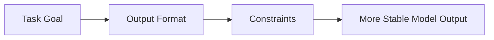

:::tip[Section Overview]
When many people first learn Prompt, they think of it as:

- being good at writing fancy wording
- using some kind of magical phrasing

But the real, more important question is:

> **Have you explained the task clearly?**

The foundation of Prompt engineering is not rhetoric, but task expression.
:::
## Learning Objectives

- Understand what Prompt really controls
- Understand why vague Prompts make model output drift
- Learn how to write more stable Prompts from three layers: task goal, output format, and constraints
- Build the most basic intuition for Prompt debugging

---

## Start with the Basics / Understand the Advanced Later

If you are a beginner, the first thing to hold on to in this section is: Prompt is not a “spell,” but a task brief. It is more important to clearly write “what to do, what to output, and what not to do” than to memorize many tricks.

If you already have experience, you can go one step further and focus on whether a Prompt can be parsed reliably by a program, whether it can constrain the model from going out of bounds, and whether it can connect to structured output, Function Calling, RAG, and Agent execution pipelines.

---

## Build a Map First

If you have already learned the overview of large models and the pretraining main line, then the most natural continuation in this section is:

- You already know where model capabilities come from
- This section begins to answer: without changing model parameters, how can we more stably activate those capabilities?

So Prompt basics are not a “small trick,” but an answer to:

- How do we release existing model capabilities more reliably through clearer task expression?

The best way for beginners to understand this section is not to “learn a few tricks first,” but to first see clearly:



So what this section really wants to solve is:

- Was the task stated clearly?
- Does the model know what it should deliver?
- Which boundaries must be fixed in advance?

## What Exactly Is a Prompt?

### Not Just “Typing in Some Text”

On the most surface level, a Prompt is of course a piece of text you input to the model.
But from an engineering perspective, it is more like:

> **A task brief you write for the model.**

What you are really telling the model through the Prompt is:

- What the task is
- What format the output should take
- What boundaries must be followed

### A Very Intuitive Analogy

A Prompt is like giving a new teammate an assignment:

- Is the goal clear?
- Is the deliverable format clear?
- Have you explained what not to do?

If all of these are vague, the result can easily go off track.
The model is the same.

### A More Beginner-Friendly Overall Analogy

You can also think of a Prompt as:

- giving a task to a very capable intern who cannot read minds

This intern is competent,
but if you only say:

- “Please handle this for me”

then the result will very likely drift.
The problem is not that the intern is not smart,
but that:

- you did not clearly explain the goal, format, and boundaries

### When You First Learn Prompt, What Should You Focus on First?

What you should focus on first is not a few popular patterns, but this sentence:

> **The essence of a Prompt is translating task specifications into instructions the model can execute.**

Once this idea is stable, when you later look at:

- few-shot
- role setting
- structured output

it becomes more natural to ask first: is it adding task goals, output format, or behavioral boundaries?

---

## Why Are “Vague Prompts” So Dangerous?

### A Typical Bad Example

```text
Please handle this content for me.
```

The problem with this sentence is not whether it sounds polite, but:

- Should it summarize?
- Or rewrite?
- Or classify?
- How long should the output be?

### A Slightly Clearer Version

```text
Please summarize the following content into 3 English bullet points, with no more than 20 characters per point.
```

Now it is clear at once:

- What to do: summarize
- Output form: 3 bullet points
- Output length: no more than 20 characters per point

This is the most basic value of a Prompt:

> **Turning a vague task into a clear task.**

### A Minimal “Bad Prompt -> Good Prompt” Comparison Table

| Version | Prompt | Problem or Advantage |
|---|---|---|
| Bad version | Please handle this content for me. | The task, format, and boundaries are all unclear |
| Slightly better | Please summarize this content. | The task is clear, but the format is still unclear |
| More stable version | Please summarize the following content into 3 English bullet points, with no more than 20 characters per point, and do not add information beyond the original text. | The task, format, and constraints are all clear |

This table is especially useful for beginners, because it lets you see:

- A more stable Prompt does not come from mysterious words
- It comes from increasingly clear specifications

---

## The Three Basic Layers of Prompt Writing

### Layer 1: Task Goal

First answer:

- What exactly should the model do?

For example:

- Summarize
- Classify
- Extract
- Rewrite

### Layer 2: Output Format

Then answer:

- What should the output look like?

For example:

- One sentence
- Three bullet points
- JSON
- A table

### Layer 3: Constraints

Finally answer:

- What boundaries must not be crossed?

For example:

- Do not make things up
- Do not output explanations
- Answer only based on the given materials

These three layers are the most basic and important skeleton of Prompt engineering.

### Why Is This Three-Layer Structure Especially Worth Remembering First?

Because many Prompts that look “well written” still end up unstable because:

- the task goal is vague
- the output format is not clearly written
- the constraints were left out

So for beginners, the most stable first step is not to pile on tricks, but to complete these three layers first.

### The Most Stable Default Order for Your First Prompt

A more stable order is usually:

1. First write “what to do”
2. Then write “what the output should look like”
3. Then write “what not to do”
4. Only after that adjust tone, style, and role

This is more stable than starting with something like:

- You are a senior expert...

because the most basic task specification has already been established.


:::tip[How to read this comic]
Read it like a small workplace story: a vague request makes the model guess; a clear task brief gives it the goal, the delivery format, and the boundaries. This is why a good Prompt is less like a magic phrase and more like an assignment card.
:::
---

## A Minimal Prompt Specification Example

```python
prompt_spec = {
    "task": "summary",
    "output_format": "3 English bullet points",
    "constraints": ["No more than 20 characters per point", "Do not add information beyond the original text"]
}

print(prompt_spec)
```

Expected output:

```text
{'task': 'summary', 'output_format': '3 English bullet points', 'constraints': ['No more than 20 characters per point', 'Do not add information beyond the original text']}
```

### What Is This Example Teaching?

It is reminding you:

> Many Prompts that look good actually have a clearer task specification behind them.

In other words, a Prompt is not written purely from inspiration, but is more like “translating task specifications into language the model can understand.”

### A Minimal “Prompt Checklist” Example

```python
prompt_checklist = {
    "task_defined": True,
    "output_format_defined": True,
    "constraints_defined": False,
}


def next_fix(checklist):
    if not checklist["task_defined"]:
        return "First make the task goal clear."
    if not checklist["output_format_defined"]:
        return "First make the output format clear."
    if not checklist["constraints_defined"]:
        return "First add boundaries and constraints."
    return "The basic Prompt specification is already fairly complete."


print(next_fix(prompt_checklist))
```

Expected output:

```text
First add boundaries and constraints.
```

This example is especially suitable for beginners because it turns Prompt from “writing one sentence” into:

- a task specification that can be checked


:::tip[Reading Guide]
This diagram breaks Prompt into three layers: task goal, output format, and constraint boundaries. Beginners should not rush to add role setting or advanced tricks yet. First confirm whether these three layers are written clearly; many unstable outputs are actually just missing one layer of the task specification.
:::
---

## An Example That Really Shows the Difference

### Vague Version

```text
Please analyze the following text.
```

### Clear Version

```text
Please read the following text and perform sentiment classification.
Only output positive or negative. Do not output any other explanation.
```

### Why Is the Latter More Stable?

Because it clearly defines all of the following at the same time:

- Task goal: sentiment classification
- Output set: positive / negative
- Output constraint: no extra explanation

So the real foundation of Prompt is not “sounding fancy,” but:

> **being precise.**

---

## Why Does Prompt Basics Affect Every Later Chapter?

Because later you will keep encountering:

- Structured output
- Function Calling
- Agent
- RAG

Although these capabilities are more complex, they all depend on the same premise:

- The task boundaries must be clear
- The output format must be clear
- The behavioral constraints must be clear

So Prompt basics are not an isolated chapter, but the foundation for many system capabilities that come later.

### Terms You Will Keep Seeing Later

| Term | Beginner-friendly meaning | Why it connects back to Prompt basics |
|---|---|---|
| Prompt | The instruction, context, examples, and constraints sent to the model | It is the model’s task brief, so unclear wording creates unclear behavior |
| Structured output | Output that follows a predictable format such as JSON, a table, or fixed fields | A product often needs parseable data, not just a nice paragraph |
| Function Calling | A mechanism that lets the model choose a tool or function and fill in arguments | The model must understand the task boundary and the required parameters |
| RAG | Retrieval-Augmented Generation: first retrieve external materials, then answer based on them | The Prompt tells the model how to use retrieved sources and avoid unsupported claims |
| Agent | A system where the model plans, calls tools, observes results, and continues acting | Every step needs clear goals, allowed actions, and stopping rules |

---

## The Most Common Beginner Mistakes

### Thinking Prompt Is Just About Wordsmithing

In fact, task structure matters more.

### Only Stating the Task, but Not the Output Format

This makes model output less stable and makes post-processing more painful.

### Not Writing Constraints

Once the model has room to improvise, it may improvise in places where it should not.

## If You Turn This into a Project or Notes, What Is Most Worth Showing?

What is usually most worth showing is not:

- “I know how to write Prompts”

but rather:

1. A bad Prompt
2. An improved Prompt
3. Which layer of the specification you actually added
4. Why the output became more stable as a result

This makes it easier for others to feel that:

- you understand task expression
- not just a few Prompt technique terms

## The Most Stable Order for Writing a Prompt for the First Time

You can follow this order directly:

1. First write the task goal
2. Then write the output format
3. Then write the constraints
4. Only at the end adjust wording and style

This will be much more stable than piling on role setting and tricks right from the start.

## Key Takeaways

- The core of a Prompt is not rhetoric, but task expression
- A basic Prompt should clearly explain “what to do, how to deliver it, and what not to do”
- All later advanced Prompt techniques, structured output, and Agent systems are built on this foundation

---

## A Very Practical Prompt-Writing Habit

Before writing a Prompt each time, ask yourself in your head:

1. What exactly am I asking the model to do?
2. What do I want it to output?
3. Where am I most afraid it will go off track?

If you can answer these three questions clearly, your Prompt is usually already much more stable than most “written on a whim” versions.

---

## Learning Loop for This Section

After finishing this section, you can use the following table to check yourself:

| Level | What You Should Be Able to Do |
|---|---|
| Intuition | Explain why a Prompt is more like a task brief than a magical spell |
| Writing | Break a vague request into task goal, output format, and constraints |
| Debugging | Judge whether unstable output is caused by an unclear goal, unclear format, or unclear boundaries |
| Later Connection | Explain why Prompt affects structured output, Function Calling, RAG, and Agents |

---

## Evidence to Keep

Keep this page's proof of learning as a small evidence card:

```text
task: one clear instruction
context: relevant facts supplied to the model
constraints: audience, length, style, forbidden behavior
output_format: bullets, JSON, table, or answer schema
comparison: vague prompt vs improved prompt output saved
```

## Summary

The most important thing in this section is not to memorize the word “Prompt,” but to understand:

> **The essence of a Prompt is to clearly express the task goal, output form, and boundary conditions.**

This is the first layer of foundation for all later Prompt engineering capabilities.

---

## Exercises

1. Rewrite “Please handle this content for me” into a clearer Prompt.
2. Think of a task of your own, and separately write the task goal, output format, and constraints.
3. Explain in your own words: why is a Prompt more like a “task brief”?
4. Why does a Prompt that only states the goal, but not the output format, usually make the system less stable?

<details>
<summary>Solution approach and explanation</summary>

1. A clearer version might be: "Summarize the following customer message in three bullet points, identify the user intent, and list one suggested reply. Do not invent facts."
2. A complete answer should separate goal, output format, and constraints. For example: goal is classify feedback, output is JSON, constraints are fixed labels and no extra text.
3. A prompt is like a task brief because it tells the model what job to do, what result to produce, and what boundaries to respect.
4. Without an output format, the model may answer in prose, bullets, JSON-like text, or mixed structure. That makes downstream use and evaluation unstable.

</details>
